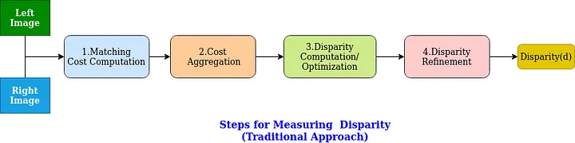
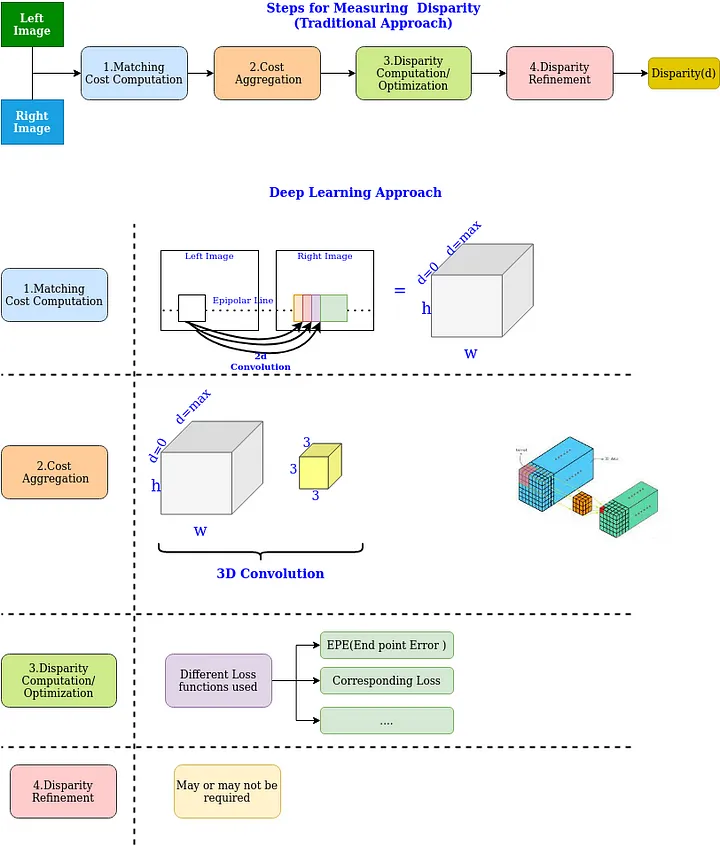
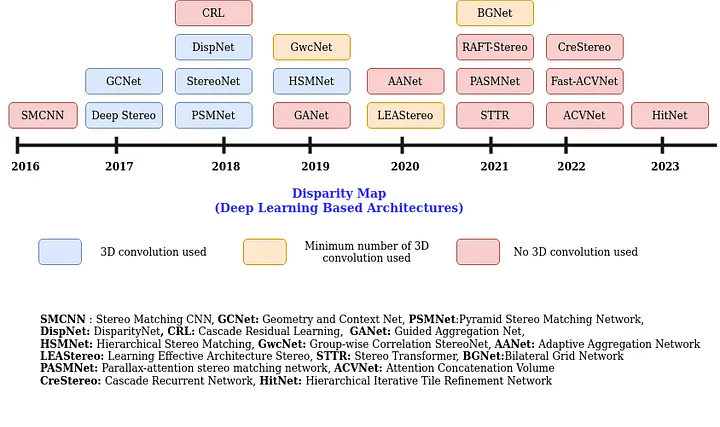
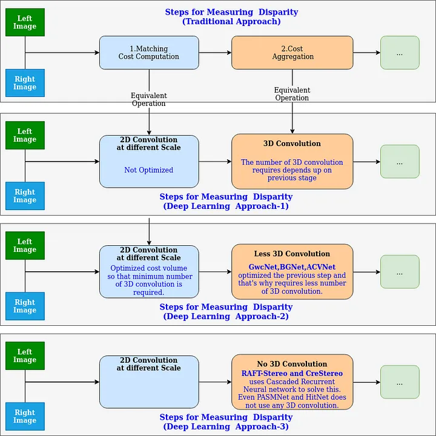

# Depth Estimation from Stereo Images

## Traditional Approach for Measuring Disparity

## Deep Learning based Apporach for Measuring Disparity

### Deep learning based approaches

## References

- [Depth Estimation From Stereo Images Using Deep Learning](https://medium.com/@satya15july_11937/depth-estimation-from-stereo-images-using-deep-learning-314952b8eaf9)
- [Depth Estimation From Stereo Images](https://github.com/satya15july/depth_estimation_stereo_images)