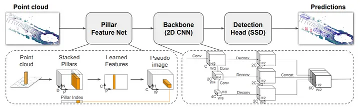
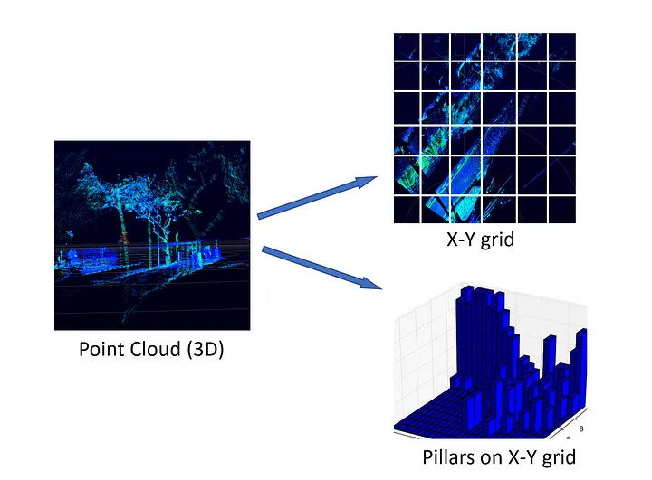
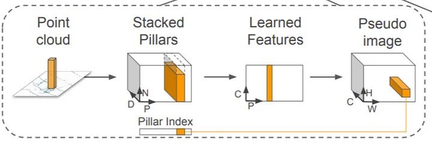

# PointPillars

There are two key differences between 2D images and 3D lidar point clouds:

1) The point cloud is a sparse representation, while an image is dense.

2) The point cloud is 3D, while an image is 2D.

Recent methods tend to view the lidar point cloud from a bird's eye view. This overhead perspective offers several advantages such as:

* lack of ambiguity

* the near lack of occulusion.

However, the bird’s eye view tends to be extremely sparse which makes direct application of convolutional neural networks impractical and inefficient. 

VoxelNet divides the space into voxels, applies a PointNet to each voxel, followed by a <b>3D convolutional middle layer</b> to consolidate the vertical axis, after which a 2D convolutional detection architecture is applied.

## Architecture

### Pillar feature net

Pillar feature net converts the point cloud to a sparse pseudo image. First, the point cloud is divided into grids in the x-y coordinates, creating a set of pillars. Each point in the cloud, which is a 4-dimensional vector (x,y,z, reflectance), is converted to a 9-dimensional vector containing the additional information explained as follows:

* Xc, Yc, Zc, where the c subscript denotes distance to the arithmetic mean of all points in the pillar.
* Xp, Yp, p subscript denotes the offset from the pillar x, y center.

Hence, a point now contains the information D = [x,y,z,r,Xc,Yc,Zc,Xp,Yp].

### From Pillars to a dense tensor

The set of pillars will be mostly empty due to sparsity of the point cloud, and the non-empty pillars will in general have few points in them. This sparsity is exploited by imposing a limit both on the number of non-empty pillars per sample (P) and on the number of points per pillar (N) to create a dense tensor of size (D, P, N). If a sample or pillar holds too much data to fit in this tensor the data is randomly sampled. Conversely, if a sample or pillar has too little data to populate the tensor, zero padding is applied.

### Generating the Pseudo Image from Learned features

This is pretty straight-forward, the generated (C, P) tensor is transformed back to its original pillar using the Pillar index for each point. So originally, where the point was converted to a D dimensional vector, now it contains a C dimensional vector, which are the features obtained from a PointNet.

## Backbone

The backbone has two sub-networks:
* one top-down network that produces features at increasingly small spatial resolution.
* a second network that performs upsampling and concatenation of the top-down features.

## Detection Head

The Single Shot Detector (SSD) is used to perform 3D object detection. Similar to SSD, they match the priorboxes to the ground truth using 2D Intersection over Union (IoU). Bounding box height and elevation were not used for matching; instead given a 2D match, the height and elevation become additional regression targets.

## References

[PointPillars: Fast Encoders for Object Detection from Point Clouds](https://arxiv.org/pdf/1812.05784.pdf)