# Teeth Model Reconstruction

## Teeth Numbering
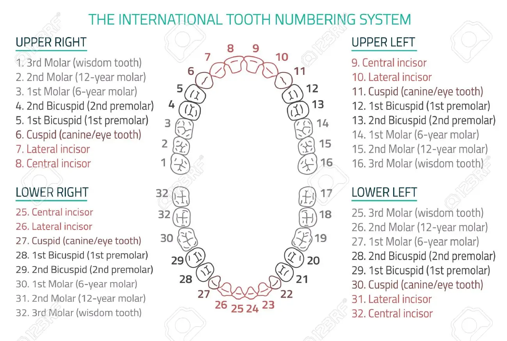

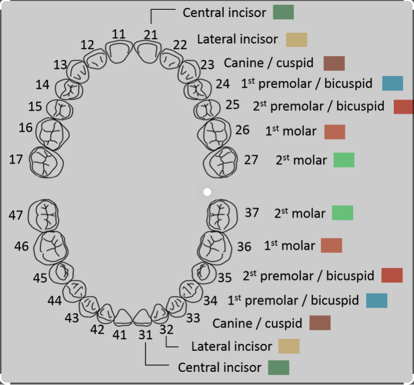

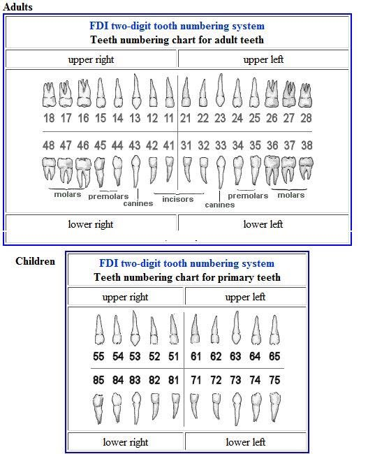

## Tooth Anatomy

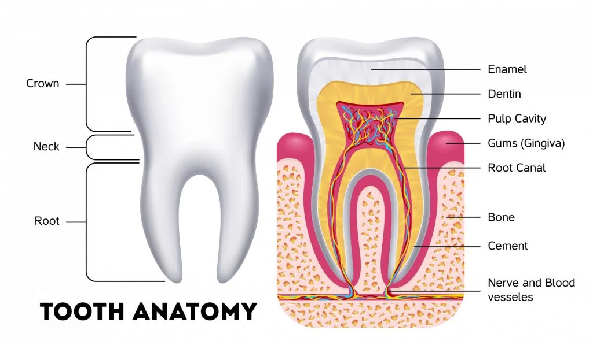

## 3D Tooth Segmentation and Labeling using Deep Convolutional Neural Networks

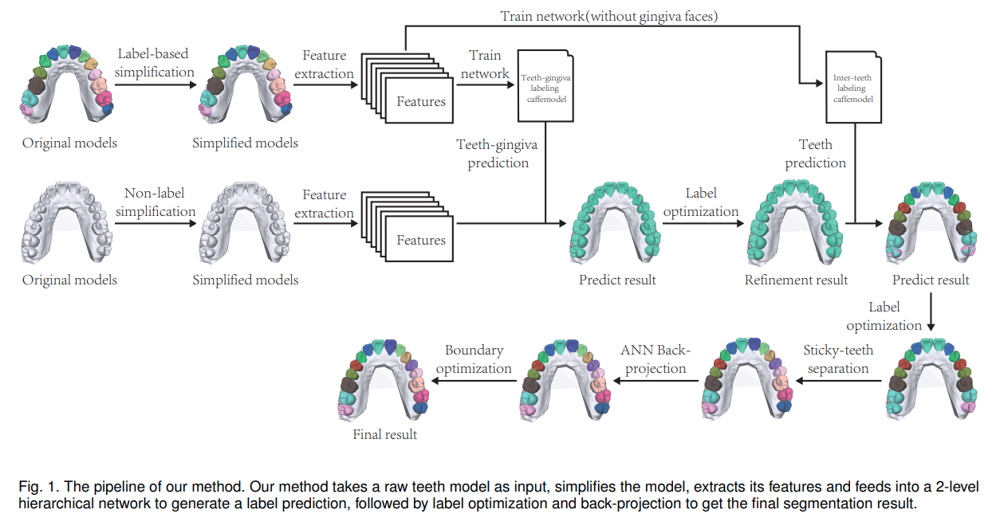

## ToothNet: Automatic Tooth Instance Segmentation and Identification from Cone Beam CT Images

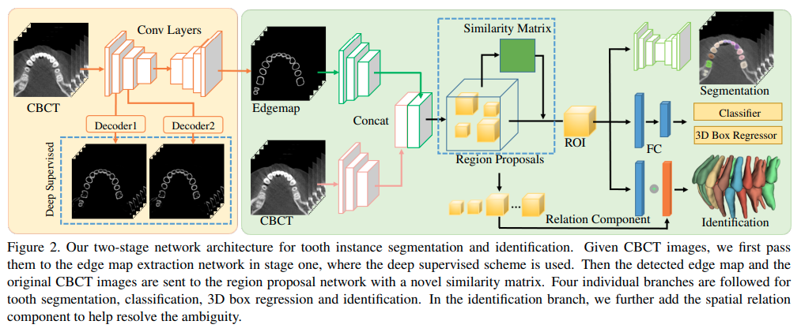

## Teeth Model Reconstruction Based on Multiple View Image Capture

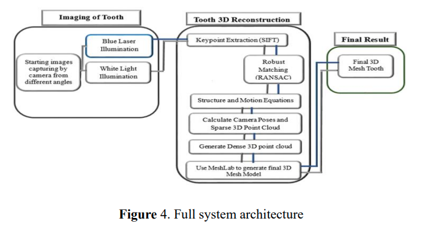

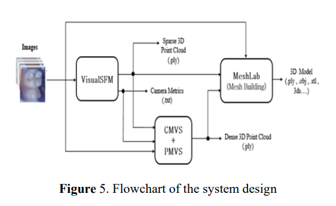

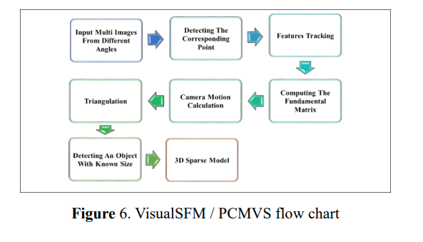

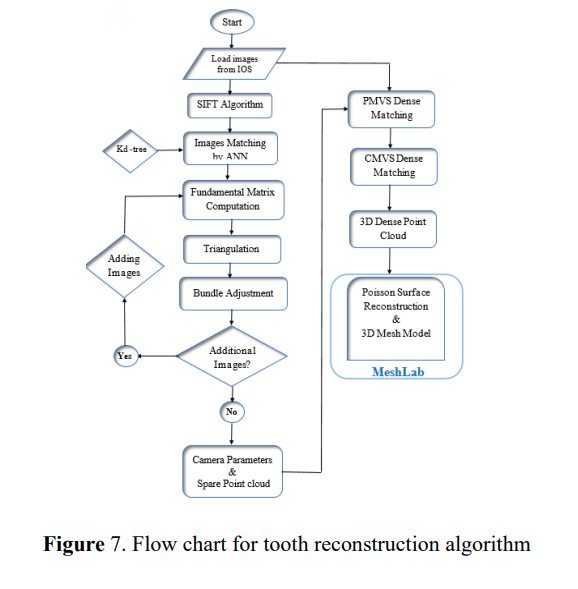

## Enhanced Tooth Region Detection Using Pretrained Deep Learning Models

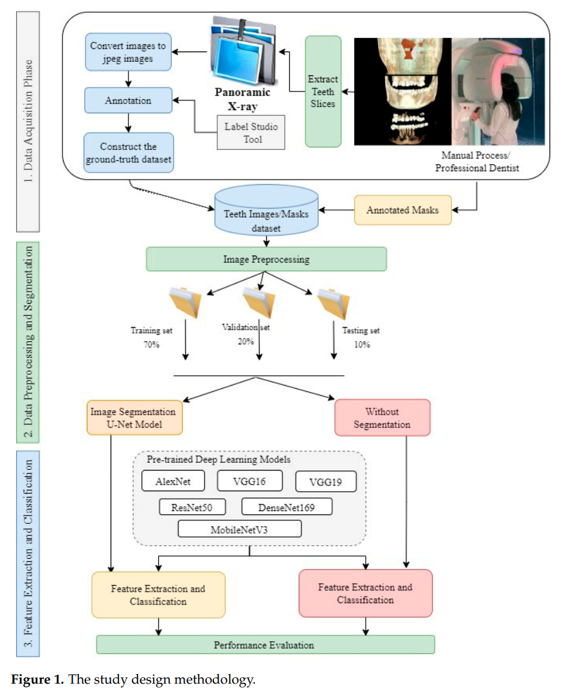

## MeshSegNet: a multi-scale deep neural network that learns high-level geometric features used for end-to-end tooth segmentation on 3D tooth surfaces

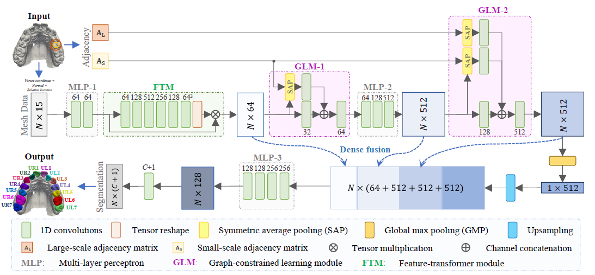

## TSegNet: An Efficient and Accurate Tooth Segmentation Network on 3D Dental Model

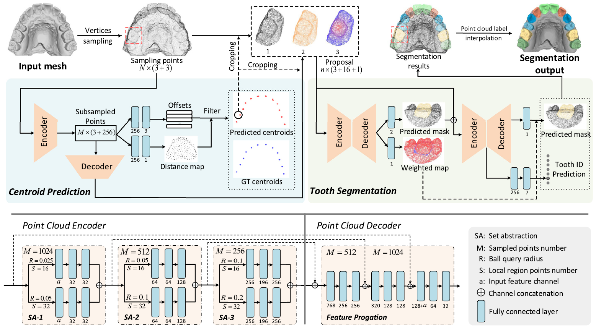

## OralViewer: 3D Demonstration of Dental Surgeries for Patient Education with Oral Cavity Reconstruction from a 2D Panoramic X-ray

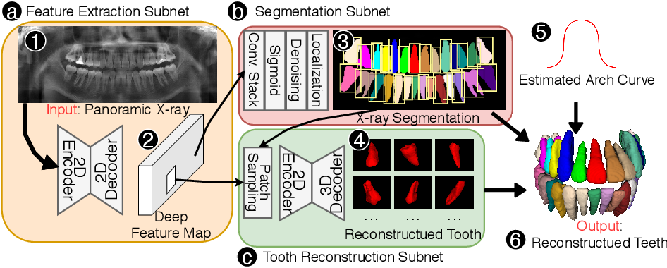

## References

- [Teeth Model Reconstruction Based on Multiple View Image Capture](https://iopscience.iop.org/article/10.1088/1757-899X/978/1/012009/pdf)

- [Segmentation of 3D Dental Images Using Deep Learning](https://arxiv.org/pdf/2207.09582.pdf)

- [MeshSegNet: Deep Multi-Scale Mesh Feature Learning for Automated Labeling of Raw Dental Surface from 3D Intraoral Scanners](https://github.com/Tai-Hsien/MeshSegNet)