# DeepSeek

## Architecture
The DeepSeek-R1 model is a Mixture-of-Experts (MoE) transformer-based architecture. 

- <b>Total Parameters</b>: 671 billion.
- <b>Active Parameters per Forward Pass</b>: 37 billion.
- <b>Structure</b>: 61 transformer layers, where the first 3 are dense (standard transformer layers with Feed-Forward Networks, FFNs), and layers 4–61 are MoE layers with expert sub-networks replacing the FFNs.
- <b>MoE Design</b>: For each token, a router selects a subset of experts (e.g., 8 out of 256 experts per layer in DeepSeek-V3/R1), and only those experts are activated. The rest of the transformer components (e.g., multi-head attention) remain active for all tokens.

## Decode-Only Transformer
Nowadays, LLMs are more commonly to choose the structure shown in (c) for more stable training, with normalization applied on the input rather then output, and LayerNorm upgraded to RMS Norm. 

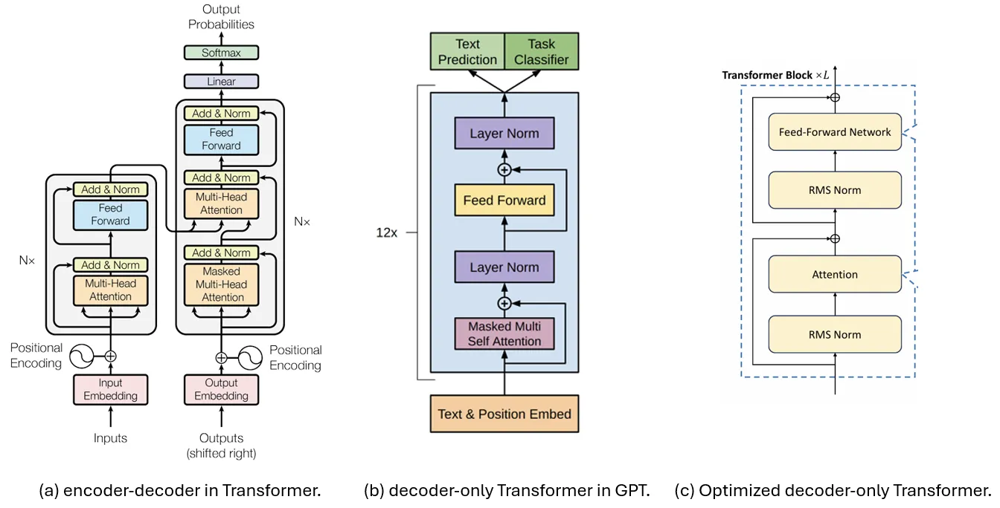

## Basic Architecture

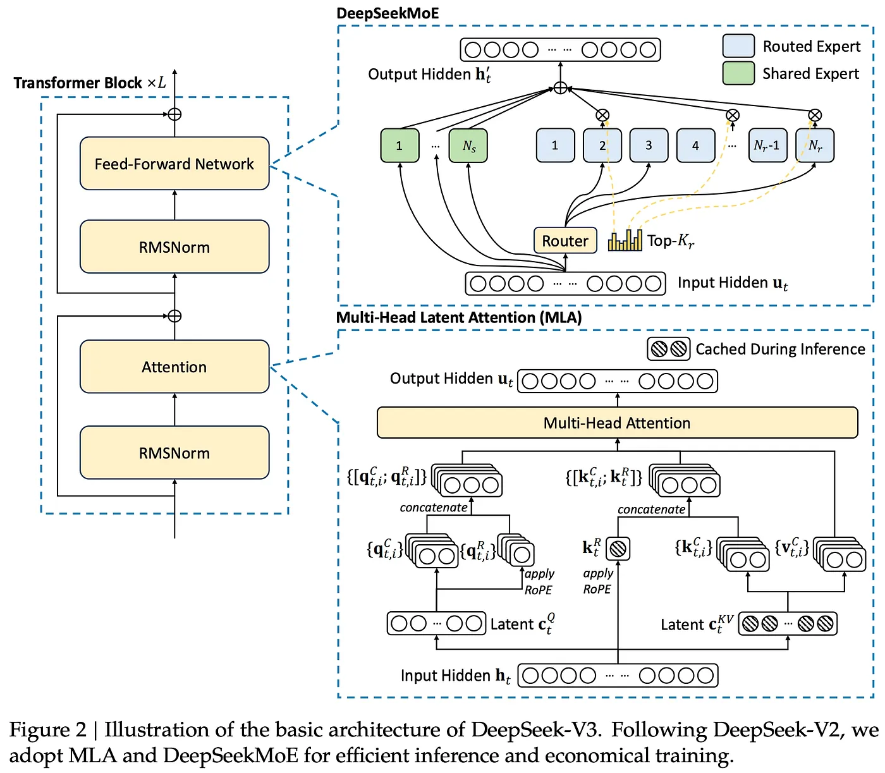

## MoE

The basic idea of MoE is split the FFN into multiple sub-networks(experts), for each input token, only part of sub-networks(experts) are activated. Different sub-networks behavior as different “experts”, during training they absorb different information and knowledge from the dataset, during inferencing only part of experts are activated based on the input token.

### What are "experts"?

In the decoder-only transformer architecture, the main modification made by an MoE is within the feed-forward component of the transformer block. In the standard architecture, we have a single feed-forward neural network—usually made up of two feed-forward layers with a non-linear activation in between—through which every token is passed individually; see below.

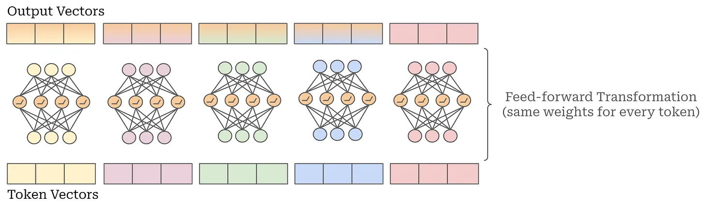

### Creating an MoE-based transformer

To create an MoE-based decoder-only transformer architecture, we simply convert the transformer’s feed-forward layers to MoE—or expert—layers. Each expert within the MoE layer has an architecture that is identical to the original, feed-forward network from that layer—we just have several independent copies of the original feed-forward network; see below.

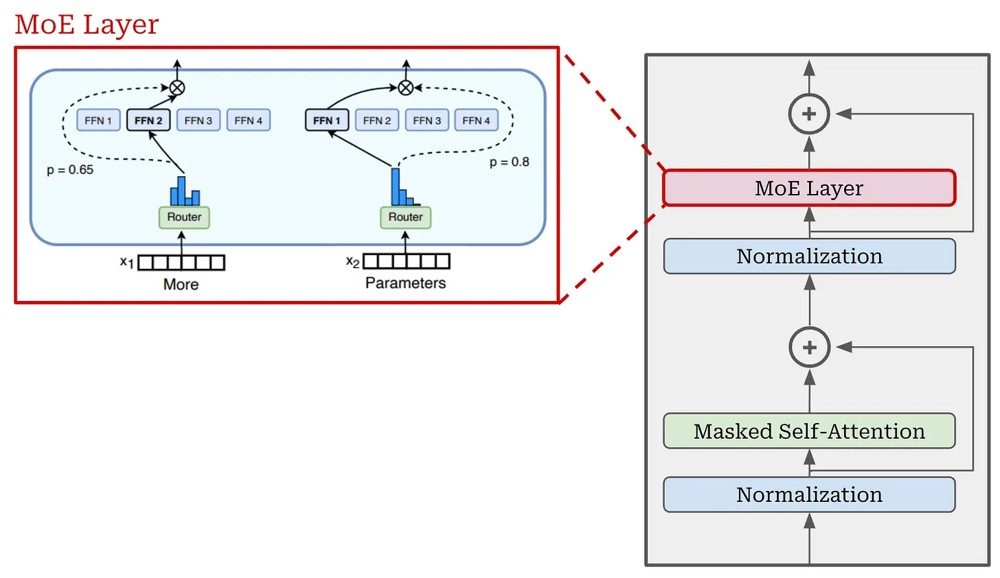

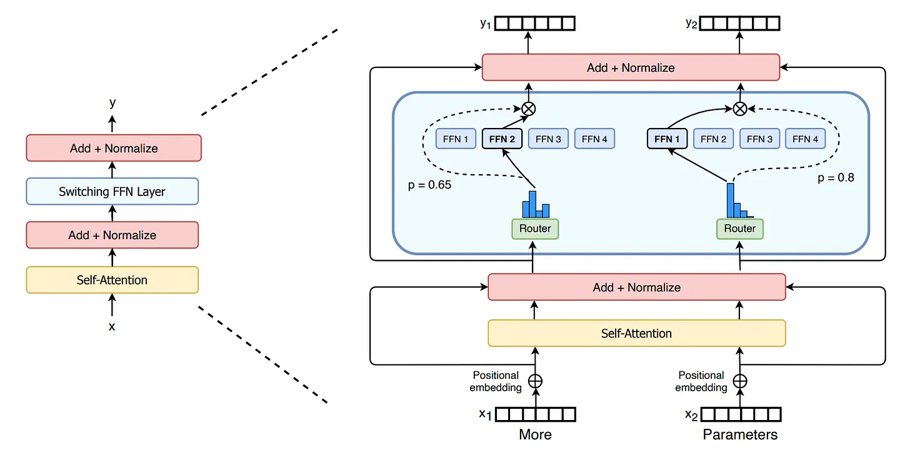

MoE layer in Neural Networks

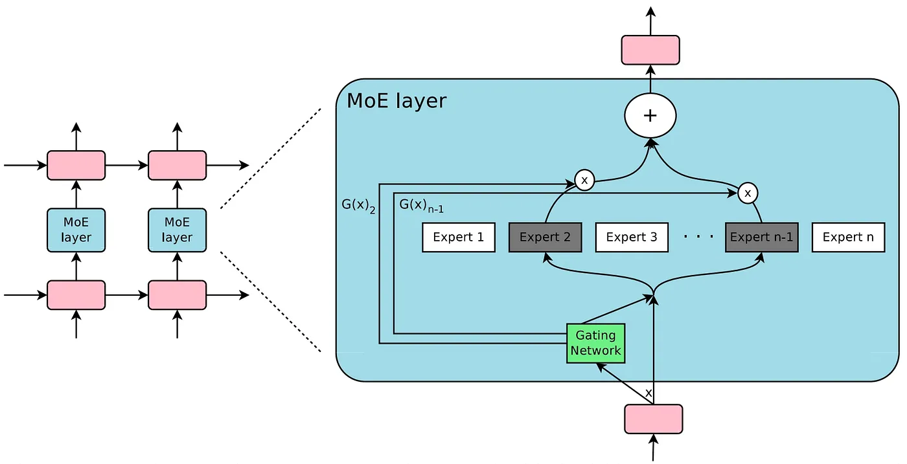

### Routing Algorithm

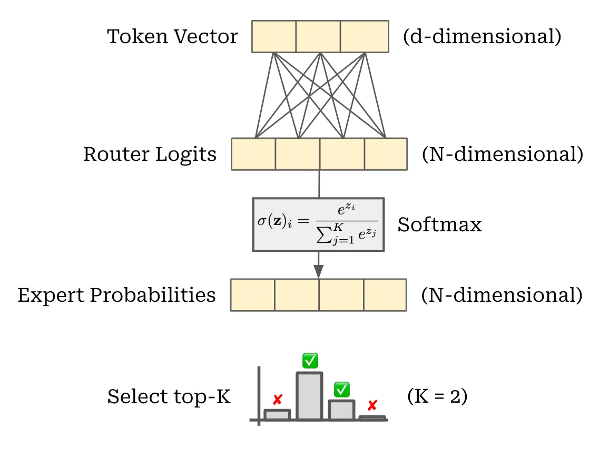

#### Auxiliary Losses and Expert Load Balancing

To encourage a balanced selection of experts during training, we can simply add an additional constraint to the training loss that rewards the model for uniformly leveraging each of its experts. In [1], this is done by defining an “importance” score for each expert. The importance score is based upon the probability predicted for each expert by the routing mechanism.

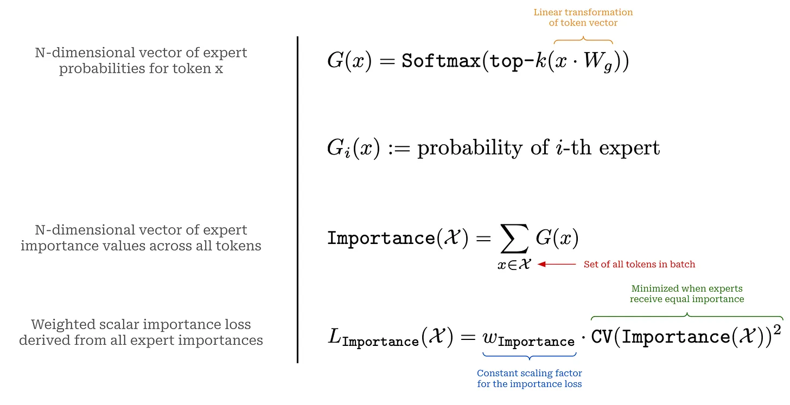

#### Expert Capacity

The computation performed in an MoE layer is dynamic due to the routing decisions made during both training and inference. However, when we look at most practical implementations of sparse models, we will see that they usually have static batch sizes—this is a useful trick for improving hardware utilization.

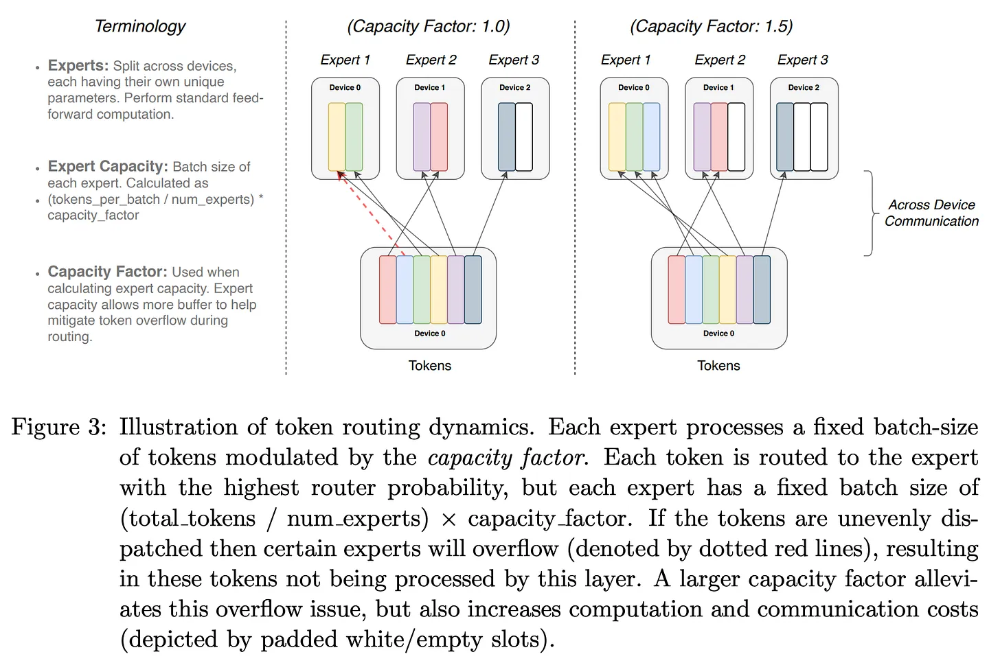

### Shared Experts

This idea of shared experts is depicted below, where we see that routing is only applied to a subset of the experts within an MoE layer. Usually, the number of shared experts must be lower than the number of routed experts—increasing the number of shared experts degrades the sparsity benefits of the MoE.

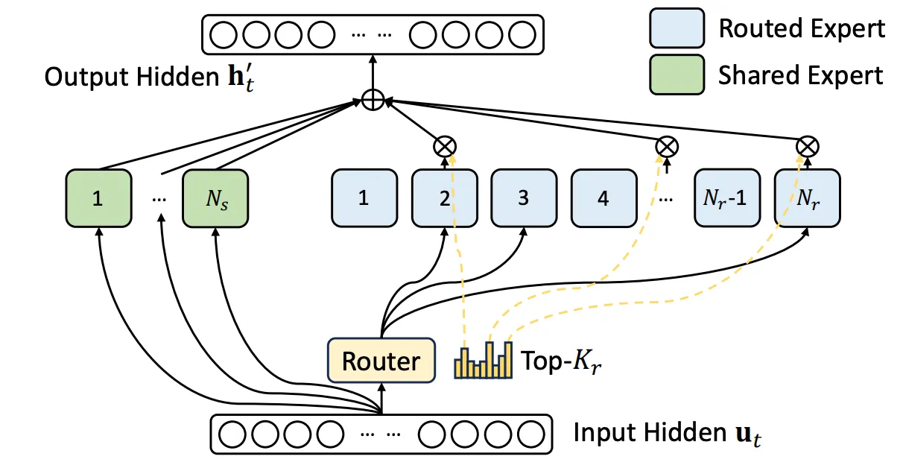

The motivation behind using shared experts is minimizing the amount of redundant information between experts. By having a set of shared experts, we can allow the network to store shared information within these experts, rather than having to replicate the same information across several different experts.

There are 2 key components in the MoE layer: Gating Network and Expert Networks. The Gating Network decides which “experts” should be activated for an input token, and then these experts handle the input token produce output for next layer during training and inferencing. The Gating Network will chose TopK experts to be activated for each input token, this is called “TopK Gating”. Both the Gating Network and Expert Networks are trained by simple back-propagation. 

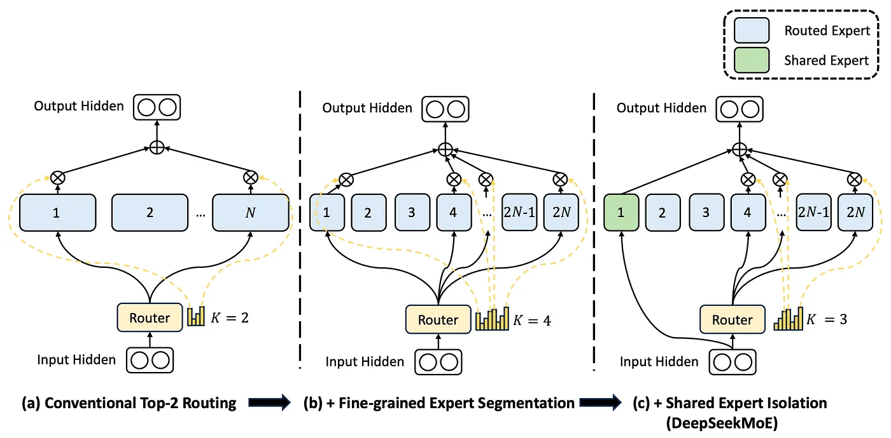

The conventional TopK MoE has <b>Knowledge Hybridity</b> and <b>Knowledge Redundancy</b>. 

- <b>Knowledge Hybridity</b>: existing MoE practices often employ a limited number of experts (e.g., 8 or 16), and thus tokens assigned to a specific expert will be likely to cover diverse knowledge. Consequently, the designated expert will intend to assemble vastly different types of knowledge in its parameters, which are hard to utilize simultaneously. 

- <b>Knowledge Redundancy</b>: tokens assigned to different experts may require common knowledge. As a result, multiple experts may converge in acquiring shared knowledge in their respective parameters, thereby leading to redundancy in expert parameters. These issues collectively hinder the expert specialization in existing MoE practices, preventing them from reaching the theoretical upper-bound performance of MoE models. By finely segmenting to more experts and introducing shared experts, DeepSeekMoE mitigated above tow issues.

## MLA (Mutli-Head Latent Attention)

### Multi and Grouped Query Attention

Multi-query attention, an efficient self-attention implementation that shares key and value projections between all attention heads in a layer; see below. Instead of performing a separate projection for each head, all heads share the same projection matrix for keys and the same projection matrix for values. This change does not make training any faster, but it significantly improves the inference speed of the resulting LLM.

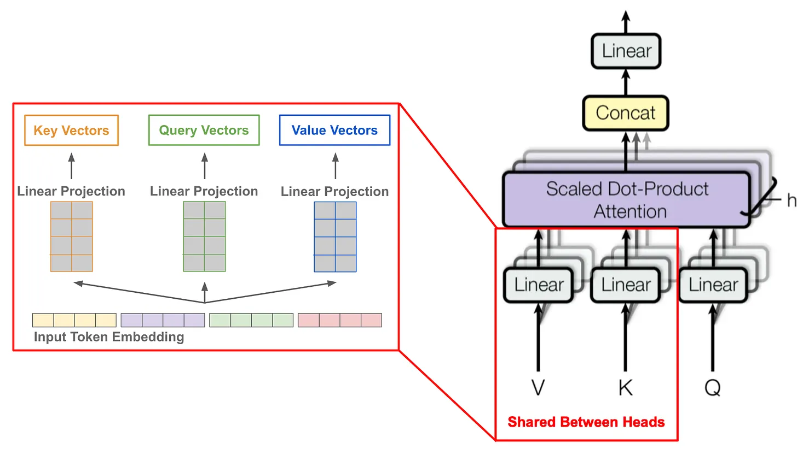

Unfortunately, multi-query attention can cause slight deteriorations in performance, which led some LLMS (e.g., LLaMA-2) to search for alternatives. Instead of sharing all key and value projections across attention heads, grouped-query attention (GQA) divides the H total self-attention heads into groups and shares key/value projections within the same group; see below. Such an approach is an interpolation between vanilla multi-headed self-attention and multi-query attention, which uses a shared key and value projection across all H heads. Interestingly, GQA maintains the performance of vanilla multi-headed causal self-attention and achieves comparable efficiency compared to multi-query attention.

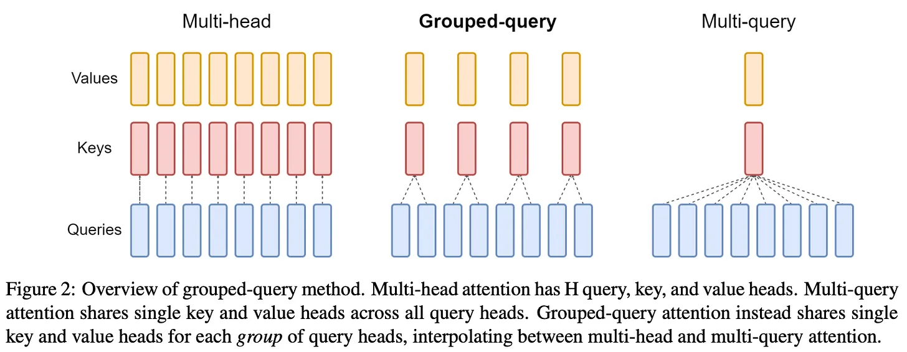

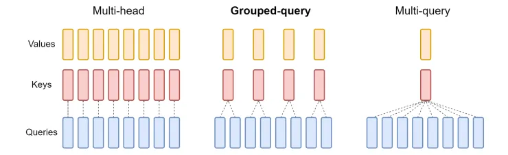

### MLA

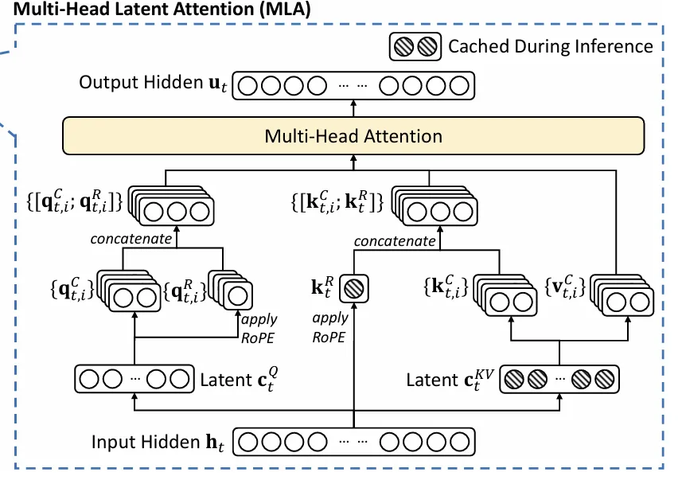

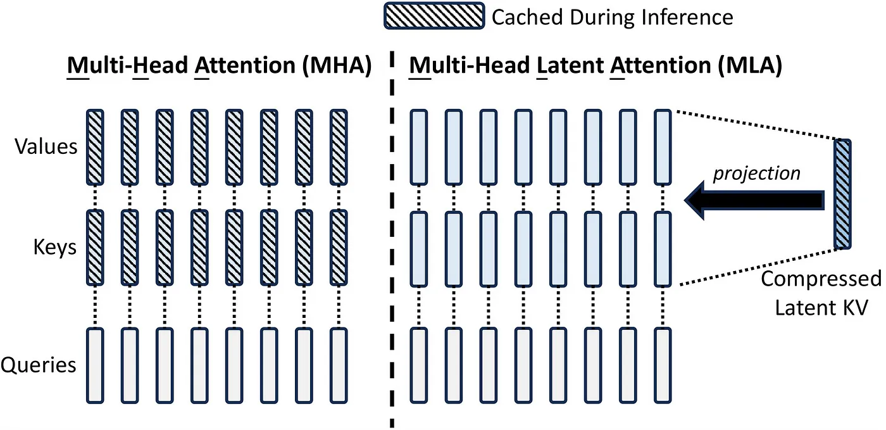

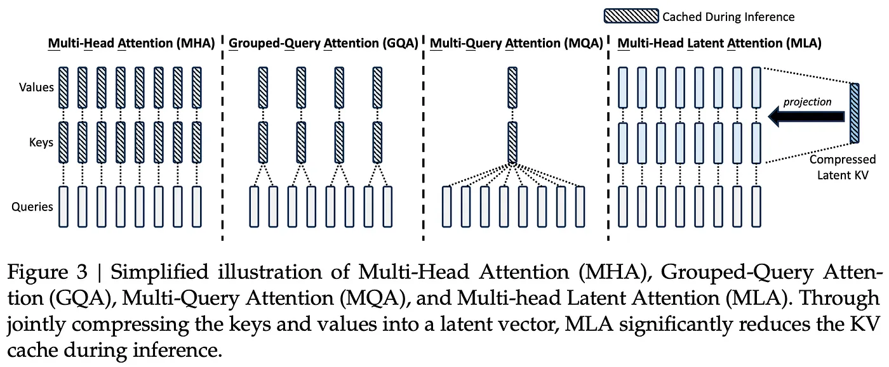

## Multi-Token Prediction

This objective is an extension of the supervised, cross entropy-based next token prediction objective that is used almost universally for training LLMs. Instead of predicting the next token for each token within a sequence, MTP predicts D future tokens. These predictions are made sequentially by a set of additional modules that are added to the model’s architecture; see below.

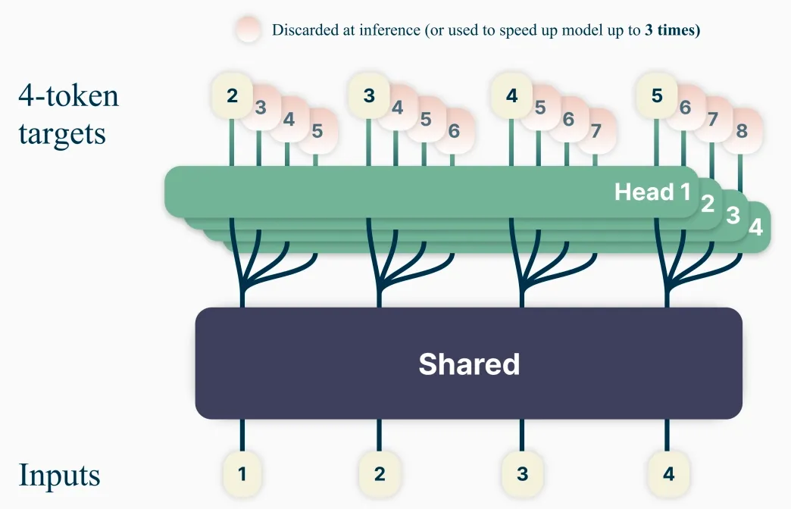

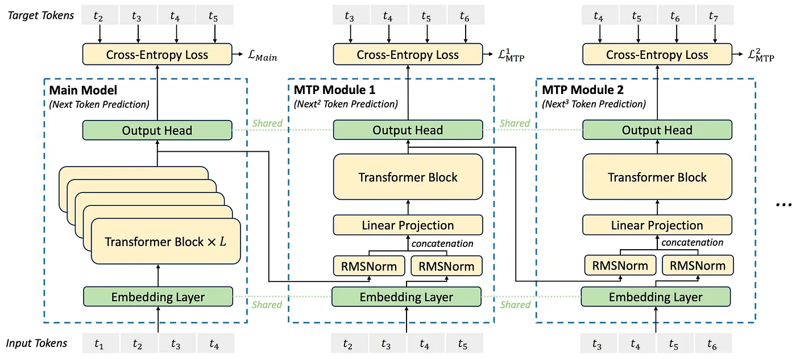

## FP8 Training

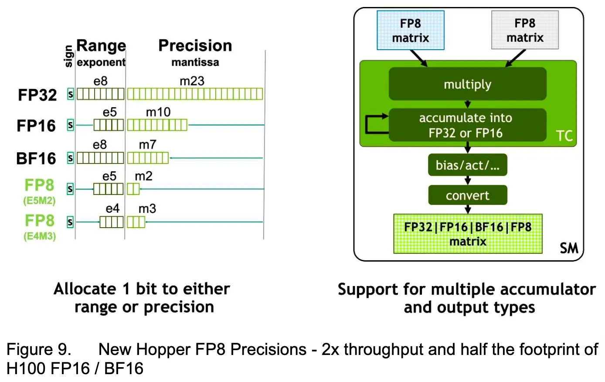

