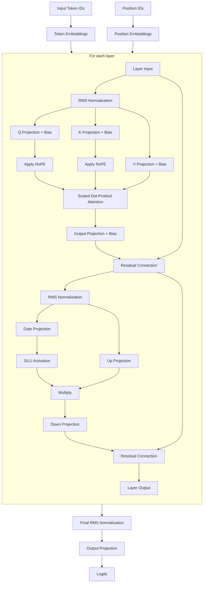

# llama.cpp

## Model Download
- [DeepSeek-R1-Distill-Qwen-14B](https://huggingface.co/bartowski/DeepSeek-R1-Distill-Qwen-14B-GGUF)
- [DeepSeek-R1-Distill-Qwen-7B](https://huggingface.co/unsloth/DeepSeek-R1-Distill-Qwen-7B-GGUF)

## llama.cpp build
```
cmake -B build -DCMAKE_BUILD_TYPE=Debug
cmake --build build
```

## 14B model
### model check
```
./llama-cli -m ~/Projects/models/DeepSeek-R1-Distill-Qwen-14B-Q8_0.gguf --verbose
```

#### meta data
- 30 key-value pairs
```
llama_model_loader: - kv   0:                       general.architecture str              = qwen2
llama_model_loader: - kv   2:                               general.name str              = DeepSeek R1 Distill Qwen 14B
llama_model_loader: - kv   3:                           general.basename str              = DeepSeek-R1-Distill-Qwen
llama_model_loader: - kv   4:                         general.size_label str              = 14B
llama_model_loader: - kv   5:                          qwen2.block_count u32              = 48
llama_model_loader: - kv   6:                       qwen2.context_length u32              = 131072
llama_model_loader: - kv   7:                     qwen2.embedding_length u32              = 5120
llama_model_loader: - kv   8:                  qwen2.feed_forward_length u32              = 13824
llama_model_loader: - kv   9:                 qwen2.attention.head_count u32              = 40
llama_model_loader: - kv  10:              qwen2.attention.head_count_kv u32              = 8
llama_model_loader: - kv  13:                       tokenizer.ggml.model str              = gpt2
llama_model_loader: - kv  14:                         tokenizer.ggml.pre str              = deepseek-r1-qwen
llama_model_loader: - type  f32:  241 tensors
llama_model_loader: - type q8_0:  338 tensors
```

## 7B model

### model check
```
./llama-cli -m ~/Projects/models/DeepSeek-R1-Distill-Qwen-7B-Q8_0.gguf --verbose
```

#### meta data
- 27 key-value pairs
```
llama_model_loader: - kv   0:                       general.architecture str              = qwen2
llama_model_loader: - kv   1:                               general.type str              = model
llama_model_loader: - kv   2:                               general.name str              = DeepSeek R1 Distill Qwen 7B
llama_model_loader: - kv   3:                       general.organization str              = Deepseek Ai
llama_model_loader: - kv   4:                           general.basename str              = DeepSeek-R1-Distill-Qwen
llama_model_loader: - kv   5:                         general.size_label str              = 7B
llama_model_loader: - kv   6:                          qwen2.block_count u32              = 28
llama_model_loader: - kv   7:                       qwen2.context_length u32              = 131072
llama_model_loader: - kv   8:                     qwen2.embedding_length u32              = 3584
llama_model_loader: - kv   9:                  qwen2.feed_forward_length u32              = 18944
llama_model_loader: - kv  10:                 qwen2.attention.head_count u32              = 28
llama_model_loader: - kv  11:              qwen2.attention.head_count_kv u32              = 4
llama_model_loader: - kv  12:                       qwen2.rope.freq_base f32              = 10000.000000
llama_model_loader: - kv  13:     qwen2.attention.layer_norm_rms_epsilon f32              = 0.000001
llama_model_loader: - kv  14:                          general.file_type u32              = 7
llama_model_loader: - kv  15:                       tokenizer.ggml.model str              = gpt2
llama_model_loader: - kv  16:                         tokenizer.ggml.pre str              = deepseek-r1-qwen
llama_model_loader: - type  f32:  141 tensors
llama_model_loader: - type q8_0:  198 tensors
```

## llm_build_qwen2() in llama-model.cpp

Here's a Mermaid flow chart that visualizes the computational graph for the Qwen2 architecture as implemented in `llm_build_qwen2()`:



### Key Components

1. **Input Processing**
   - Convert token IDs to embeddings
   - Generate position embeddings

2. **Transformer Layers**
   - **Attention Block**
     - RMS normalization
     - Q, K, V projections with biases
     - Rotary position embeddings (RoPE)
     - Scaled dot-product attention
     - Output projection with bias
     - Residual connection

   - **Feed-Forward Network**
     - RMS normalization
     - Parallel gate and up projections
     - SiLU activation on gate path
     - Element-wise multiplication
     - Down projection
     - Residual connection

3. **Output Processing**
   - Final RMS normalization
   - Output projection to vocabulary size

This architecture follows the standard decoder-only transformer design with some Qwen2-specific features like RMS normalization and SiLU activations in a parallel feed-forward configuration.

### Qwen2 Architecture Specifics

The function implements Qwen2-specific features:
- RMS normalization (different from LayerNorm)
- Separate, explicit Q, K, V projection matrices (with biases)
- Rotary position embeddings without alibi
- SiLU (Swish) activations in feed-forward network
- Parallel feed-forward network structure

The resulting computation graph defines the complete forward pass for inference with the Qwen2 model.


## Quantization

- <b>Bit Precision</b>: `Q8` > `Q6` > `Q5` > `Q4`. Lower bits mean less memory but more accuracy loss.
- <b>K-Quantization</b>: The `_K` suffix indicates advanced block-wise quantization with the K-means-like technique, which is more sophisticated than plain quantization (like `_0`). It groups weights and assigns scale factors per block, reducing quantization errors.
- <b>Variant Suffixes (`_S`, `_M`, `_L`)</b>: These tweak the block size or complexity of the K-quantization:
  - `_S` (small): More aggressive memory savings, potentially faster but less accurate.
  - `_M` (medium): Balanced approach.
  - `_L` (large): Larger blocks or more precision-preserving, at the cost of slightly more memory.


## References
