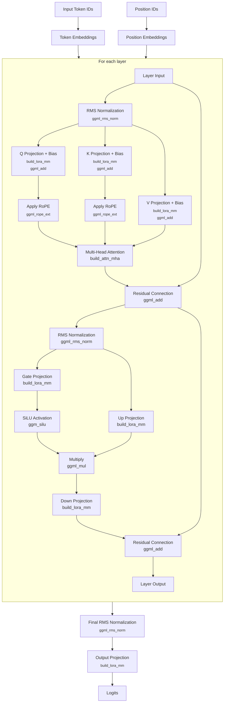
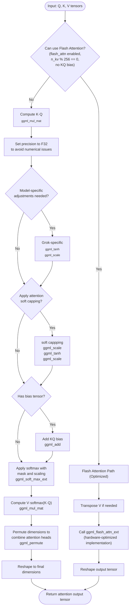
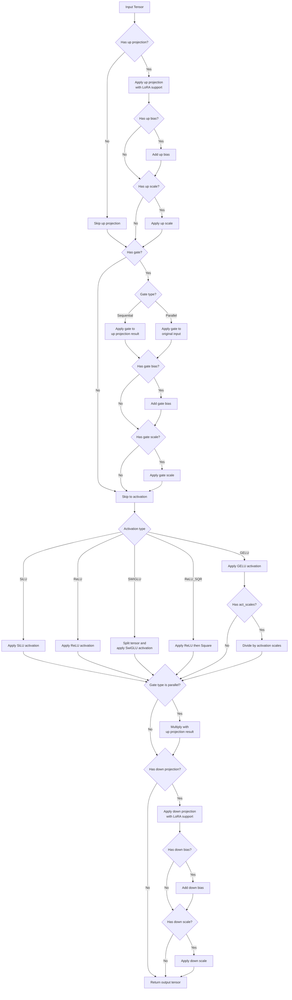

# llama.cpp

## Model Download
- [DeepSeek-R1-Distill-Qwen-14B](https://huggingface.co/bartowski/DeepSeek-R1-Distill-Qwen-14B-GGUF)
- [DeepSeek-R1-Distill-Qwen-7B](https://huggingface.co/unsloth/DeepSeek-R1-Distill-Qwen-7B-GGUF)

## llama.cpp build
```
cmake -B build -DCMAKE_BUILD_TYPE=Debug
cmake --build build
```

## 14B model
### model check
```
./llama-cli -m ~/Projects/models/DeepSeek-R1-Distill-Qwen-14B-Q8_0.gguf --verbose
```

#### meta data
- 30 key-value pairs
```
llama_model_loader: - kv   0:                       general.architecture str              = qwen2
llama_model_loader: - kv   2:                               general.name str              = DeepSeek R1 Distill Qwen 14B
llama_model_loader: - kv   3:                           general.basename str              = DeepSeek-R1-Distill-Qwen
llama_model_loader: - kv   4:                         general.size_label str              = 14B
llama_model_loader: - kv   5:                          qwen2.block_count u32              = 48
llama_model_loader: - kv   6:                       qwen2.context_length u32              = 131072
llama_model_loader: - kv   7:                     qwen2.embedding_length u32              = 5120
llama_model_loader: - kv   8:                  qwen2.feed_forward_length u32              = 13824
llama_model_loader: - kv   9:                 qwen2.attention.head_count u32              = 40
llama_model_loader: - kv  10:              qwen2.attention.head_count_kv u32              = 8
llama_model_loader: - kv  13:                       tokenizer.ggml.model str              = gpt2
llama_model_loader: - kv  14:                         tokenizer.ggml.pre str              = deepseek-r1-qwen
llama_model_loader: - type  f32:  241 tensors
llama_model_loader: - type q8_0:  338 tensors
```

## 7B model

### model check
```
./llama-cli -m ~/Projects/models/DeepSeek-R1-Distill-Qwen-7B-Q8_0.gguf --verbose
```

#### meta data
- 27 key-value pairs
```
llama_model_loader: - kv   0:                       general.architecture str              = qwen2
llama_model_loader: - kv   1:                               general.type str              = model
llama_model_loader: - kv   2:                               general.name str              = DeepSeek R1 Distill Qwen 7B
llama_model_loader: - kv   3:                       general.organization str              = Deepseek Ai
llama_model_loader: - kv   4:                           general.basename str              = DeepSeek-R1-Distill-Qwen
llama_model_loader: - kv   5:                         general.size_label str              = 7B
llama_model_loader: - kv   6:                          qwen2.block_count u32              = 28
llama_model_loader: - kv   7:                       qwen2.context_length u32              = 131072
llama_model_loader: - kv   8:                     qwen2.embedding_length u32              = 3584
llama_model_loader: - kv   9:                  qwen2.feed_forward_length u32              = 18944
llama_model_loader: - kv  10:                 qwen2.attention.head_count u32              = 28
llama_model_loader: - kv  11:              qwen2.attention.head_count_kv u32              = 4
llama_model_loader: - kv  12:                       qwen2.rope.freq_base f32              = 10000.000000
llama_model_loader: - kv  13:     qwen2.attention.layer_norm_rms_epsilon f32              = 0.000001
llama_model_loader: - kv  14:                          general.file_type u32              = 7
llama_model_loader: - kv  15:                       tokenizer.ggml.model str              = gpt2
llama_model_loader: - kv  16:                         tokenizer.ggml.pre str              = deepseek-r1-qwen
llama_model_loader: - type  f32:  141 tensors
llama_model_loader: - type q8_0:  198 tensors
```

## llm_build_qwen2() in llama-model.cpp

Here's a Mermaid flow chart that visualizes the computational graph for the Qwen2 architecture as implemented in `llm_build_qwen2()`:



### Key Components

1. **Input Processing**
   - Convert token IDs to embeddings
   - Generate position embeddings

2. **Transformer Layers**
   - **Attention Block**
     - RMS normalization
     - Q, K, V projections with biases
     - Rotary position embeddings (RoPE)
     - Scaled dot-product attention
     - Output projection with bias
     - Residual connection

   - **Feed-Forward Network**
     - RMS normalization
     - Parallel gate and up projections
     - SiLU activation on gate path
     - Element-wise multiplication
     - Down projection
     - Residual connection

3. **Output Processing**
   - Final RMS normalization
   - Output projection to vocabulary size

This architecture follows the standard decoder-only transformer design with some Qwen2-specific features like RMS normalization and SiLU activations in a parallel feed-forward configuration.

### Qwen2 Architecture Specifics

The function implements Qwen2-specific features:
- RMS normalization (different from LayerNorm)
- Separate, explicit Q, K, V projection matrices (with biases)
- Rotary position embeddings without alibi
- SiLU (Swish) activations in feed-forward network
- Parallel feed-forward network structure

## `llm_graph_context::build_inp_embd()` in `llama-graph.cpp`

This function creates the initial embedding vectors for tokens, which is the first transformation in the language model's forward pass.

```mermaid
flowchart TD
    start([Start]) --> check_input{"Input type?"}
    
    check_input -->|Token IDs| create_tokens["Create tensor for token IDs
    ggml_new_tensor_1d()"]
    check_input -->|Embeddings| create_embd["Create tensor for embeddings
    ggml_new_tensor_2d()"]
    
    create_tokens --> lookup["Look up embeddings
    ggml_get_rows"]
    create_embd --> use_direct["Use embeddings directly"]
    
    lookup --> has_lora{"Any LoRA
    adapters?"}
    
    has_lora -->|Yes| lora_loop["For each applicable LoRA adapter"]
    has_lora -->|No| scale_check
    
    lora_loop --> get_weight["Get LoRA weights for embeddings"]
    get_weight --> apply_lora["Apply LoRA modification:
    ∆ = scale * B·(A·tokens)<br>ggml_get_rows<br>ggml_mul_mat<br>ggml_scale"]
    apply_lora --> add_delta["Add modification:
    cur = cur + ∆<br>ggml_add"]
    add_delta --> more_loras{"More adapters?"}
    
    more_loras -->|Yes| lora_loop
    more_loras -->|No| scale_check
    
    use_direct --> scale_check{"Needs embedding
    scaling?"}
    
    scale_check -->|Yes| apply_scale["Apply embedding scale<br>
    ggml_scale"]
    scale_check -->|No| callback
    
    apply_scale --> callback["Call callback function
    "]
    
    callback --> return["Return embedding tensor"]
  ```

### Key Operations

1. **Input Processing**:
   - Creates appropriate tensors based on input type (token IDs or direct embeddings)
   - Marks tensors for external input (to be filled later)

2. **Token to Embedding Conversion**:
   - For token IDs: Performs lookup in the embedding table using `ggml_get_rows`
   - For embeddings: Uses the provided embeddings directly 

3. **LoRA Adaptation** (if applicable):
   - Applies low-rank adaptation to embeddings
   - Enables fine-tuned behavior without modifying base embeddings
   - Computes `∆ = scale * B·(A·tokens)` for each adapter
   - Adds these modifications to base embeddings

4. **Architecture-Specific Processing**:
   - Applies embedding scale factor for certain architectures (e.g., Granite)

5. **Result Handling**:
   - Registers the input handler for later use
   - Returns the processed embeddings for use in subsequent layers

This is the first step in the model's computation path, converting discrete tokens into continuous vector representations.

## `llm_graph_context::build_inp_pos()` in `llama-graph.cpp`

This function creates a tensor for position information in the computation graph, which is crucial for position-aware operations in transformer models.

### Purpose

The position tensor is essential for transformers because:

1. **Sequence Order**: Transformer models need to understand token positions in sequences
2. **RoPE (Rotary Position Embeddings)**: Positions are used to calculate rotation angles
3. **Attention Calculations**: Positions determine which tokens can attend to each other

### Key Details

- Creates an INT32 tensor to hold position values
- Size depends on:
  - `n_tokens`: Number of tokens in the batch
  - `n_pos_per_token()`: Returns 4 for Qwen2VL models, 1 for all others
- Marks the tensor as an "input tensor" which will be filled later
- The actual position values are set by `set_input()` when the model runs

### Related Functions

The position information is later used by:
- RoPE calculations in attention mechanisms
- Relative position bias computations
- Attention masking to enforce causal attention

This function is critical for position-awareness in transformers, which would otherwise be permutation-invariant.

## `llm_graph_context::build_lora_mm()` in `llama-graph.cpp`

The `build_lora_mm()` function implements Low-Rank Adaptation (LoRA) in the llama.cpp inference process. LoRA is a parameter-efficient fine-tuning technique that allows adapting pre-trained models with minimal additional parameters.

```mermaid
flowchart TD
    start([Start]) --> standard_mm["Standard Matrix Multiplication:
    res = W·cur"<br> <sub>ggml_mul_mat</sub>]
    
    standard_mm --> has_loras{"Any LoRA
    adapters?"}
    
    has_loras -->|No| return_res["Return res"]
    
    has_loras -->|Yes| lora_loop["For each LoRA adapter"]
    
    lora_loop --> has_weights{"Adapter has
    weights for W?"}
    
    has_weights -->|No| next_lora["Next adapter"]
    next_lora --> lora_loop
    
    has_weights -->|Yes| compute_a["Compute A·cur<br> <sub>ggml_mul_mat</sub>"]
    compute_a --> compute_b["Compute B·(A·cur)<br> <sub>ggml_mul_mat</sub>"]
    compute_b --> scale["Scale result by adapter factor<br> <sub>ggml_scale</sub>"]
    scale --> add["Add to original: 
    res = res + scale·B·(A·cur)<br> <sub>ggml_add</sub>"]
    
    add --> more_adapters{"More adapters?"}
    more_adapters -->|Yes| next_lora
    more_adapters -->|No| return_res
    
    return_res --> finish([End])
    
    classDef process fill:#f9f,stroke:#333,stroke-width:1px;
    classDef decision fill:#bbf,stroke:#333,stroke-width:1px;
    
    class standard_mm,compute_a,compute_b,scale,add process;
    class has_loras,has_weights,more_adapters decision;
```

### How LoRA Works in This Function

1. **Base Computation**: First computes the standard matrix multiplication `W·x` between original weights and input

2. **For Each LoRA Adapter**:
   - Retrieves adapter-specific weights for the given tensor
   - Calculates the adaptation by computing `B·(A·x)` where A and B are low-rank matrices
   - Scales the result by the adapter's scaling factor
   - Adds this adaptation to the original result

3. **Mathematical Equivalent**: 
   - Original: `y = W·x`
   - With LoRA: `y = W·x + (BA)·x = W·x + B·(A·x)`

This function effectively implements the core LoRA equation: `W' = W + BA` where the adapted weight `W'` is used instead of the original weight `W`, but without explicitly materializing the full `W'` matrix - saving memory and computation.

The function handles multiple LoRA adapters simultaneously, allowing for composable adaptations of the base model.

## `llm_graph_context::build_attn_mha()` in `llama-graph.cpp`

The `build_attn_mha()` function implements the multi-head attention mechanism, which is the core component that allows transformer models to dynamically focus on different parts of the input.



### Key Steps in the Function

1. **Decision Point**: Choose between Flash Attention (optimized) or standard attention path
   
2. **Flash Attention Path**:
   - Transpose V tensor if needed
   - Use optimized `ggml_flash_attn_ext` operation
   - Set precision and reshape output

3. **Standard Attention Path**:
   - Compute query-key product (`K·Q`)
   - Apply model-specific adjustments (e.g., GROK scaling)
   - Handle attention logit soft capping if enabled
   - Add bias if provided
   - Apply softmax with mask to get attention weights
   - Calculate weighted values (`V·softmax(K·Q)`)
   - Reshape and permute dimensions for final output format

4. **Backend Selection**:
   - Optionally force CPU execution for this operation

This function is critical for model performance as attention operations are among the most computationally intensive parts of transformer inference.

## `llm_graph_context::build_ffn()` in `llma-graph.cpp`

The `build_ffn()` function constructs the feed-forward network (FFN) component of transformer models in llama.cpp's computational graph. This is a crucial part of each transformer layer that processes token representations after the attention mechanism.



### Key Components

1. **Up-Projection**
   - Expands the input's dimensionality
   - Applies LoRA fine-tuning if available
   - Optionally adds bias and scaling

2. **Gating Mechanisms**
   - **Sequential Gate**: Applied after up-projection
   - **Parallel Gate**: Applied to original input in parallel with up-projection
   - Both support bias and scaling

3. **Activation Functions**
   - **SiLU** (Sigmoid Linear Unit): `x * sigmoid(x)`
   - **GELU** (Gaussian Error Linear Unit): Smooth approximation of ReLU
   - **ReLU** (Rectified Linear Unit): `max(0, x)`
   - **ReLU-SQR**: Applies ReLU then squares the result
   - **SwiGLU**: Splits tensor and applies special activation

4. **Down-Projection**
   - Projects dimensions back to original size
   - Applies LoRA fine-tuning if available
   - Optionally adds bias and scaling

This highly flexible implementation can support various modern transformer architectures including LLaMA, Falcon, GPT-J, Qwen, and others with their specific variations.

## `llm_graph_context::build_cvec()` in `llama-graph.cpp`

The `build_cvec()` function applies conditioning vectors to the model's internal representations, which is a technique used for controlled generation or steering in language models.

### Purpose

This function is part of llama.cpp's conditioning system that allows you to manipulate the model's internal activations to guide or steer its output in specific directions.

### Key Functionality

The function acts as a thin wrapper around the `apply_to()` method of a conditioning vector object (`cvec`), which:

1. Receives the current tensor representation (`cur`) at a specific layer (`il`)
2. Uses the ggml context (`ctx0`) to create necessary computation nodes
3. Returns a modified tensor with the conditioning applied

### How It's Used

Conditioning vectors are applied at specific points in the model's forward pass, typically:

1. After self-attention layers
2. After feed-forward networks
3. At specific layers where intervention is desired

### Applications

In llama.cpp, this functionality enables:

- **Logit manipulation**: Steering text generation toward or away from certain topics
- **Classifier-free guidance**: Similar to techniques used in image diffusion models
- **Concept steering**: Amplifying or suppressing specific concepts in generated text
- **Style control**: Modifying the writing style or tone of generated text

This is part of llama.cpp's more advanced control features that allow fine-grained influence over model behavior without full fine-tuning.

## Quantization

- <b>Bit Precision</b>: `Q8` > `Q6` > `Q5` > `Q4`. Lower bits mean less memory but more accuracy loss.
- <b>K-Quantization</b>: The `_K` suffix indicates advanced block-wise quantization with the K-means-like technique, which is more sophisticated than plain quantization (like `_0`). It groups weights and assigns scale factors per block, reducing quantization errors.
- <b>Variant Suffixes (`_S`, `_M`, `_L`)</b>: These tweak the block size or complexity of the K-quantization:
  - `_S` (small): More aggressive memory savings, potentially faster but less accurate.
  - `_M` (medium): Balanced approach.
  - `_L` (large): Larger blocks or more precision-preserving, at the cost of slightly more memory.


## References
