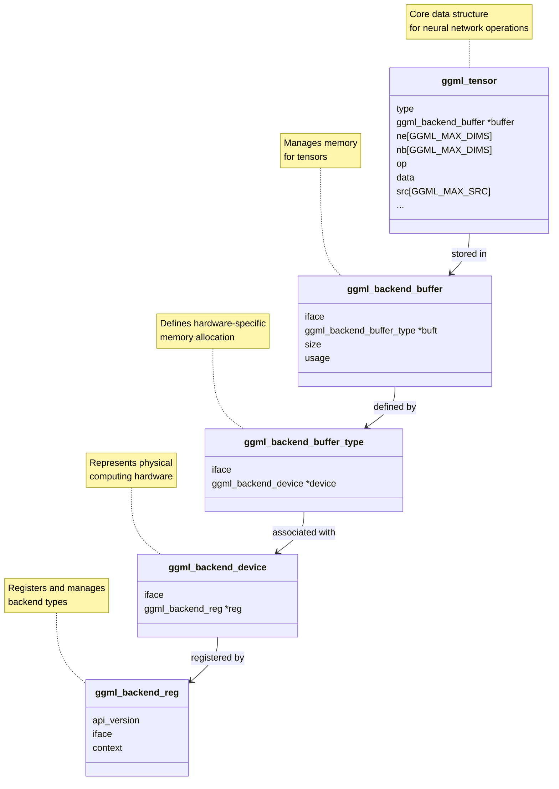
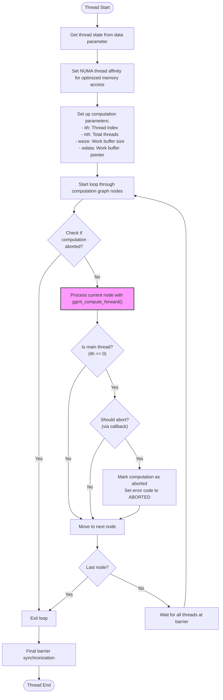
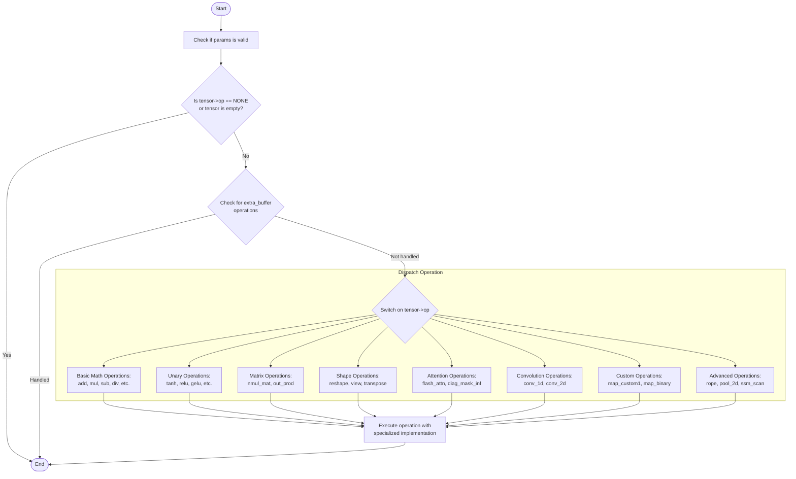

# GGML GGUF



## GGML Tensor
- ggml.h
```
    // n-dimensional tensor
    struct ggml_tensor {
        enum ggml_type type;  // GGML_TYPE_F32     = 0, 
                              // GGML_TYPE_F16     = 1,        
                              // GGML_TYPE_Q8_0    = 8,

        struct ggml_backend_buffer * buffer;

        int64_t ne[GGML_MAX_DIMS]; // number of elements
        size_t  nb[GGML_MAX_DIMS]; // stride in bytes:
                                   // nb[0] = ggml_type_size(type)
                                   // nb[1] = nb[0]   * (ne[0] / ggml_blck_size(type)) + padding
                                   // nb[i] = nb[i-1] * ne[i-1]

        // compute data
        enum ggml_op op;  // GGML_OP_NONE = 0,
                          // GGML_OP_ADD,
                          // GGML_OP_RMS_NORM,

        // op params - allocated as int32_t for alignment
        int32_t op_params[GGML_MAX_OP_PARAMS / sizeof(int32_t)];

        int32_t flags;

        struct ggml_tensor * src[GGML_MAX_SRC];

        // source tensor and offset for views
        struct ggml_tensor * view_src;
        size_t               view_offs;

        void * data;

        char name[GGML_MAX_NAME];

        void * extra; // extra things e.g. for ggml-cuda.cu

        char padding[8];
    };
```    

The `ggml_tensor` is the core data structure in GGML (the tensor library used by llama.cpp) that represents n-dimensional arrays of values for neural network operations. It serves as the fundamental building block for all computations in the library.

In llama.cpp, tensors are used to represent everything from model weights to activations during inference. The structure is designed to be flexible enough to support various operations while maintaining performance through careful memory management and support for hardware acceleration.

### Data Storage
- Stores values of different types (FP32, FP16, quantized formats, etc.)
- Supports up to 4 dimensions with configurable shapes
- Manages memory layout through strides (`nb`) for efficient operations

### Computational Graph Integration
- Records which operation created this tensor (`op`)
- Stores references to source tensors (`src`) used to create it
- Contains operation parameters used during computation
- Enables building a computational graph for inference and training

### Memory Optimization
- Supports views (references to subsections of other tensors)
- Can belong to different backend buffers for device-specific memory
- Contains metadata necessary for quantization and special operations

### Tensor Classification
- Flags mark tensors as inputs, outputs, parameters or loss values
- Contains name field for human-readable identification

## GGML Backend Buffer

- ggml-backend-impl.h
```
    struct ggml_backend_buffer_i {
        // (optional) free the buffer
        void         (*free_buffer)  (ggml_backend_buffer_t buffer);
        // base address of the buffer
        void *       (*get_base)     (ggml_backend_buffer_t buffer);
        // (optional) initialize a tensor in the buffer (eg. add tensor extras)
        enum ggml_status (*init_tensor)(ggml_backend_buffer_t buffer, struct ggml_tensor * tensor);
        // tensor data access
        void         (*memset_tensor)(ggml_backend_buffer_t buffer,       struct ggml_tensor * tensor,     uint8_t value, size_t offset, size_t size);
        void         (*set_tensor)   (ggml_backend_buffer_t buffer,       struct ggml_tensor * tensor, const void * data, size_t offset, size_t size);
        void         (*get_tensor)   (ggml_backend_buffer_t buffer, const struct ggml_tensor * tensor,       void * data, size_t offset, size_t size);
        // (optional) tensor copy: dst is in the buffer, src may be in any buffer, including buffers from a different backend (return false if not supported)
        bool         (*cpy_tensor)   (ggml_backend_buffer_t buffer, const struct ggml_tensor * src, struct ggml_tensor * dst);
        // clear the entire buffer
        void         (*clear)        (ggml_backend_buffer_t buffer, uint8_t value);
        // (optional) reset any internal state due to tensor initialization, such as tensor extras
        void         (*reset)        (ggml_backend_buffer_t buffer);
    };

    struct ggml_backend_buffer {
        struct ggml_backend_buffer_i  iface;
        ggml_backend_buffer_type_t    buft;
        void * context;
        size_t size;
        enum ggml_backend_buffer_usage usage;   // GGML_BACKEND_BUFFER_USAGE_ANY = 0,
                                                // GGML_BACKEND_BUFFER_USAGE_WEIGHTS = 1,
                                                // GGML_BACKEND_BUFFER_USAGE_COMPUTE = 2,
    };
```    

The `ggml_backend_buffer` is a core component in GGML's hardware abstraction layer that manages memory for tensor operations across different computing devices. It has several key responsibilities:

The `ggml_backend_buffer_i` structure defines the interface for device-specific memory operations in GGML's hardware abstraction layer. It's essentially a collection of function pointers that implement memory operations for different hardware backends.

1. **Memory Management**
   - `free_buffer`: Deallocates the memory
   - `get_base`: Gets the raw pointer to the memory
   - `clear`: Sets all bytes in the buffer to a specific value

2. **Tensor-Buffer Operations**
   - `init_tensor`: Prepares a tensor to use this buffer (sets up metadata)
   - `memset_tensor`: Sets a section of a tensor's memory to a specific value
   - `set_tensor`: Copies data into a tensor (from host memory)
   - `get_tensor`: Retrieves data from a tensor (to host memory)

3. **Cross-Backend Compatibility**
   - `cpy_tensor`: Enables copying tensors between different backend types (e.g., CPU to GPU)
   - `reset`: Cleans up internal state after tensor operations

### Key Benefits

- **Hardware Abstraction**: Allows GGML to work with different memory types (CPU, CUDA, Metal) through a unified API
- **Polymorphism**: Different backends can implement these functions according to their specific requirements
- **Extensibility**: New hardware backends can be added by implementing this interface
- **Performance Optimization**: Each backend can optimize memory operations for its hardware

This abstraction enables GGML to work efficiently with different hardware like CPUs, GPUs, and potentially other accelerators while maintaining a consistent API.

## GGML Backend Buffer Type 

- ggml-backend-impl.h
```
    struct ggml_backend_buffer_type_i {
        const char *          (*get_name)      (ggml_backend_buffer_type_t buft);
        // allocate a buffer of this type
        ggml_backend_buffer_t (*alloc_buffer)  (ggml_backend_buffer_type_t buft, size_t size);
        // tensor alignment
        size_t                (*get_alignment) (ggml_backend_buffer_type_t buft);
        // (optional) max buffer size that can be allocated (defaults to SIZE_MAX)
        size_t                (*get_max_size)  (ggml_backend_buffer_type_t buft);
        // (optional) data size needed to allocate the tensor, including padding (defaults to ggml_nbytes)
        size_t                (*get_alloc_size)(ggml_backend_buffer_type_t buft, const struct ggml_tensor * tensor);
        // (optional) check if tensor data is in host memory and uses standard ggml tensor layout (defaults to false)
        bool                  (*is_host)       (ggml_backend_buffer_type_t buft);
    };

    struct ggml_backend_buffer_type {
        struct ggml_backend_buffer_type_i  iface;
        ggml_backend_dev_t device;
        void * context;
    };
```    

The `ggml_backend_buffer_type` structure defines a specific class of memory buffer that can be used with a particular hardware backend in GGML. It serves as a hardware-specific template for memory allocation.

The `ggml_backend_buffer_type_i` structure defines the interface for different memory buffer types in GGML's hardware abstraction layer. It's a critical component that enables GGML to work with different types of memory across various computing devices.

### Key Responsibilities

This interface defines how a specific type of memory buffer (e.g., CPU memory, CUDA memory, Metal memory) behaves by providing function pointers for common operations:

1. **Identification**
   - `get_name`: Returns a human-readable name for the buffer type (like "CPU", "CUDA", etc.)

2. **Memory Allocation**
   - `alloc_buffer`: Creates a new buffer of this type with specified size
   - `get_alignment`: Provides memory alignment requirements for optimal performance
   - `get_max_size`: Returns maximum possible allocation size (hardware-dependent)
   - `get_alloc_size`: Calculates required memory for a tensor including any padding

3. **Memory Characteristics**
   - `is_host`: Indicates if the buffer is in host memory with standard GGML layout

### Real-World Examples

- **CPU Buffer Type**: Defines standard RAM allocation for tensors
- **CUDA Buffer Type**: Manages GPU memory allocation on NVIDIA devices
- **Metal Buffer Type**: Handles memory on Apple GPUs
- **Pinned Memory Buffer Type**: Creates CPU memory optimized for faster GPU transfers

### Benefits of This Design

- **Hardware Abstraction**: Allows GGML to work with different memory types through a common interface
- **Extensibility**: New hardware backends can be added by implementing this interface
- **Optimization**: Each backend can implement memory operations optimized for its specific hardware
- **Polymorphism**: Enables different memory types to be treated uniformly in higher-level code

This abstraction is what allows GGML to efficiently use different memory types across various hardware backends while maintaining a unified programming model. It's a critical component that enables llama.cpp to run on many different computing platforms.

## GGML Backend Device

- ggml-backend-impl.h
```
    // Note: if additional properties are needed, we should add a struct with all of them
    //       the current functions to obtain the properties can remain, since they are more convenient for often used properties
    struct ggml_backend_device_i {
        // device name: short identifier for this device, such as "CPU" or "CUDA0"
        const char * (*get_name)(ggml_backend_dev_t dev);

        // device description: short informative description of the device, could be the model name
        const char * (*get_description)(ggml_backend_dev_t dev);

        // device memory in bytes
        void         (*get_memory)(ggml_backend_dev_t dev, size_t * free, size_t * total);

        // device type
        enum ggml_backend_dev_type (*get_type)(ggml_backend_dev_t dev);

        // device properties
        void (*get_props)(ggml_backend_dev_t dev, struct ggml_backend_dev_props * props);

        // backend (stream) initialization
        ggml_backend_t (*init_backend)(ggml_backend_dev_t dev, const char * params);

        // preferred buffer type
        ggml_backend_buffer_type_t (*get_buffer_type)(ggml_backend_dev_t dev);

        // (optional) host buffer type (in system memory, typically this is a pinned memory buffer for faster transfers between host and device)
        ggml_backend_buffer_type_t (*get_host_buffer_type)(ggml_backend_dev_t dev);

        // (optional) buffer from pointer: create a buffer from a host pointer (useful for memory mapped models and importing data from other libraries)
        ggml_backend_buffer_t (*buffer_from_host_ptr)(ggml_backend_dev_t dev, void * ptr, size_t size, size_t max_tensor_size);

        // check if the backend can compute an operation
        bool (*supports_op)(ggml_backend_dev_t dev, const struct ggml_tensor * op);

        // check if the backend can use tensors allocated in a buffer type
        bool (*supports_buft)(ggml_backend_dev_t dev, ggml_backend_buffer_type_t buft);

        // (optional) check if the backend wants to run an operation, even if the weights are allocated in an incompatible buffer
        // these should be expensive operations that may benefit from running on this backend instead of the CPU backend
        bool (*offload_op)(ggml_backend_dev_t dev, const struct ggml_tensor * op);

        // (optional) event synchronization
        ggml_backend_event_t (*event_new)         (ggml_backend_dev_t dev);
        void                 (*event_free)        (ggml_backend_dev_t dev, ggml_backend_event_t event);
        void                 (*event_synchronize) (ggml_backend_dev_t dev, ggml_backend_event_t event);
    };

    struct ggml_backend_device {
        struct ggml_backend_device_i iface;
        ggml_backend_reg_t reg;
        void * context;
    };
```

The `ggml_backend_device` is a key structure in GGML's hardware abstraction layer that represents a physical computing device (like a CPU, GPU, or other accelerator). It serves as the bridge between the GGML framework and specific hardware platforms.

The `ggml_backend_device_i` structure defines the interface that all device backends must implement to work with GGML. It's essentially a contract that specifies how GGML interacts with various hardware platforms.

This interface provides critical functions for:

1. **Device Information**
   - `get_name`: Returns a short identifier like "CPU" or "CUDA0"
   - `get_description`: Provides more detailed device information
   - `get_memory`: Reports available and total memory on the device
   - `get_type`: Identifies the device type (CPU, GPU, etc.)
   - `get_props`: Returns detailed device properties and capabilities

2. **Backend Creation**
   - `init_backend`: Creates a computational stream on this device

3. **Memory Management**
   - `get_buffer_type`: Returns the optimal buffer type for this device
   - `get_host_buffer_type`: Returns buffer type for efficient host-device transfers
   - `buffer_from_host_ptr`: Creates device buffers from existing host memory

4. **Operation Support**
   - `supports_op`: Checks if a tensor operation can run on this device
   - `supports_buft`: Verifies compatibility with specific buffer types
   - `offload_op`: Determines if an operation should be moved to this device

5. **Synchronization**
   - Event creation, management, and synchronization functions

This is an example of the Strategy <b>design pattern</b> - it allows GGML to swap different hardware implementations while maintaining a consistent interface. By implementing this interface, any device (CPU, NVIDIA GPU, AMD GPU, Apple Silicon, etc.) can be integrated into the GGML framework.

This abstraction is what enables llama.cpp to run efficiently across diverse hardware while keeping the core tensor operations hardware-agnostic.

## GGML Backend Registry

- ggml-backend-impl.h
```
    //
    // Backend (reg)
    //

    struct ggml_backend_reg_i {
        const char * (*get_name)(ggml_backend_reg_t reg);

        // enumerate available devices
        size_t             (*get_device_count)(ggml_backend_reg_t reg);
        ggml_backend_dev_t (*get_device)(ggml_backend_reg_t reg, size_t index);

        // (optional) get a pointer to a function in the backend
        // backends can add custom functions that are not part of the standard ggml-backend interface
        void * (*get_proc_address)(ggml_backend_reg_t reg, const char * name);
    };

    struct ggml_backend_reg {
        int api_version; // initialize to GGML_BACKEND_API_VERSION
        struct ggml_backend_reg_i iface;
        void * context;
    };
```

The `ggml_backend_reg` structure serves as a backend type registry in GGML's hardware abstraction system. It acts as a factory and management system for hardware backends.

### Core Responsibilities

1. **Backend Registration**
   - Registers different backend types with the GGML system
   - Maintains compatibility through API versioning
   - Provides a standard interface for discovering backend capabilities

2. **Device Enumeration**
   - Lists all available devices of a specific backend type
   - Returns device handles that can be used for computation
   - Example: A CUDA backend registry would enumerate all NVIDIA GPUs

3. **Backend Discovery**
   - Enables dynamic loading of backends at runtime
   - Allows scoring backends based on system capabilities
   - Facilitates automatic backend selection based on hardware availability

4. **Extension Support**
   - Provides access to non-standard, backend-specific functions
   - Enables extensions beyond the standard GGML interface
   - Allows specialized optimizations for particular hardware

### Real-World Example

The registry system is what allows llama.cpp to dynamically discover and use different computation backends:

- CPU backends register themselves with details about available CPU cores
- CUDA backends register with information about NVIDIA GPUs
- Metal backends register with information about Apple GPUs
- OpenCL backends register with information about compatible devices

This registry design enables llama.cpp's plugin architecture, where different hardware backends can be loaded at runtime based on what's available on the user's system.

## GGML Graph Compute Thread

- ggml-cpu.c

The `ggml_graph_compute_thread()` is the core function that executes tensor operations in GGML's computational graph across multiple threads. Here's a flowchart explaining how it works:



### Key Features

1. **Parallel Execution**: Divides work across multiple threads efficiently
2. **Thread Coordination**: Uses barriers to synchronize at critical points
3. **Graceful Abortion**: Supports stopping computation early via callbacks
4. **Memory Optimizations**: Sets thread affinity for better memory access patterns
5. **Work Sharing**: Each thread processes different parts of the same operations

This design allows GGML to efficiently execute neural network operations like matrix multiplications, convolutions, and attention mechanisms in parallel across CPU cores, which is critical for the performance of llama.cpp.

## GGML Compute Forward Function

- ggml-cpu.c

The `ggml_compute_forward` function is the core computation dispatcher in the GGML library. It processes tensor operations by routing each operation to its appropriate implementation based on the tensor's operation type.

## Flowchart



### Key Points

1. **Operation Validation**: First checks if the tensor operation is valid or needed
2. **Hardware Specialization**: Checks for hardware-specific implementations with `ggml_cpu_extra_compute_forward`
3. **Dispatch Process**: Uses a large switch statement with ~85 operations to route to the appropriate implementation
4. **Implementation Pattern**: Each operation has its own specialized function (e.g., `ggml_compute_forward_add`)
5. **Type Handling**: Many operations have separate implementations for different data types (F32, F16, etc.)

This function is central to GGML's computation model, efficiently handling all supported tensor operations across different hardware configurations.