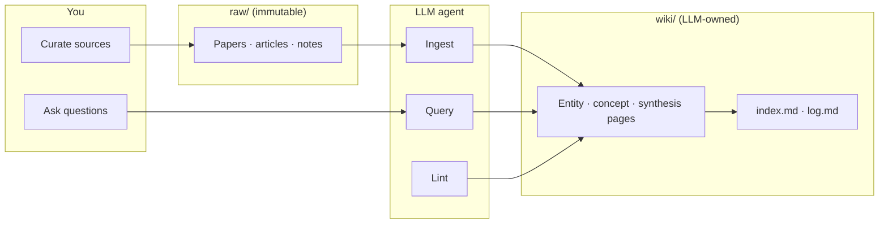
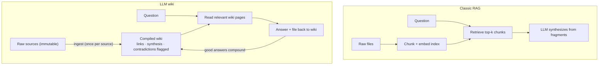
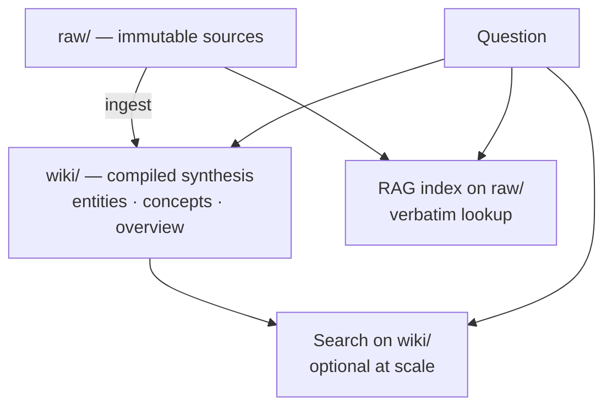
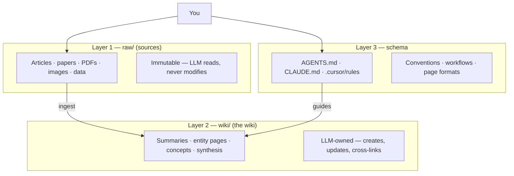
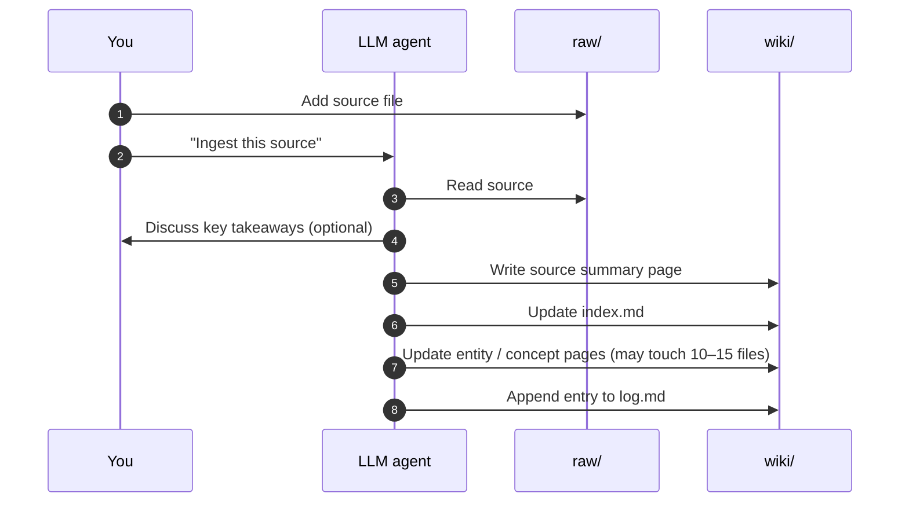
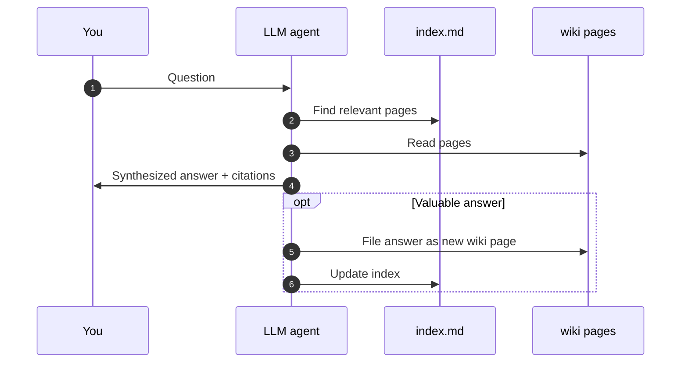
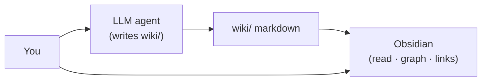
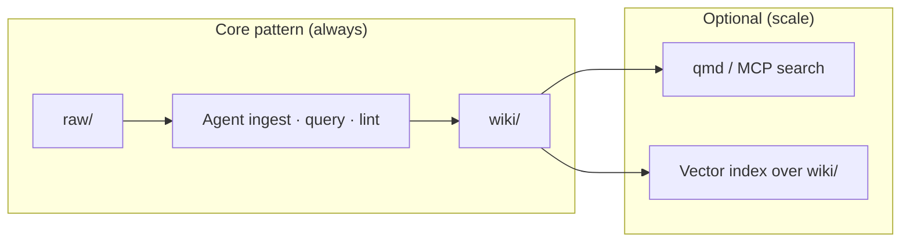

# LLM Wiki — LLM-Maintained, Compounding Knowledge

An **LLM wiki** is an **AI knowledge management architecture** — popularized by [Andrej Karpathy](https://gist.github.com/karpathy/442a6bf555914893e9891c11519de94f) — where an **LLM agent** continuously compiles, synthesizes, and maintains a **persistent, interlinked markdown wiki** from your raw sources. Knowledge is **compiled once and kept current**, not re-derived from scratch on every question.

Karpathy describes it as a portable **pattern** (an idea file you copy into your agent); **architecture** names the **system**: three layers (`raw/` · `wiki/` · schema), three operations (ingest · query · lint), and compounding synthesis over time. It applies to **personal PKM, research, and team knowledge** — not one audience only.

Parent overview: [LLM.md §5 LLM wiki (brief)](./LLM.md#5-llm-wiki--compounding-knowledge-karpathy-architecture) · [RAG.md](./RAG.md) (retrieval technique — related but different goal)

---

## Contents

* LLM Wiki
  * [Cheat sheet](#cheat-sheet)
  * [1. What is an LLM wiki?](#1-what-is-an-llm-wiki)
    * [What's actually new?](#whats-actually-new)
  * [2. LLM wiki vs RAG](#2-llm-wiki-vs-rag)
    * [Similar goal, different mechanism](#similar-goal-different-mechanism)
    * [Comparison table](#comparison-table)
    * [When to use which](#when-to-use-which)
    * [Hybrid architectures](#hybrid-architectures)
  * [3. Architecture — three layers](#3-architecture--three-layers)
  * [4. Three operations](#4-three-operations)
    * [Ingest](#ingest)
    * [Query](#query)
    * [Lint](#lint)
  * [5. index.md and log.md](#5-indexmd-and-logmd)
  * [6. How to build one](#6-how-to-build-one)
  * [7. Obsidian — the IDE for your wiki](#7-obsidian--the-ide-for-your-wiki)
  * [8. What good wiki pages look like](#8-what-good-wiki-pages-look-like)
  * [9. Optional tooling and scale](#9-optional-tooling-and-scale)
  * [10. Team and enterprise extensions](#10-team-and-enterprise-extensions)
  * [11. Related docs and further reading](#11-related-docs-and-further-reading)

---

## Cheat sheet

| Question | Short answer |
|---|---|
| **What is an LLM wiki?** | An **AI knowledge management architecture** — LLM-maintained, compounding markdown wiki between you and raw sources. |
| **Who writes the pages?** | **The LLM** (you curate sources, ask questions, steer). You rarely write wiki pages yourself. |
| **LLM wiki vs RAG?** | **Same goal** (your data → grounded answers), **different mechanism** (compile-first vs retrieve-first). Often **hybrid**. |
| **Three layers?** | **`raw/`** (immutable sources) · **`wiki/`** (LLM-generated pages) · **schema** (`AGENTS.md` / `CLAUDE.md`). |
| **Three operations?** | **Ingest** (source → wiki updates) · **Query** (read wiki → answer → file back) · **Lint** (health-check). |
| **Obsidian's role?** | **IDE for browsing** the wiki — graph view, links. **LLM is the programmer; wiki is the codebase.** |
| **Similar to RAG?** | Same as above — not a replacement; complementary at scale. |
| **Anything really new?** | **No new ML technique** — see [§1 What's actually new?](#whats-actually-new). New packaging + feasibility with agents. |



---

## 1. What is an LLM wiki?

Most people's experience with documents and LLMs looks like **RAG**: upload files, retrieve chunks at query time, generate an answer. The LLM **rediscovers** knowledge from scratch on every question. There is **no accumulation** — ask something that requires synthesizing five documents, and the model must find and piece together fragments **every time**.

Karpathy's **LLM wiki** architecture is different from classic RAG:

> Instead of just retrieving from raw documents at query time, the LLM **incrementally builds and maintains a persistent wiki** — a structured, interlinked collection of markdown files that sits **between you and the raw sources**.

When you add a new source, the LLM does **not** only index it for later retrieval. It **reads** it, **extracts** key information, and **integrates** it into the existing wiki — updating entity pages, revising topic summaries, noting where new data **contradicts** old claims, strengthening or challenging the evolving synthesis.

| Property | Meaning |
|---|---|
| **Persistent** | Knowledge lives in markdown files across sessions — not in chat history |
| **Compounding** | Every ingest and good query makes the wiki richer |
| **Interlinked** | Cross-references exist **before** you ask the next question |
| **LLM-maintained** | Summarizing, filing, cross-referencing, bookkeeping — **near-zero human maintenance cost** |
| **Human-directed** | You source, explore, and ask; the LLM does the grunt work |

**The key metaphor** (from Karpathy):

| Role | Analog |
|---|---|
| **Obsidian** | IDE |
| **LLM agent** | Programmer |
| **Wiki markdown** | Codebase |

You browse results in Obsidian (links, graph view); the agent makes edits based on your conversation.

**Use cases** (from the gist):

| Domain | Example |
|---|---|
| **Personal** | Goals, health, psychology — journal entries and articles → structured self-model |
| **Research** | Papers over weeks → evolving thesis wiki |
| **Reading a book** | Chapter-by-chapter ingest → character/theme/plot pages (personal Tolkien Gateway) |
| **Business / team** | Slack, meetings, docs → LLM-maintained internal wiki (humans review) |
| **Learning** | Course notes, hobby deep-dives, trip planning, due diligence |

**Historical note:** Related in spirit to Vannevar Bush's **Memex** (1945) — private, curated knowledge with associative trails. Bush couldn't solve **who maintains the links**. The LLM handles that.

### What's actually new?

At the highest level, an LLM wiki **is** what it sounds like: **immutable sources + an LLM that keeps a linked markdown wiki current.** Wikis, PKM, summarization, and RAG all existed before. Don't oversell it.

| Not new | Already familiar |
|---|---|
| Wiki as knowledge store | Wikipedia, Confluence, Obsidian |
| Linked notes | Memex, Roam, `[[wikilinks]]` |
| "Summarize my docs with AI" | ChatGPT uploads, NotebookLM |
| Wiki rot from maintenance burden | Why most team wikis die |
| Search raw text at question time | RAG |

**What is new — or newly practical:**

| Idea | Why it matters |
|---|---|
| **Compile-first vs retrieve-first** | Explicit tradeoff: pay LLM cost on **ingest**, read **pre-synthesized** wiki at query time — not the default RAG mental model |
| **Persistent maintainer, not one-shot summarizer** | Each source updates **many pages**; good queries **file back**; knowledge **compounds across sessions** |
| **Agents can afford the bookkeeping** | Multi-file cross-link updates in one pass — impractical for most humans, feasible with Cursor / Claude Code now |
| **Packaged operations** | Ingest · query · lint + schema + `raw/`/`wiki/` split — reproducible workflow, not ad-hoc chat |
| **Contradictions & lint** | Flag tension and stale claims instead of silently merging or overwriting |

**Honest summary:**

| Question | Answer |
|---|---|
| New ML technique? | **No.** |
| Just "LLM maintains a wiki"? | **Mostly yes.** |
| Still worth it? | **Yes**, if you want **compounding synthesis** over months — and accept that errors can compound too without review |

**When to skip it:** small static corpus (RAG or search is enough); you need verbatim raw quotes (use hybrid); you won't review agent-written pages.

---

## 2. LLM wiki vs RAG

These are often confused because both involve "documents + LLM." They share a **similar goal** — letting an LLM answer from **your** private or domain data — but use a **fundamentally different mechanism**.

### Similar goal, different mechanism

| | Shared goal | Different mechanism |
|---|---|---|
| **Both** | Ground the LLM on custom data (not just pretraining) | — |
| **RAG** | — | **Retrieve-first:** search raw chunks **at every query**, synthesize on the fly |
| **LLM wiki** | — | **Compile-first:** synthesize into persistent wiki pages **at ingest**, read wiki at query time |

**Not opposites.** Many production setups use **both** (see [Hybrid architectures](#hybrid-architectures) below).



### Comparison table

| Dimension | **RAG** | **LLM wiki (Karpathy pattern)** |
|---|---|---|
| **Architecture** | **Retrieve-first** — dynamic search over raw chunks at query time | **Compile-first** — persistent wiki pages built/updated on ingest |
| **Primary artifact** | Vector / keyword **index** over raw text | **Wiki pages** — markdown folder with `[[wikilinks]]` (+ optional YAML frontmatter) |
| **When knowledge is integrated** | At **query time** (retrieve + generate) | At **ingest time** (compile into wiki) |
| **Processing overhead** | **Higher at query time** — retrieve, rerank, fit chunks into context | **Higher at ingest time** — parse, extract, write/update many pages |
| **Knowledge persistence** | Index persists, but **synthesis is stateless** — each answer rebuilt from fragments | **Stateful & compounding** — synthesis lives in wiki files across sessions |
| **Cross-references** | Implicit in embedding similarity | **Explicit** `[[links]]` — knowledge graph (Obsidian graph view) |
| **Global synthesis** | Weaker — dots connected only if retrieval finds co-located chunks | Stronger — claims already synthesized and interlinked vault-wide |
| **Contradictions** | May surface differently each query | **Flagged and tracked** on wiki pages (not silently overwritten) |
| **Adding new data** | **Fast** — chunk + embed raw file | **Slower** — LLM must read, synthesize, and update linked pages |
| **Who writes content** | Original authors (or OCR) | **LLM maintains** the wiki layer |
| **Typical query path** | Embeddings + top-k over **raw** | Read **`index.md`** + wiki pages (search/RAG over wiki optional later) |

**Clarifications (common misconceptions):**

| Misconception | Reality |
|---|---|
| "RAG has no memory" | The **vector index** persists; what doesn't compound is **integrated synthesis** across queries. |
| "LLM wiki never uses vectors" | Core pattern needs **no** embeddings; at scale you may add [qmd](#9-optional-tooling-and-scale) or RAG over `wiki/` — optional, not contradictory. |
| "Wikilinks are bidirectional in the file" | Links are written **outbound** in markdown; Obsidian's **graph view** makes the network feel bidirectional. |

### When to use which

| Use **RAG** when… | Use **LLM wiki** when… |
|---|---|
| **Massive or fast-moving** corpora — support tickets, news feeds, logs | **Long-horizon** learning — research, reading a book, PKM |
| Adding data must be **cheap and instant** (chunk + embed) | Ideas **build on each other** over weeks/months |
| You need **verbatim quotes** from raw archives | You want **evolving synthesis** and explicit concept graph |
| One-shot Q&A over a fixed doc set; prototype/hackathon | Personal wiki (Obsidian), course notes, due diligence, domain expertise |
| Transactional / operational lookup | "What does it all **mean**?" — integrated worldview |

### Hybrid architectures

**No conflict with choosing one "winner."** Common production pattern:



| Layer | Role |
|---|---|
| **LLM wiki** | Core **domain concepts**, high-level synthesis, cross-links |
| **RAG on `raw/`** | Precise **quotes**, citations to original wording, un-synthesized archives |
| **Search / RAG on `wiki/`** | When the wiki outgrows `index.md` + file reads ([§9](#9-optional-tooling-and-scale)) |

Karpathy's gist keeps **`raw/` immutable** — the wiki never replaces sources. A side RAG index over `raw/` complements the wiki; it does not negate the compile-first pattern.

**Relation to [LLM.md](./LLM.md) layer ⑤:** In this repo, "LLM wiki" means **Karpathy's compounding pattern**. [RAG.md](./RAG.md) covers the **retrieval technique** — complementary, often hybrid.

---

## 3. Architecture — three layers



| Layer | Path (example) | Owner | Purpose |
|---|---|---|---|
| **Raw sources** | `raw/` | **You** drop files in | Source of truth — articles, papers, clipped web pages, transcripts |
| **The wiki** | `wiki/` | **LLM** writes & maintains | Compiled knowledge — entity pages, topic summaries, comparisons, overview |
| **The schema** | `AGENTS.md` or `CLAUDE.md` | **You + LLM** co-evolve | Tells the agent how to ingest, query, lint; page templates; naming conventions |

The **schema** is the key configuration file. It turns a generic chatbot into a **disciplined wiki maintainer**. Start from Karpathy's gist; refine with your agent over time.

**Example layout:**

```
my-llm-wiki/
├── raw/                    # immutable sources
│   ├── papers/
│   ├── articles/
│   └── assets/             # images (optional)
├── wiki/                   # LLM-generated
│   ├── index.md            # catalog (see §5)
│   ├── log.md              # chronological log (see §5)
│   ├── concepts/
│   ├── entities/
│   └── sources/            # one summary page per ingested source
└── AGENTS.md               # schema (or CLAUDE.md / .cursor/rules)
```

---

## 4. Three operations

The LLM wiki lifecycle has three operations. All three are **agent-driven**.

### Ingest

You drop a new source into `raw/` and tell the LLM to process it.



Ingest is often described as **four phases** (all inside the single **Ingest** operation):

| Phase | What happens |
|---|---|
| **1. Ingestion & extraction** | Agent reads source; identifies entities, concepts, definitions, relationships |
| **2. Compilation & synthesis** | Creates new pages for novel concepts; updates existing pages with new facts; **notes contradictions** instead of silently overwriting |
| **3. Hyperlinking & graph** | Inserts `[[wikilinks]]` between related pages — flat files → structured graph |
| **4. Bookkeeping** | Refresh `index.md`; append to `log.md` |

| Step (operational) | Maps to |
|---|---|
| Read + discuss with you | Phase 1 (optional alignment) |
| Summarize → `wiki/sources/` | Phase 2 |
| Update entity/concept pages (10–15 files) | Phases 2–3 |
| Index + log | Phase 4 |

**One source → many wiki updates.** That integration step is what RAG skips.

Karpathy prefers **one source at a time** with human check-ins; batch ingest with less supervision is also valid — document your choice in the schema.

### Query

You ask questions **against the wiki**, not by re-reading all raw sources.



| Insight | Detail |
|---|---|
| **Read wiki first** | Agent uses `index.md` to navigate, then reads specific pages |
| **Answers can compound** | Comparisons, analyses, connections → **new wiki pages**, not lost in chat |
| **Output formats** | Markdown, tables, Marp slides, charts — per schema |

### Lint

Periodically ask the agent to **health-check** the wiki.

| Check | Example |
|---|---|
| **Contradictions** | Page A says X; page B says not-X |
| **Stale claims** | Newer source superseded an old summary |
| **Orphans** | Pages with no inbound links |
| **Missing pages** | Important concept mentioned but no dedicated page |
| **Gaps** | Topics worth a web search or new source |

Lint keeps the wiki healthy as it grows. The agent can suggest **new questions** and **sources** to investigate.

---

## 5. index.md and log.md

Two special files anchor navigation and history.

### index.md — content catalog

| Property | Detail |
|---|---|
| **Purpose** | Catalog of every wiki page — link, one-line summary, optional metadata |
| **Organization** | By category: entities, concepts, sources, etc. |
| **Updated** | On every ingest |
| **Query use** | Agent reads index **first**, then drills into pages |

At moderate scale (~100 sources, hundreds of pages), **index + file reads** work well — **no embedding pipeline required**.

### log.md — chronological record

| Property | Detail |
|---|---|
| **Purpose** | Append-only timeline: ingests, queries, lint passes |
| **Format tip** | Consistent prefixes, e.g. `## [2026-04-02] ingest \| Article Title` |
| **Unix-friendly** | `grep "^## \[" log.md \| tail -5` for recent activity |
| **Use** | Timeline of wiki evolution; agent knows recent context |

---

## 6. How to build one

Karpathy's gist is **intentionally abstract** — the agent helps you instantiate specifics.

### Step-by-step

| Step | Action |
|---|---|
| **1** | Copy [Karpathy's gist](https://gist.github.com/karpathy/442a6bf555914893e9891c11519de94f) into your agent session |
| **2** | Create folder layout: `raw/`, `wiki/`, schema file |
| **3** | Co-write **schema** with the agent — ingest/query/lint workflows, page templates, naming |
| **4** | Initialize `wiki/index.md` and `wiki/log.md` |
| **5** | **First ingest:** drop one source in `raw/`, run ingest per schema |
| **6** | Browse wiki in Obsidian; steer the agent on emphasis |
| **7** | **Query** — ask questions; file good answers back |
| **8** | **Lint** periodically as the wiki grows |
| **9** | Refine schema as you learn what works |

### Starter prompt (example)

```text
You are my LLM Wiki agent. Implement Karpathy's LLM Wiki pattern for a personal
research wiki on [TOPIC].

1. Create AGENTS.md with full ingest / query / lint rules
2. Set up raw/, wiki/, index.md, log.md
3. Walk me through ingesting my first source: [path or description]

Every interaction follows the schema from here on.
```

### Applying to this repo (`ML-CV-AI/LLM/`)

Your existing `.md` files (`RAG.md`, `attention.md`, …) can play two roles:

| Role | How |
|---|---|
| **Seeds in `raw/`** | Original papers, tutorials, rough notes — immutable inputs |
| **Outputs in `wiki/`** | Agent-maintained synthesis pages that **link and evolve** as you add sources |

Do **not** assume hand-written reference docs are already an LLM wiki — they become one when an agent **maintains** them via ingest/query/lint.

### Community scaffolds (optional)

| Project | Notes |
|---|---|
| [llm-wiki-init](https://github.com/vijay-athithyaa-GV/llm-wiki-init) | Claude Code plugin — `/wiki-init` scaffolds raw/wiki/schema |
| [LLMWikiNG](https://github.com/ZeroDot1/LLMWikiNG) | Self-hosted app implementing the pattern |
| [sourcebook](https://github.com/BackendGameSetMatch/sourcebook) | Community implementation |
| [mindbase](https://github.com/frankchu91/mindbase) | Local-model UI around ingest/query/lint |

---

## 7. Obsidian — the IDE for your wiki

**[Obsidian](https://obsidian.md/)** is the recommended **browser** for the wiki layer — not the maintainer.



| Tool | Role |
|---|---|
| **LLM agent** | Ingest, query, lint — **writes** `wiki/` |
| **Obsidian** | Real-time browse — graph view, follow `[[links]]`, check updates |
| **You** | Curate `raw/`, steer conversation, read results |

**Workflow:** Agent open on one side, Obsidian on the other. The agent edits; you browse the living wiki.

**Useful Obsidian tips** (from Karpathy):

| Tip | Why |
|---|---|
| **Web Clipper** | Clip articles → markdown into `raw/` |
| **Download images locally** | Agent can reference images; URLs break |
| **Graph view** | See hubs, orphans, connection shape |
| **Marp plugin** | Slide decks from wiki content |
| **Dataview plugin** | Query frontmatter if agent adds YAML metadata |
| **Git** | Wiki is a markdown repo — version history for free |

---

## 8. What good wiki pages look like

The **LLM writes** these pages; the schema defines conventions. Good structure helps both humans (Obsidian) and agents (navigation).

| Practice | Why |
|---|---|
| **One topic per page** | Clean updates on ingest; precise citations |
| **Clear H1 / H2 hierarchy** | Agent can read sections; future chunking if you add search |
| **Explicit `[[links]]`** | Graph connectivity; lint catches orphans |
| **Source attribution** | Link back to `raw/` file or source summary page |
| **Separate page types** | Entity vs concept vs source summary vs synthesis |
| **Note contradictions** | Don't silently merge conflicting claims |
| **Frontmatter (optional, recommended)** | YAML: `tags`, `sources`, `updated` — Dataview, filters; not required by Karpathy's core pattern |

**Page types (typical):**

| Type | Example |
|---|---|
| **Source summary** | `wiki/sources/karpathy-llm-wiki-gist.md` |
| **Entity** | `wiki/entities/attention-mechanism.md` |
| **Concept** | `wiki/concepts/grouped-query-attention.md` |
| **Synthesis / overview** | `wiki/overview/transformer-stack.md` |
| **Query artifact** | Comparison or analysis you asked for — filed back |

---

## 9. Optional tooling and scale

Karpathy's pattern **deliberately avoids** heavy infra at the start.

| Scale | Approach |
|---|---|
| **Small (~100 sources, hundreds of pages)** | `index.md` + agent reads files — **enough** |
| **Growing** | Local search: [qmd](https://github.com/tobi/qmd) (hybrid BM25 + vectors + rerank; CLI + MCP) |
| **Large / team** | Add RAG index over `wiki/` (not just raw) — see [RAG.md](./RAG.md) |
| **Very large** | Wiki bloat vs context window — retrieval becomes necessary ([community discussion on the gist](https://gist.github.com/karpathy/442a6bf555914893e9891c11519de94f)) |



**Rule:** Start without embeddings. Add search when `index.md` + grep stops being sufficient.

---

## 10. Team and enterprise extensions

Karpathy's gist targets **personal** knowledge bases. Teams extend the pattern with guardrails others have explored:

| Concern | Extension |
|---|---|
| **Bad pages become "truth"** | Human review before merge; git diff gates |
| **Who sees what** | Path-based ACL stamped at write time |
| **Entity resolution** | Registry of names/aliases — code stamps `about:` field |
| **Provenance** | Quotes as pointers into immutable `raw/`, not unattributed copies |
| **Contradictions** | Record conflicts; don't let the model silently pick a winner |

These are **add-ons** to the core three-layer pattern — not replacements.

---

## 11. Related docs and further reading

### In this repo

| Doc | Topic |
|---|---|
| [LLM.md §5](./LLM.md#5-llm-wiki--compounding-knowledge-karpathy-architecture) | Brief placement in the LLM stack |
| [LLM.md §4 Agents](./LLM.md#4-agents--from-one-shot-to-a-control-loop) | Agent loop — ingest/query/lint are agent workflows |
| [RAG.md](./RAG.md) | Retrieval technique — optional at scale, different from core LLM wiki pattern |
| [RAG.md §6 Chunking](./RAG.md#6-chunking-make-or-break) | Relevant if you add vector search over wiki pages |

### External

| Resource | Topic |
|---|---|
| [Karpathy — llm-wiki.md](https://gist.github.com/karpathy/442a6bf555914893e9891c11519de94f) | **Primary source** — the idea file |
| [Obsidian](https://obsidian.md/) | Wiki browser / IDE |
| [qmd](https://github.com/tobi/qmd) | Optional local markdown search (CLI + MCP) |
| Gist comments / forks | Implementations, debates, team patterns — see gist discussion thread |

---

## Summary

| | **LLM wiki (Karpathy)** | **RAG** |
|---|---|---|
| **What** | **Compounding markdown wiki** the LLM maintains | **Retrieve → augment → generate** pipeline |
| **When knowledge compiles** | **Ingest** (+ good queries filed back) | **Every query** |
| **Main artifact** | `wiki/` pages + `index.md` | Chunk index + retriever |
| **Your job** | Sources, questions, steering | Corpus + index + prompts |
| **LLM's job** | **Write, cross-link, update, lint** | Synthesize retrieved chunks |
| **Obsidian** | **IDE** to browse the wiki | N/A |

**Bottom line:** An **LLM wiki** is a **persistent, compounding knowledge base** where the **LLM is the maintainer** — not a human-authored corpus tuned for embedding search. Copy [Karpathy's gist](https://gist.github.com/karpathy/442a6bf555914893e9891c11519de94f) into your agent, co-create the schema, and let ingest / query / lint build the wiki over time. Add [RAG](./RAG.md) later only if the wiki outgrows `index.md` + file reads.
