# RAG — Retrieval-Augmented Generation

**RAG** connects an LLM to **external knowledge** by **retrieving** relevant text at query time, **augmenting** the prompt with those passages, then **generating** an answer grounded in that evidence.

Parent overview: [llm.md §3 RAG (brief)](./llm.md#3-rag-retrieval-augmented-generation) · [LLM wiki / curated corpus](./llm.md#5-llm-wiki--grounded-knowledge-for-orgs--agents)

---

## Contents

* RAG
  * [Cheat sheet](#cheat-sheet)
  * [1. Why RAG exists](#1-why-rag-exists)
  * [2. RAG vs large context window](#2-rag-vs-large-context-window)
    * [Two ways to give the model external knowledge](#two-ways-to-give-the-model-external-knowledge)
    * [Comparison](#comparison)
    * [Decision guide](#decision-guide)
    * [Practical rule of thumb](#practical-rule-of-thumb)
  * [3. End-to-end flow](#3-end-to-end-flow)
    * [Offline: build the index](#offline-build-the-index)
    * [Online: answer one question](#online-answer-one-question)
  * [4. Core components](#4-core-components)
  * [5. Embeddings in RAG](#5-embeddings-in-rag)
    * [5.1 Same-dimensional vectors for query and chunks?](#51-do-the-user-prompt-and-chunks-always-embed-to-the-same-dimensional-vectors)
    * [5.2 Consumer chatbots — local vector DB?](#52-consumer-chatbots-chatgpt-gemini--local-rag-and-local-vector-db)
    * [5.3 Coding tools — local vector DB?](#53-coding-tools-cursor-codex--local-rag-and-local-vector-db)
    * [5.4 Embedding FAQ (quick answers)](#54-embedding-faq-quick-answers)
  * [6. Chunking (make or break)](#6-chunking-make-or-break)
  * [7. Retrieval strategies](#7-retrieval-strategies)
    * [Dense (vector) search](#dense-vector-search)
    * [Keyword (sparse) search](#keyword-sparse-search)
    * [Hybrid (common in production)](#hybrid-common-in-production)
  * [8. PageIndex vs traditional vector RAG](#8-pageindex-vs-traditional-vector-rag)
    * [What is PageIndex?](#what-is-pageindex)
    * [Query-time flow (LLM tree navigation)](#query-time-flow-llm-tree-navigation)
    * [Side-by-side comparison](#side-by-side-comparison)
    * [When to prefer which](#when-to-prefer-which)
    * [Can they be combined?](#can-they-be-combined)
  * [9. Prompt assembly (augment)](#9-prompt-assembly-augment)
  * [10. RAG vs tools vs agents](#10-rag-vs-tools-vs-agents)
    * [Simple RAG vs tools vs agents (overview)](#simple-rag-vs-tools-vs-agents-overview)
    * [What is Agentic RAG?](#what-is-agentic-rag)
    * [Traditional RAG vs PageIndex vs Agentic RAG](#traditional-rag-vs-pageindex-vs-agentic-rag)
    * [Agentic RAG query flow](#agentic-rag-query-flow)
    * [When to use which pattern](#when-to-use-which-pattern)
  * [11. Failure modes and mitigations](#11-failure-modes-and-mitigations)
  * [12. Evaluation (what to measure)](#12-evaluation-what-to-measure)
  * [13. Minimal architecture map](#13-minimal-architecture-map)
  * [14. When to use RAG](#14-when-to-use-rag)
  * [15. Related docs](#15-related-docs)
  * [References](#references)

---

## Cheat sheet

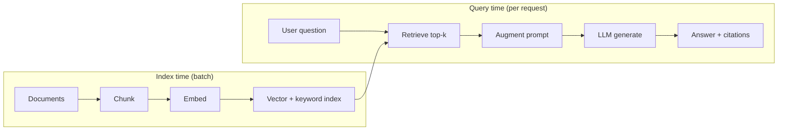

| Phase | One-liner |
|---|---|
| **Retrieve** | Find the few chunks most relevant to the question |
| **Augment** | Paste those chunks into the LLM prompt (with instructions) |
| **Generate** | LLM writes the answer using provided evidence |
| **Embed** | Query + chunks → **same-dim** vectors (same model) for similarity search |

**RAG ≠ training.** You do not retrain the model weights; you change **what tokens are in the context** for this request.

**Embeddings FAQ:** [§5](./RAG.md#5-embeddings-in-rag) — same vector dims?, chat apps vs coding tools, local vs cloud index.

---

## 1. Why RAG exists

| Source of knowledge | Limit |
|---|---|
| **Model weights** | Frozen at train time — stale, no private docs, can hallucinate |
| **Long context (stuff all docs)** | Corpus ≫ window, cost, “lost in the middle,” hard to cite |
| **RAG** | Pull **only** what you need now from a large, updatable index |

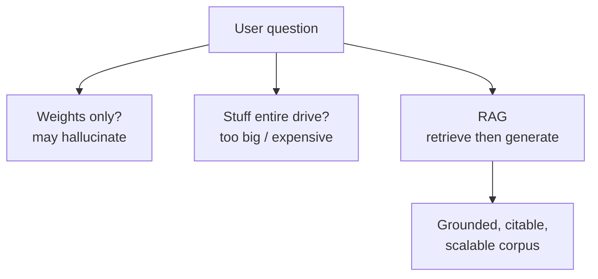

See [§2 below](#2-rag-vs-large-context-window) and [llm.md](./llm.md) for how **large context + RAG** combine (retrieve top-k, then reason in a big window).

---

## 2. RAG vs large context window

Large context windows **help** but do **not** replace RAG when knowledge is large, changing, private, or must be cited.

### Two ways to give the model external knowledge

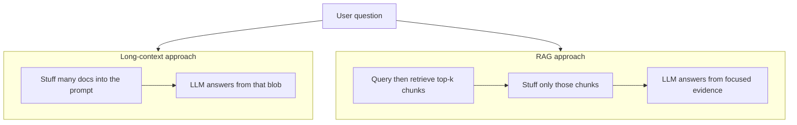

### Comparison

| Dimension | Long context only (stuff everything) | RAG (retrieve, then generate) |
|---|---|---|
| **Corpus size** | Breaks when data ≫ window (or becomes huge prompts) | Scales to millions of chunks via an index |
| **Freshness** | Must re-paste / re-upload when docs change | Re-index or update vectors; prompt stays small |
| **Cost / latency** | Pay for *all* tokens every request | Pay for query + top-k chunks (+ embedding search) |
| **Signal quality** | Lost in the middle: facts diluted in long prompts | Top-k focuses attention on relevant passages |
| **Privacy / tenancy** | Entire corpus may enter the prompt vendor context | Retrieve only per-user / per-tenant slices |
| **Citations** | Harder to know which page mattered | Natural: return retrieved chunk IDs / URLs |
| **When it wins** | Single book, one large PDF, short-lived session memory | Enterprise wiki, codebases, tickets, policies |

### Decision guide

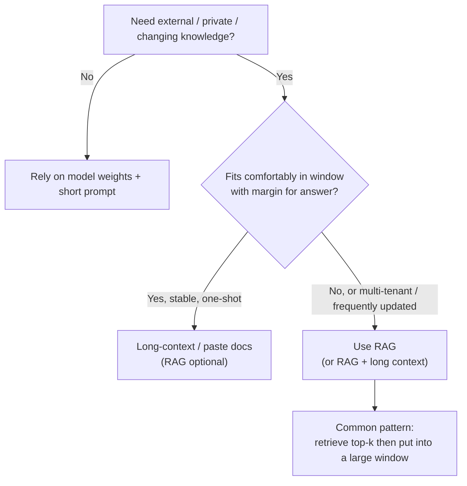

### Practical rule of thumb

| Situation | Prefer |
|---|---|
| One PDF / meeting transcript / ticket thread | Long context (maybe no RAG) |
| Company wiki, Confluence, Notion, drive with 10k+ pages | **RAG** |
| Codebase Q&A across many repos | **RAG** (+ optional repo map) |
| News / inventory / prices that change daily | **RAG** (or tools/APIs) |
| Agent with tools that fetch facts | Tools ≈ live RAG; still not all in weights |

**Bottom line:** Large windows make RAG **smarter and simpler** (retrieve fewer, larger chunks; keep more history), but they do **not** make “put the whole company drive in the prompt” viable. RAG remains the default for **scalable, updatable, attributable** knowledge.

---

## 3. End-to-end flow

### Offline: build the index

Run when documents are added or updated (not on every user question).

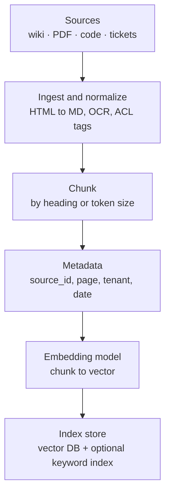

| Step | Input | Output |
|---|---|---|
| **Ingest** | Raw files, CMS export, git | Clean text + structure |
| **Chunk** | Long pages | Passages ~256–1024 tokens (typical) |
| **Embed** | Each chunk | Dense vector (e.g. 768–3072 dims) |
| **Index** | Vectors + metadata | Searchable store (Pinecone, pgvector, Elasticsearch, …) |

### Online: answer one question

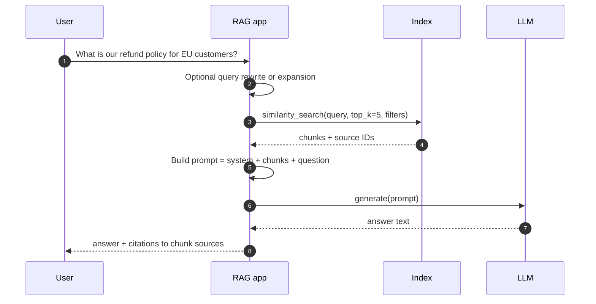

---

## 4. Core components

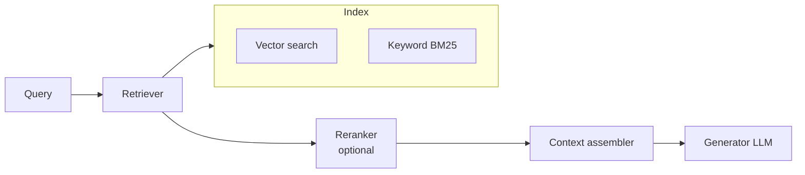

| Component | Role | Notes |
|---|---|---|
| **Chunking** | Split docs into retrievable units | Quality dominates — bad chunks → bad answers |
| **Embedding model** | Map text ↔ vector for similarity | Same family often used at index and query time |
| **Vector store** | Approximate nearest neighbor search | Scales to millions of chunks |
| **Keyword index** | Lexical match (BM25) | Good for SKUs, error codes, exact terms |
| **Retriever** | Returns top-k candidate chunks | Often **hybrid** = vector + keyword |
| **Reranker** | Re-score top-k with a cross-encoder | Better precision, extra latency |
| **Generator** | LLM that reads chunks + question | Instructions: “answer only from context” |
| **Citation layer** | Map sentences → chunk IDs | Trust and debugging |

---

## 5. Embeddings in RAG

RAG retrieval depends on a **separate embedding model** (or embedding API) that maps whole passages of text to **dense vectors**. That is **not** the same thing as the **token embedding table inside the LLM** that turns token IDs into vectors for attention — see [token_embedding.md](./token_embedding.md).

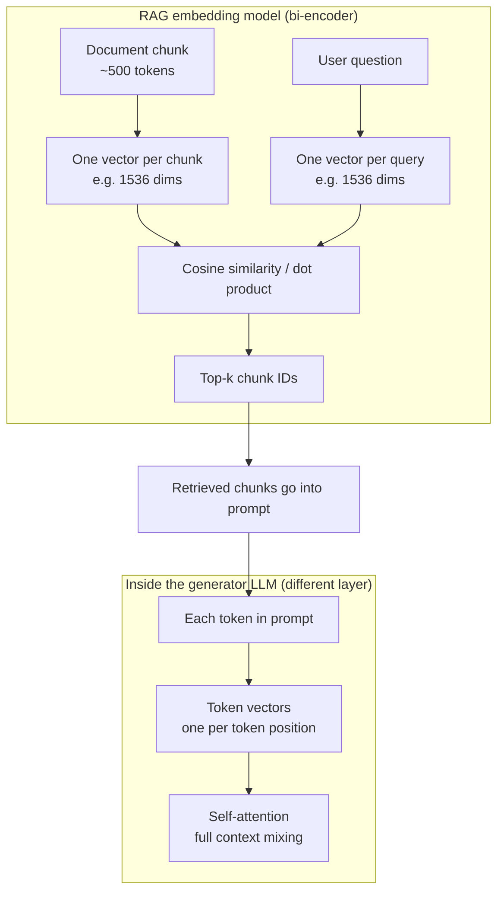

| Layer | Input | Output | Used for |
|---|---|---|---|
| **RAG embedding model** | Whole chunk or whole query string | **One** fixed-size vector per string | Similarity search in the index |
| **LLM token embeddings** | Each token ID in the context window | One vector **per token** | Next-token prediction inside the transformer |

---

### 5.1 Do the user prompt and chunks always embed to the same-dimensional vectors?

**For a working RAG index: yes — at retrieve time, the query vector and every stored chunk vector must have the same dimensionality and come from the same embedding model family.**

| Rule | Why |
|---|---|
| **Same embedding model** at index time and query time | Vectors live in one shared semantic space; mixing models breaks similarity |
| **Same output dimension** | Vector DB distance math requires equal-length vectors |
| **Same preprocessing** | Same prefixes (`query:` / `passage:`), truncation, normalization |
| **Re-embed on model change** | New model → new dims and/or new space → rebuild the index |

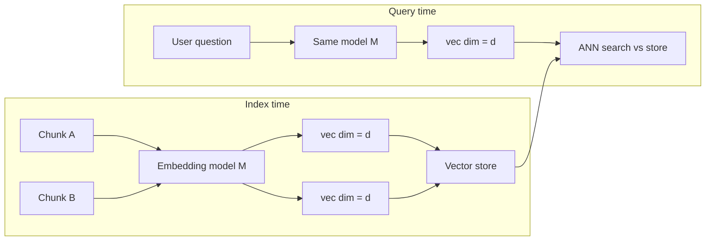

**Typical dimensions (examples, not fixed forever):**

| Model / API (examples) | Common dims | Notes |
|---|---|---|
| OpenAI `text-embedding-3-small` | 1536 (default), optional shorter | Matryoshka-style shorter dims only if **both** sides use the same size |
| OpenAI `text-embedding-3-large` | 3072 (default), optional shorter | Same rule |
| Cohere `embed-v3` | 1024 | Separate `search_query` vs `search_document` input types, same output dim |
| open-source (e.g. BGE, E5) | 384 / 768 / 1024 | Often `query:` / `passage:` prefixes baked into the model |

**What is *not* required to match:**

| | Must match chunk vectors? |
|---|---|
| **User question** (query embedding) | **Yes** — same model, same `d` |
| **System prompt text** | **No** — usually not embedded for retrieval at all; it is pasted into the LLM context as plain tokens |
| **Chat history** | **No** for classic RAG — only the **retrieval query** (often the latest user turn, sometimes rewritten) is embedded |
| **LLM token embeddings** | **No** — different subsystem; dimensions follow the **generator** model (e.g. 4096-d hidden states), not the RAG index |

**Nuances:**

- **One vector per chunk, one vector per query** is the default (bi-encoder RAG). The full user message and each chunk are separate strings → separate vectors → compared in the index.
- **Multi-vector retrieval** (e.g. ColBERT): each token gets its own vector, but query tokens and document tokens still use the **same encoder and same per-token dimension**; scoring is more complex than a single cosine.
- **Rerankers** (cross-encoders): may use a different model entirely; they re-score text pairs and do **not** have to share the bi-encoder’s vector dimension because they are not stored in the vector DB.

**Bottom line:** Similarity search needs **query vec ∈ ℝᵈ** and **chunk vec ∈ ℝᵈ** from the **same** embedding model. The LLM prompt (system + history + user) is a separate pipeline: those strings become **tokens**, not necessarily RAG query vectors.

---

### 5.2 Consumer chatbots (ChatGPT, Gemini, …) — local RAG and local vector DB?

**Usually no.** The chat **product** runs retrieval and indexing on **vendor cloud infrastructure**, not by building a vector database on your laptop.

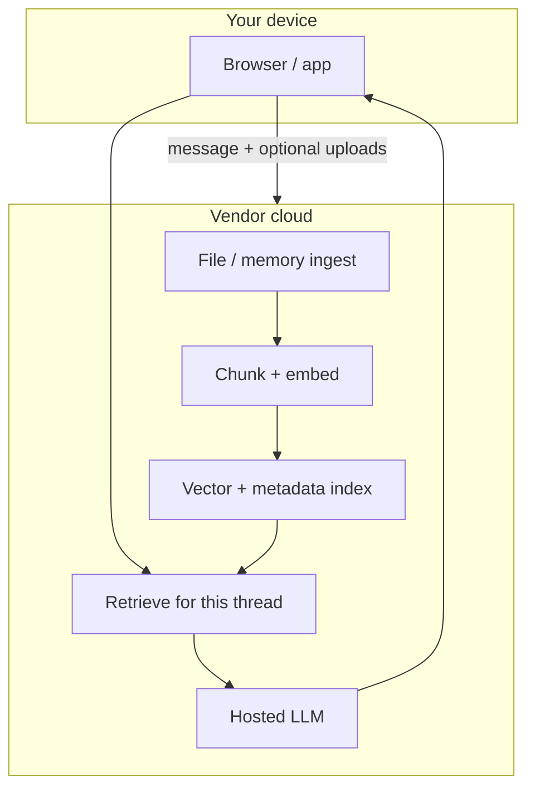

| Product | Where RAG-like retrieval runs | What feels “local” to you |
|---|---|---|
| **ChatGPT** | OpenAI cloud (file uploads, Custom GPT knowledge, memory features) | Files you pick in the UI; nothing you manage as a local vector DB |
| **Claude.ai** | Anthropic cloud (Projects, uploads) | Same — attachments live in the product backend |
| **Google Gemini** | Google cloud (Drive/Gmail/Workspace connectors, Gems) | Google-side indexes over connected accounts |
| **Grok / others** | Provider cloud | Same pattern |

| Question | Typical answer for consumer chat apps |
|---|---|
| Does **my PC** build and store the vector index? | **No** |
| Is there **a** vector DB involved? | **Often yes**, but on the **provider’s** side |
| Does my raw upload stay only on my machine? | **No** — content is sent to the service to index and retrieve (see each vendor’s privacy/data policy) |
| Can I point ChatGPT at **my** local `pgvector`? | **Not** as the native app — you would build **your own** RAG app using their **API** and host the index wherever you choose |

**Enterprise / team tiers** may add VPC isolation, zero-retention options, or customer-managed keys — still **cloud-side** indexing in almost all cases, not “SQLite on your MacBook.”

**Contrast — when *you* build the chatbot:**

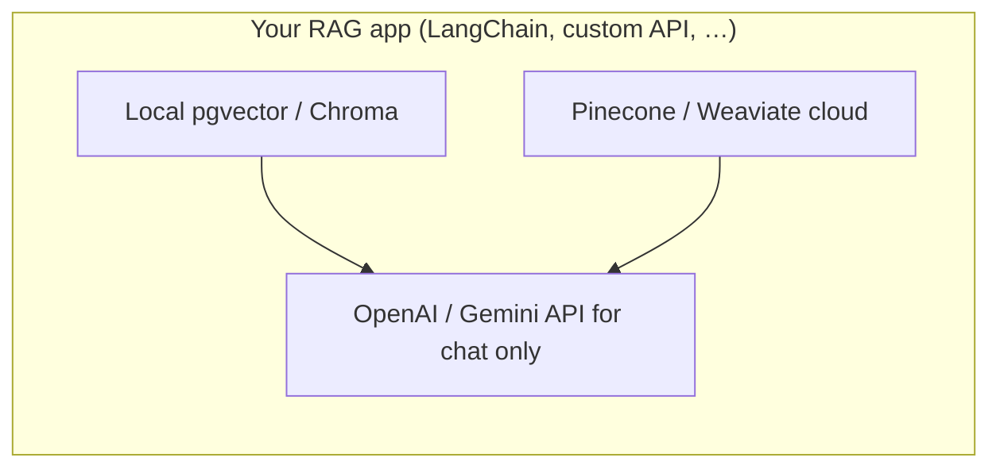

You choose index location; the **consumer ChatGPT/Gemini app** is not that architecture.

---

### 5.3 Coding tools (Cursor, Codex, …) — local RAG and local vector DB?

**Mixed — coding agents often index *your repo*, and many keep a *local* codebase index on your machine; cloud agents may keep indexes in the vendor sandbox instead.**

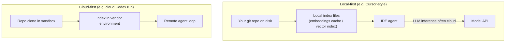

| Product | Index / RAG over codebase | Vector store location (typical) | Embedding compute (typical) |
|---|---|---|---|
| **Cursor** | **Yes** — semantic codebase index, `@codebase`, grep, file search | **Local** on your machine (index/cache under editor data dirs); repo stays on disk | Embeddings often via **remote embedding API**, vectors **stored locally** |
| **OpenAI Codex** (cloud/CLI agent) | **Yes** — repo context for tasks | **Vendor sandbox / cloud** for the run — not a durable local vector DB you manage | Cloud-side orchestration |
| **Claude Code** | **Yes** — reads/search repo via tools | **Mostly tool-based** (read, grep, glob) + context assembly; **not** always a persistent local vector DB like Cursor’s codebase index | Model on Anthropic cloud |
| **GitHub Copilot** | **Partial** — open files + workspace context; enterprise may add broader index | IDE + **GitHub/Microsoft** services depending on mode | Cloud model; indexing details vary by plan |

**Practical distinctions:**

| | Consumer chat (§5.2) | Coding agent (§5.3) |
|---|---|---|
| **Corpus** | Your uploads, memory, connectors | **Your repository**, rules, docs |
| **Who owns the index** | Almost always the **vendor** | Often **local-first** (Cursor) or **sandbox** (cloud Codex) |
| **You see “vector DB”** | No — opaque product feature | Sometimes — local cache files, but rarely a DB you query directly |
| **Hybrid retrieval** | Common (vector + keyword + tools) | Very common — **grep** + semantic + open tabs + `@file` |

**Cursor-specific mental model:** RAG happens **before** the LLM call: the product retrieves relevant files/chunks from a **local codebase index**, then stuffs them into the **context window**. The **LLM** still runs on hosted GPUs; only the **index** is local-first.

**Codex-specific mental model:** The agent runs in an **environment that already has your repo**; retrieval/indexing serves that remote loop — you do not typically get a persistent local vector DB on your laptop for every Codex session.

---

### 5.4 Embedding FAQ (quick answers)

| # | Question | Short answer |
|---|---|---|
| **1** | User prompt and chunks — same vector dimension? | **Yes**, for the **same RAG embedding model** at index and query time. System/history are not chunk vectors. |
| **2** | ChatGPT / Gemini — local vector DB? | **No** — consumer apps index and retrieve in the **cloud**. |
| **3** | Cursor / Codex — local vector DB? | **Cursor: local codebase index (typical). Codex: cloud/sandbox (typical).** Others mix tool search + optional indexes. |

See also: [llm.md §7 Consumer chat apps](./llm.md#7-consumer-chat-apps--chatgpt-claude-gemini-grok) · [llm.md §8 Coding-agent products](./llm.md#8-coding-agent-products--cursor-claude-code-codex-)

---

## 6. Chunking (make or break)

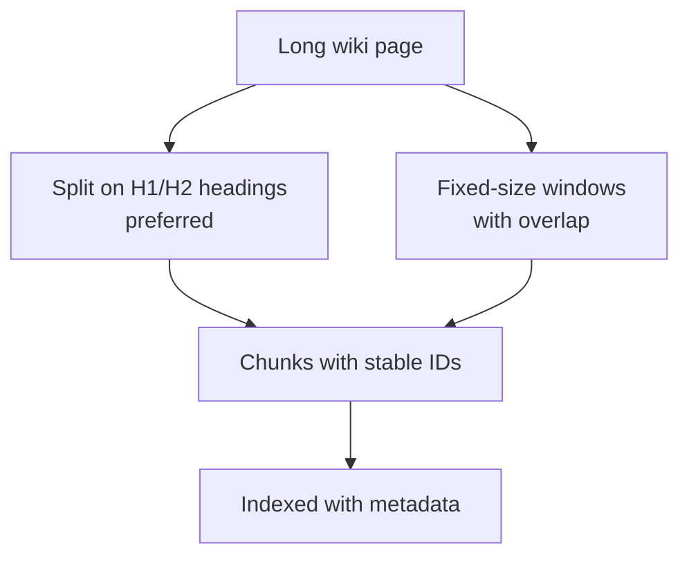

| Strategy | Pros | Cons |
|---|---|---|
| **By heading / section** | Semantically coherent | Needs structure in source |
| **Fixed size + overlap** | Simple, works on plain text | May cut mid-sentence |
| **Semantic chunking** | Boundaries by embedding similarity | Heavier pipeline |
| **One doc = one chunk** | Simple | Too coarse for long docs |

**Metadata to keep:** `source_url`, `title`, `section`, `updated_at`, `tenant_id`, `acl`.

Good chunking aligns with [LLM wiki](./llm.md#5-llm-wiki--grounded-knowledge-for-orgs--agents) practices (one topic per page, clear headings).

---

## 7. Retrieval strategies

### Dense (vector) search

Query and chunks live in the same embedding space; retrieve by **cosine similarity** or inner product.


### Keyword (sparse) search

**BM25** / inverted index — strong when users paste exact IDs, API names, or rare tokens.

### Hybrid (common in production)

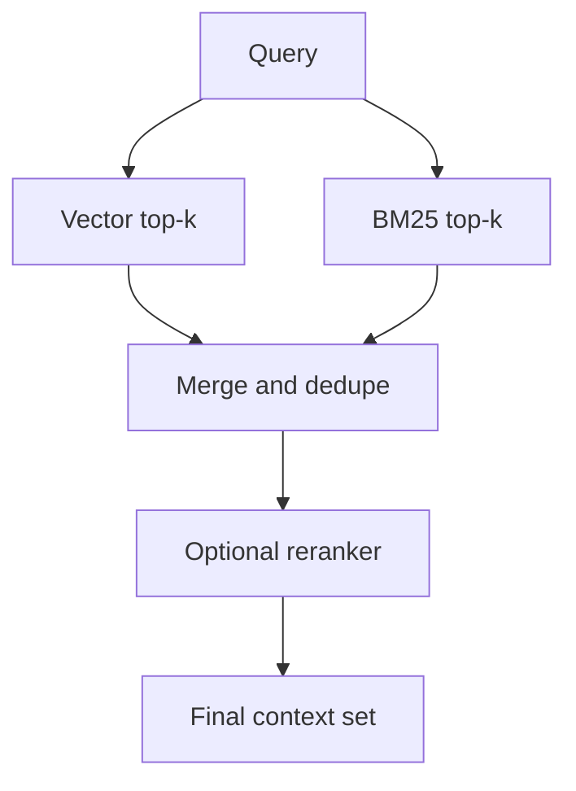

| Mode | Best when |
|---|---|
| Vector only | Paraphrased questions, conceptual Q&A |
| Keyword only | Exact strings, codes, SKUs |
| Hybrid | General enterprise search |
| + Reranker | High stakes, small k, budget for latency |

See also: [§8 PageIndex](#8-pageindex-vs-traditional-vector-rag) — a **vectorless**, structure-first alternative to embedding + vector DB retrieval.

---

## 8. PageIndex vs traditional vector RAG

**[PageIndex](https://pageindex.ai/)** (open source: [VectifyAI/PageIndex](https://github.com/VectifyAI/PageIndex)) is a **reasoning-based, vectorless** retrieval approach. Instead of chunking documents, embedding passages, and searching a vector DB by similarity, it builds a **hierarchical tree index** (like an intelligent table of contents) and lets an **LLM navigate that tree** to find the right sections.

Traditional RAG and PageIndex both answer “what text should go in the prompt?” — they differ in **how** relevance is decided.

---

### What is PageIndex?

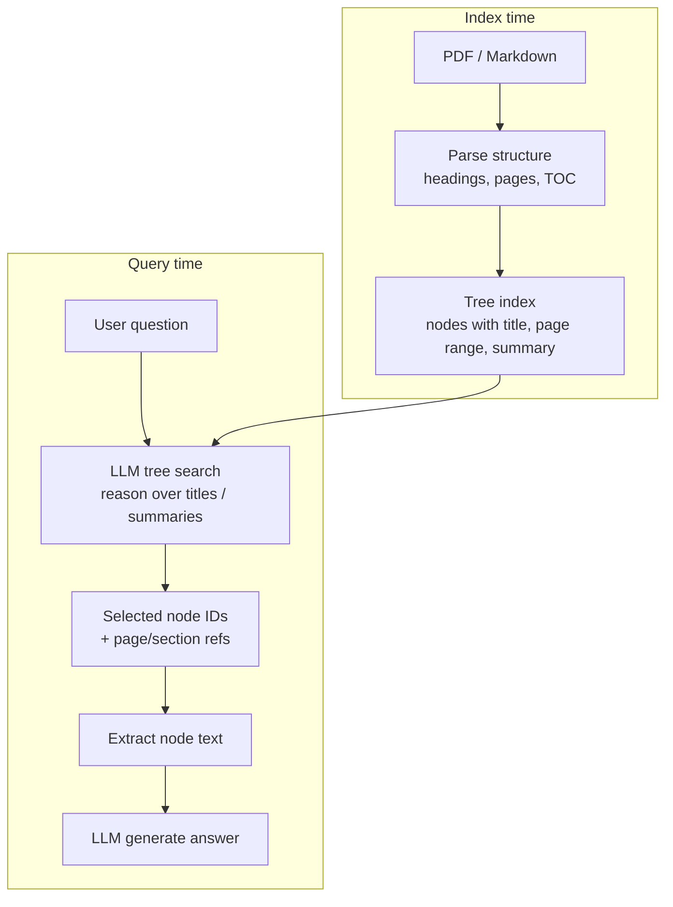

| Tree node field | Role |
|---|---|
| **`title`** | Section heading from the document |
| **`node_id`** | Stable ID for citation and traceability |
| **`start_index` / `end_index`** | Page range in the source PDF |
| **`nodes`** | Child sections (nested hierarchy) |
| **`summary`** (optional) | AI-generated section summary to guide tree search |

**Index construction** (from [PageIndex docs](https://docs.pageindex.ai/)):

1. **Document has a TOC** → extract and validate against page content  
2. **TOC without page numbers** → match section titles to pages  
3. **No TOC** → infer hierarchy from headings and layout  

**Query time:** the LLM reads node titles/summaries (not full document text), **reasons** which branches to open, returns **node IDs**, then the app pulls text from those nodes into the generator prompt. Retrieval is **traceable** — every hit maps to an explicit section and page range. See [query-time flow](#query-time-flow-llm-tree-navigation) below.

PageIndex is **not** “no retrieval” — it replaces **similarity search** with **structure + LLM navigation** (closer to [agentic RAG](#10-rag-vs-tools-vs-agents) than to a pure vector pipeline).

---

### Query-time flow (LLM tree navigation)

**Yes — PageIndex depends on an LLM for retrieval at query time.** Tree building is mostly parsing; **navigation** is LLM-driven reasoning over the index (titles, summaries, hierarchy), not embedding nearest-neighbor search.

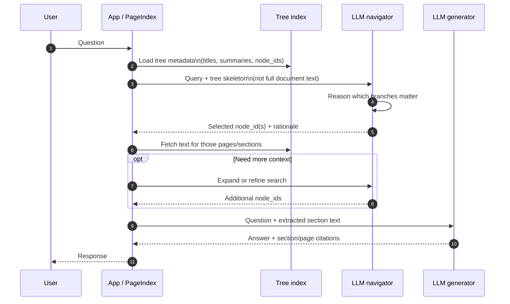

| Step | Who | What |
|---|---|---|
| **1** | Parser (offline) | Build tree from TOC / headings / pages |
| **2** | Optional LLM (offline) | Write short **summaries** per node to aid navigation |
| **3** | User | Asks a question |
| **4** | **Navigator LLM** | Reads query + tree metadata; selects relevant **node_id(s)** |
| **5** | App | Extracts full text from selected nodes’ page ranges |
| **6** | Optional **Navigator LLM** | Drills into child nodes or opens sibling sections |
| **7** | **Generator LLM** | Answers using extracted sections; cites pages / sections |

**Typical LLM calls per query:** at least **two** — one to **navigate** the tree (retrieval), one to **generate** the answer. Agentic setups may issue **multiple navigator calls** when the model expands branches iteratively.

| Role | Input | Output |
|---|---|---|
| **Navigator LLM** | User query + tree skeleton (titles, summaries, IDs) | `node_id(s)` + optional reasoning trace |
| **Generator LLM** | User query + text from selected nodes | Final answer + citations |

**vs vector RAG:** traditional retrieval is **embed query → ANN search** with **no LLM** in the retrieve step (optional reranker afterward). PageIndex makes **LLM navigation the retrieve step**.

---

### Side-by-side comparison

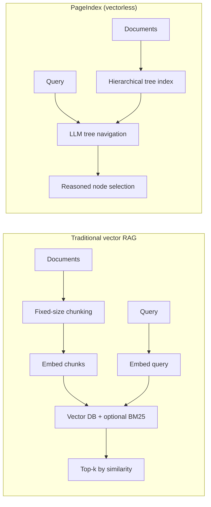

| Dimension | **Traditional vector RAG** | **PageIndex** |
|---|---|---|
| **Core signal** | **Embedding similarity** (cosine / dot product) | **LLM reasoning** over document **structure** |
| **Index artifact** | Chunk vectors in **vector DB** (+ optional keyword index) | **Tree** of sections/pages (JSON-like hierarchy) |
| **Chunking** | Required (~256–1024 token windows, overlap) | **Avoids artificial chunks** — sections follow natural headings |
| **Retrieval unit** | Arbitrary text chunk | **Section / subsection / page range** |
| **Scoring** | Fixed **top-k** nearest neighbors | Dynamic node selection (no single k hyperparameter) |
| **Infrastructure** | Embedding API, vector store, re-index on model change | Tree builder + LLM calls for navigation; **no vector DB** |
| **Citations** | Chunk ID / metadata (quality depends on chunk boundaries) | **Explicit page + section** references by design |
| **Explainability** | “Similarity score 0.82” (opaque) | **Reasoning trace** — which nodes were chosen and why |
| **Strengths** | Scales to **millions** of chunks; fast ANN; works on unstructured text | Strong on **long, structured** docs (manuals, filings, contracts) |
| **Weaknesses** | Chunk boundaries, similarity ≠ relevance, “lost in the middle” | Extra **LLM latency/cost** per query; tree quality depends on layout/TOC |
| **Multi-doc corpus** | Mature pattern (one big index + metadata filters) | Evolving — e.g. [PageIndex File System](https://pageindex.ai/blog/pageindex-filesystem) for file-level trees at scale |

**Conceptual difference:**

| | Traditional RAG | PageIndex |
|---|---|---|
| **Analogy** | “Find paragraphs that *look like* the question” | “Skim the table of contents like a human, then open the right chapter” |
| **Relevance** | **Similarity** in embedding space | **Reasoning** over titles, summaries, and hierarchy |
| **Failure mode** | Right fact in wrong chunk; near-duplicate noise | Wrong branch in tree; weak TOC on messy PDFs |

---

### When to prefer which

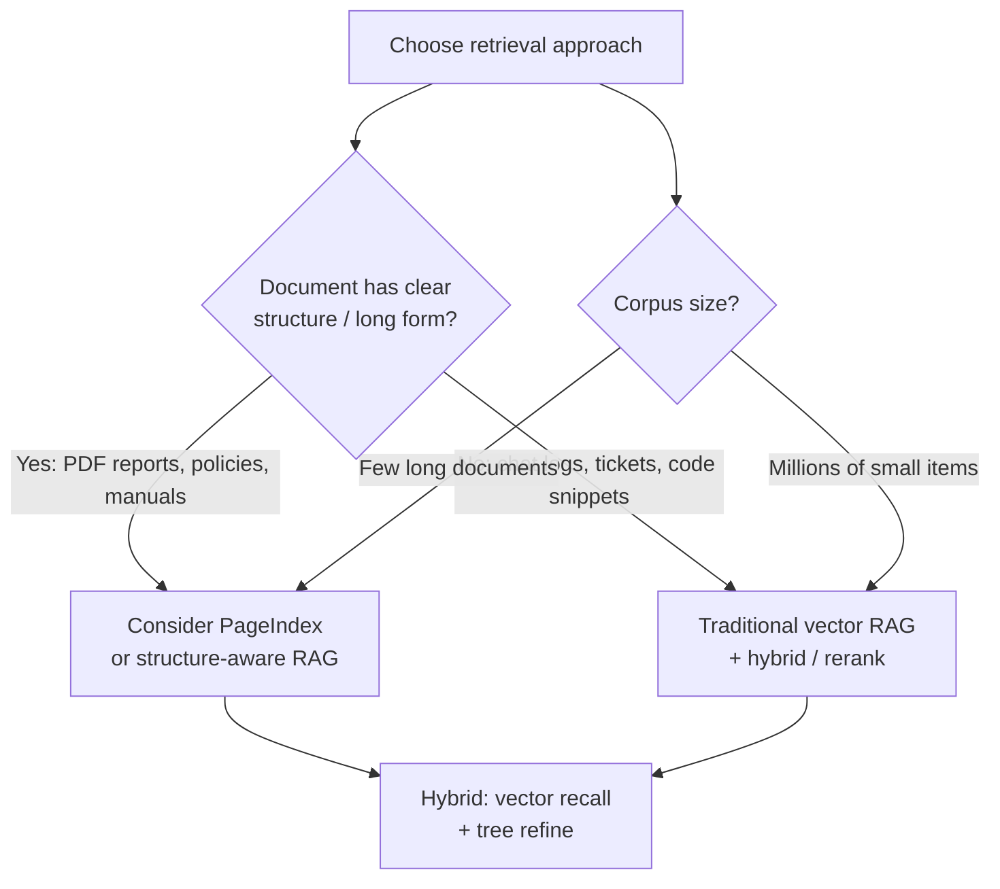

| Prefer **traditional vector RAG** when… | Prefer **PageIndex** when… |
|---|---|
| Corpus is **large and heterogeneous** (wiki, tickets, Slack, code) | Documents are **long and structured** (10-K, contract, regulatory PDF) |
| You need **sub-second** retrieval at huge scale | **Traceable** section/page citations matter (audit, finance, legal) |
| Text has **weak or no headings** | **Chunking artifacts** hurt (tables split across chunks, cross-section answers) |
| Team already runs **vector DB + embeddings** | You want to **skip** embedding pipeline and vector infra |
| Paraphrased / fuzzy conceptual search is enough | **Similarity ≠ relevance** — need reasoning over “which section applies” |

**PageIndex sweet spot:** domain Q&A over **few complex documents** where structure carries meaning (policies with numbered sections, financial reports, technical manuals).

**Vector RAG sweet spot:** **broad enterprise search** over many short pages, messy text, and constantly growing corpora.

---

### Can they be combined?

Yes — they solve different layers of the problem:

| Hybrid pattern | Flow |
|---|---|
| **Vector recall → tree refine** | Vector search finds candidate **documents**; PageIndex navigates **inside** each long PDF |
| **Tree + keyword** | Tree for section selection; BM25 for exact codes/SKUs inside a section |
| **PageIndex + reranker** | Tree picks sections; cross-encoder re-scores section text vs query (uncommon but valid) |

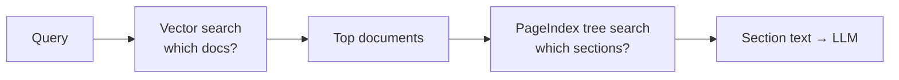

**Bottom line:** PageIndex is an alternative **retrieval layer**, not a replacement for the whole RAG stack. You still **augment** the prompt and **generate** with an LLM. Many production systems stay on **vector + hybrid + rerank**; PageIndex fits when **document structure** is the main retrieval signal and **explainable section-level citations** matter.

**External links:** [PageIndex docs](https://docs.pageindex.ai/) · [GitHub](https://github.com/VectifyAI/PageIndex) · [Developer / MCP / API](https://pageindex.ai/developer)

---

## 9. Prompt assembly (augment)

The retriever output becomes **tokens in the context window** — same rules as [prompt vs context in llm.md](./llm.md#prompt-vs-context--model-view-vs-app-view).

Typical template (conceptual):

```text
System: Answer using ONLY the provided context. If unknown, say so. Cite sources.

Context:
[1] (policy/refunds-eu.md §2) EU customers may request...
[2] (policy/refunds-eu.md §4) Window is 30 days unless...

User: What is our refund policy for EU customers?
```

```mermaid
flowchart LR
    subgraph Window["Context window budget"]
        Sys["System instructions"]
        Chunks["Retrieved chunks 1..k"]
        Q["User question"]
        Out["Generated answer"]
    end
    Sys --> Chunks --> Q --> Out
```

| Knob | Effect |
|---|---|
| **top-k** | More chunks → more recall, more noise and cost |
| **Max chunk tokens** | Cap per passage |
| **Total context budget** | Leave room for answer + history |
| **Citation format** | `[1]`, footnotes, or inline links |

---

## 10. RAG vs tools vs agents

This section covers **orchestration**: who decides *when* and *how* to fetch knowledge. [§8 PageIndex](#8-pageindex-vs-traditional-vector-rag) is one **retrieval mechanism**; **Agentic RAG** is one **control pattern** that can sit on top of vector search, PageIndex, or both.

---

### Simple RAG vs tools vs agents (overview)

| | **Simple (traditional) RAG** | **Tool** (e.g. search API) | **Agentic RAG** |
|---|---|---|---|
| **When data is fetched** | Before generation (**once**, fixed pipeline) | When the model emits a **tool_call** | Model in a **loop** — zero or many retrieves |
| **Who triggers retrieve** | **Application** (always) | **LLM** (via tool schema) | **LLM** (plan → retrieve → reflect → maybe retrieve again) |
| **Retrieve query** | Usually the raw user question | Args the model chooses | Model may **rewrite**, decompose, or specialize queries |
| **Best for** | Straightforward doc Q&A | Live APIs, side effects, web | Multi-hop, ambiguous, or evolving research tasks |
| **Latency** | Predictable (1× retrieve + 1× generate) | Variable | Often **highest** (multiple LLM + retrieve steps) |

```mermaid
flowchart TB
    subgraph SimpleRAG["Simple RAG"]
        Q1["Question"] --> R1["Retrieve once"] --> G1["Generate once"]
    end
    subgraph Tool["Tool use"]
        Q2["Question"] --> L2["LLM"]
        L2 --> T2["tool_call"]
        T2 --> O2["Observation"]
        O2 --> L2
    end
    subgraph AgentRAG["Agentic RAG"]
        Q3["Goal"] --> A["Agent LLM"]
        A --> R3["Retrieve tool\nvector / PageIndex / SQL"]
        R3 --> A
        A --> Check{"Enough\nevidence?"}
        Check -->|No| A
        Check -->|Yes| G3["Final answer"]
    end
```

Live web search in ChatGPT is closer to **tool + agent loop** than to classic one-shot batch-index RAG.

---

### What is Agentic RAG?

**Agentic RAG** puts an **LLM in control of retrieval** instead of a fixed `retrieve(query) → top-k → generate` pipeline. The model can:

- **Decide whether** to retrieve at all  
- **Rewrite or split** the question into sub-queries  
- **Call retrieve tools multiple times** (multi-hop)  
- **Choose backends** — vector DB, keyword search, PageIndex tree nav, SQL, web  
- **Reflect** — “I still need the 2023 policy, not 2022” → retrieve again  
- **Generate** only when it judges context sufficient  

```mermaid
flowchart LR
    subgraph Agentic["Agentic RAG = agent loop + RAG tools"]
        LLM["Agent LLM"]
        LLM --> RT["retrieve_knowledge\n(vector / hybrid)"]
        LLM --> PI["navigate_document_tree\n(PageIndex)"]
        LLM --> Other["grep / SQL / web / …"]
        RT --> LLM
        PI --> LLM
        Other --> LLM
    end
```

**Agentic RAG is not a fourth index type.** It is an **orchestration pattern**. The actual retrieval can still be:

| Backend inside the loop | Same as |
|---|---|
| Vector + BM25 hybrid | [Traditional RAG §7](#7-retrieval-strategies) |
| LLM tree navigation | [PageIndex §8](#8-pageindex-vs-traditional-vector-rag) |
| Live web / APIs | Tools, not static index |

Common variants (names vary by vendor):

| Pattern | Behavior |
|---|---|
| **Corrective RAG (CRAG)** | Retrieve → grade relevance → re-query or fall back to web if poor |
| **Self-RAG** | Model emits retrieve / relevance / support tokens as part of generation |
| **ReAct-style** | Alternate **Reason** (thought) and **Act** (retrieve tool) until done |
| **Query decomposition** | Break “compare A and B policies” into two retrieve calls |

See also: [llm.md §4 Agents](./llm.md#4-agents--from-one-shot-to-a-control-loop) for the general agent control loop.

---

### Traditional RAG vs PageIndex vs Agentic RAG

These three are often confused because all three “use retrieval.” They differ on **who retrieves** and **how relevance is scored**.

```mermaid
flowchart TB
    subgraph Trad["Traditional RAG"]
        direction LR
        TQ["Query"] --> TE["Embed"]
        TE --> ANN["Vector DB top-k"]
        ANN --> TG["LLM generate"]
    end
    subgraph PI["PageIndex"]
        direction LR
        PQ["Query"] --> PN["LLM navigates tree"]
        PN --> PT["Extract sections"]
        PT --> PG["LLM generate"]
    end
    subgraph AR["Agentic RAG"]
        direction LR
        AQ["Goal"] --> AL["Agent LLM loop"]
        AL --> ARet["Retrieve tool\n(any backend)"]
        ARet --> AL
        AL --> AG["Final generate"]
    end
```

| Dimension | **Traditional RAG** | **PageIndex** | **Agentic RAG** |
|---|---|---|---|
| **Primary axis** | **Retrieval mechanism** (similarity) | **Retrieval mechanism** (structure + LLM nav) | **Control flow** (LLM-driven loop) |
| **Who plans retrieval?** | **App** (fixed pipeline) | **App** invokes navigator LLM with fixed tree-search step | **Agent LLM** (dynamic plan) |
| **# of retrieve steps** | Usually **1** | Usually **1** nav pass (+ optional drill-down) | **0 to many** |
| **Relevance signal** | Embedding similarity (+ optional rerank) | Reasoning over TOC / sections | Model decides *when* and *what* to fetch; backend can be vector **or** tree |
| **Query handling** | Raw or lightly rewritten user query | User query → tree search prompt | Sub-queries, decomposition, follow-ups |
| **Vector DB required?** | **Yes** (typical) | **No** | **Optional** (only if vector tool is used) |
| **LLM calls (typical)** | **1** (generate only); +0 rerank | **2+** (navigate + generate) | **3+** (plan/retrieve/reflect/generate × n) |
| **Multi-hop questions** | Weak unless you add agent loop | Moderate (tree drill-down) | **Strong** (designed for this) |
| **Explainability** | Chunk IDs, similarity scores | Section / page node trace | Thought + tool log + citations |
| **Cost / latency** | **Lowest** | **Medium** | **Highest** |
| **Failure mode** | Wrong chunk in top-k | Wrong tree branch | Runaway loop, over-retrieval, tool misuse |

**Relationships (not mutually exclusive):**

| Statement | True? |
|---|---|
| PageIndex **is** agentic at the **navigation** step | **Yes** — an LLM reasons over the tree ([§8 flow](#query-time-flow-llm-tree-navigation)) |
| PageIndex **is** full Agentic RAG | **Not necessarily** — classic PageIndex is still a **fixed** nav-then-generate pipeline unless wrapped in a broader agent loop |
| Agentic RAG **replaces** vector RAG | **No** — it often **calls** vector search as a **tool** inside the loop |
| Traditional RAG **cannot** multi-hop | **Not alone** — add an agent loop → becomes Agentic RAG |

**One-line analogies:**

| Pattern | Analogy |
|---|---|
| **Traditional RAG** | Librarian hands you **one stack of index cards** before you read. |
| **PageIndex** | You **skim the table of contents** with a guide, open specific chapters. |
| **Agentic RAG** | Research assistant who **keeps going back to the shelves** until the question is answered. |

---

### Agentic RAG query flow

```mermaid
sequenceDiagram
    autonumber
    participant U as User
    participant App as Agent host
    participant A as Agent LLM
    participant R as Retrieve tools
    participant Idx as Index\n(vector / tree / SQL)

    U->>App: Complex question
    App->>A: Goal + tool schemas + history

    loop Until done or max steps
        A->>A: Reason / plan next step
        alt Needs more knowledge
            A->>App: tool_call retrieve\n(query, filters, backend)
            App->>R: Execute tool
            R->>Idx: Search or tree nav
            Idx-->>R: Passages or node text
            R-->>App: Observation
            App->>A: Tool result
        else Ready to answer
            A-->>App: Final response + citations
        end
    end

    App-->>U: Answer
```

**Example — multi-hop with traditional vector backend:**

1. User: “Did our 2024 EU refund policy change from 2023, and what does finance require for approval?”  
2. Agent: `retrieve("EU refund policy 2023")` → chunks from wiki  
3. Agent: `retrieve("EU refund policy 2024")` → updated chunks  
4. Agent: `retrieve("finance approval workflow refunds")` → process doc  
5. Agent: synthesize answer with citations from all three result sets  

**Example — Agentic RAG using PageIndex as a tool:**

1. Agent: `list_documents()` → finds `annual-report-2024.pdf`  
2. Agent: `pageindex_navigate(doc_id, "revenue recognition note 2")` → node IDs + section text  
3. Agent: insufficient detail → `pageindex_navigate(doc_id, "segment reporting footnote")`  
4. Agent: final answer with page references  

Same **agent loop**; different **retrieve tools** inside it.

---

### When to use which pattern

```mermaid
flowchart TD
    Start["Pick a RAG pattern"]
    Start --> Hops{"Multi-hop or\nfollow-up retrieves?"}
    Hops -->|No, single lookup| Mechanism{"Corpus shape?"}
    Hops -->|Yes| Agentic["Agentic RAG\n(loop + retrieve tools)"]
    Mechanism -->|Large messy corpus| Trad["Traditional vector RAG\n+ hybrid / rerank"]
    Mechanism -->|Few long structured PDFs| PI["PageIndex\nor vector → tree hybrid"]
    Agentic --> Backend{"Which retrieve tool?"}
    Backend --> Vec["Vector / hybrid tool"]
    Backend --> Tree["PageIndex tree tool"]
    Backend --> Mix["Both + web / SQL"]
```

| Situation | Start here |
|---|---|
| FAQ over a stable wiki, one-shot answers | **Traditional RAG** |
| 100-page PDF with clear sections, audit citations | **PageIndex** (or hybrid) |
| “Compare X across three years and cross-check policy” | **Agentic RAG** |
| Chat product with browse + files + memory | **Agentic RAG** (often hidden in the product) |
| Strict latency SLA, predictable cost | **Traditional RAG** — avoid agent loop unless necessary |
| Already built vector index; need multi-hop | **Agentic RAG** wrapping existing retriever as a **tool** |

**Practical progression:** **Traditional RAG** → add rerank/hybrid if recall hurts → add **PageIndex** for long structured docs → wrap in **Agentic RAG** when single-shot retrieval is not enough.

---

## 11. Failure modes and mitigations

| Failure | Symptom | Mitigations |
|---|---|---|
| **Bad chunks** | Right doc, wrong paragraph | Better chunking, headings, overlap |
| **Missed retrieval** | Answer “not in context” | Hybrid search, query expansion, higher k |
| **Wrong chunk retrieved** | Confident wrong answer | Reranker, metadata filters, “I don’t know” prompt |
| **Lost in the middle** | Ignores middle passages | Fewer chunks, rerank, put best chunk last/near question |
| **Stale index** | Outdated policy | Re-index pipeline, `updated_at` filters |
| **No citation discipline** | Ungrounded prose | Require cites, eval with attribution checks |
| **ACL leak** | User sees others’ docs | Filter by `tenant_id` / user at retrieve time |

```mermaid
flowchart TD
    Bad["Bad RAG answer"] --> C{"Retrieve correct chunk?"}
    C -->|No| FixR["Improve index, hybrid, k, query rewrite"]
    C -->|Yes| FixG["Improve prompt, model, cite-only instructions"]
```

---

## 12. Evaluation (what to measure)

| Metric | Measures |
|---|---|
| **Retrieval recall@k** | Is the gold passage in top-k? |
| **Answer faithfulness** | Is the answer supported by retrieved text? |
| **Answer relevance** | Does it address the question? |
| **Citation accuracy** | Do cites match the supporting chunk? |
| **Latency / cost** | Embed + search + LLM tokens |

Improve retrieval first when answers are wrong but the corpus contains the truth.

---

## 13. Minimal architecture map

```mermaid
flowchart TB
    subgraph Data["Knowledge layer"]
        Wiki["LLM wiki / docs"]
        Pipe["Ingest pipeline"]
        Wiki --> Pipe
    end
    subgraph RAG["RAG layer"]
        Idx["Index"]
        Ret["Retriever"]
        Pipe --> Idx
        Ret --> Idx
    end
    subgraph App["Application"]
        UI["Chat / API"]
        LLM["LLM"]
        UI --> Ret
        Ret --> LLM
        LLM --> UI
    end
```

---

## 14. When to use RAG

| Situation | Use RAG? |
|---|---|
| Company wiki, policies, manuals (large, changing) | **Yes** |
| Private data not in model weights | **Yes** |
| Need citations / audit trail | **Yes** |
| Long **structured** PDFs (filings, contracts) where chunking hurts | **Yes** — consider [PageIndex §8](#8-pageindex-vs-traditional-vector-rag) or vector RAG |
| Single short PDF, one-shot | Optional (long context may suffice) |
| Real-time stock price | **Tool/API**, not static RAG index |
| Multi-tenant SaaS | **Yes** + strict metadata filters |

---

## 15. Related docs

| Doc | Topic |
|---|---|
| [llm.md](./llm.md) | Tokens, context window, agents, MCP, skills |
| [llm.md §3](./llm.md#3-rag-retrieval-augmented-generation) | Brief RAG placement in the LLM stack |
| [llm.md §5](./llm.md#5-llm-wiki--grounded-knowledge-for-orgs--agents) | Curating corpora for retrieval |
| [llm.md §7–§8](./llm.md#7-consumer-chat-apps--chatgpt-claude-gemini-grok) | Consumer chat vs coding-agent products (local vs cloud index) |
| [§5 Embeddings in RAG](./RAG.md#5-embeddings-in-rag) | Vector dims, query vs chunk, ChatGPT vs Cursor |
| [§8 PageIndex vs vector RAG](./RAG.md#8-pageindex-vs-traditional-vector-rag) | Vectorless, tree-based reasoning retrieval |
| [§10 Agentic RAG](./RAG.md#what-is-agentic-rag) | LLM loop + retrieve tools; vs traditional RAG & PageIndex |
| [PageIndex (external)](https://docs.pageindex.ai/) | Official docs, MCP/API, open-source tree index |
| [token_embedding.md](./token_embedding.md) | Token embeddings inside the transformer (not RAG bi-encoder) |

---

## References

- Lewis et al., *Retrieval-Augmented Generation for Knowledge-Intensive NLP Tasks* (foundational RAG paper)
- Lost-in-the-middle literature (long prompts dilute signal)
- Hybrid search: dense + sparse retrieval in production IR systems
- [PageIndex](https://pageindex.ai/) / [VectifyAI/PageIndex](https://github.com/VectifyAI/PageIndex) — vectorless, reasoning-based tree retrieval
