# RAG — Retrieval-Augmented Generation

**RAG** connects an LLM to **external knowledge** by **retrieving** relevant text at query time, **augmenting** the prompt with those passages, then **generating** an answer grounded in that evidence.

Parent overview: [llm.md §3 RAG (brief)](./llm.md#3-rag-retrieval-augmented-generation) · [LLM wiki / curated corpus](./llm.md#5-llm-wiki--grounded-knowledge-for-orgs--agents)

---

## Cheat sheet

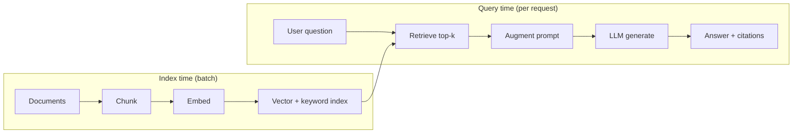

| Phase | One-liner |
|---|---|
| **Retrieve** | Find the few chunks most relevant to the question |
| **Augment** | Paste those chunks into the LLM prompt (with instructions) |
| **Generate** | LLM writes the answer using provided evidence |

**RAG ≠ training.** You do not retrain the model weights; you change **what tokens are in the context** for this request.

---

## 1. Why RAG exists

| Source of knowledge | Limit |
|---|---|
| **Model weights** | Frozen at train time — stale, no private docs, can hallucinate |
| **Long context (stuff all docs)** | Corpus ≫ window, cost, “lost in the middle,” hard to cite |
| **RAG** | Pull **only** what you need now from a large, updatable index |

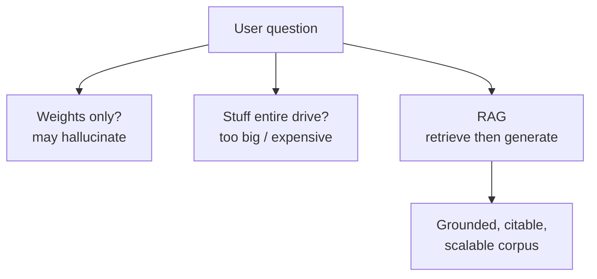

See [§2 below](#2-rag-vs-large-context-window) and [llm.md](./llm.md) for how **large context + RAG** combine (retrieve top-k, then reason in a big window).

---

## 2. RAG vs large context window

Large context windows **help** but do **not** replace RAG when knowledge is large, changing, private, or must be cited.

### Two ways to give the model external knowledge

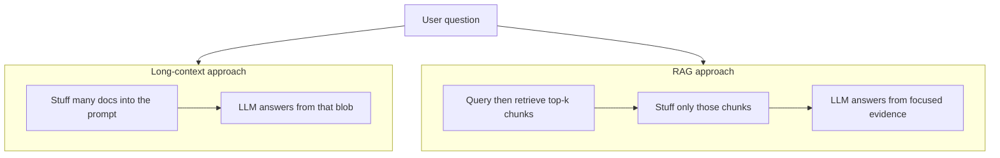

### Comparison

| Dimension | Long context only (stuff everything) | RAG (retrieve, then generate) |
|---|---|---|
| **Corpus size** | Breaks when data ≫ window (or becomes huge prompts) | Scales to millions of chunks via an index |
| **Freshness** | Must re-paste / re-upload when docs change | Re-index or update vectors; prompt stays small |
| **Cost / latency** | Pay for *all* tokens every request | Pay for query + top-k chunks (+ embedding search) |
| **Signal quality** | Lost in the middle: facts diluted in long prompts | Top-k focuses attention on relevant passages |
| **Privacy / tenancy** | Entire corpus may enter the prompt vendor context | Retrieve only per-user / per-tenant slices |
| **Citations** | Harder to know which page mattered | Natural: return retrieved chunk IDs / URLs |
| **When it wins** | Single book, one large PDF, short-lived session memory | Enterprise wiki, codebases, tickets, policies |

### Decision guide

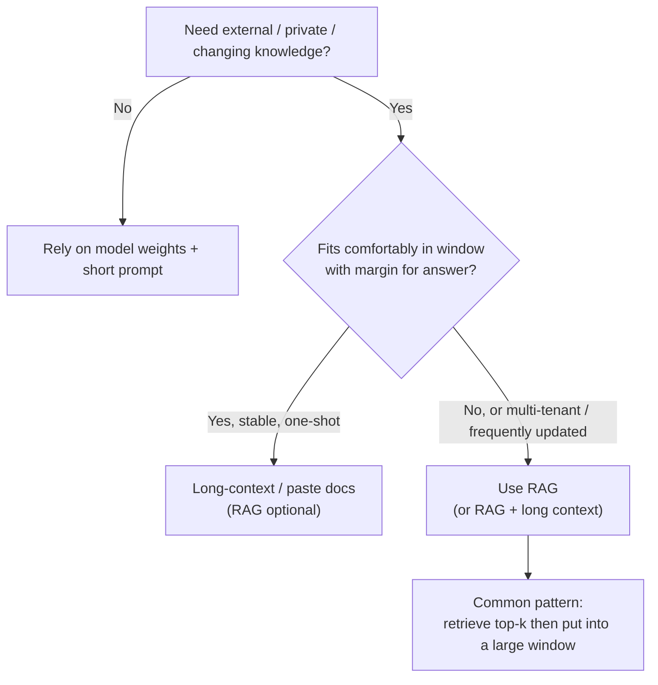

### Practical rule of thumb

| Situation | Prefer |
|---|---|
| One PDF / meeting transcript / ticket thread | Long context (maybe no RAG) |
| Company wiki, Confluence, Notion, drive with 10k+ pages | **RAG** |
| Codebase Q&A across many repos | **RAG** (+ optional repo map) |
| News / inventory / prices that change daily | **RAG** (or tools/APIs) |
| Agent with tools that fetch facts | Tools ≈ live RAG; still not all in weights |

**Bottom line:** Large windows make RAG **smarter and simpler** (retrieve fewer, larger chunks; keep more history), but they do **not** make “put the whole company drive in the prompt” viable. RAG remains the default for **scalable, updatable, attributable** knowledge.

---

## 3. End-to-end flow

### Offline: build the index

Run when documents are added or updated (not on every user question).

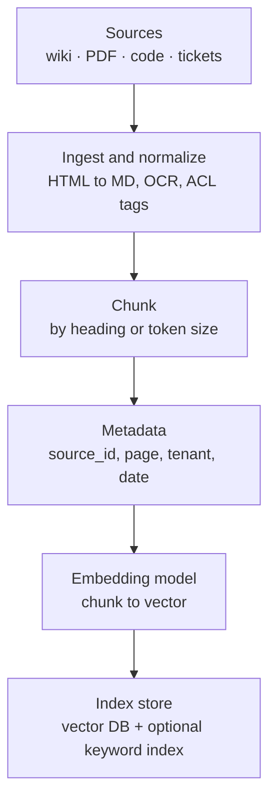

| Step | Input | Output |
|---|---|---|
| **Ingest** | Raw files, CMS export, git | Clean text + structure |
| **Chunk** | Long pages | Passages ~256–1024 tokens (typical) |
| **Embed** | Each chunk | Dense vector (e.g. 768–3072 dims) |
| **Index** | Vectors + metadata | Searchable store (Pinecone, pgvector, Elasticsearch, …) |

### Online: answer one question

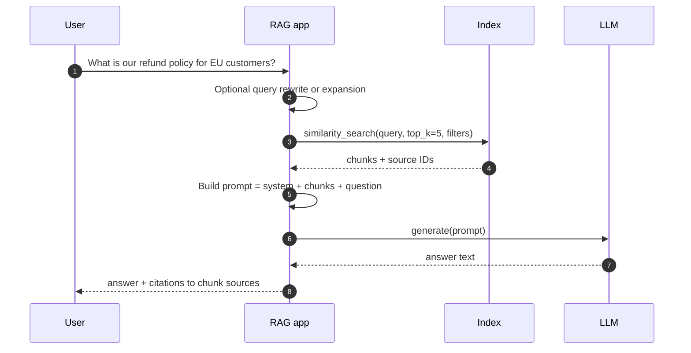

---

## 4. Core components

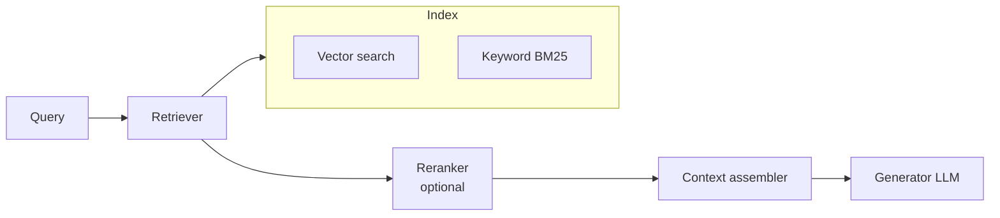

| Component | Role | Notes |
|---|---|---|
| **Chunking** | Split docs into retrievable units | Quality dominates — bad chunks → bad answers |
| **Embedding model** | Map text ↔ vector for similarity | Same family often used at index and query time |
| **Vector store** | Approximate nearest neighbor search | Scales to millions of chunks |
| **Keyword index** | Lexical match (BM25) | Good for SKUs, error codes, exact terms |
| **Retriever** | Returns top-k candidate chunks | Often **hybrid** = vector + keyword |
| **Reranker** | Re-score top-k with a cross-encoder | Better precision, extra latency |
| **Generator** | LLM that reads chunks + question | Instructions: “answer only from context” |
| **Citation layer** | Map sentences → chunk IDs | Trust and debugging |

---

## 5. Chunking (make or break)

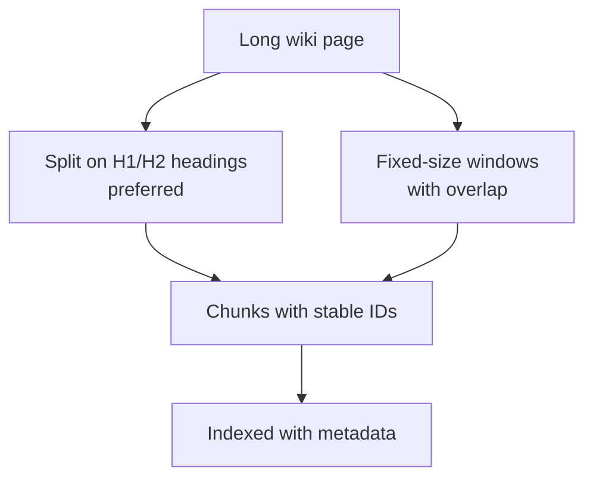

| Strategy | Pros | Cons |
|---|---|---|
| **By heading / section** | Semantically coherent | Needs structure in source |
| **Fixed size + overlap** | Simple, works on plain text | May cut mid-sentence |
| **Semantic chunking** | Boundaries by embedding similarity | Heavier pipeline |
| **One doc = one chunk** | Simple | Too coarse for long docs |

**Metadata to keep:** `source_url`, `title`, `section`, `updated_at`, `tenant_id`, `acl`.

Good chunking aligns with [LLM wiki](./llm.md#5-llm-wiki--grounded-knowledge-for-orgs--agents) practices (one topic per page, clear headings).

---

## 6. Retrieval strategies

### Dense (vector) search

Query and chunks live in the same embedding space; retrieve by **cosine similarity** or inner product.


### Keyword (sparse) search

**BM25** / inverted index — strong when users paste exact IDs, API names, or rare tokens.

### Hybrid (common in production)

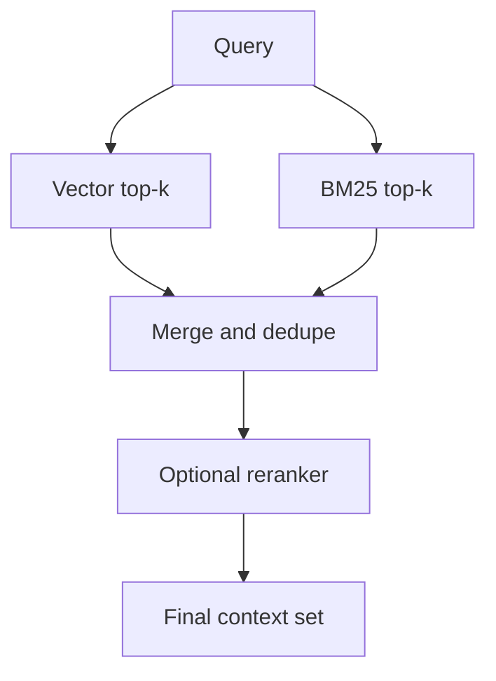

| Mode | Best when |
|---|---|
| Vector only | Paraphrased questions, conceptual Q&A |
| Keyword only | Exact strings, codes, SKUs |
| Hybrid | General enterprise search |
| + Reranker | High stakes, small k, budget for latency |

---

## 7. Prompt assembly (augment)

The retriever output becomes **tokens in the context window** — same rules as [prompt vs context in llm.md](./llm.md#prompt-vs-context--model-view-vs-app-view).

Typical template (conceptual):

```text
System: Answer using ONLY the provided context. If unknown, say so. Cite sources.

Context:
[1] (policy/refunds-eu.md §2) EU customers may request...
[2] (policy/refunds-eu.md §4) Window is 30 days unless...

User: What is our refund policy for EU customers?
```

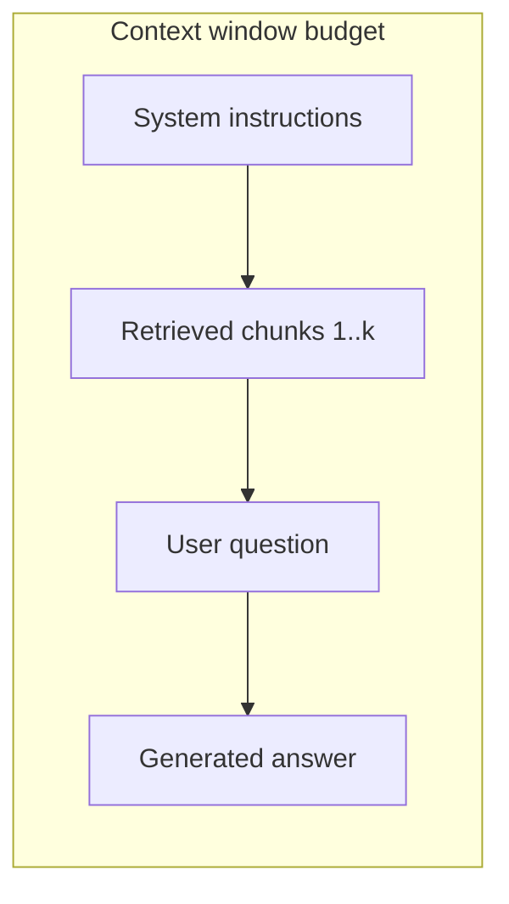

| Knob | Effect |
|---|---|
| **top-k** | More chunks → more recall, more noise and cost |
| **Max chunk tokens** | Cap per passage |
| **Total context budget** | Leave room for answer + history |
| **Citation format** | `[1]`, footnotes, or inline links |

---

## 8. RAG vs tools vs agents

| | **RAG** | **Tool (e.g. search API)** | **Agent + RAG** |
|---|---|---|---|
| **When data is fetched** | Before generation (usually once) | When model asks | Model may retrieve multiple times |
| **Who triggers retrieve** | App always | LLM via tool_call | LLM in a loop |
| **Best for** | Doc Q&A over static index | Live APIs, side effects | Complex multi-hop research |

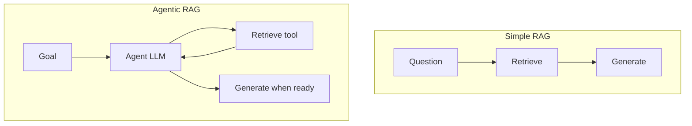

Live web search in ChatGPT is closer to **tool + retrieve** than classic batch-index RAG.

---

## 9. Failure modes and mitigations

| Failure | Symptom | Mitigations |
|---|---|---|
| **Bad chunks** | Right doc, wrong paragraph | Better chunking, headings, overlap |
| **Missed retrieval** | Answer “not in context” | Hybrid search, query expansion, higher k |
| **Wrong chunk retrieved** | Confident wrong answer | Reranker, metadata filters, “I don’t know” prompt |
| **Lost in the middle** | Ignores middle passages | Fewer chunks, rerank, put best chunk last/near question |
| **Stale index** | Outdated policy | Re-index pipeline, `updated_at` filters |
| **No citation discipline** | Ungrounded prose | Require cites, eval with attribution checks |
| **ACL leak** | User sees others’ docs | Filter by `tenant_id` / user at retrieve time |

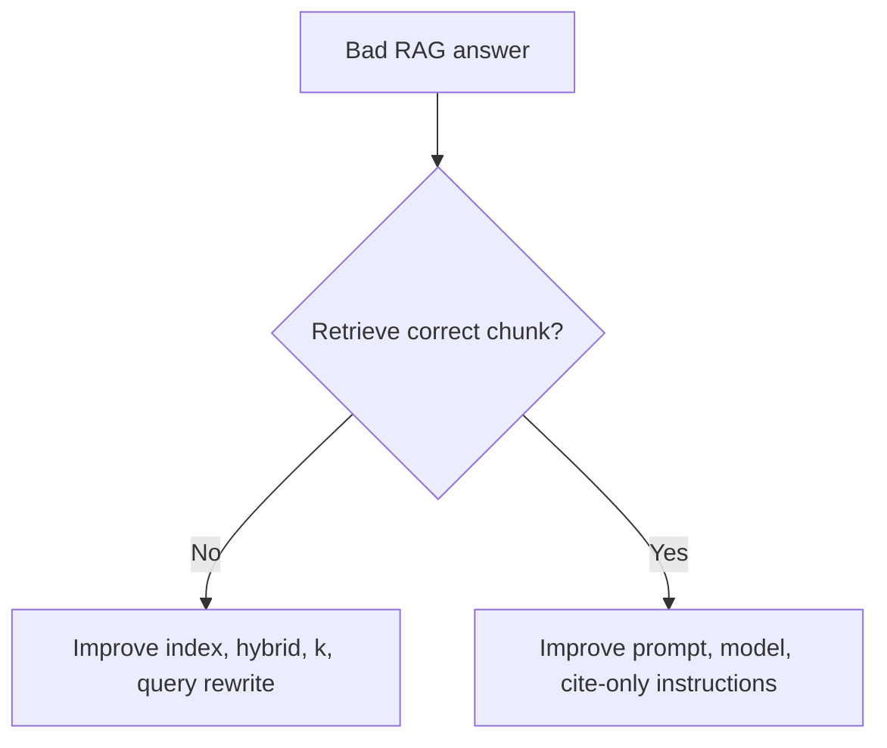

---

## 10. Evaluation (what to measure)

| Metric | Measures |
|---|---|
| **Retrieval recall@k** | Is the gold passage in top-k? |
| **Answer faithfulness** | Is the answer supported by retrieved text? |
| **Answer relevance** | Does it address the question? |
| **Citation accuracy** | Do cites match the supporting chunk? |
| **Latency / cost** | Embed + search + LLM tokens |

Improve retrieval first when answers are wrong but the corpus contains the truth.

---

## 11. Minimal architecture map

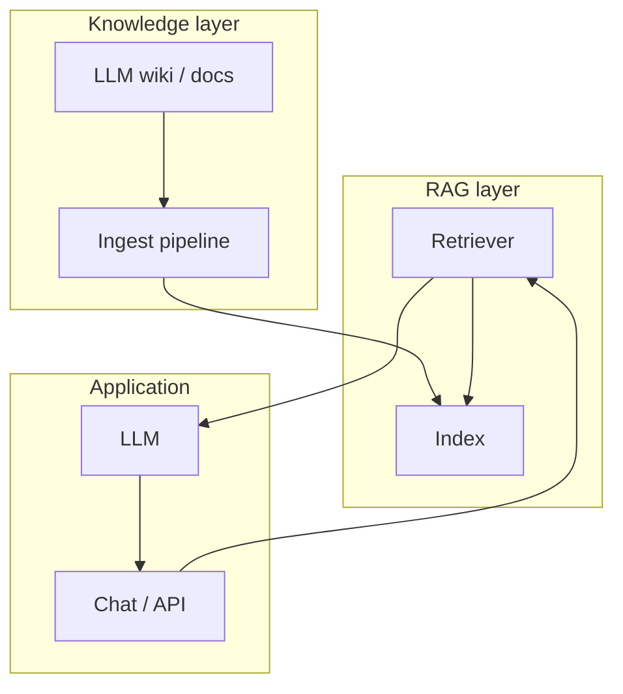

---

## 12. When to use RAG

| Situation | Use RAG? |
|---|---|
| Company wiki, policies, manuals (large, changing) | **Yes** |
| Private data not in model weights | **Yes** |
| Need citations / audit trail | **Yes** |
| Single short PDF, one-shot | Optional (long context may suffice) |
| Real-time stock price | **Tool/API**, not static RAG index |
| Multi-tenant SaaS | **Yes** + strict metadata filters |

---

## 13. Related docs

| Doc | Topic |
|---|---|
| [llm.md](./llm.md) | Tokens, context window, agents, MCP, skills |
| [llm.md §3](./llm.md#3-rag-retrieval-augmented-generation) | Brief RAG placement in the LLM stack |
| [llm.md §5](./llm.md#5-llm-wiki--grounded-knowledge-for-orgs--agents) | Curating corpora for retrieval |
| [token_embedding.md](./token_embedding.md) | Embeddings (related to chunk vectors) |

---

## References

- Lewis et al., *Retrieval-Augmented Generation for Knowledge-Intensive NLP Tasks* (foundational RAG paper)
- Lost-in-the-middle literature (long prompts dilute signal)
- Hybrid search: dense + sparse retrieval in production IR systems
