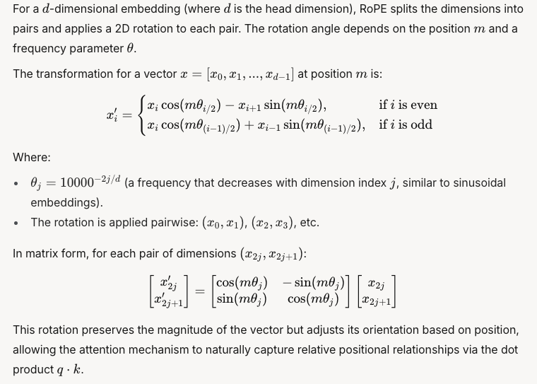

# Rotary Position Embedding (RoPE)

Rotary Position Embedding (RoPE) is a technique used in transformer models to encode positional information directly into the attention mechanism. Unlike absolute or relative positional embeddings, RoPE applies a rotation to the query (`Q`) and key (`K`) vectors in the attention mechanism, enabling the model to capture positional relationships in a more flexible and efficient way.



## How RoPE Works:
1. **Rotation Matrix**:
   - RoPE applies a rotation to the `Q` and `K` vectors based on their positions in the sequence.
   - The rotation is parameterized by sinusoidal functions (`cos` and `sin`) that depend on the position and frequency.

2. **Mathematical Formulation**:
   For a vector `x` split into even (`x_even`) and odd (`x_odd`) dimensions:
   ```
   x_rot_even = x_even * cos - x_odd * sin
   x_rot_odd = x_even * sin + x_odd * cos
   ```
   The rotated vector is then interleaved back into the original shape.

3. **Benefits**:
   - RoPE is lightweight and efficient, as it doesn't require additional learned parameters.
   - It enables the model to generalize better to unseen sequence lengths.

---

## Where to Add RoPE in `GroupedQueryAttention`

In the `GroupedQueryAttention` class, RoPE should be applied to the **query (`Q`)** and **key (`K`)** vectors <b>after their linear projection</b> but <b>before computing attention scores</b>. This is because RoPE modifies the `Q` and `K` vectors to encode positional information, which is essential for the attention mechanism to consider positional relationships.

[Example code](./code/GQA_with_RoPE.py)

## Current Implementation in Your Code:
In your `GroupedQueryAttention` class, RoPE is already applied correctly:
1. **Query (`Q`)**:
   ```python
   q = self.rope(q, offset=past_seq_len)
   ```
   - RoPE is applied to the query vector `q` with an offset for past sequence length (important for caching in autoregressive decoding).

2. **Key (`K`)**:
   ```python
   k = self.rope(k, offset=0)
   ```
   - RoPE is applied to the key vector `k` starting from position `0`, as keys include all past positions.

---

# Why RoPE is Applied to `Q` and `K`:
- **Query (`Q`)**: Encodes the position of the current token being processed.
- **Key (`K`)**: Encodes the positions of all tokens in the sequence (including past tokens in the cache).
- **Value (`V`)**: RoPE is **not applied** to `V` because it doesn't participate in positional comparisons; it only carries the content information.

---

# Summary:
- **What is RoPE?**: A method to encode positional information into the attention mechanism by rotating `Q` and `K` vectors.
- **Where to Add RoPE in `GroupedQueryAttention`?**: RoPE should be applied to both `Q` and `K` vectors before computing attention scores. Your current implementation already does this correctly.