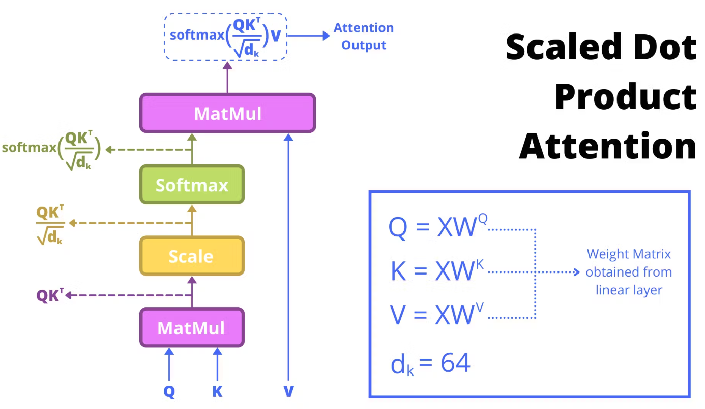
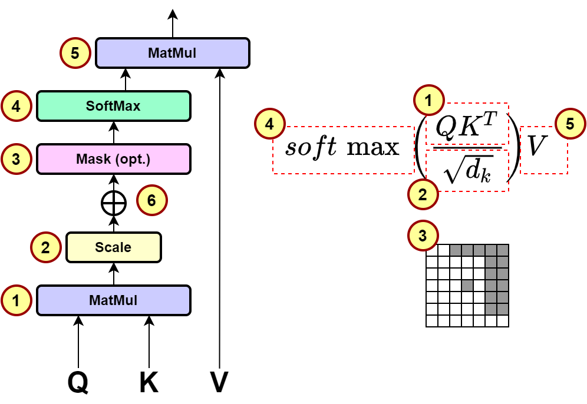

# Attention (Self-Attention)

## Create three vectors K, Q, V for each embedding

The first step in calculating self-attention is to create three vectors from each of the encoder’s input vectors (in this case, the embedding of each word). These vectors `K`, `Q`, `V` are created by multiplying the embedding by three matrices WQ, WK, WV that we trained during the training process.

## Matrix Calculation of Self-Attention

The next step is to calculate the attention weights. The attention weights are calculated by dividing the dot product of the query vector and the key vector by the square root of the dimension of the key vector.

- Another illustration of the matrix calculation of self-attention:

- Another illustration of the matrix calculation of self-attention:

## Multi-Head Attention

### Calculate Q, K, V for each head

### Calculate attention separately for each head

### Concatenate the results of each head

### Put it all together

## References

* [The illustrated Transformer](https://jalammar.github.io/illustrated-transformer/)