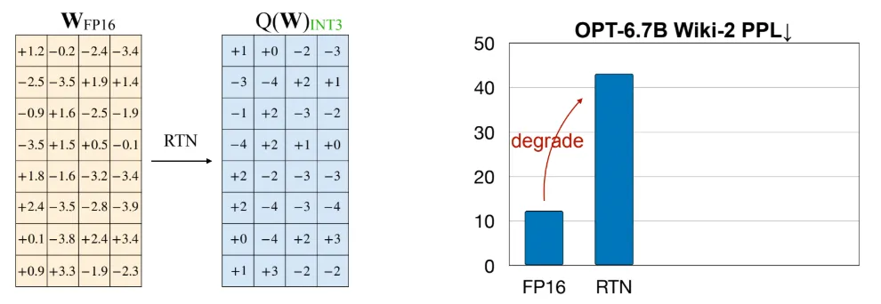
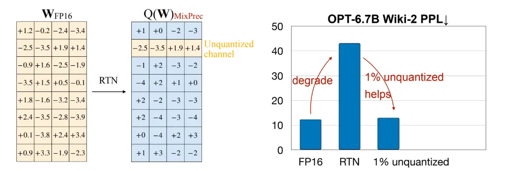
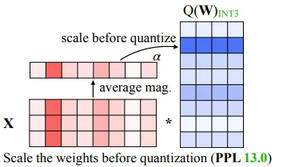

# AWQ: Activation Aware Quantization

Activation aware quantization (AWQ) is a process for quantizing large language models whilst maintaining significant accuracy without the memory overhead of Quantization Aware Training. There are difficulties quantizing very large language models due to outliers.

Outliers are weights in the network which take on very large values. These large values can skew the distribution of weights at quantization time, making it harder to maintain performance whilst reducing weight precision. AWQ accounts for these outlier values during the quantization process by calculating scale factors to offset them, thereby maintaining model performance.

However, naive weight-only quantization can significantly degrade model accuracy, as demonstrated by the case of RTN (Round-to-Nearest), which quantizes an FP16 tensor into INT using a simple rounding function. In the example below, weights are quantized to INT3 from FP16, resulting in a fourfold increase in perplexity. This highlights the need for a more sophisticated approach to quantization.

A key insight from this paper is that preserving approximately 1% of the most salient weight channels in FP16 while quantizing the rest of the tensor significantly improves model accuracy, making it nearly equivalent to that of an unquantized FP16 tensor. However, GPUs do not efficiently support matrix multiplication with tensors containing mixed precision elements (FP16 and INT4).

To overcome this limitation, AWQ scales the weight channels (W) by channel-specific scaling factors (s) in FP16 before quantization, ensuring the entire weight matrix is represented in INT format. 

To determine the per-channel scaling factors, AWQ analyzes the activation matrix (X). The ideal scaling factors (s∗) are formulated to minimize the difference between the product WX and its approximated version after applying AWQ to W. However, this approach is computationally expensive due to the large search space.

In practice, AWQ simplifies the process by defining the search space with the formulation presented below. Specifically, the base scaling factor (Sx​) for each channel is calculated by averaging the magnitudes of the elements within each column of the activation matrix (X). This method assumes that activation channels with higher average magnitudes amplify their corresponding weight channels. Therefore, these weight channels must be properly emphasized before quantization to maintain high model accuracy.

## References

* [AWQ: Activation-aware Weight Quantization for LLM Compression and Acceleration](https://medium.com/byte-sized-ai/vllm-quantization-awq-activation-aware-weight-quantization-for-llm-compression-and-35894ffd6a9b)
