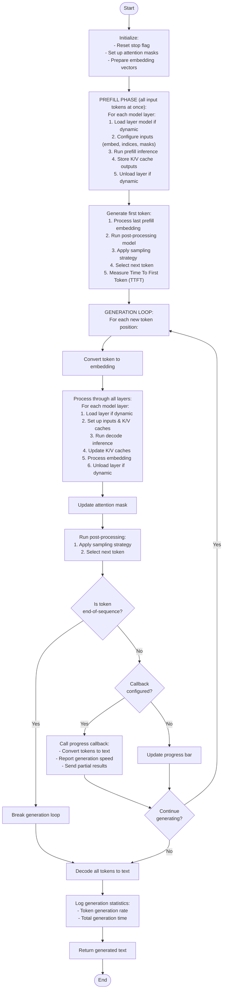
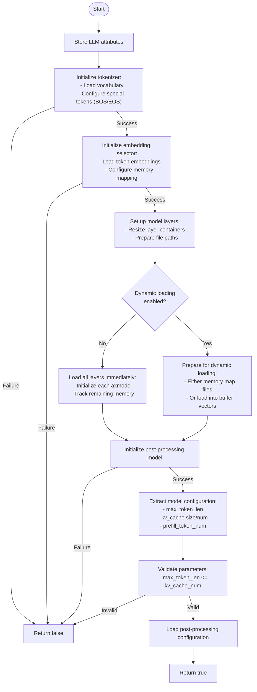
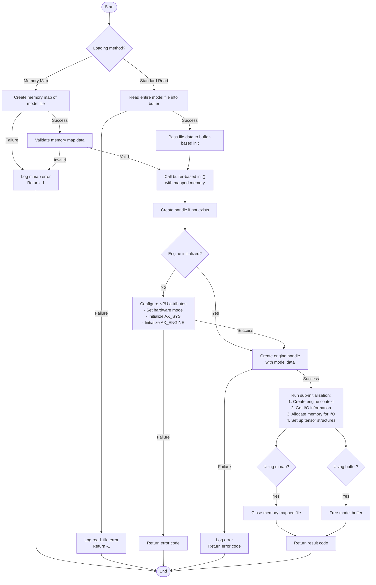
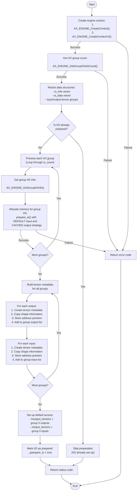
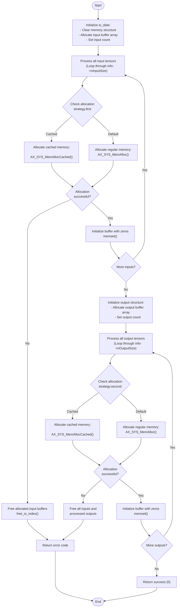

# ax-llm

https://github.com/AXERA-TECH/ax-llm/tree/prefill

# `LLM::Run()` Function Analysis - LLM Text Generation Engine

This function executes a complete language model inference pipeline on the AX650 NPU, generating text from either a prompt string or pre-processed embeddings.

## Key Features

1. **Two-Phase Execution**
   - **Prefill**: Processes all input tokens in parallel for efficiency
   - **Decode**: Generates new tokens one by one in autoregressive fashion

2. **Memory Optimization**
   - Dynamically loads/unloads model layers to reduce memory usage
   - Uses memory mapping for efficient file access
   - Carefully manages K/V caches for attention state

3. **Hardware Acceleration**
   - Uses AX650 NPU for computation
   - Handles cache invalidation for CPU/NPU memory coherence
   - Optimizes memory transfers between host and device

4. **Text Generation Controls**
   - Implements sampling with temperature/top-k/top-p
   - Supports early stopping
   - Detects end-of-sequence tokens

5. **Progress Reporting**
   - Provides real-time generation statistics
   - Supports callback for partial results
   - Measures token generation speed

This implementation represents a complete transformer inference engine optimized for edge hardware, balancing memory constraints with performance requirements.

## `LLM::Init()` Function Analysis

This function initializes a Large Language Model (LLM) for inference on an AX650 hardware accelerator, setting up all necessary components for model execution.

### Key Components

1. **Model Loading**:
   - Either loads all model layers at once or prepares for dynamic loading
   - Supports memory mapping for efficient file access
   - Loads embedding tables for token representation

2. **Memory Optimization**:
   - Dynamic layer loading to reduce memory footprint
   - Memory mapping for efficient file access
   - Tracks remaining memory for debugging

3. **Hardware Configuration**:
   - Sets up models for AX650 acceleration
   - Configures appropriate memory layouts
   - Prepares input/output tensors for hardware

4. **Pipeline Setup**:
   - Tokenizer for text conversion
   - Embedding selector for token embedding
   - Layer processors for transformer operations
   - Post-processor for output generation

This function creates the foundation for the entire inference pipeline, from text input to generated output.

## `ax_runner_ax650::init()` Function Analysis

This function initializes a model/layer for inference on the AX650 NPU hardware accelerator, setting up the necessary resources for model/layer execution.

### Key Components

1. **Flexible Loading Strategies**:
   - Memory mapping for efficient loading of large models
   - Standard file reading for compatibility with all systems

2. **Hardware Initialization**:
   - One-time engine initialization with appropriate NPU settings
   - Handle creation for the specific model

3. **Resource Allocation**:
   - Context creation for model execution
   - Memory allocation for inputs and outputs
   - Tensor organization for consistent access patterns

4. **I/O Management**:
   - Identification of model inputs and outputs
   - Memory allocation with appropriate alignment
   - Organization of tensor shapes and sizes

This function is the entry point for setting up inference on the AX650 hardware, enabling efficient execution of neural network models.

## `sub_init()` Function Analysis

This function initializes the execution context and I/O resources for a model on the AX650 NPU hardware after the model handle has been created.

### Key Components

1. **Context Creation**:
   - Creates execution context for the hardware accelerator
   - Links the context to the model handle

2. **Memory Organization**:
   - Determines the number of I/O groups in the model
   - Allocates appropriately sized containers for all resources

3. **I/O Group Handling**:
   - Gets detailed information about each I/O group
   - Allocates memory for all inputs and outputs
   - Uses DEFAULT strategy for inputs and CACHED strategy for outputs

4. **Tensor Abstraction**:
   - Creates higher-level tensor abstractions with metadata
   - Stores shape information and memory pointers
   - Organizes tensors in convenient access structures

This function completes the initialization started by the `init()` function, preparing all resources needed for model execution on the AX650 hardware.

## `prepare_io()` Function Analysis

This function allocates memory for input and output tensors needed by the AX650 NPU (Neural Processing Unit), setting up the data transfer pathway between the host system and the accelerator.

### Key Features

1. **Hardware-Accelerated Memory Allocation**
   - Allocates memory that's optimized for NPU access
   - Uses physical memory addresses for hardware DMA transfers
   - Maintains virtual addresses for CPU access

2. **Memory Strategy Support**
   - **Cached Memory**: Better for CPU-side processing, requires synchronization
   - **Uncached Memory**: Direct access, avoids cache coherency issues
   - Separate strategies for inputs and outputs

3. **Memory Alignment**
   - Ensures proper alignment (128-byte boundaries) for optimal DMA performance
   - Critical for hardware acceleration efficiency

4. **Error Handling**
   - Properly cleans up resources on allocation failures
   - Returns meaningful error codes when allocation fails

This function is a critical bridge between software and hardware acceleration, setting up the memory structures that allow efficient data transfer between the CPU and the AX650 NPU.