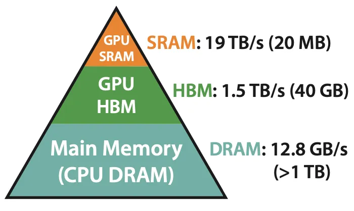
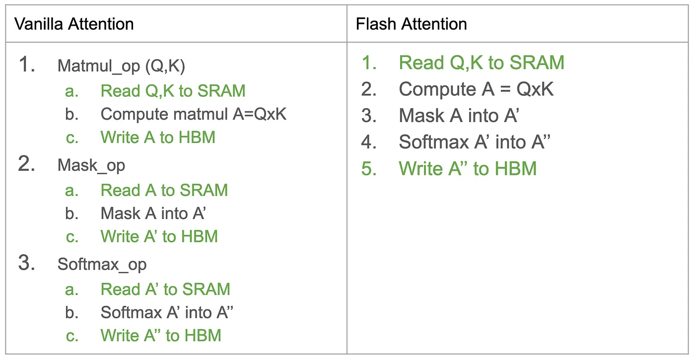
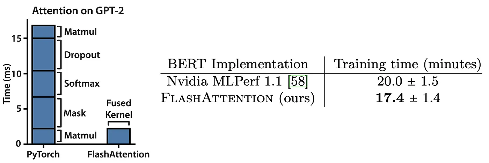
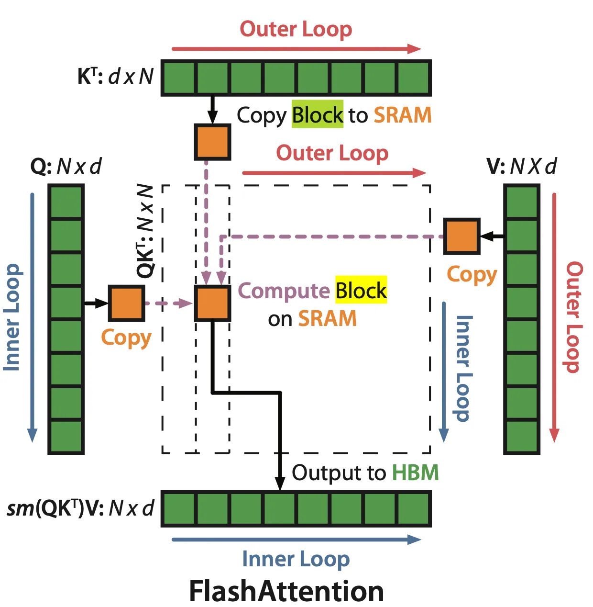
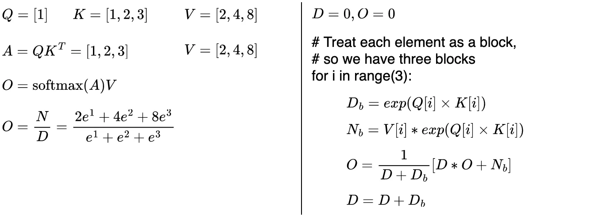
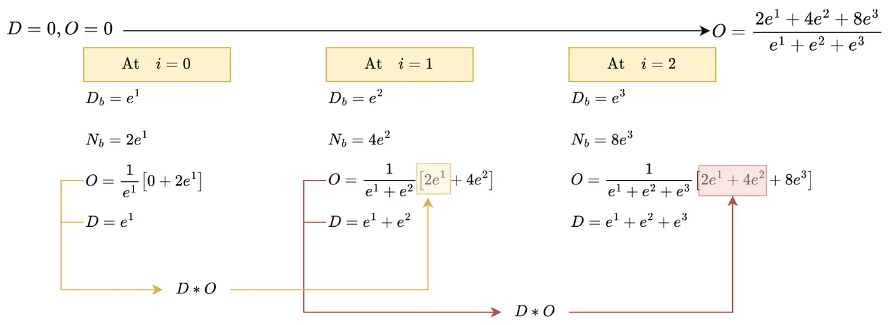

# FlashAttention: Fast and Memory-Efficient Exact Attention with IO-Awareness

Memory Hierarchy with Bandwidth & Memory Size

HBM is used to store tensors (e.g., feature maps/activations), while SRAM is used to perform compute operations on those tensors. For instance, when applying a RELU operation on a tensor x, we 
- (1) move x from HBM (read-op) to SRAM; 
- (2) apply RELU operation on x (compute-op), 
- (3) move x back from SRAM to HBM (write-op).

A comparison between standard attention (left) and flash attention (right). This comparison leverages three operations (matmul, mask, softmax) only. Other operations (e.g., dropout) are omitted for presentation purposes.

By having a fused kernel, the proposed flash-attention reduces the number of memory operations, which translates into a large speed-up during training as shown in the following Fig.

FlashAttention avoids the materialization of the large 𝑁 × 𝑁 attention matrix. In the outer loop (red arrows), FlashAttention loops through blocks of the K and V matrices and loads them to fast on-chip SRAM. In each block, FlashAttention loops over blocks of Q matrix (blue arrows), loading them to SRAM, and writing the output of the attention computation back to HBM.

A Toy Q, K, and V matrixes to illustrate the difference between standard and flash attention. (Left) Standard attention computes and stores the entire attention matrix A to compute the attention output O; (Right) Flash attention operates on individual blocks of attention matrix A (A[i]=Q[i]*K[i]). So there is no need to compute and store the entire attention matrix A.

An illustration for the pseudo-code from Fig. 7 applied on the toy Q, K, V matrixes. Flash attention computes exact softmax operation using summary statistics {D, and O} and without storing the attention matrix A.

## References

* [FlashAttention: Fast and Memory-Efficient Exact Attention with IO-Awareness](https://ahmdtaha.medium.com/flashattention-fast-and-memory-efficient-exact-attention-with-io-awareness-2a0aec52ed3d)
