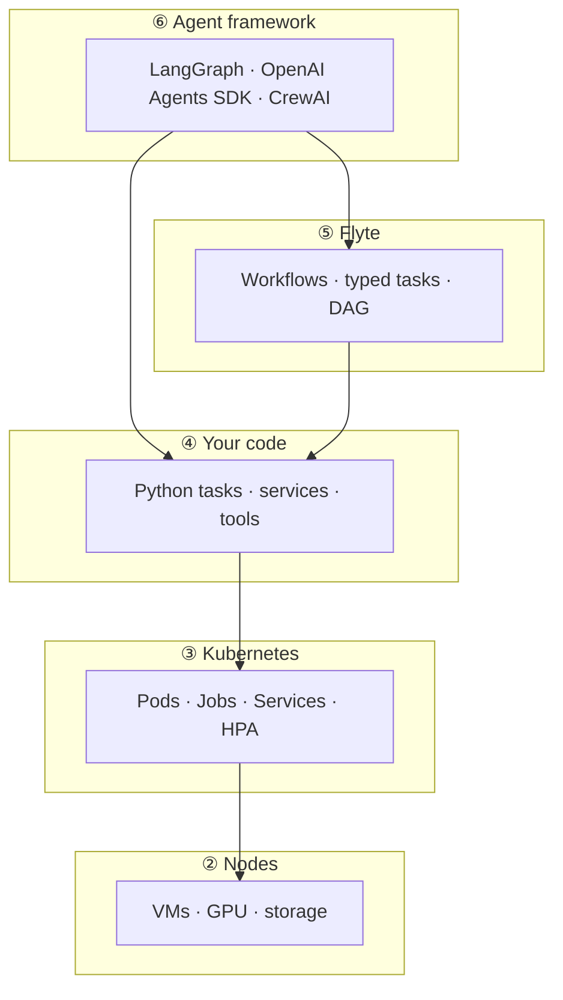
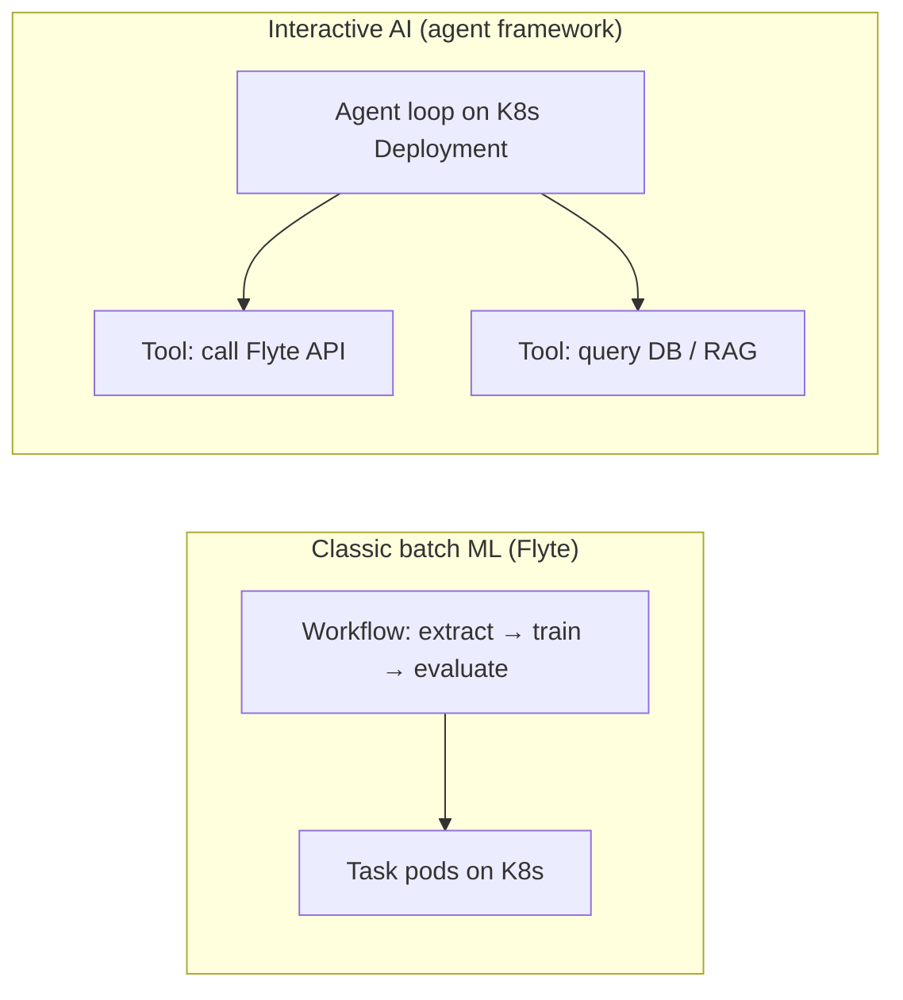
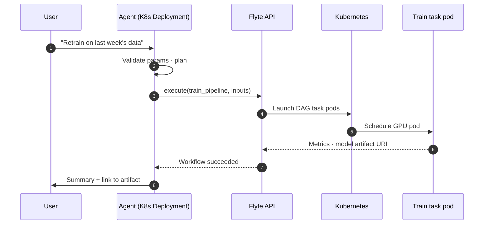

# Kubernetes, Flyte & Agent Frameworks — Ops Layers

**Kubernetes** schedules containers. **Flyte** orchestrates deterministic ML/data **workflows** on K8s. **Agent frameworks** orchestrate non-deterministic **AI control loops** (often also deployed on K8s). They stack — they do not replace each other.

Parent overview: [LLM.md §6 Agent frameworks](./LLM.md#6-agent-frameworks--who-orchestrates-the-loop) · [§6 vs Flyte/K8s](./LLM.md#agent-frameworks-vs-kubernetes-vs-flyte)

---

## Contents

* [Cheat sheet](#cheat-sheet)
* [1. Layer stack](#1-layer-stack)
* [2. Side-by-side](#2-side-by-side)
* [3. How they work together](#3-how-they-work-together)
* [4. Anti-patterns](#4-anti-patterns)
* [5. Related docs](#5-related-docs)

---

## Cheat sheet

| Layer | Product | One question it answers |
|---|---|---|
| **Infrastructure** | **Kubernetes** | *Where* do containers run? (CPU/GPU, restart, network) |
| **Workflow orchestration** | **Flyte** | *In what order* do batch/ML steps run? (DAG, lineage, cache) |
| **Agent logic** | **LangGraph, Agents SDK, CrewAI, …** | *What should the AI do next?* (tools, memory, branching) |

| Metaphor | Kubernetes | Flyte | Agent framework |
|---|---|---|---|
| Role | OS for the cluster | Air traffic control for ML pipelines | Brain for an AI app |
| Graph | None (you deploy workloads) | **Fixed DAG** you define | **Dynamic** (LLM/runtime decides) |
| Typical unit | Pod / Deployment | **Task** in a **Workflow** | Agent turn / tool call |

---

## 1. Layer stack



| | Kubernetes | Flyte | Agent framework |
|---|---|---|---|
| **Runs on** | Cloud / bare metal | **Kubernetes** (executor) | Usually **Kubernetes** (Deployment) |
| **Defines flow?** | You (YAML / operators) | **You** (workflow code) | **LLM + guardrails** (+ your graph) |
| **Determinism** | N/A | **Deterministic** steps | **Non-deterministic** (model + tools) |
| **Best for** | Any containerized workload | ETL, train, batch infer, scheduled pipelines | Chat, research bots, tool-using agents |
| **State** | Pod spec, cluster etcd | Task outputs, execution IDs, lineage | Conversation / graph checkpoints |
| **Cost driver** | Cluster resources (CPU/GPU hours) | Pipeline run duration | **Tokens** + tool calls |

**Flyte note:** Each Flyte **task** is typically materialized as a **K8s pod**. Flyte adds typing, caching, retries, and data lineage on top of raw pod scheduling.

---

## 2. Side-by-side



| Dimension | Flyte | Agent framework |
|---|---|---|
| **Control flow** | Predefined DAG | Emergent (LLM chooses tools/paths) |
| **Latency profile** | Minutes–hours (batch) | Seconds–minutes (interactive) |
| **Data passing** | First-class typed artifacts (S3, etc.) | Context window + tool return values |
| **Human in the loop** | Per-task approvals possible | Native pattern (checkpoints, HITL) |
| **When to prefer** | Repeatable pipelines, compliance, lineage | Reasoning, dialogue, ad-hoc goals |

Neither replaces **Kubernetes** — both are **workloads on** (or triggered via) K8s.

---

## 3. How they work together

### Pattern A — Agent front door, Flyte backend

User asks; agent reasons; agent **triggers a Flyte workflow** for heavy ML; agent summarizes results.



**Agent tool example:** `run_flyte_workflow(name, version, inputs) -> execution_id, outputs`

### Pattern B — Flyte pipeline with a bounded agent step

```
extract → featurize → agent_summarize(report) → publish
```

Use when the agent step is **scoped** (one call, schema output) — not an unbounded multi-turn loop inside Flyte.

### Pattern C — Same cluster, separate services

```
K8s cluster
├── Flyte control plane + workflow executions
├── Agent API (Deployment, always on)
└── Shared: Postgres, object store, vector DB, model serving
```

| Responsibility | Owner |
|---|---|
| GPU scheduling, networking, secrets | **Kubernetes** |
| Nightly ETL, training, batch scoring | **Flyte** |
| Understand request → pick action → explain | **Agent framework** |
| One-off script | K8s **Job** (agent or Flyte can trigger) |

---

## 4. Anti-patterns

| Don't… | Why |
|---|---|
| Implement a 40-step ETL **inside** an agent loop | Fragile, expensive; no Flyte lineage/caching |
| Run Flyte for **every chat message** | Flyte is for batch workflows, not ms-latency chat |
| Expect K8s to orchestrate LLM branching | K8s runs containers; it doesn't understand agent state |
| Replace Flyte with LangGraph for **fixed** ML DAGs | LangGraph can model graphs, but Flyte is built for data/ML ops (types, cache, lineage) |

---

## 5. Related docs

| Doc | Topic |
|---|---|
| [LLM.md §4 Agents](./LLM.md#4-agents--from-one-shot-to-a-control-loop) | Tool loop, MCP |
| [LLM.md §6 Agent frameworks](./LLM.md#6-agent-frameworks--who-orchestrates-the-loop) | LangGraph, CrewAI, … |
| [LLM.md §6 vs Flyte/K8s](./LLM.md#agent-frameworks-vs-kubernetes-vs-flyte) | Short summary in parent doc |
| [Flyte docs](https://docs.flyte.org/) | Workflows, tasks, deployment on K8s |
| [Kubernetes docs](https://kubernetes.io/docs/home/) | Pods, Deployments, Jobs |

---

## Summary

```
Agent framework   →  "What should AI do next?"
Flyte             →  "Run this DAG reliably"
Kubernetes        →  "Run these containers"
```

**Bottom line:** Deploy agents and Flyte **on** Kubernetes. Let **agents** handle interactive reasoning; let **Flyte** handle deterministic ML/data pipelines; expose Flyte (or K8s Jobs) as **agent tools** when the user request needs heavy batch work.
