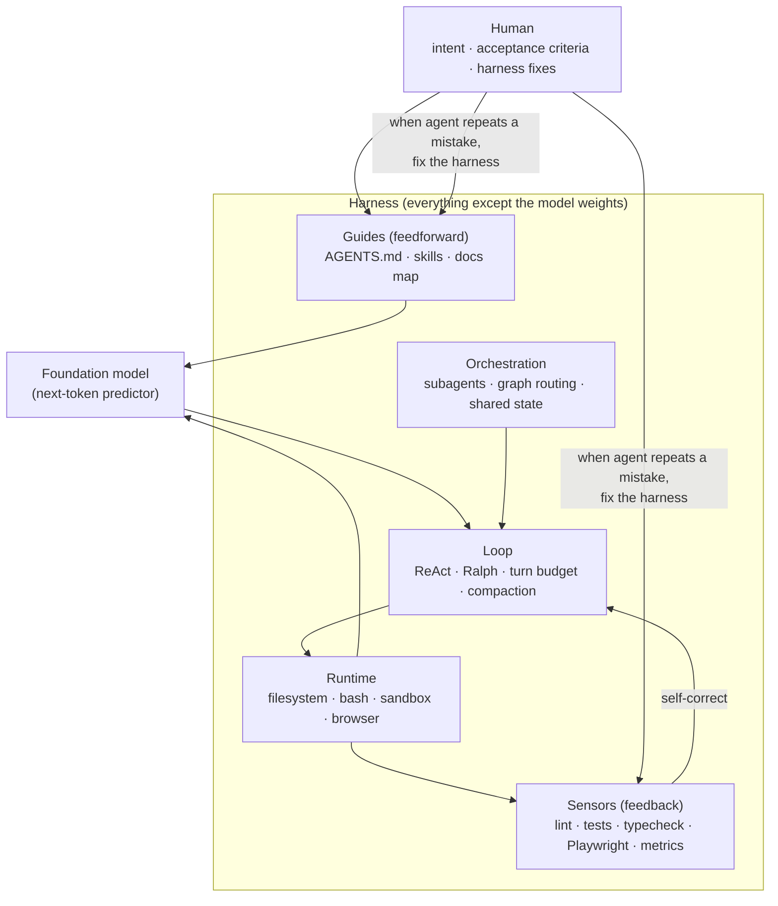
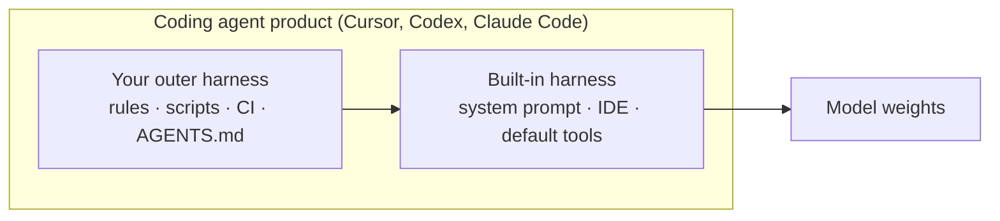
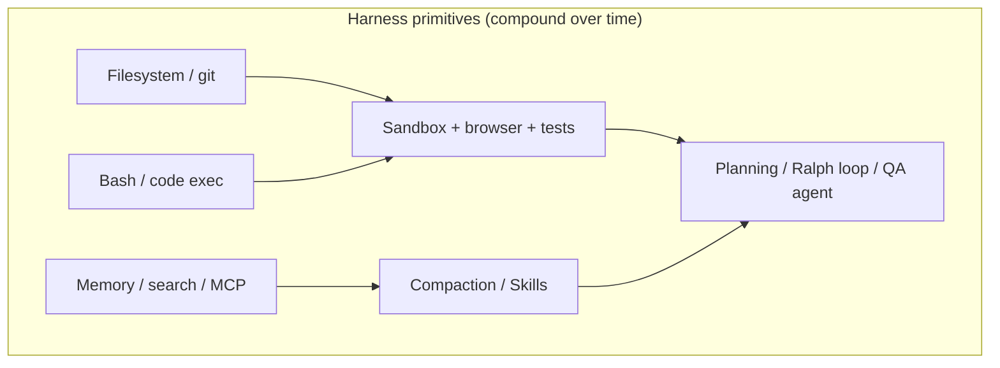
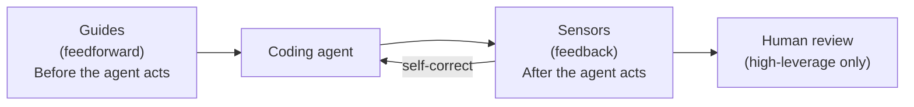
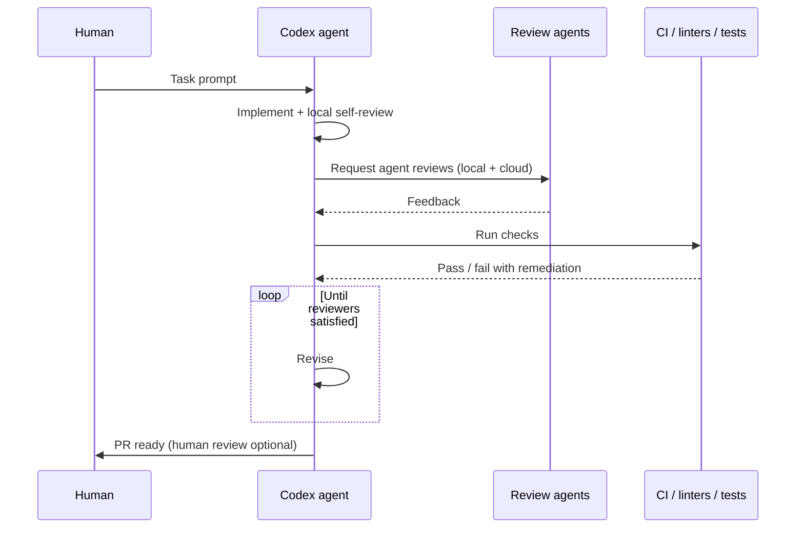
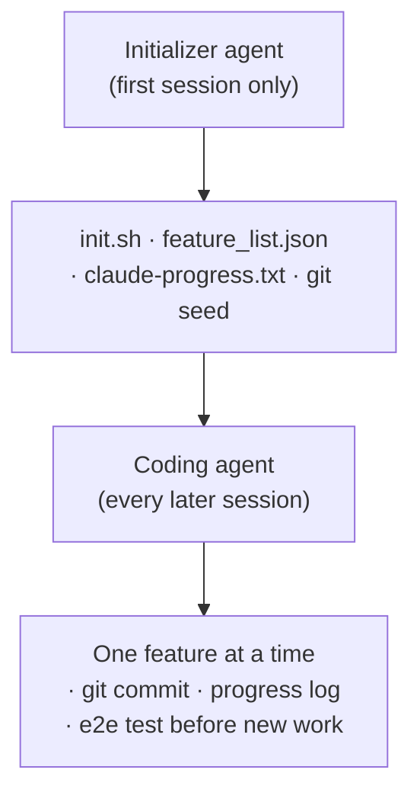
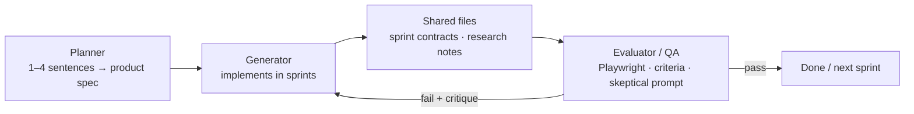
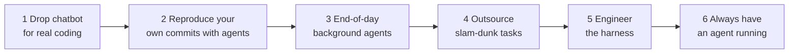
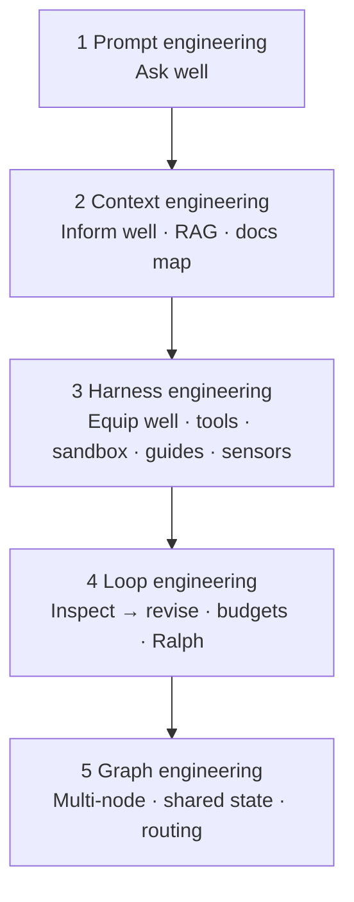

# Harness Engineering — Equipping Agents to Act Reliably

**Harness engineering** is the discipline of building everything **around** the model — tools, environment, docs, loops, and feedback — so a coding agent can **act**, **verify**, and **ship** with minimal babysitting.

Parent overview: [LLM.md §9 AI coding evolution](./LLM.md#9-ai-coding-evolution--from-prompt-to-graph) · [§4 Agents](./LLM.md#4-agents--from-one-shot-to-a-control-loop) · [§8 Coding-agent products](./LLM.md#8-coding-agent-products--cursor-claude-code-codex-) · [Context vs harness in LLM.md](./LLM.md#what-prompt-context-and-harness-mean)

Related: [RAG.md](./RAG.md) (context *retrieval*) · [LLM_Wiki.md](./LLM_Wiki.md) (repo-local knowledge) · [flyte_k8s_ops.md](./flyte_k8s_ops.md) (production orchestration)

---

## Contents

* [Cheat sheet](#cheat-sheet)
* [1. Core definition](#1-core-definition)
* [2. Anatomy of a harness (LangChain)](#2-anatomy-of-a-harness-langchain)
* [3. Guides vs sensors (Martin Fowler)](#3-guides-vs-sensors-martin-fowler)
* [4. OpenAI: agent-first Codex harness](#4-openai-agent-first-codex-harness)
* [5. Anthropic: long-running agent harnesses](#5-anthropic-long-running-agent-harnesses)
* [6. Mitchell Hashimoto: harness in practice](#6-mitchell-hashimoto-harness-in-practice)
* [7. How layers stack](#7-how-layers-stack)
* [8. Practical checklist](#8-practical-checklist)
* [References](#references)

---

## Cheat sheet



| Term | One-liner |
|---|---|
| **Agent** | Model + harness |
| **Harness** | Code, config, tools, env, loops, and controls that are *not* the model |
| **Equip well** | Give the agent a runtime it can read, run, test, and observe |
| **Guide** | Steer *before* action (docs, conventions, skills) |
| **Sensor** | Observe *after* action (lint, tests, browser, metrics) |
| **Harness engineering** | When the agent fails, improve the system — not just the one-off output |

---

## 1. Core definition

LangChain’s framing is the cleanest starting point:

> **Agent = Model + Harness.** If you're not the model, you're the harness.

The model outputs text. By itself it cannot maintain durable state, execute code, browse the live web, or run your test suite. The harness wraps the model with:

- **State** — chat history, files, memory files (`AGENTS.md`, progress logs)
- **Tools** — bash, read/write files, browser, MCP servers, APIs
- **Environment** — sandbox, dependencies, git worktrees, observability stack
- **Orchestration** — loops, subagents, graph routing, compaction
- **Constraints** — permissions, linters, structural tests, review bots



**Martin Fowler** narrows “harness” for coding agents to the **outer harness** you add on top of what the product already ships — the controls that increase confidence in agent output for *your* repo and team.

**OpenAI (2026)** pushes further: on agent-first teams, the engineer’s primary job shifts from **writing code** to **designing environments, specifying intent, and building feedback loops** so agents do reliable work at scale.

---

## 2. Anatomy of a harness (LangChain)

LangChain derives harness components **working backwards** from behaviors we want agents to perform:

| Desired behavior | Harness primitive | Examples |
|---|---|---|
| Durable storage & context offload | **Filesystem + git** | Read/write repo; `AGENTS.md`; progress files; shared agent state |
| General-purpose action without pre-built tools | **Bash + code execution** | Agent writes scripts, installs packages, composes one-off tools |
| Safe execution & verification | **Sandbox + default tooling** | Isolated env; pre-installed runtimes; browser; test runners |
| Continual / up-to-date knowledge | **Memory + search** | `AGENTS.md` injection; web search; MCP (e.g. Context7) |
| Long sessions without context rot | **Compaction + offloading** | Summarize history; spill large tool outputs to files; Skills (progressive disclosure) |
| Long-horizon autonomous work | **Planning + loops + verification** | Plan files; Ralph loops; test hooks; evaluator agents |



**Co-evolution note (LangChain):** Products like Claude Code and Codex **post-train** models with harnesses in the loop (filesystem ops, bash, planning). That improves in-harness performance but can **overfit** to one tool shape — changing patch format or orchestration may hurt until the next model generation. Optimizing the harness for *your* task still yields large gains (e.g. Terminal Bench scores moving Top 30 → Top 5 with harness-only changes).

---

## 3. Guides vs sensors (Martin Fowler)

Fowler’s **coding-agent harness** is a **control system** built from two complementary mechanisms:



### Guides (feedforward)

Steer behavior **proactively** — reduce mistakes before they happen.

| Guide type | Examples |
|---|---|
| Conventions | `AGENTS.md`, Cursor rules, `CLAUDE.md` |
| Skills / playbooks | `SKILL.md` workflows for repeatable tasks |
| Structured docs | Short map → deep `docs/` tree (OpenAI pattern) |
| Architecture rules | Layering diagrams, dependency direction, “parse at boundary” |

### Sensors (feedback)

Observe what the agent **actually produced** and enable **self-correction**.

| Sensor type | Computational (cheap, deterministic) | Inferential (LLM-as-judge) |
|---|---|---|
| Examples | Linters, type checkers, unit tests, structural tests, CI | Code review agent, QA agent with browser |
| Fowler’s tip | Prefer sensor messages the **model can act on** — e.g. lint text that says *how* to fix per project conventions (“positive prompt injection”) |

### Steering rule (Fowler / Hashimoto)

| Occurrence | Action |
|---|---|
| Agent mistake **once** | Fix the output (or let sensors self-correct) |
| Same class of mistake **twice** | **Update the harness** — add a guide or sensor so it cannot recur |

Three regulation lenses Fowler uses to keep “harness” concrete:

| Regulation | Question the harness answers |
|---|---|
| **Maintainability** | Will the repo stay coherent as agents add code? |
| **Fitness** | Does the change meet functional / product requirements? |
| **Behavior** | Does the app *feel* right and work end-to-end for users? |

Behavior verification (UI, UX, subjective quality) remains the **weakest** sensor — often needs browser automation or a **separate evaluator agent** (Anthropic pattern below).

---

## 4. OpenAI: agent-first Codex harness

Source: [Harness engineering: leveraging Codex in an agent-first world](https://openai.com/index/harness-engineering/) (Feb 2026).

OpenAI’s internal experiment: ~**1M lines**, ~**1,500 PRs**, **zero hand-written application code** — humans steer, agents execute.

### Role shift

| Traditional | Agent-first harness team |
|---|---|
| Engineer writes code | Engineer designs **environment + feedback loops** |
| Review every diff | **Agent-to-agent review**; human review optional |
| Ad-hoc docs | Repo is **system of record** — legible to agents |

### Repository as agent map (context engineering *inside* the harness)

OpenAI rejected a monolithic `AGENTS.md` (~1000 lines). Problems: crowds out task context, everything “important,” rots quickly, hard to verify.

**Working pattern:**

```text
AGENTS.md          ← ~100 lines, table of contents only
docs/
  design-docs/
  exec-plans/      ← active + completed plans in-repo
  product-specs/
  references/      ← tool-specific llms.txt packs
  ARCHITECTURE.md, QUALITY_SCORE.md, …
```

Progressive disclosure: small stable entry → pointers → deep sources of truth.

### Mechanical enforcement + entropy control

| Mechanism | Purpose |
|---|---|
| Layered architecture + **dependency rules** | Agents ship fast without breaking structure |
| **Custom linters** (often Codex-generated) | Ban duplicate helpers; inject remediation in errors |
| **Structural tests** | Enforce invariants, not micromanaged implementations |
| **Doc-gardening / garbage-collection agents** | Periodic PRs fixing drift from “golden principles” |
| **Quality grades per domain** | Track architectural / product gaps over time |

### Legibility sensors (beyond static analysis)

Make the **running app** observable to the agent:

| Capability | Why |
|---|---|
| **Per-worktree app instance** | Agent drives an isolated copy of the change |
| **Chrome DevTools Protocol** | DOM snapshots, screenshots, navigation |
| **Ephemeral observability stack** | LogQL / PromQL / traces per task — SLO-style prompts become tractable |
| Long runs (6+ hours) | Agent validates fixes while humans sleep |

### PR loop (Ralph-style)



---

## 5. Anthropic: long-running agent harnesses

Sources:

- [Effective harnesses for long-running agents](https://www.anthropic.com/engineering/effective-harnesses-for-long-running-agents) (Nov 2025)
- [Harness design for long-running application development](https://www.anthropic.com/engineering/harness-design-long-running-apps) (Mar 2026)

### Problem: amnesia across sessions

Each new context window starts with **no memory**. Compaction alone is insufficient — agents **one-shot** large apps, leave half-finished features, or **declare victory too early**.

### Two-agent bootstrap (Anthropic SDK pattern)



| Artifact | Role |
|---|---|
| `feature_list.json` | End-to-end features; all start `passes: false`; agent may only flip status after testing |
| `claude-progress.txt` | Human-readable session log for fast onboarding |
| `init.sh` | Boot dev server; standard smoke test |
| **Git history** | Recover working states; auditable incremental progress |

### Failure modes ↔ harness fixes (Anthropic)

| Failure | Harness response |
|---|---|
| Tries to build entire app at once | **One feature per session**; structured feature list |
| Leaves broken / undocumented state | **Clean-state rule** — merge-quality after each session; smoke test first |
| Marks features done without testing | **Browser automation** (e.g. Puppeteer MCP); explicit e2e verification |
| Forgets how to run the app | **`init.sh`** + documented startup ritual |

### Generator / evaluator split (Mar 2026 — GAN-inspired)

For subjective work (UI design) and for full-stack builds, **separate the agent that builds from the agent that judges**:



| Insight | Detail |
|---|---|
| **Self-evaluation is lenient** | Generators praise their own work; standalone evaluators can be tuned skeptical |
| **Context anxiety** | Some models rush to finish as window fills; **context reset + handoff artifact** beats compaction alone (model-dependent) |
| **Simplification as models improve** | Opus 4.6 needed less sprint scaffolding than 4.5 — **re-stress-test harness assumptions** after each model generation |
| **Evaluator cost/benefit** | Worth it when task is **beyond** what the generator reliably does solo |

Example evaluator finding (game maker harness): route ordering bug (`PUT /frames/reorder` after `/{frame_id}`) caught only by contract-based QA, not by generator self-check.

---

## 6. Mitchell Hashimoto: harness in practice

Source: [My AI Adoption Journey](https://mitchellh.com/writing/my-ai-adoption-journey) (Feb 2026).

Hashimoto describes **harness engineering** as: whenever an agent does a bad thing, **engineer so it never happens again**.

| Form | Example |
|---|---|
| **Implicit prompting** | Extend `AGENTS.md` — each line often traces to one past failure (see Ghostty repo) |
| **Programmed tools** | Screenshot scripts, filtered test runners; document them in `AGENTS.md` |

His adoption path (abbreviated):



| Step | Harness-relevant lesson |
|---|---|
| **2 — Reproduce work** | Break tasks down; separate plan vs execute; **give verification** so agents fix their own mistakes |
| **5 — Harness** | Fast, high-quality **automatic** feedback beats repeated human correction |
| **6 — Always-on agent** | Requires a pipeline of delegable, well-scoped tasks — harness quality enables throughput |

---

## 7. How layers stack

Harness engineering sits in the **equip well** layer but **uses** context engineering and **feeds** loop / graph engineering:



| Layer | Harness connection |
|---|---|
| Prompt | Task description agents receive each turn |
| Context | What the harness **loads** into the window (files, retrieval, compaction) |
| Harness | **This document** — runtime, guides, sensors |
| Loop | Harness **controller** — stop rules, hooks, continuation (Ralph) |
| Graph | Harness **orchestration** — planner / coder / QA nodes ([§6 LLM.md](./LLM.md#6-agent-frameworks--who-orchestrates-the-loop)) |

OpenAI’s `AGENTS.md` + `docs/` pattern is **context engineering implemented as harness infrastructure** — the harness decides *what* gets injected and *when*.

---

## 8. Practical checklist

Use this when standing up or hardening a coding-agent harness:

| # | Item | Guide or sensor? |
|---|---|---|
| 1 | Short **`AGENTS.md` map** → deeper docs | Guide |
| 2 | **One-feature-at-a-time** + progress file + git commits | Loop + guide |
| 3 | **`init.sh`** / documented dev server + smoke test | Sensor (startup) |
| 4 | **Unit + e2e tests** wired into agent loop | Sensor |
| 5 | **Linters / typecheck** with actionable messages | Sensor |
| 6 | **Browser or API verification** for UI tasks | Sensor (behavior) |
| 7 | **Sandbox** + least-privilege tools | Harness runtime |
| 8 | **Compaction / tool-output offload** policy | Context harness |
| 9 | **Separate evaluator** for subjective or high-stakes QA | Sensor (inferential) |
| 10 | **Revisit harness** after each new frontier model | Meta |

**When the agent repeats a mistake:** do not only re-prompt — add a **guide** (doc/rule) or **sensor** (script/CI rule) so the loop self-corrects next time.

---

## References

Primary sources (linked by the user):

| Author | Title | URL |
|---|---|---|
| **OpenAI** | Harness engineering: leveraging Codex in an agent-first world | https://openai.com/index/harness-engineering/ |
| **Anthropic** | Effective harnesses for long-running agents | https://www.anthropic.com/engineering/effective-harnesses-for-long-running-agents |
| **Anthropic** | Harness design for long-running application development | https://www.anthropic.com/engineering/harness-design-long-running-apps |
| **LangChain** | The Anatomy of an Agent Harness | https://www.langchain.com/blog/the-anatomy-of-an-agent-harness |
| **Mitchell Hashimoto** | My AI Adoption Journey | https://mitchellh.com/writing/my-ai-adoption-journey |
| **Martin Fowler** | Harness engineering for coding agent users (supersedes early memo) | https://martinfowler.com/articles/harness-engineering.html |
| **Martin Fowler** | Harness Engineering — first thoughts (redirects to article above) | https://martinfowler.com/articles/exploring-gen-ai/harness-engineering-memo.html |

Related reading in this repo:

| Doc | Link |
|---|---|
| LLM stack overview | [LLM.md](./LLM.md) |
| Context / retrieval | [RAG.md](./RAG.md) |
| Repo-local compounding knowledge | [LLM_Wiki.md](./LLM_Wiki.md) |
| Agent frameworks & graphs | [LLM.md §6](./LLM.md#6-agent-frameworks--who-orchestrates-the-loop) · [flyte_k8s_ops.md](./flyte_k8s_ops.md) |
| Coding-agent products | [LLM.md §8](./LLM.md#8-coding-agent-products--cursor-claude-code-codex-) |
| Prompt → graph evolution | [LLM.md §9](./LLM.md#9-ai-coding-evolution--from-prompt-to-graph) |
