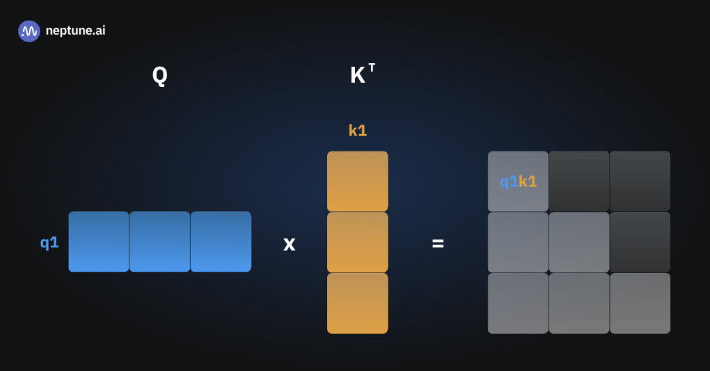
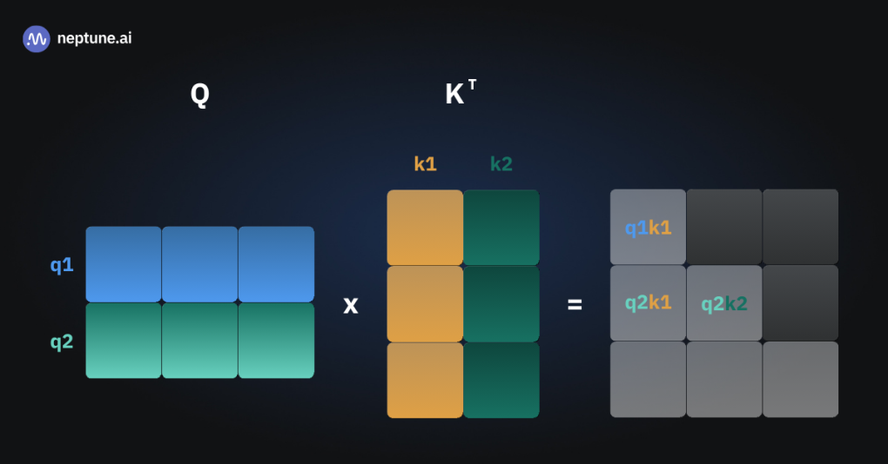
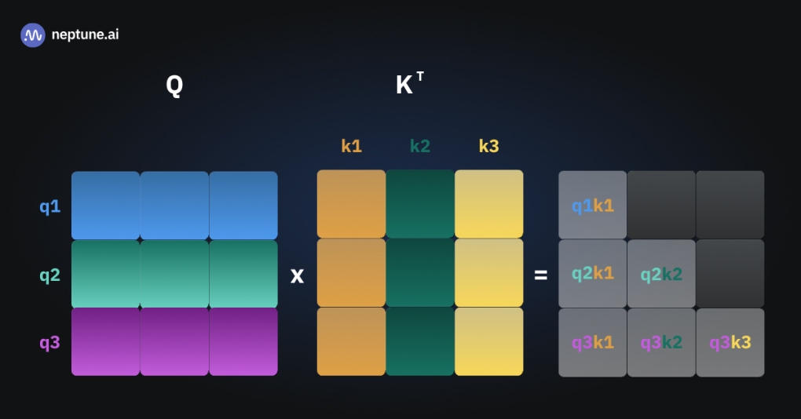
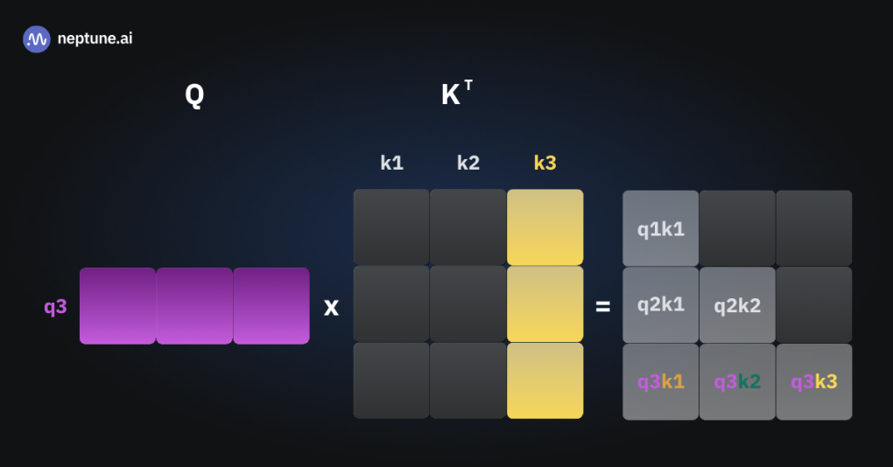
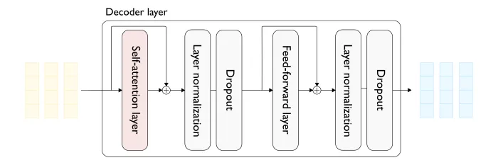
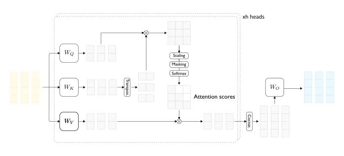
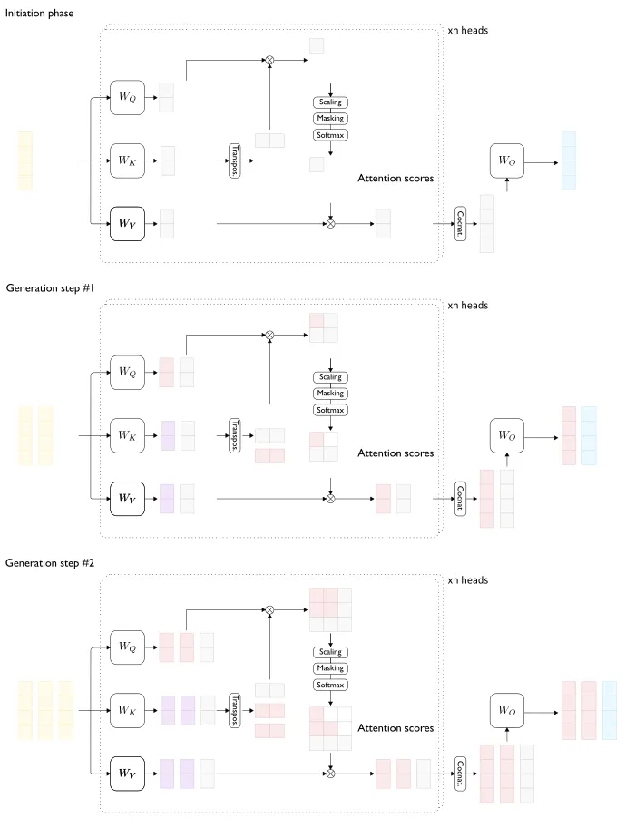
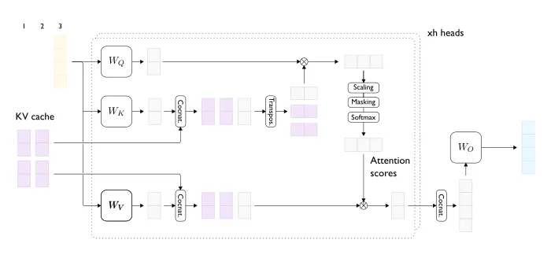

# key-value caching

## Basic Self-attention module

Take a look at this implementation of the basic self-attention module by Sebastian Raschka. The code is part of his book, [“Build A Large Language Model (From Scratch)”](https://github.com/rasbt/LLMs-from-scratch):

```
import torch

class SelfAttention_v2(torch.nn.Module):

    def __init__(self, d_in, d_out, qkv_bias=False):
        super().__init__()
        self.W_query = torch.nn.Linear(d_in, d_out, bias=qkv_bias)
        self.W_key   = torch.nn.Linear(d_in, d_out, bias=qkv_bias)
        self.W_value = torch.nn.Linear(d_in, d_out, bias=qkv_bias)

    def forward(self, x):
        keys = self.W_key(x)
        queries = self.W_query(x)
        values = self.W_value(x)
        
        attn_scores = queries @ keys.T
        attn_weights = torch.softmax(attn_scores / keys.shape[-1]**0.5, dim=-1)

        context_vec = attn_weights @ values
        return context_vec
```

Please see the [notebook](./code/torch_linear.ipynb) for `torch.nn.Linear`.

The important takeaway from this brief explanation of self-attention is that in each forward pass, we multiply keys with the queries and then later with the values.

## Advanced self-attention modules
The variant of self-attention described above is its simplest vanilla form. Today’s largest LLMs typically use slightly modified variations that typically differ from our basic flavor in three ways:

1. Attention is causal.
2. Dropout is used on attention weights.
3. Multi-head attention is used.

Causal attention means that the model should only consider previous tokens in the sequence when predicting the next one, preventing it from “looking ahead” at future words. Going back to our example, “She poured coffee.”, when the model was given the word “She” and is now attempting to predict the next one (“poured” would be correct), it should not compute or have access to attention weights between “coffee” and any other word since the word “coffee” has not appeared in the text yet. Causal attention is typically implemented by masking the “look-ahead” part of the attention weights matrix with zeros.

Next, to reduce overfitting during training, dropout is often applied to the attention weights. This means that some of them are randomly set to zero in each forward pass.

Finally, basic attention can be referred to as single-head, meaning that there is just one set of Wk, Wq, and Wv matrices. An easy way to increase the model’s capacity is to switch to multi-head attention. This boils down to having multiple sets of the W-matrices and, consequently, multiple query, key, and value matrices, as well as multiple context vectors for each input.

Additionally, some transformers implement additional modifications of the attention module with the goal of improving speed or accuracy. Three popular ones are:

- Grouped-query attention: Instead of looking at every input token individually, tokens are grouped, allowing the model to focus on related groups of words at once, which speeds up processing. This is used by Llama 3, Mixtral, and Gemini.
- Paged attention: Attention is broken down into “pages” or chunks of tokens, so the model processes one page at a time, making it faster for very long sequences.
- Sliding-window attention: The model only attends to nearby tokens within a fixed “window” around each token, so it focuses on the local context without needing to look at the entire sequence.

All of these state-of-the-art approaches to implementing self-attention don’t change its basic premise and the fundamental mechanism it relies on: one always needs to multiply the keys by the queries and then later by the values.

## What is key-value caching?

During inference, transformers generate one token at a time. When we prompt the model to start generation by passing “She,” it will produce one word, such as “poured” (for the sake of avoiding distractions, let’s keep assuming one token is one word). Then, we can pass “She poured” to the model, and it produces “coffee.” Next, we pass “She poured coffee” and obtain the end-of-sequence token from the model, indicating that it considers generation to be complete.

This means we have run the forward pass three times, each time multiplying the queries by the keys to obtain the attention scores (the same applies to the later multiplication by the values).

In the first forward pass, there was just one input token (“She”), resulting in just one key vector and one query vector. We multiplied them to obtain the q1k1 attention score.



Next, we passed “She poured” to the model. It now sees two input tokens, so the computation inside our attention module looks as follows:



We did the multiplication to compute three terms, but q1k1 was computed needlessly—we had already calculated it before! This q1k1 element is the same as in the previous forward pass because:

- q1 is calculated as the embedding of the input (“She”) times the Wq matrix,
- k1 is calculated as the embedding of the input (“She”) times the Wk matrix,
- Both the embeddings and the weight matrices are constant at inference time.

Note the grayed-out entries in the attention scores matrix: these are masked with zero to achieve causal attention. For example, the top-right element where q1k3 would have been is not shown to the model as we don’t know the third word (and k3) at the moment of generating the second word.

Finally, here is the illustration of the query-times-keys calculation in our third forward pass.



We make the computational effort to calculate six values, half of which we already know and don’t need to recompute!

You may already have a hunch about what key-value caching is all about. At inference, as we compute the keys (K) and values (V) matrices, we store their elements in the cache. The cache is an auxiliary memory from which high-speed retrieval is possible. As subsequent tokens are generated, we only compute the keys and values for the new tokens.

For example, this is how the third forward pass would look with caching:

 

When processing the third token, we don’t need to recompute the previous token’s attention scores. We can retrieve the keys and values for the first two tokens from the cache, thus saving computation time.

## Key-Value Cache Step by Step

### Detailed view of a transformer decoder layer



### a two-head (self)-attention layer (below) with a input sequence of length 3



### Redundant computations in the attention layer in the generation phase



### Generation step with KV caching enabled



## Self Attention with KV Cache Example Code

Below is an example of implementing a self-attention layer in PyTorch with a key-value (KV) cache, which is commonly used in autoregressive language models (e.g., transformers during inference) to avoid recomputing keys and values for previous tokens. The KV cache stores past keys and values, allowing efficient generation one token at a time. 

[Example code:](./code/self_attention_with_kv_cache.py) 

### Key Features
- Efficiency: The KV cache prevents recomputing keys and values for the entire sequence, reducing complexity from O(n²) to O(n) per step after the first token (where n is the sequence length).
- Causal Attention: Add a mask (e.g., a lower-triangular matrix) to ensure tokens only attend to previous positions.
```python
mask = torch.tril(torch.ones(seq_len, cached_seq_len)).unsqueeze(0).unsqueeze(0)
```
- Flexibility: use_cache can be toggled off for training or full-sequence attention.

### Notes
- Real-World Use: In practice, you’d integrate this into a transformer decoder with multiple layers, position embeddings, and feed-forward networks.
- GQA: To extend this to Grouped Query Attention, group the heads and share K and V within each group (modify the reshaping logic).

### Behavior with use_cache=True
- What Happens:
    - The keys (K) and values (V) computed from the current input x (via W_k(x) and W_v(x)) are concatenated with the existing KV cache (k_cache and v_cache).
    - The cache stores all previous keys and values from earlier tokens in the sequence, and each forward pass appends the new K and V to it along the sequence dimension (dim=2).
    - The attention mechanism then uses the full cached K and V (i.e., k_cache and v_cache), which include keys and values from all tokens seen so far, including the current one.
- Purpose: This mimics autoregressive inference (e.g., text generation), where each new token attends to all previous tokens without recomputing their K and V.
- Resulting Shape:
    - If x is (batch_size, seq_len, d_model):
        - Initial k and v: (batch_size, n_heads, seq_len, d_k).
        - After concatenation, k_cache and v_cache grow to (batch_size, n_heads, cached_seq_len, d_k), where cached_seq_len increases by seq_len each step.

Example
- Step 1: Input x is (2, 1, 64), k and v are (2, 8, 1, 8). Cache starts as (2, 8, 1, 8).
- Step 2: New x is (2, 1, 64), new k and v are (2, 8, 1, 8). Cache becomes (2, 8, 2, 8) after concatenation.
- Attention uses the full (2, 8, 2, 8) cache for K and V.

### Behavior with use_cache=False
- What Happens:
    - The keys (K) and values (V) are only the projections of the current input x (i.e., W_k(x) and W_v(x)).
    - The KV cache (k_cache and v_cache) is not used or updated.
    - The attention mechanism operates solely on the K and V computed from the current input, without any historical context from previous tokens.
- Purpose: This is typical for training or when processing an entire sequence at once (e.g., in a non-autoregressive setting), where all tokens’ K and V are available simultaneously.
- Resulting Shape:
    - If x is (batch_size, seq_len, d_model), then k and v are (batch_size, n_heads, seq_len, d_k).
    - No concatenation occurs, and the cache remains untouched (still None if never initialized).

Example
- Input x is (2, 3, 64) (e.g., 3 tokens at once):
- k and v are (2, 8, 3, 8).
- Attention uses only these (2, 8, 3, 8) for K and V, ignoring any cache.

## References

* [Transformers Key-Value Caching Explained](https://neptune.ai/blog/transformers-key-value-caching)
* [LLM Inference Series: 3. KV caching explained](https://medium.com/@plienhar/llm-inference-series-3-kv-caching-unveiled-048152e461c8)