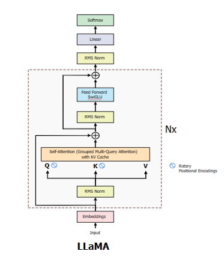
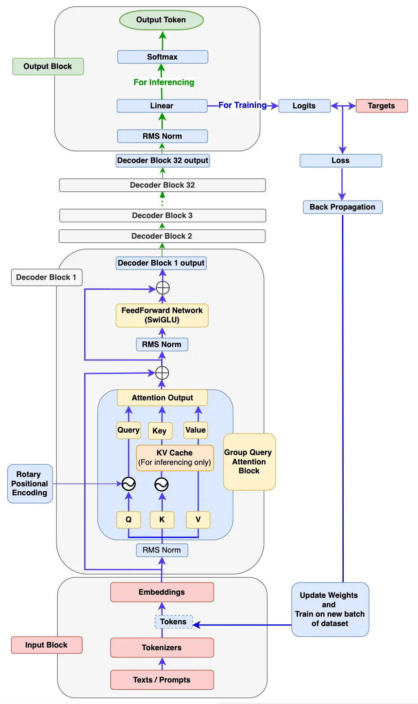
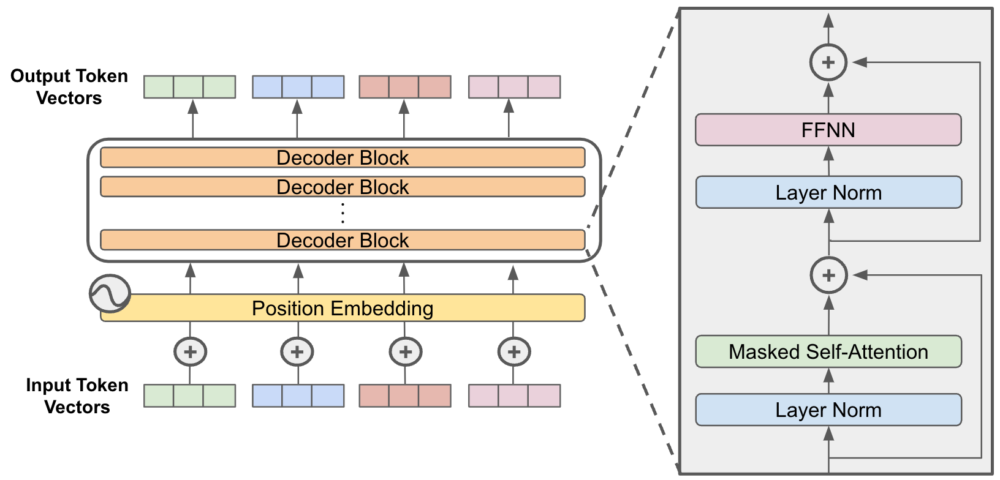
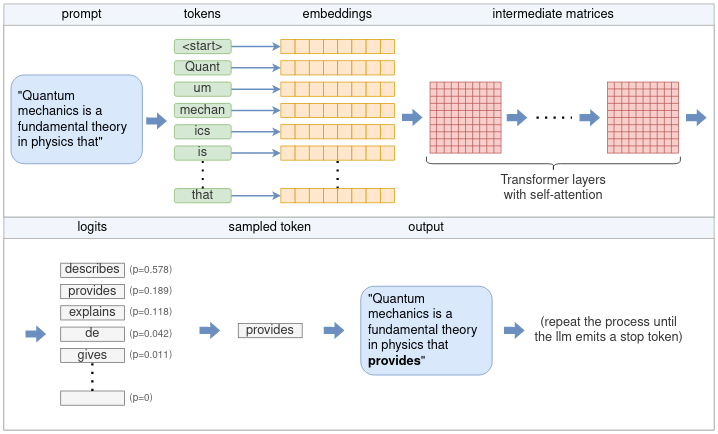
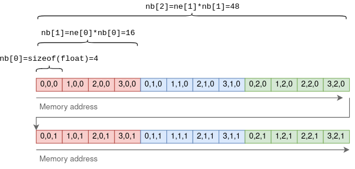

# llama.cpp

- Please check [llama.cpp_flowchart.md](./llama.cpp_flowchart.md) for end-to-end flowchart. 
- Please check [llama.cpp_flowchart_decode.md](llama.cpp_flowchart_decode.md) for more detailed information about `llama_decode` function.
- Please check [llama.cpp_flowchart_decode_graph_build_qwen.md](llama.cpp_flowchart_decode_graph_build_qwen.md) for more detailed information about how to build Qwen graph.

## Llama Archtiecture

Llama.cpp’s backbone is the original Llama models, which is also based on the transformer architecture.


The main difference between the LLaMa architecture and the transformers’:

- <b>Pre-normalization (GPT3):</b> used to improve the training stability by normalizing the input of each transformer sub-layer using the RMSNorm approach instead of normalizing the output.
- <b>SwigGLU activation function (PaLM):</b> the original non-linearity ReLU activation function is replaced by the SwiGLU activation function, which leads to performance improvements.
- <b>Rotary embeddings (GPTNeao):</b> the rotary positional embeddings (RoPE) was added at each layer of the network after removing the absolute positional embeddings.

### Llama3 architecture





### Decoder-Only Architecture

A decoder-only architecture refers to a type of transformer model that consists solely of the decoder component from the original transformer framework, omitting the encoder entirely. This design is tailored for tasks where the model generates output autoregressively—predicting the next token in a sequence based on all previous tokens—without requiring a separate input encoding phase. It’s widely used in large language models (LLMs) like GPT, LLaMA, and DeepSeek-R1.



#### The Original Transformer Context
The transformer architecture, introduced in "Attention is All You Need" (Vaswani et al., 2017), has two main components:

- Encoder: Processes the input sequence (e.g., a sentence to translate) into a contextualized representation. It uses bidirectional self-attention, allowing each token to attend to all tokens in the input.
- Decoder: Generates the output sequence (e.g., the translated sentence) autoregressively, using causal (masked) self-attention to ensure each token only attends to previous positions, plus cross-attention to the encoder’s output.

In tasks like machine translation, the encoder-decoder setup excels because the encoder captures the full input context, and the decoder generates the output step-by-step.

## High Level Flow

At its core, an LLM only predicts a single token each time. The generation of a complete sentence (or more) is achieved by repeatedly applying the LLM model to the same prompt, with the previous output tokens appended to the prompt. This type of model is referred to as an autoregressive model.



Following the diagram, the flow is as follows:

1. The `tokenizer` splits the prompt into a list of `tokens`. Some words may be split into multiple tokens, based on the model’s `vocabulary`. Each token is represented by a unique number.
2. Each numerical token is converted into an `embedding`. An embedding is a vector of fixed size that represents the token in a way that is more efficient for the LLM to process. All the embeddings together form an `embedding` matrix.
3. The embedding matrix serves as the input to the `Transformer`. The Transformer is a neural network that acts as the core of the LLM. The Transformer consists of a chain of multiple layers. Each layer takes an input matrix and performs various mathematical operations on it using the model parameters, the most notable being the self-attention mechanism. The layer’s output is used as the next layer’s input.
4. A final neural network converts the output of the Transformer into `logits`. Each possible next token has a corresponding logit, which represents the probability that the token is the “correct” continuation of the sentence.
5. One of several `sampling` techniques is used to choose the next token from the list of logits.
6. The chosen token is returned as the output. To continue generating tokens, the chosen token is appended to the list of tokens from step (1), and the process is repeated. This can be continued until the desired number of tokens is generated, or the LLM emits a special end-of-stream (EOS) token.

## GGML Context

```
struct ggml_context {
    size_t mem_size;
    void * mem_buffer;
    bool   mem_buffer_owned;
    bool   no_alloc;

    int    n_objects;

    struct ggml_object * objects_begin;
    struct ggml_object * objects_end;
};
```

The `ggml_context` is one of the fundamental structures in GGML (the tensor library used by llama.cpp), serving as a memory manager and allocation system. Based on the code, it has these key responsibilities:

### Memory Management
- Manages a single contiguous memory buffer for tensor allocations
- Controls whether memory is owned by the context or provided externally
- Tracks the total memory size available for allocations

### Object Allocation and Tracking
- Maintains a linked list of all allocated objects (tensors and other structures)
- Keeps pointers to the beginning and end of this list
- Counts the total number of allocated objects

### Allocation Control
- Can disable new allocations with the `no_alloc` flag
- Allows for efficient memory reuse patterns

When using GGML, you typically:
1. Create a context with a defined memory size
2. Allocate tensors and other objects within that context
3. Perform operations using those tensors
4. Free the entire context at once, which releases all allocated objects

This approach provides more efficient memory usage than allocating each tensor separately, and simplifies memory management in tensor computation systems.

## Tensors

It is important to distinguish between two types of tensors. 
- There are tensors that hold actual data, containing a multi-dimensional array of numbers. 
- On the other hand, there are tensors that only represent the result of a computation between one or more other tensors, and do not hold data until actually computed.

```
    // ggml.h
    // n-dimensional tensor
    struct ggml_tensor {
        enum ggml_type type;

        struct ggml_backend_buffer * buffer;

        int64_t ne[GGML_MAX_DIMS]; // number of elements
        size_t  nb[GGML_MAX_DIMS]; // stride in bytes:
                                   // nb[0] = ggml_type_size(type)
                                   // nb[1] = nb[0]   * (ne[0] / ggml_blck_size(type)) + padding
                                   // nb[i] = nb[i-1] * ne[i-1]

        // compute data
        enum ggml_op op;

        // op params - allocated as int32_t for alignment
        int32_t op_params[GGML_MAX_OP_PARAMS / sizeof(int32_t)];

        int32_t flags;

        struct ggml_tensor * src[GGML_MAX_SRC];

        // source tensor and offset for views
        struct ggml_tensor * view_src;
        size_t               view_offs;

        void * data;

        char name[GGML_MAX_NAME];

        void * extra; // extra things e.g. for ggml-cuda.cu

        char padding[8];
    };
```

`nb` is a bit more sophisticated. It contains the stride: the number of bytes between consequetive elements in each dimension. In the first dimension this will be the size of the primitive element. In the second dimension it will be the row size times the size of an element, and so on. For example, for a 4x3x2 tensor:



The purpose of using a stride is to allow certain tensor operations to be performed without copying any data. For example, the transpose operation on a two-dimensional that turns rows into columns can be carried out by just flipping `ne` and `nb` and pointing to the same underlying data:

```
// ggml.c
// ggml_transpose

struct ggml_tensor * ggml_transpose(
        struct ggml_context * ctx,
        struct ggml_tensor  * a) {
    struct ggml_tensor * result = ggml_view_tensor(ctx, a);
    ggml_format_name(result, "%s (transposed)", a->name);

    result->ne[0] = a->ne[1];
    result->ne[1] = a->ne[0];

    result->nb[0] = a->nb[1];
    result->nb[1] = a->nb[0];

    result->op     = GGML_OP_TRANSPOSE;
    result->src[0] = a;

    return result;
}
```

In the above function, <b>result</b> is a new tensor initialized to point to the same multi-dimensional array of numbers as the source tensor <b>a</b>. By exchanging the dimensions in <b>ne</b> and the strides in <b>nb</b>, it performs the transpose operation without copying any data.

### Tensor operations and views

As mentioned before, some tensors hold data, while others represent the theoretical result of an operation between other tensors. Going back to `struct ggml_tensor`:

- `op` may be any supported operation between tensors. Setting it to `GGML_OP_NONE` marks that the tensor holds data. Other values can mark an operation. For example, `GGML_OP_MUL_MAT` means that this tensor does not hold data, but only represents the result of matrix multiplication between two other tensors.
- `src` is an array of pointers to the tensors between which the operation is to be taken. For example, if `op == GGML_OP_MUL_MAT`, then `src` will contain pointers to the two tensors to be multiplied. If `op == GGML_OP_NONE`, then `src` will be empty.
- `data` points to the actual tensor’s data, or `NULL` if this tensor is an operation. It may also point to another tensor’s data, and then it’s known as a view. For example, in the `ggml_transpose()` function above, the resulting tensor is a view of the original, just with flipped dimensions and strides. `data` points to the same location in memory.

The matrix multiplication function illustrates these concepts well:

```
// ggml.c
struct ggml_tensor * ggml_mul_mat(
        struct ggml_context * ctx,
        struct ggml_tensor  * a,
        struct ggml_tensor  * b) {
    GGML_ASSERT(ggml_can_mul_mat(a, b));
    GGML_ASSERT(!ggml_is_transposed(a));

    const int64_t ne[4] = { a->ne[1], b->ne[1], b->ne[2], b->ne[3] };
    struct ggml_tensor * result = ggml_new_tensor(ctx, GGML_TYPE_F32, 4, ne);

    result->op     = GGML_OP_MUL_MAT;
    result->src[0] = a;
    result->src[1] = b;

    return result;
}
```

In the above function, `result` does not contain any data. It is merely a representation of the theoretical result of multiplying `a` and `b`.

### Computing tensors
The `ggml_mul_mat()` function above, or any other tensor operation, does not calculate anything but just prepares the tensors for the operation. A different way to look at it is that it builds up a computation graph where each tensor operation is a node, and the operation’s sources are the node’s children. In the matrix multiplication scenario, the graph has a parent node with operation `GGML_OP_MUL_MAT`, along with two children.

The computation graph is run using `ggml_graph_compute()`, which runs `ggml_compute_forward()` on each node in a depth-first order. `ggml_compute_forward()` does the heavy lifting of calculations. It performs the mathetmatical operation and fills the tensor’s data pointer with the result.

|function| |source location|
|---|---|---|
|ggml_graph_compute() ||ggml_cpu.c|
|ggml_metal_graph_compute() || ggml_metal.m|
|ggml_compute_forward()  | |ggml_cpu.c|
||ggml_compute_forward_soft_max|ggml_cpu.c|
|ggml_cuda_compute_forward() || ggml-cuda.cu|
||ggml_cuda_op_soft_max|softmax.cu|


## Computation Acceleration

|Backend|Supported Platforms|Notes|
|---|---|---|
|CPU|All|mutli-threading and SIMD(AVX, AVX2, AVX512, AMX)|
|CUDA|NVIDIA GPUs|Compute Unified Device Architecture|
|HIP|AMD GPUs|Heterogeneous-Interface Parallel Programming|
|Metal|Apple GPUs|
|CANN|Huawei Ascend AI processors|Compute Architecture for Neural Networks|
|MUSA|Moore Threads MTT GPU|Multiverse Unified System Architecture|
|Vulkan|Cross-platform (NVIDIA, AMD, Apple, Intel) |Low-level API for rendering and compute|
| |Cross-platform (Windows, Linux, MacOS, Android) |On platform like Android, it is the de facto standard for GPU computing|
|Kompute|High-leve framework for <b>Vulkan</b>-based GPU computing|
|OpenCL|Cross-platform (NVIDIA, AMD, Intel) |Enables acceleration on devices that don't support CUDA or Metal|
|SYCL|C++ for Heterogeneous computing (Intel GPUs)|high-level programming model builds on the foundation of <b>OpenCL</b>|
|BLAS|Cross-platform math libraries for matrix operations|Basic Linear Algebra Subprograms|
| | Intel MKL: Intel Math Kernel Library| using AVX/AVX2/AVX512 instructions for SIMD|
| | OpenBLAS: Optimized BLAS library| Open-source, optimized for various CPUs (Intel, AMD, ARM)|
| | cuBLAS: NVIDIA CUDA BLAS library| NVIDIA GPUs|
| | rocBLAS: AMD ROC BLAS library| AMD GPUs using the HIP platform|
|BLIS|BLAS-like library for high-performance dense linear algebra|
|RPC|Distributed or remote computing|remote procedure call|

### AVX/AVX2/AVX-512/AMX Comparison Table

- Advanced Vector Extensions (AVX) instruction set
- Advanced Matrix Extensions (AMX). Intel-specific extension. 
- AMD CPUs also support AVX/AVX2/AVX-512

|Feature|	AVX|	AVX2|	AVX-512|	AMX|
|---|---|---|---|---|
|Bit-width|	256 bits|	256 bits|	512 bits|	Tile-based (Matrix ops)|
|Registers|	YMM|	YMM|	ZMM|	Tile registers|
|Focus|	Floating-point|	Floating-point & integers|	Vector ops, AI, HPC|	Matrix multiplication|
|Performance|	Moderate|	Higher|	Very high|	Specialized for AI/ML|
|Applications|	Multimedia, HPC|	HPC, ML, video encoding|	AI, scientific computing|	AI, deep learning|

#### Neon Instruction Set

The `NEON instruction set` is an advanced SIMD (Single Instruction, Multiple Data) extension to the ARM architecture, designed to accelerate parallel processing tasks like multimedia, signal processing, and machine learning on ARM-based CPUs. Introduced with ARMv7-A in 2005 and enhanced in later versions (e.g., ARMv8-A in the M3 chip), NEON is ARM’s equivalent to Intel’s AVX or SSE, enabling CPUs to perform the same operation on multiple data elements simultaneously.

Example:
```
#include <arm_neon.h>
#include <stdio.h>

void addFloats(float* a, float* b, float* result, int n) {
    for (int i = 0; i < n; i += 4) {
        // Load 4 floats from each array into 128-bit registers
        float32x4_t va = vld1q_f32(&a[i]);
        float32x4_t vb = vld1q_f32(&b[i]);
        // Add them in parallel
        float32x4_t vr = vaddq_f32(va, vb);
        // Store result
        vst1q_f32(&result[i], vr);
    }
}

int main() {
    float a[4] = {1.0, 2.0, 3.0, 4.0};
    float b[4] = {5.0, 6.0, 7.0, 8.0};
    float result[4];
    addFloats(a, b, result, 4);
    for (int i = 0; i < 4; i++) {
        printf("%f ", result[i]); // Outputs: 6.0 8.0 10.0 12.0
    }
    return 0;
}
```

- Compile: `gcc -o neon_add neon_add.c -march=armv8-a+simd` (on ARM64).
- How It Works: `vld1q_f32` loads 4 floats, `vaddq_f32` adds them, and  `vst1q_f32` stores the result—all in one cycle per vector.

#### NEON vs. AVX

- NEON: Leaner, power-efficient, ubiquitous in ARM (phones, Apple Silicon).
- AVX: Wider registers, more complex ops, higher power draw.

|Feature|	NEON (ARM)	| AVX (Intel)|
|---|---|---|
|Register Size|	128-bit	|256-bit (AVX), 512-bit (AVX-512)
|Introduced	|2005 (ARMv7-A)|	2011 (Sandy Bridge)
|Scope	|ARM CPUs (e.g., M3)|	x86 CPUs (e.g., i9)
|Instructions|	Broad SIMD ops	|Broader + FMA, AVX-512 adds more
|Use Case|	Mobile, embedded, ML	|Desktop, server, HPC

### Key Differences Between Metal and CoreML

|Feature|	Metal|	CoreML|
|---|---|---|
|Purpose|	High-performance graphics and GPU compute API.|	Framework for integrating and running machine learning models.|
|Focus Area|	Rendering and compute tasks for games, AR, and GPU workloads.|	On-device inference for machine learning models.|
|Target Developer|	Game developers, graphics/rendering experts, GPU compute developers.|	App developers incorporating AI/ML features.|
|Device Usage|	Optimizes GPU for graphics or parallel computations.|	Leverages CPU, GPU, and Neural Engine for ML inference.|
|Example Application|	High-performance 3D games, ARKit apps, or video editing.|	Object detection, text classification, or image processing in apps.

#### MLX
- MLX is a NumPy-like array framework designed for efficient and flexible machine learning on Apple silicon, brought to you by Apple machine learning research.

- The Python API closely follows NumPy with a few exceptions. MLX also has a fully featured C++ API which closely follows the Python API.

### iOS Inference Framework Comparison Table

|Feature|	CoreML|	TensorFlow Lite (TFLite)|	ONNX Runtime|
|---|---|---|---|
|Native to iOS|	Yes|	No|	No|
|Cross-Platform|	No|	Yes|	Yes|
|Performance on iOS|	Excellent (fully optimized).|	Good (with Core ML/GPU delegates).|	Moderate (less optimized).|
|Ease of Integration|	Best for iOS developers.|	Requires TensorFlow Lite APIs.|	Requires ONNX Runtime setup.|
|Hardware Utilization|	Fully optimized (Neural Engine, GPU).|	Can use GPU/CoreML delegate.|	Less efficient without conversion.|
|Model Format Support|	Only CoreML format.|	TensorFlow and TFLite formats.|	Any framework supporting ONNX.|
|Workflow Simplicity|	Simple (Xcode and Swift integration).|	Moderate (requires extra setup).|	More complex (manual tuning needed).|

### Android Inference Framework Comparison Table

|Feature|	TensorFlow Lite|	ONNX Runtime|	ExecuTorch|	Others (MNN/NCNN)|
|---|---|---|---|---|
|Optimization for Android|	Excellent (designed for mobile).|	Good (general-purpose, NNAPI support).|	Moderate (not as optimized).|	Excellent (mobile-first frameworks).|
|Hardware Acceleration|	NNAPI, GPU Delegate, Hexagon DSP.|	NNAPI, GPU Delegate.|	NNAPI, GPU Delegate.|	NNAPI, GPU (varies by framework).|
|Model Compatibility|	Best with TensorFlow-trained models.|	Supports PyTorch, TensorFlow, etc.|	Best with PyTorch-trained models.|	Limited (specific use cases).|
|Ease of Use|	Simple for TensorFlow users.|	Requires ONNX conversion.|	Simple for PyTorch users.|	Moderate to complex.|
|Cross-Platform|	Yes (Android, iOS, embedded).|	Yes (Android, iOS, Linux, Windows).|	Yes (Android, iOS, Linux, Mac, embedded).|	Primarily Android (some iOS support).|
|Binary Size|	Smallest.|	Moderate.|	Larger.|	Very small.|

- MNN (Alibaba)
- NCNN (Tencent)

## Build a project outside of the source tree
- Please see this [example](https://github.com/ggerganov/llama.cpp/tree/master/examples/simple-cmake-pkg)

## What is a layer?

### Transformer Architecture Basics
LLaMA (Large Language Model Meta AI) follows the standard transformer architecture, which consists of multiple stacked "layers." Each layer in a transformer model is typically a <b>transformer block</b> that processes input data sequentially. For LLaMA, which is a decoder-only model (like GPT), these layers are responsible for generating or understanding text by applying a series of computations.

A single transformer layer (or block) in LLaMA generally includes:

- <b>Multi-Head Self-Attention</b>: This mechanism allows the model to weigh the importance of different tokens in the input sequence relative to each other.
- <b>Feed-Forward Neural Network (FFN)</b>: A fully connected network applied independently to each token’s representation, typically with a hidden size larger than the input/output size (e.g., 4x the model dimension in LLaMA).
- <b>Normalization Layers</b>: Layer normalization (e.g., RMSNorm in LLaMA) is applied before or after the attention and FFN components to stabilize training and inference.
- <b>Residual Connections</b>: These add the input of the layer to its output, helping with gradient flow during training.

Each layer transforms the input embeddings (or hidden states) and passes them to the next layer, progressively refining the representation of the text.

### Layers in llama.cpp
llama.cpp is a C++ implementation of LLaMA designed for efficient inference on CPUs (and optionally GPUs via extensions). In this codebase, a "layer" corresponds to one of these transformer blocks, and the model is composed of multiple such layers stacked together. The exact number of layers depends on the specific LLaMA model variant (e.g., 7B, 13B, 70B), with larger models having more layers.

For example:

- LLaMA 7B: 32 layers
- LLaMA 13B: 40 layers
- LLaMA 70B: 80 layers

In the llama.cpp source code (e.g., llama.h or llama.cpp), layers are represented structurally. The model weights are organized by layer, with each layer containing weights for:

- Self-attention (query, key, value, and output projection matrices: wq, wk, wv, wo).
- Feed-forward network (e.g., w1, w2, w3 for the SwiGLU activation in LLaMA).
- Normalization parameters (e.g., RMSNorm weights).
When llama.cpp performs inference, it processes the input token embeddings through each layer sequentially, applying the attention and FFN computations as defined by the transformer block.

### What Does "Layer" Mean Practically in llama.cpp?

- <b>Computationally</b>: A layer is a unit of processing. During inference, llama.cpp iterates over all layers (e.g., 32 times for LLaMA 7B) to compute the output for a given input.
- <b>Memory</b>: Each layer has associated weights, and the total memory footprint of the model scales with the number of layers and their size (determined by the hidden dimension and number of attention heads).
- <b>Quantization</b>: When quantizing models in llama.cpp (e.g., to 4-bit or 8-bit precision), the weights of each layer are quantized individually, which can affect performance and memory usage.
- <b>Parallelism</b>: Features like layer offloading (to GPU) or splitting layers across multiple threads rely on treating layers as discrete units.

### Example in Context
If you see a log or configuration in llama.cpp mentioning "layers," it might refer to:

- How many transformer blocks are loaded into memory (e.g., --n-layers for offloading).
- The progress of computation (e.g., "processing layer 10 of 32").

### Summary
In llama.cpp, a layer is a single transformer block in the LLaMA model, consisting of self-attention, a feed-forward network, and normalization, with associated weights. The model’s depth (number of layers) defines its capacity, and llama.cpp processes these layers iteratively during inference. 

## Layer Offloading

Llama.cpp allows you to specify how many model layers (e.g., transformer layers in an LLM) are offloaded to the GPU, with the remainder staying on the CPU.

- Default Behavior: Without GPU support compiled in or if `-ngl` is set to 0, all computations run on the CPU using optimized tensor operations (via the GGML library). With GPU support enabled, you can offload some or all layers to the GPU, depending on VRAM capacity and your settings.

### How Layers Are Distributed
1. User Specification:

    - You explicitly set the number of layers to offload. For example, `-ngl 32` offloads 32 layers to the GPU, and any additional layers stay on the CPU.
    - If you set `-ngl` higher than the model’s total layers (e.g., `-ngl 100` for a 33-layer model like LLaMA 7B), it offloads all layers to the GPU, assuming VRAM permits.
    - Setting `-ngl -1` in some contexts (like Python bindings) attempts to offload all layers automatically.

2. Model Architecture:

    - LLMs like LLaMA consist of stacked transformer layers (e.g., 32 for 7B, 40 for 13B). Llama.cpp offloads these layers sequentially from the bottom up. So, if you offload 20 out of 32 layers, the first 20 run on the GPU, and the last 12 run on the CPU.
    - Key-value caches (used for context in generation) can also be offloaded alongside layers, increasing VRAM usage.

3. VRAM Management:

    - The GPU handles the offloaded layers’ computations and stores their weights in VRAM. If VRAM is insufficient, you’ll encounter errors unless you reduce -ngl to fit within your GPU’s memory (e.g., a 7B model in 4-bit quantization needs ~6-8 GB VRAM fully offloaded).
    - Remaining layers and their weights stay in system RAM, processed by the CPU.

4. Backend Integration:

    - CUDA (NVIDIA GPUs): With CUDA support compiled (e.g., `make LLAMA_CUBLAS=1`), llama.cpp uses NVIDIA’s cuBLAS library for GPU acceleration. Layers offloaded to the GPU benefit from parallel matrix operations.
    - Metal (Apple GPUs): On macOS, Metal support offloads layers to the integrated GPU, optimized for Apple Silicon.
    - SYCL (Intel GPUs): For Intel GPUs, SYCL enables layer offloading with similar logic.
    - The CPU uses GGML’s SIMD-optimized routines for any layers not offloaded.

Performance Implications

- Full GPU Offload: Offloading all layers (e.g., -ngl 32 for a 7B model with enough VRAM) maximizes GPU parallelism, yielding the fastest inference (e.g., 20-50 tokens/s on an NVIDIA RTX 3090 with a 7B model in Q4).
- Partial Offload: Splitting layers (e.g., 20 on GPU, 12 on CPU) balances VRAM constraints but introduces a performance hit due to data transfer between GPU and CPU RAM over the PCIe bus. This hybrid mode is slower than full GPU or full CPU but allows larger models on limited VRAM (e.g., 13B on a 12 GB GPU).
- CPU Only: With no offload (`-ngl 0`), inference relies solely on CPU cores, typically achieving 5-15 tokens/s on modern CPUs (e.g., Ryzen 9) for a 7B model.

Multi-GPU Support

For systems with multiple GPUs, llama.cpp can split layers across them using the `--split-mode` and `--tensor-split` options:

- --split-mode layer (default): Distributes layers across GPUs (e.g., 16 layers per GPU on two GPUs for a 32-layer model).
- --split-mode row: Splits tensor rows across GPUs, less common for layer-based models.
- --tensor-split 0.5,0.5: Allocates 50% of the workload to each of two GPUs (adjust fractions based on GPU count and VRAM).

## llama.swiftui example

### Using the old llama.cpp

- Exactly follow the `Instruction` on this [link](https://github.com/ggerganov/llama.cpp/discussions/4508)

- Clone the project
```
    git clone https://github.com/ggerganov/llama.cpp
    git checkout 0e18b2e
```
- Open the examples/llama.swiftui with Xcode
- Enable Release build

### Using the latest llama.cpp

- Please refer to [here](https://github.com/ggerganov/llama.cpp/issues/11578) on how to setup.

1. Compile the library first:

```
cmake -DCMAKE_SYSTEM_NAME=iOS \
      -DCMAKE_OSX_ARCHITECTURES=arm64 \
      -DCMAKE_BUILD_TYPE=Release \
      -DLLAMA_BUILD_TESTS=OFF \
      -DLLAMA_BUILD_EXAMPLES=OFF \
      -DGGML_METAL=OFF \
      -DSIMD_SUM_F32_DISABLED=ON \
      -S . \
      -B build

cmake --build build --config Release 
```

2. Select all `.dylib` files from the newly created build directory. Open Xcode, and put them all under the `Frameworks` folder.

3. In `General > Frameworks, Libraries and Embedded Content`, make sure all of them are flagged as <b>Embedded & Sign</b>.

4. Update Header Search Paths in your project settings:
    - Click on your project in Xcode navigator
    - Select the llama.swiftui target
    - Go to "Build Settings" tab
    - Search for "Header Search Paths"
    - Add these paths:
    ```
    $(SRCROOT)/../../include
    $(SRCROOT)/../../ggml/include
    ```

## References
- [Llama.cpp Tutorial: A Complete Guide to Efficient LLM Inference and Implementation](https://www.datacamp.com/tutorial/llama-cpp-tutorial)
- [Understanding how LLM inference works with llama.cpp](https://www.omrimallis.com/posts/understanding-how-llm-inference-works-with-llama-cpp/)