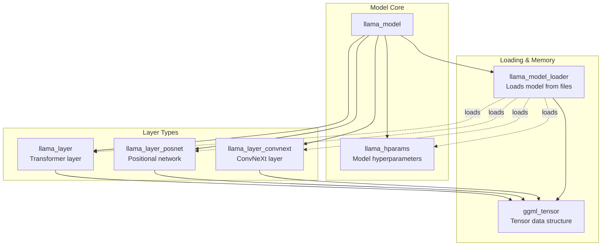

# llama.cpp

## Llama.cpp Archtiecture

Llama.cpp’s backbone is the original Llama models, which is also based on the transformer architecture.


The main difference between the LLaMa architecture and the transformers’:

- <b>Pre-normalization (GPT3):</b> used to improve the training stability by normalizing the input of each transformer sub-layer using the RMSNorm approach instead of normalizing the output.
- <b>SwigGLU activation function (PaLM):</b> the original non-linearity ReLU activation function is replaced by the SwiGLU activation function, which leads to performance improvements.
- <b>Rotary embeddings (GPTNeao):</b> the rotary positional embeddings (RoPE) was added at each layer of the network after removing the absolute positional embeddings.

## Computation Acceleration

|Backend|Supported Platforms|Notes|
|---|---|---|
|CPU|All|mutli-threading and SIMD(AVX, AVX2, AVX512)|
|CUDA|NVIDIA GPUs|Compute Unified Device Architecture|
|HIP|AMD GPUs|Heterogeneous-Interface Parallel Programming|
|Metal|Apple GPUs|
|CANN|Huawei Ascend AI processors|Compute Architecture for Neural Networks|
|MUSA|Moore Threads MTT GPU|Multiverse Unified System Architecture|
|Vulkan|Cross-platform (NVIDIA, AMD, Apple, Intel) |Low-level API for rendering and compute|
| |Cross-platform (Windows, Linux, MacOS, Android) |On platform like Android, it is the de facto standard for GPU computing|
|Kompute|High-leve framework for <b>Vulkan</b>-based GPU computing|
|OpenCL|Cross-platform (NVIDIA, AMD, Intel) |Enables acceleration on devices that don't support CUDA or Metal|
|SYCL|C++ for Heterogeneous computing|high-level programming model builds on the foundation of <b>OpenCL</b>|
|BLAS|Cross-platform math libraries for matrix operations|Basic Linear Algebra Subprograms|
| | Intel MKL: Intel Math Kernel Library| using AVX/AVX2/AVX512 instructions for SIMD|
| | OpenBLAS: Optimized BLAS library| Open-source, optimized for various CPUs (Intel, AMD, ARM)|
| | cuBLAS: NVIDIA CUDA BLAS library| NVIDIA GPUs|
| | rocBLAS: AMD ROC BLAS library| AMD GPUs using the HIP platform|
|BLIS|BLAS-like library for high-performance dense linear algebra|
|RPC|Distributed or remote computing|remote procedure call|

### AVX/AVX2/AVX-512/AMX Comparison Table

|Feature|	AVX|	AVX2|	AVX-512|	AMX|
|---|---|---|---|---|
|Bit-width|	256 bits|	256 bits|	512 bits|	Tile-based (Matrix ops)|
|Registers|	YMM|	YMM|	ZMM|	Tile registers|
|Focus|	Floating-point|	Floating-point & integers|	Vector ops, AI, HPC|	Matrix multiplication|
|Performance|	Moderate|	Higher|	Very high|	Specialized for AI/ML|
|Applications|	Multimedia, HPC|	HPC, ML, video encoding|	AI, scientific computing|	AI, deep learning|


### Key Differences Between Metal and CoreML

|Feature|	Metal|	CoreML|
|---|---|---|
|Purpose|	High-performance graphics and GPU compute API.|	Framework for integrating and running machine learning models.|
|Focus Area|	Rendering and compute tasks for games, AR, and GPU workloads.|	On-device inference for machine learning models.|
|Target Developer|	Game developers, graphics/rendering experts, GPU compute developers.|	App developers incorporating AI/ML features.|
|Device Usage|	Optimizes GPU for graphics or parallel computations.|	Leverages CPU, GPU, and Neural Engine for ML inference.|
|Example Application|	High-performance 3D games, ARKit apps, or video editing.|	Object detection, text classification, or image processing in apps.

#### MLX
- MLX is a NumPy-like array framework designed for efficient and flexible machine learning on Apple silicon, brought to you by Apple machine learning research.

- The Python API closely follows NumPy with a few exceptions. MLX also has a fully featured C++ API which closely follows the Python API.

### iOS Inference Framework Comparison Table

|Feature|	CoreML|	TensorFlow Lite (TFLite)|	ONNX Runtime|
|---|---|---|---|
|Native to iOS|	Yes|	No|	No|
|Cross-Platform|	No|	Yes|	Yes|
|Performance on iOS|	Excellent (fully optimized).|	Good (with Core ML/GPU delegates).|	Moderate (less optimized).|
|Ease of Integration|	Best for iOS developers.|	Requires TensorFlow Lite APIs.|	Requires ONNX Runtime setup.|
|Hardware Utilization|	Fully optimized (Neural Engine, GPU).|	Can use GPU/CoreML delegate.|	Less efficient without conversion.|
|Model Format Support|	Only CoreML format.|	TensorFlow and TFLite formats.|	Any framework supporting ONNX.|
|Workflow Simplicity|	Simple (Xcode and Swift integration).|	Moderate (requires extra setup).|	More complex (manual tuning needed).|

### Android Inference Framework Comparison Table

|Feature|	TensorFlow Lite|	ONNX Runtime|	ExecuTorch|	Others (MNN/NCNN)|
|---|---|---|---|---|
|Optimization for Android|	Excellent (designed for mobile).|	Good (general-purpose, NNAPI support).|	Moderate (not as optimized).|	Excellent (mobile-first frameworks).|
|Hardware Acceleration|	NNAPI, GPU Delegate, Hexagon DSP.|	NNAPI, GPU Delegate.|	NNAPI, GPU Delegate.|	NNAPI, GPU (varies by framework).|
|Model Compatibility|	Best with TensorFlow-trained models.|	Supports PyTorch, TensorFlow, etc.|	Best with PyTorch-trained models.|	Limited (specific use cases).|
|Ease of Use|	Simple for TensorFlow users.|	Requires ONNX conversion.|	Simple for PyTorch users.|	Moderate to complex.|
|Cross-Platform|	Yes (Android, iOS, embedded).|	Yes (Android, iOS, Linux, Windows).|	Yes (Android, iOS, Linux, Mac, embedded).|	Primarily Android (some iOS support).|
|Binary Size|	Smallest.|	Moderate.|	Larger.|	Very small.|

- MNN (Alibaba)
- NCNN (Tencent)

## Build a project outside of the source tree
- Please see this [example](https://github.com/ggerganov/llama.cpp/tree/master/examples/simple-cmake-pkg)

## Core Structures and Classes



## llama.cpp core functions

### ggml_backend_load_all()

The ggml_backend_load_best function is responsible for finding and loading the best available version of a specific backend by name. Here's how it works:

1. It searches for backend libraries matching the pattern [lib]ggml-{name}-*.[so|dll] in the following locations:
    - Current directory (./)
    - Executable's directory
    - Or a user-specified search path if provided

2. For each matching library file found, it:
    - Attempts to load the library
    - Looks for a ggml_backend_score() function in the library
    - If found, calls this function to get a "score" indicating how well the backend will perform on the current system
    - Keeps track of the library with the highest score
3. If no library with a score is found, it falls back to trying to load a basic version of the backend ([lib]ggml-{name}.[so|dll])

4. Returns the backend registration for the best-scoring version found, or NULL if none are found/loadable

For example, when called with name = "cuda", it might find:
```
ggml-cuda.dll           (base version)
ggml-cuda-sm75.dll     (score: 75)
ggml-cuda-sm86.dll     (score: 86)
```

And would load the sm86 version as it has the highest score, indicating better performance for that GPU architecture.

This allows for optimized versions of backends to be automatically selected based on the specific hardware capabilities of the system.

### llama_model_load_from_file()

The llama_model_load_from_file_impl function is a core function in llama.cpp that handles loading a LLaMA model from files. Here's a breakdown of its key responsibilities:

1. Model Device Setup:
    - Determines the device type (CPU, GPU, etc.) based on the model file and available backends.
    - Sets up the appropriate backend for the model.

2. Device Management:
    - Handles single GPU mode vs multi-GPU mode
    - Logs available device memory and capabilities
    - Sets up device priorities and configurations

3. Model Loading:
    - Reads the model file(s) from disk
    - Handles model splitting across multiple files if necessary
    - Validates model architecture and parameters
    - Initializes model weights and tensors

4. Error Handling:
    - Provides error messages if model loading fails
    - Logs detailed information about the model and device

5. Progress Tracking:   
    - Provides progress callback functionality during loading
    - Shows percentage completion through the loading process

This function is central to llama.cpp as it handles the critical task of getting the model from disk into a usable state in memory, properly configured for the available hardware.

## llama.swiftui example

### Using the old llama.cpp

- Exactly follow the `Instruction` on this [link](https://github.com/ggerganov/llama.cpp/discussions/4508)

- Clone the project
```
    git clone https://github.com/ggerganov/llama.cpp
    git checkout 0e18b2e
```
- Open the examples/llama.swiftui with Xcode
- Enable Release build

### Using the latest llama.cpp

- Please refer to [here](https://github.com/ggerganov/llama.cpp/issues/11578) on how to setup.

1. Compile the library first:

```
cmake -DCMAKE_SYSTEM_NAME=iOS \
      -DCMAKE_OSX_ARCHITECTURES=arm64 \
      -DCMAKE_BUILD_TYPE=Release \
      -DLLAMA_BUILD_TESTS=OFF \
      -DLLAMA_BUILD_EXAMPLES=OFF \
      -DGGML_METAL=OFF \
      -DSIMD_SUM_F32_DISABLED=ON \
      -S . \
      -B build

cmake --build build --config Release 
```

2. Select all `.dylib` files from the newly created build directory. Open Xcode, and put them all under the `Frameworks` folder.

3. In `General > Frameworks, Libraries and Embedded Content`, make sure all of them are flagged as <b>Embedded & Sign</b>.

4. Update Header Search Paths in your project settings:
    - Click on your project in Xcode navigator
    - Select the llama.swiftui target
    - Go to "Build Settings" tab
    - Search for "Header Search Paths"
    - Add these paths:
    ```
    $(SRCROOT)/../../include
    $(SRCROOT)/../../ggml/include
    ```

## References
- [Llama.cpp Tutorial: A Complete Guide to Efficient LLM Inference and Implementation](https://www.datacamp.com/tutorial/llama-cpp-tutorial)
- [Understanding how LLM inference works with llama.cpp](https://www.omrimallis.com/posts/understanding-how-llm-inference-works-with-llama-cpp/)