# llama.cpp Flowchart

## End-to-End flowchart

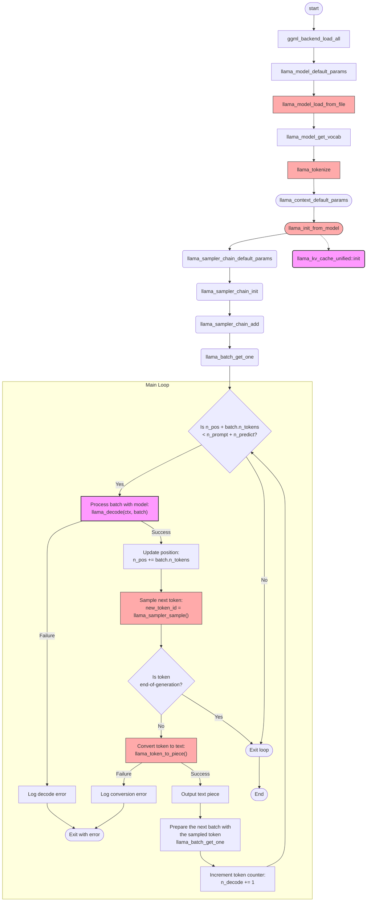

### llama_decode function deep dive
Please check [llama.cpp_flowchart_decode.md](llama.cpp_flowchart_decode.md) for more detailed information about this function.

## `ggml_backend_load_all()` in `ggml-backend-reg.cpp`

This function dynamically discovers and loads all available hardware acceleration backends for the GGML framework in llama.cpp, enabling optimal performance across different hardware.

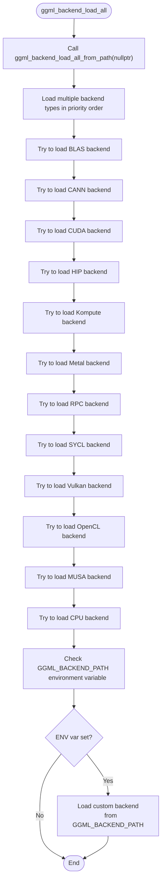

### Key Features

1. **Dynamic Backend Discovery**
   - Searches for backend libraries with naming patterns like:
     - Linux/macOS: `libggml-{type}-*.so`
     - Windows: `ggml-{type}-*.dll`

2. **Search Paths**
   - Executable directory
   - Current working directory
   - Custom path specified by parameter (when using `ggml_backend_load_all_from_path()`)

3. **Backend Selection Process**
   - Loads candidate libraries
   - Calls each backend's `ggml_backend_score()` function
   - Selects the backend with the highest score (best compatibility/performance)

   For example, when called with name = "cuda", it might find:
    ```
    ggml-cuda.dll           (base version)
    ggml-cuda-sm75.dll     (score: 75)
    ggml-cuda-sm86.dll     (score: 86)
    ```
  And would load the sm86 version as it has the highest score, indicating better performance for that GPU architecture.

  This allows for optimized versions of backends to be automatically selected based on the specific hardware capabilities of the system.

4. **Supported Backends**
   - **GPU**: CUDA (NVIDIA), Metal (Apple), Vulkan, OpenCL, HIP (AMD), CANN (Huawei)
   - **CPU**: BLAS, specialized CPU implementations
   - **Other**: RPC (remote), SYCL, Kompute, MUSA

5. **Custom Backend Support**
   - Checks `GGML_BACKEND_PATH` environment variable for custom backends

This function is crucial for llama.cpp's hardware acceleration capabilities, allowing it to adapt to the specific hardware available on the user's system.

## `llama_model_default_params()` in `llama-model.cpp`

This function creates and returns a default configuration structure for loading a language model in llama.cpp.

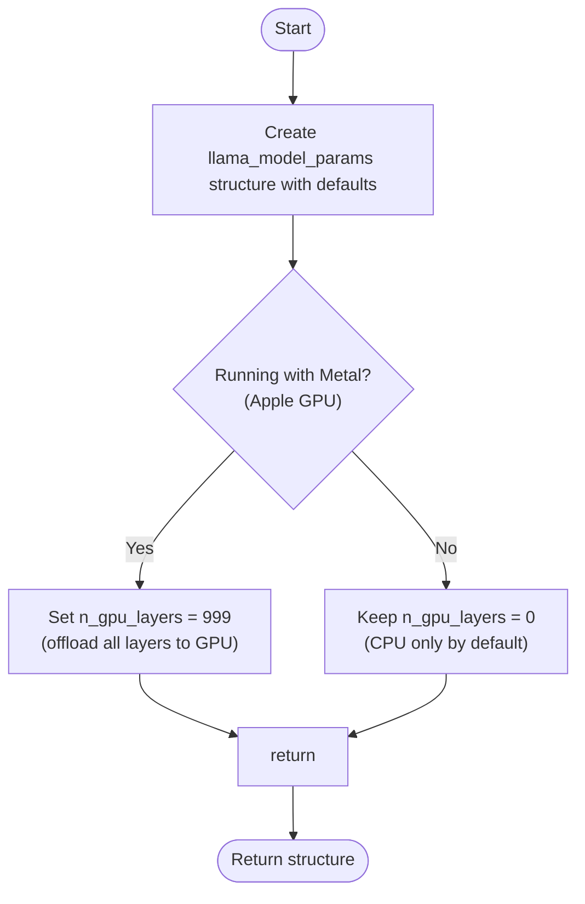

## Default Parameter Values

The function initializes the following configuration parameters:

| Parameter | Default Value | Purpose |
|-----------|---------------|---------|
| `devices` | `nullptr` | No specific devices selected |
| `n_gpu_layers` | `0` (CPU) or `999` (Metal) | Number of layers to offload to GPU |
| `split_mode` | `LLAMA_SPLIT_MODE_LAYER` | How to split model across devices |
| `main_gpu` | `0` | Primary GPU device ID |
| `tensor_split` | `nullptr` | Custom tensor splitting ratios |
| `progress_callback` | `nullptr` | Function for loading progress updates |
| `progress_callback_user_data` | `nullptr` | User data for callbacks |
| `kv_overrides` | `nullptr` | Override model parameters |
| `vocab_only` | `false` | Load only vocabulary (not weights) |
| `use_mmap` | `true` | Use memory mapping for model loading |
| `use_mlock` | `false` | Lock model in RAM to prevent swapping |
| `check_tensors` | `false` | Validate tensor data during loading |

On Apple devices with Metal support, the function automatically configures GPU offloading for optimal performance, assuming Apple GPUs typically have sufficient VRAM.

## llama_model_load_from_file() in llama.cpp

This function loads an LLM (Large Language Model) from a GGUF file into memory and prepares it for inference.

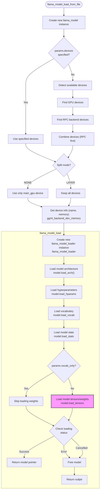

### Key Operations

1. **Initialization**:
   - Takes a model path and parameter struct
   - Creates a model instance with specified parameters

2. **Device Selection**:
   - Uses explicitly provided devices or detects available hardware
   - Prioritizes GPU devices based on split mode setting
   - Handles RPC (remote procedure call) servers for distributed inference

3. **Loading Process**:
   - Architecture: Model structure definition
   - Hyperparameters: Configuration values like embedding size, layer count
   - Vocabulary: Tokenizer data for text conversion
   - Statistics: Memory usage, parameter counts
   - Tensors: Actual model weights (unless in vocab_only mode)

This is the primary entry point for loading models in llama.cpp and supports various configurations including memory mapping, tensor checking, and GPU offloading.

## `llama_model_loader` in llama-model-loader.cpp

The `llama_model_loader` constructor initializes the infrastructure for loading large language models from GGUF files, setting up metadata access without immediately loading the full weights.

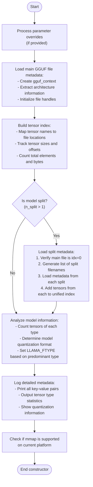

### Key Features

1. **Metadata Extraction**:
   - Loads model architecture, hyperparameters, and configuration
   - Builds a map of all tensors with their locations and sizes
   - Supports parameter overrides via command line or API

2. **Multi-File Support**:
   - Handles models split across multiple files (sharded models)
   - Validates file consistency and ordering
   - Creates a unified view of tensors across all files

3. **Memory Efficiency**:
   - Delays actual weight loading until needed
   - Prepares for memory mapping when supported
   - Only loads metadata initially, not the full model

4. **Analysis & Diagnostics**:
   - Determines model quantization format
   - Outputs detailed statistics and information
   - Validates model consistency

This constructor is the first step in loading a model, creating the scaffolding that enables efficient, on-demand loading of the actual weight data when needed for inference.

## `llama_model::load_tensors()` in `llama-model.cpp`

This function is responsible for loading model weights (tensors) from disk into memory and allocating them optimally across available computing devices.

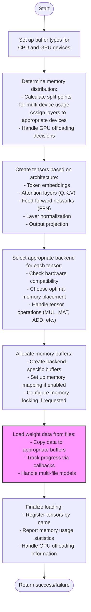

### Key Features

1. **Architecture-Specific Loading**: Handles 50+ model architectures (LLaMA, Falcon, Gemma, etc.) with specialized tensor layouts

2. **Multi-Device Support**: Distributes model layers across:
   - Multiple GPUs
   - CPU + GPU combinations
   - Various specialized accelerators

3. **Memory Optimization**:
   - Uses memory mapping for efficiency when possible
   - Properly aligns tensors for hardware acceleration
   - Minimizes copying between host and device memory

4. **Operation-Based Tensor Management**:
   - Assigns tensors to appropriate devices based on operations (matrix multiply, addition, etc.)
   - Handles specialized operations like RoPE (Rotary Position Embedding)

This function enables efficient inference by ensuring model weights are optimally placed across available computing resources, critical for running large language models on consumer hardware.

## `llama_model_loader::load_all_data()` in `llama-model-loader.cpp`

This function loads the actual weight data from files into memory for all tensors in a model. It's a crucial part of the model loading process that transfers data from storage to computation buffers.

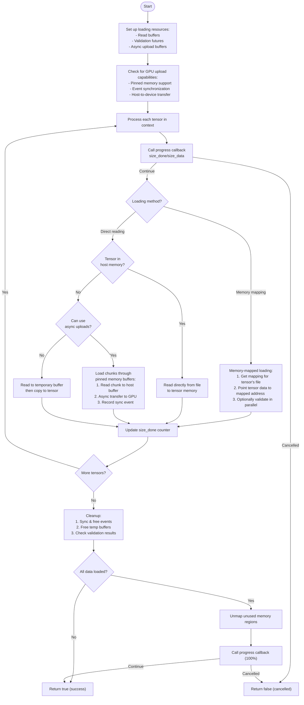

### Key Features

1. **Multiple Loading Methods**:
   - **Memory Mapping**: Zero-copy access to model data directly from files
   - **Direct Loading**: Reading data from files into pre-allocated memory
   - **Asynchronous GPU Uploads**: Efficient pinned-memory transfers for GPU tensors

2. **Performance Optimizations**:
   - Parallel validation of tensor data
   - Asynchronous uploads for GPU memory
   - Pinned memory staging buffers for efficient transfers
   - Unmapping of unused memory regions

3. **Progress Reporting and Cancellation**:
   - Reports loading progress through callback
   - Honors cancellation requests at multiple points

This function is critical for memory efficiency in llama.cpp, enabling several techniques that allow large models to run on consumer hardware.

## `llama_tokenize()` in `llama-vocab.cpp`

The `llama_tokenize()` function converts natural language text into tokens (integer IDs) that can be processed by a language model.

```cpp
int32_t llama_tokenize(
    const struct llama_vocab * vocab,
                  const char * text,
                     int32_t   text_len,
                 llama_token * tokens,
                     int32_t   n_tokens_max,
                        bool   add_special,
                        bool   parse_special)
```

### Key Operations

1. **Text Preprocessing**:
   - Takes the input text and processes it according to the tokenizer's rules
   - Creates fragments for further processing

2. **Special Token Handling**:
   - If `parse_special` is `true`, identifies and separates special tokens like control tokens
   - Special tokens have direct token IDs without being broken down further

3. **Tokenization Algorithm**:
   - Applies the appropriate tokenization algorithm based on the vocabulary type:
     - **SPM (SentencePiece)**: Uses byte-pair encoding with unigram language model
     - **BPE (Byte-Pair Encoding)**: Merges common pairs of characters/subwords
     - **WPM (WordPiece)**: Similar to BPE but with different merging criteria
     - **UGM (Unigram Model)**: Optimizes word segmentation using Viterbi algorithm
     - **RWKV**: Custom tokenizer for RWKV models

4. **Special Token Addition**:
   - If `add_special` is `true`, adds appropriate special tokens:
     - BOS (beginning of sequence) token at the start if configured
     - EOS (end of sequence) token at the end if configured

5. **Output Handling**:
   - Returns the number of tokens if successful
   - Returns negative number if `n_tokens_max` is too small (indicates required buffer size)

### Example Flow

For a simple example with SPM tokenizer:
```
"Hello world" → (preprocess) → "▁Hello▁world" → (tokenize) → [1, 15043, 2787]
```

Where:
- `1` might be the BOS token (if `add_special` is true)
- `15043` and `2787` are the token IDs for "Hello" and "world" respectively

This function is a core component of the inference pipeline, bridging the gap between human-readable text and the numeric representation that language models process.

## `llama_context_default_params()` in `llama-context.cpp`

This function creates and returns a default configuration structure (`llama_context_params`) for language model inference in llama.cpp. It initializes sensible defaults that can later be customized by users.

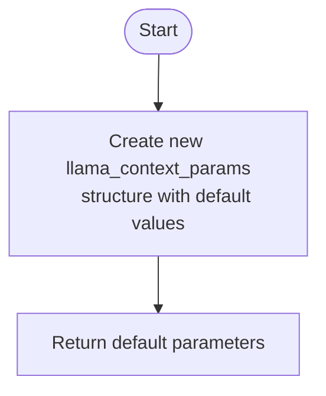

### Key Parameter Groups

1. **Context Window Settings**
   - `n_ctx = 512`: Maximum context size (tokens)
   - `n_batch = 2048`: Batch size for token processing
   - `n_ubatch = 512`: Micro-batch size for efficiency
   - `n_seq_max = 1`: Maximum concurrent sequences

2. **Computational Resources**
   - `n_threads` and `n_threads_batch`: Default thread counts
   - `offload_kqv = true`: Offload computation to GPU if available
   - `flash_attn = false`: Optimized attention disabled by default

3. **Model Behavior Controls**
   - RoPE configuration parameters (`rope_freq_base`, `rope_freq_scale`)
   - YaRN parameters for extended context (`yarn_ext_factor`, etc.)
   - `defrag_thold = -1.0f`: KV cache defragmentation threshold

4. **Memory Optimization**
   - `type_k = GGML_TYPE_F16`: Half precision for key cache
   - `type_v = GGML_TYPE_F16`: Half precision for value cache

5. **Output Controls**
   - `logits_all = false`: Only compute logits for the last token
   - `embeddings = false`: Output logits, not embeddings
   - `pooling_type = UNSPECIFIED`: Inherit from model

These default parameters provide a reasonable starting point for language model inference, prioritizing memory efficiency while still allowing the model to function effectively.

## `llama_init_from_model()` in `llama-context.cpp`

This function creates a new inference context from a loaded model, setting up all resources needed for model execution.

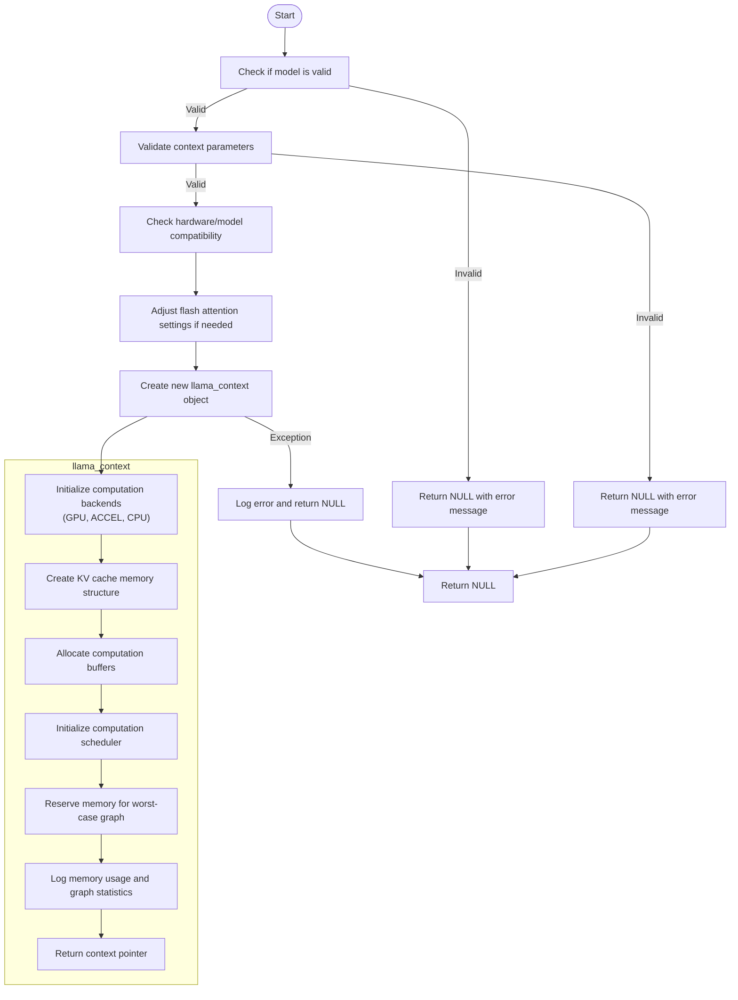

### Key Operations

1. **Validation**
   - Ensures model pointer is not NULL
   - Checks batch size parameters are valid
   - Verifies context size parameters are valid

2. **Hardware Compatibility**
   - Disables flash attention for incompatible models (e.g., Grok)
   - Verifies key/value head dimensions for flash attention
   - Checks quantization compatibility with flash attention

3. **Resource Allocation**
   - Creates backend interfaces for GPU, CPU, and acceleration devices
   - Allocates memory for key-value cache
   - Sets up computation buffers and scheduler

4. **Configuration**
   - Configures RoPE parameters (frequency scaling, etc.)
   - Sets up threading and callbacks
   - Handles model type specific settings

5. **Performance Optimization**
   - Sets up pipeline parallelism when appropriate
   - Configures GPU offloading based on model size
   - Reserves memory for efficient graph execution

This function is the bridge between a loaded model and the ability to perform inference with it, handling all the necessary setup for efficient execution.

## `llama_context::llama_context()` Constructor Analysis

The `llama_context` constructor is the fundamental initialization function in llama.cpp that prepares the model for inference. It takes a model reference and parameters, then configures everything needed for efficient model execution.

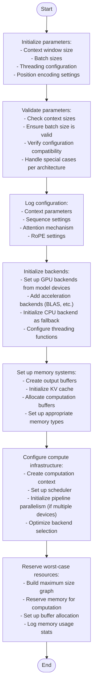

## Key Components:

1. **Parameter Processing**:
   - Handles context window sizing
   - Configures RoPE (Rotary Position Embedding) parameters
   - Sets up model-specific adaptations

2. **Hardware Acceleration**:
   - Creates a prioritized list of backends (GPU → Accelerators → CPU)
   - Configures thread pools for parallel execution
   - Sets up pipeline parallelism for multi-device execution

3. **Memory Management**:
   - Allocates KV cache based on model requirements
   - Creates output buffers for logits/embeddings
   - Sets up computation buffers optimized for each backend
   - Configures memory sharing between devices when beneficial

4. **Inference Engine Setup**:
   - Builds graph scheduler for distributing computation
   - Reserves worst-case computation graph
   - Sets up callbacks and abort handlers
   - Configures tensor operation routing

This constructor is the foundation for all model inference, establishing the resources and execution framework that enables efficient language model inference across diverse hardware setups.

## `llama_kv_cache_unified::init()` in `llama-kv-cache.cpp`

This function initializes the key-value (KV) cache for a language model, which is critical for efficient inference by storing previously computed keys and values.

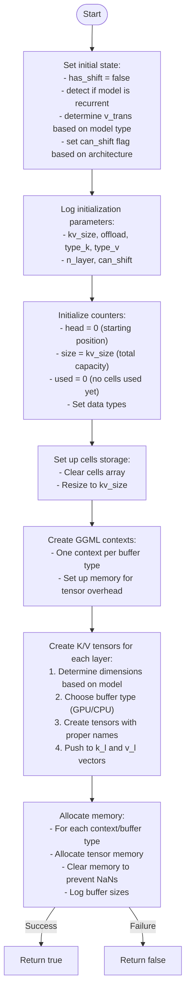

### Key Components

1. **Model-Specific Configuration**:
   - Detects if model is recurrent (like Mamba or RWKV)
   - Sets up appropriately for transformer vs. state-space models
   - Configures value transposition based on model needs

2. **Memory Management**:
   - Creates appropriate buffer types (CPU/GPU) based on offload parameter
   - Allocates memory efficiently for different hardware
   - Supports GPU offloading for specific layers

3. **Tensor Organization**:
   - Creates tensors for each layer's keys and values
   - Handles grouped query attention (GQA) dimensions
   - Sets up proper naming for debugging

4. **Optimization Features**:
   - Configures "can_shift" capability for context extension
   - Sets up memory layouts optimized for specific models
   - Provides clear logging for debugging

This initialization function is a critical part of llama.cpp's efficiency, as proper KV cache setup dramatically improves inference speed by avoiding redundant computations for previously seen tokens.

## `llama_sampler_chain_default_params()` in `llama.cpp`

This function initializes and returns a default configuration structure for text sampling in llama.cpp.

```cpp
struct llama_sampler_chain_params llama_sampler_chain_default_params() {
    struct llama_sampler_chain_params result = {
        /*.no_perf                     =*/ true,
    };

    return result;
}
```

### Purpose

The function creates default parameters for a "sampler chain" - a sequence of sampling strategies that determine how the next token is selected during text generation.

Currently, the structure has only one parameter:

- `no_perf = true`: Disables performance tracking for the sampling process by default

### Usage Context

In llama.cpp, token sampling is a critical part of text generation that determines how to select the next token from probability distributions. The sampler chain allows for multiple sampling methods to be applied in sequence, such as:

1. Temperature scaling
2. Top-K filtering
3. Top-P (nucleus) sampling
4. Repetition penalties
5. Frequency penalties

This function creates a starting point with conservative defaults that users can then customize for their specific generation needs.

# `llama_sampler_chain_init()` in `llama-sampling.cpp`

This function initializes a composite sampler chain that allows multiple sampling strategies to be applied sequentially during text generation.

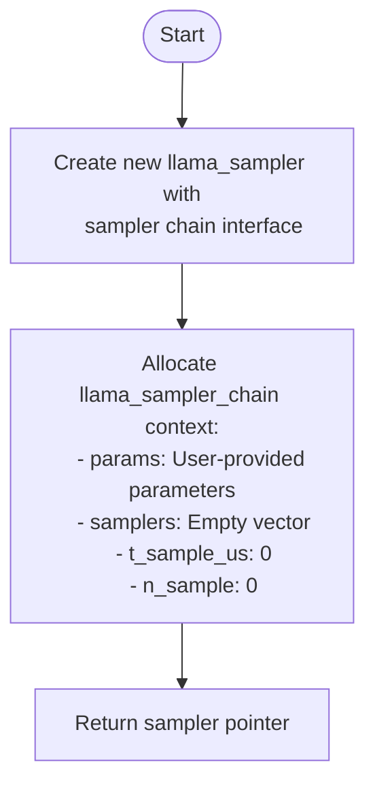

### Purpose

The sampler chain acts as a container and orchestrator for multiple text sampling strategies. During token generation, these strategies are applied in sequence, with each one modifying the token probability distribution before passing it to the next sampler.

## Key Components

1. **Interface Setup**:
   - Sets up function pointers for standard operations (accept, apply, reset, clone)
   - Establishes behavior for the chain as a whole

2. **Context Initialization**:
   - Creates an empty container for individual samplers
   - Sets up performance tracking (disabled by default)

3. **Chain Pattern Implementation**:
   - Forms the foundation of a chain-of-responsibility pattern
   - Each sampler in the chain modifies token probabilities in sequence

## Usage Flow

After initialization, specific samplers are added to the chain with `llama_sampler_chain_add()`. For example:

```cpp
sampler = llama_sampler_chain_init(params);
llama_sampler_chain_add(sampler, llama_sampler_init_temp(0.8f));     // Temperature
llama_sampler_chain_add(sampler, llama_sampler_init_top_k(40));      // Top-K filtering
llama_sampler_chain_add(sampler, llama_sampler_init_top_p(0.95f, 1)); // Top-P sampling
```

This design makes sampling highly customizable through composition of different strategies.

## `llama_sampler_chain_add()` in `llama-sampling.cpp`

The `llama_sampler_chain_add()` function adds a sampler to a sampler chain, building a sequence of text generation sampling strategies.

```cpp
void llama_sampler_chain_add(struct llama_sampler * chain, struct llama_sampler * smpl) {
    auto * p = (llama_sampler_chain *) chain->ctx;
    p->samplers.push_back(smpl);
}
```

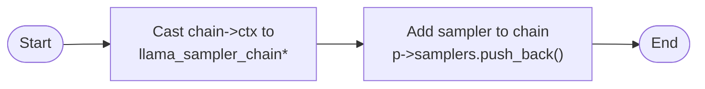

### Purpose

This function implements the "Chain of Responsibility" pattern for token sampling, allowing multiple sampling strategies to be combined in sequence during text generation. Each sampler in the chain modifies the token probability distribution before passing it to the next sampler.

### Parameters

- `chain`: A pointer to the sampler chain created with `llama_sampler_chain_init()`
- `smpl`: A pointer to the sampler to add to the chain

### Usage Example

```cpp
// Create a sampling chain
llama_sampler* chain = llama_sampler_chain_init(params);

// Add samplers in sequence (order matters)
llama_sampler_chain_add(chain, llama_sampler_init_temp(0.8f));      // Temperature
llama_sampler_chain_add(chain, llama_sampler_init_top_k(40));       // Top-K filtering
llama_sampler_chain_add(chain, llama_sampler_init_top_p(0.95f, 1)); // Top-P (nucleus)
llama_sampler_chain_add(chain, llama_sampler_init_min_p(0.05f, 1)); // Min-P filtering

// The chain ownership is transferred - individual samplers will be freed when the chain is freed
```

This design allows for highly customizable sampling strategies through composition, with each component focusing on a specific aspect of probability manipulation.

## `llama_batch_get_one()` in `llama-batch.cpp`

This function creates a minimal batch structure for token processing, designed for simple, single-sequence inference cases.

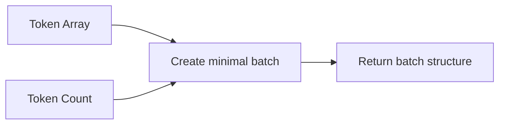

### Purpose

`llama_batch_get_one()` is a utility function that quickly creates a basic `llama_batch` structure from an array of token IDs. It's the simplest way to prepare tokens for inference.

```cpp
struct llama_batch llama_batch_get_one(
             llama_token * tokens,
                 int32_t   n_tokens) {
    return {
        /*n_tokens       =*/ n_tokens,
        /*tokens         =*/ tokens,
        /*embd           =*/ nullptr,
        /*pos            =*/ nullptr,
        /*n_seq_id       =*/ nullptr,
        /*seq_id         =*/ nullptr,
        /*logits         =*/ nullptr,
    };
}
```

### Key Features

1. **Minimal Configuration**:
   - Sets only the token array and count
   - All other batch fields are set to `nullptr`

2. **Default Behavior** (when used without modification):
   - Positions will be assigned sequentially (0, 1, 2...)
   - All tokens will be treated as a single sequence
   - Only the final token will generate logits (probabilities for next token)
   - No embedding inputs are provided

This function provides a streamlined way to feed tokens into the model for the common case of processing a single sequence of text.

## `llama_decode()` in `llama-context.cpp`

The `llama_decode()` function is the core inference engine of llama.cpp, processing tokens through the model to generate logits or embeddings.

```mermaid
flowchart TD
    start([Input: batch of tokens]) --> validate["Validate inputs
    - Check if n_tokens > 0
    - Verify token IDs are valid"]
    
    validate --> batch_prepare["Prepare batch for processing
    - Allocate memory if needed
    - Start performance timing"]
    
    batch_prepare --> split["Split into micro-batches
    - Handle based on n_ubatch parameter
    - Prepare for sequential processing"]
    
    split --> kv_update["Update KV cache
    - Defragment if needed
    - Find slots for new tokens"]
    
    kv_update --> loop{"Process all 
    micro-batches"}
    
    loop -->|"For each micro-batch"| graph_build["Build computation graph
    - Create tensor operations
    - Connect forward pass layers"]
    
    graph_build --> allocate["Allocate computation buffers
    - Optimize memory usage
    - Prepare for execution"]
    
    allocate --> execute["Execute computation
    - Run through transformer layers
    - Process through attention & FFN"]
    
    execute --> extract["Extract outputs
    - Get logits (token probabilities)
    - Get embeddings (if requested)"]
    
    extract --> update_kv["Update KV cache state
    - Move head pointer
    - Update sequence tracking"]
    
    update_kv --> next_batch{"More batches?"}
    next_batch -->|Yes| loop
    next_batch -->|No| finalize["Finalize processing
    - Update output mappings
    - Check for defragmentation needs"]
    
    finalize --> reset["Reset scheduler state"]
    
    reset --> return["Return status code:
    0: Success
    2: Aborted
    -1: Invalid input
    -2: Memory allocation failed
    -3: Computation failed"]
```

### Key Components

1. **Batch Processing**:
   - Handles both token IDs and direct embedding inputs
   - Processes tokens in micro-batches for efficiency
   - Supports both causal and non-causal attention modes

2. **KV Cache Management**:
   - Maintains key-value pairs for efficient sequence processing
   - Handles sequence IDs and positions for multi-sequence batches
   - Implements cache defragmentation and shifting

3. **Computation Optimization**:
   - Uses hardware acceleration (GPU, CPU optimizations)
   - Implements pipeline parallelism when appropriate
   - Optimizes memory usage with scheduler

4. **Multiple Output Modes**:
   - Token logits for text generation
   - Token embeddings for representation learning
   - Sequence embeddings with different pooling types

The function is the central execution point that brings together all the components of the model (attention, feed-forward networks, embedding lookups) to perform the actual language model inference.

### llama_decode function deep dive
Please check [llama.cpp_flowchart_decode.md](llama.cpp_flowchart_decode.md) for more detailed information about this function.

## `llama_sampler_sample()` in `llama-sampling.cpp`

This function serves as the core token selection mechanism for llama.cpp, taking a model's logits and applying sampling strategies to choose the next token.

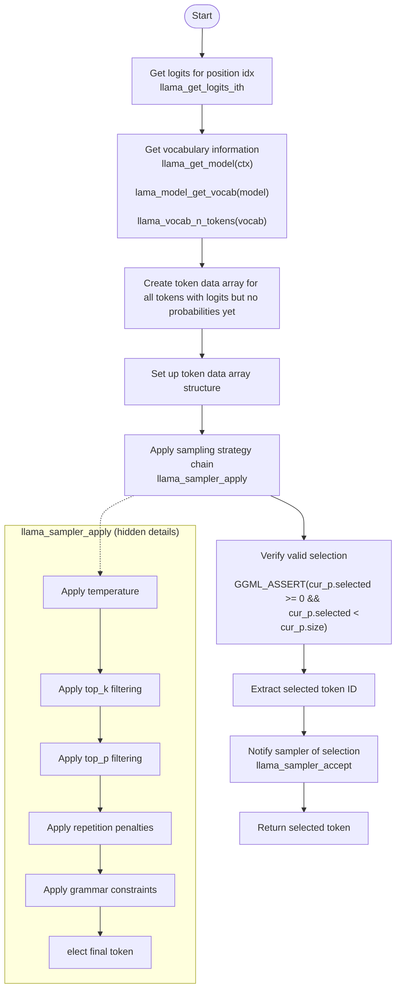

### Key Steps

1. **Get Raw Logits**: Retrieve the model's raw output scores for the specified position

2. **Prepare Token Data**: Convert logits into a structured array containing all tokens in the vocabulary

3. **Apply Sampling Strategy**: Call `llama_sampler_apply()` which modifies token probabilities based on the configured sampling chain:
   - Temperature scaling
   - Top-K filtering
   - Top-P (nucleus) sampling 
   - Repetition penalties
   - Grammar constraints
   - etc.

4. **Select Token**: The sampling chain selects the final token and sets it in `cur_p.selected`

5. **Update Sampler State**: Call `llama_sampler_accept()` to update the sampler's internal state with the selected token (for repetition tracking, etc.)

6. **Return Token**: Return the selected token ID for use in the generation process

This is the critical function that transforms raw model outputs into the next token in the generated sequence.

## `llama_token_to_piece()` in `llama-vocab.cpp`

The `llama_token_to_piece()` function converts a numeric token ID back into its corresponding text representation (called a "piece"). This function is crucial for detokenization — the process of converting the model's token IDs back into human-readable text.

```cpp
int32_t llama_token_to_piece(
    const struct llama_vocab * vocab, // Vocabulary containing token information
    llama_token token,                // The token ID to convert
    char * buf,                       // Output buffer for the text
    int32_t length,                   // Size of output buffer
    int32_t lstrip,                   // Number of leading spaces to strip
    bool special                      // Whether to allow special tokens
)
```

### Key Operations

1. **Special Token Filtering**: 
   - If `special=false` and the token is a special token (control or unknown), returns 0 (no output)
   - This allows the caller to control whether special tokens appear in the output

2. **Text Retrieval**:
   - Looks up the token's text representation from the vocabulary
   - Uses a cache if available for performance optimization

3. **Tokenizer-Specific Processing**:
   - **SPM/WPM/UGM**: Unescapes whitespace (converts "\xe2\x96\x81" back to actual space)
   - **BPE**: Handles decoding of escaped sequences
   - **RWKV**: Uses custom escaping format for tokens

4. **Buffer Management**:
   - Checks if the provided buffer is large enough for the result
   - Handles leading space removal via `lstrip` parameter
   - Returns negative value if buffer is too small (indicating required size)

### Return Value

- **Positive**: Number of bytes written to the buffer
- **Negative**: Required buffer size (as a negative number) if provided buffer is too small
- **Zero**: When the token produces no output (e.g., filtered special tokens)

This function is essential for converting token sequences generated by the model back into human-readable text during inference.
