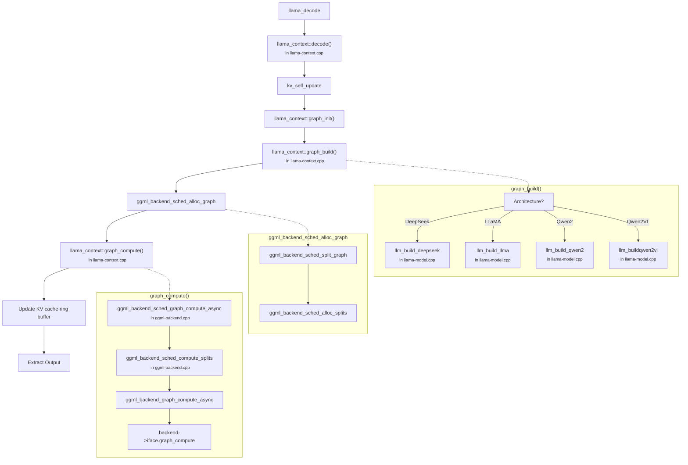
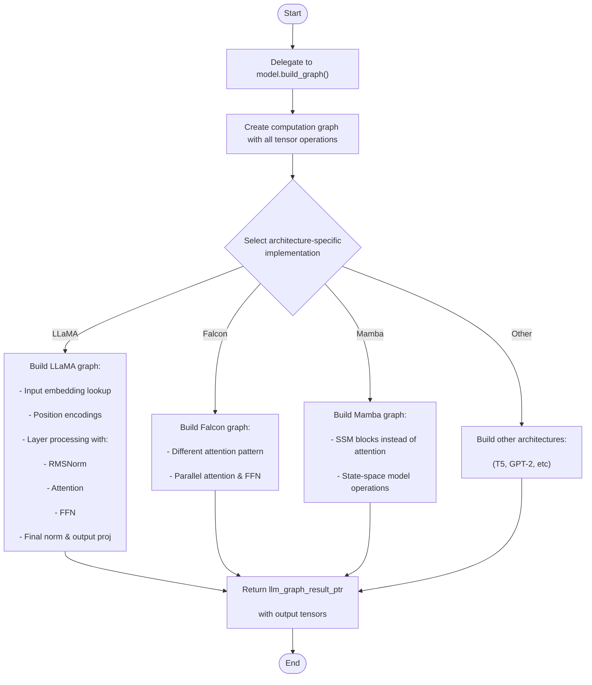
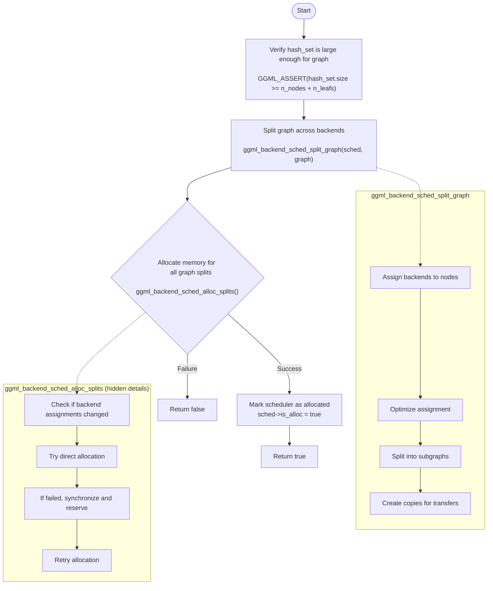
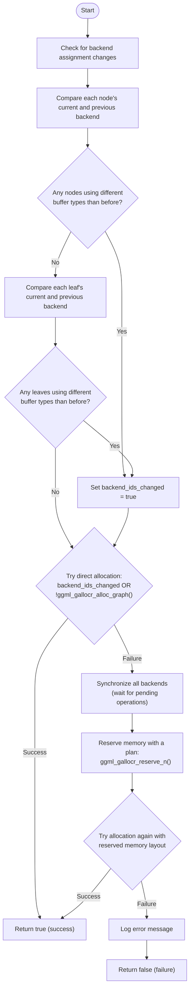
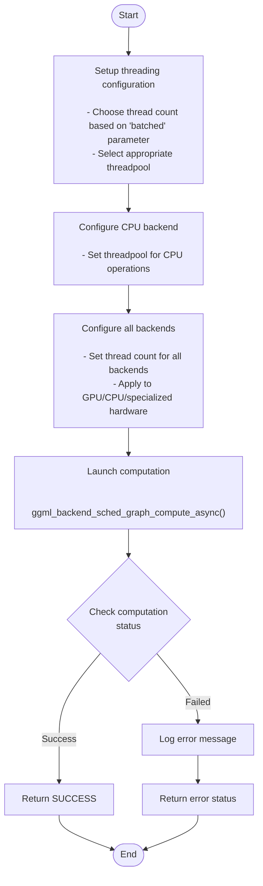
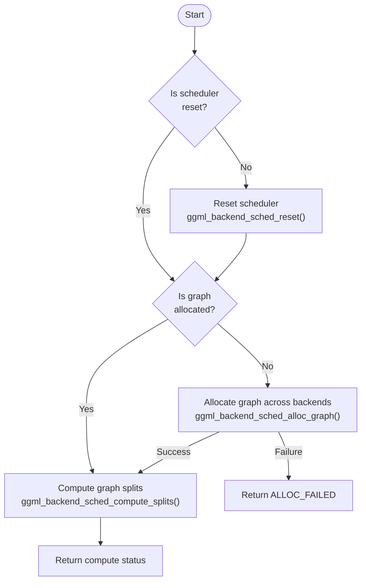
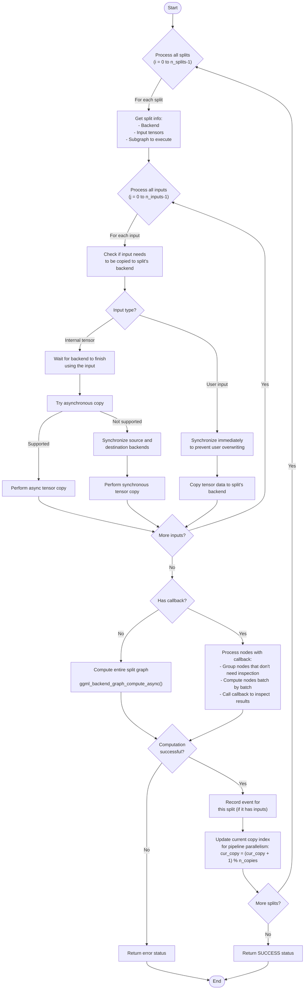
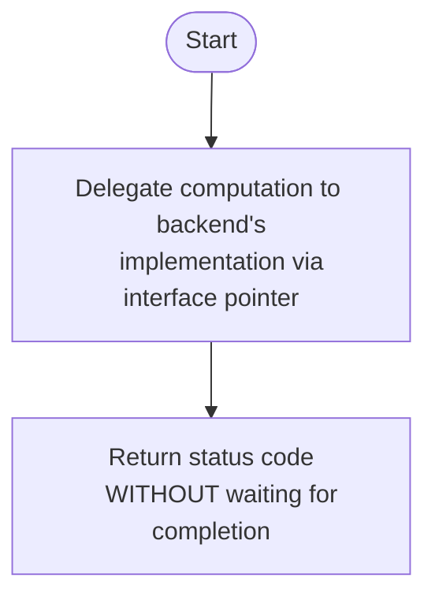

# llama.cpp Decode

## `llama_decode` in `llama-context.cpp`



### Key Components

- Input Processing
- KV Cache Management
- Inference Pipeline
    - <b>graph_build()</b>
    - <b>graph_compute()</b>
- Output Generation
- Preformance Optimization

### llm_build_qwen2 function deep dive
Please check [llama.cpp_flowchart_decode_graph_build_qwen.md](llama.cpp_flowchart_decode_graph_build_qwen.md) for more detailed information about how to build Qwen graph.

## `llama_context::kv_self_update()` in `llama-context.cpp`

This function manages and updates the key-value (KV) cache, which is crucial for efficient inference in large language models.

```mermaid
flowchart TD
    start([Start]) --> check_shift{"Has shifts to apply?"}
    
    check_shift -->|Yes| can_shift{"Context supports<br>K-shift?"}
    check_shift -->|No| check_defrag
    
    can_shift -->|No| abort["ABORT: Context doesn't<br>support K-shift"]
    can_shift -->|Yes| log_shift["Log: applying K-shift"]
    
    log_shift --> has_rope{"Does model use<br>RoPE?"}
    
    has_rope -->|Yes| apply_shift["Apply K-shift:
    1. Reset scheduler
    2. Initialize graph
    3. Build shift computation
    4. Execute graph
    5. Set need_reserve flag"]
    
    has_rope -->|No| skip_shift["Skip rope application"]
    
    apply_shift --> clear_shift["Clear shift state:
    1. Set has_shift = false
    2. Reset all delta values"]
    
    skip_shift --> clear_shift
    
    clear_shift --> check_defrag{"Defragmentation<br>needed?"}
    
    check_defrag -->|Yes| log_defrag["Log: defragmenting KV cache"]
    check_defrag -->|No| check_need_reserve
    
    log_defrag --> prepare_defrag{"Prepare defrag<br>successful?"}
    
    prepare_defrag -->|Yes| apply_defrag["Apply defragmentation:
    1. Reset scheduler
    2. Initialize graph
    3. Build defrag computation
    4. Execute graph
    5. Set need_reserve flag"]
    
    prepare_defrag -->|No| clear_defrag
    
    apply_defrag --> clear_defrag["Set do_defrag = false"]
    
    clear_defrag --> check_need_reserve{"Need to reserve<br>worst-case graph?"}
    
    check_need_reserve -->|Yes| log_reserve["Log: reserving worst case graph"]
    check_need_reserve -->|No| finish
    
    log_reserve --> build_worstcase["Build worst-case graph:
    1. Simulate full KV cache
    2. Set batch parameters
    3. Create computation graph"]
    
    build_worstcase --> reset_sched["Reset scheduler"]
    
    reset_sched --> reserve["Allocate compute buffers"]
    
    reserve --> check_alloc{"Allocation<br>successful?"}
    
    check_alloc -->|No| log_error["Log error message"]
    check_alloc -->|Yes| finish
    
    log_error --> finish([End])
```



### Key Functions:

1. **K-shift Application**:
   - Updates positional encodings when token positions change
   - Crucial for maintaining correct attention patterns when manipulating sequences
   - Only applied when using rotary position embeddings (RoPE)

2. **KV Cache Defragmentation**:
   - Rearranges fragmented KV cache to make it contiguous
   - Moves tensors to more optimal positions
   - Improves memory efficiency and performance

3. **Worst-case Graph Reservation**:
   - After updates that change memory layout, rebuilds computation graphs
   - Ensures sufficient memory allocation for future operations
   - Prevents reallocation during inference

This function is critical for long-context generation, enabling efficient reuse of computed key-value pairs while maintaining their correct positional relationships in the transformer architecture.

## `graph_build()` in `llama-model.cpp`

The `graph_build()` function constructs the computational graph for model inference in llama.cpp - it's the function that defines the flow of operations needed to process tokens.



### Main Operations

The function:

1. **Creates a Graph Blueprint**: Defines how tensors flow through the model's layers

2. **Configures Architecture-Specific Operations**: Each model architecture (LLaMA, Falcon, Mamba, etc.) has different computational patterns

3. **Sets Up Tensor Operations** including:
   - Token embedding lookups
   - Position encoding application
   - Attention mechanisms (self and cross-attention)
   - Feed-forward networks
   - Layer normalization
   - Output projections

4. **Handles KV Cache Integration**: Connects with previous key-value pairs for efficient inference

5. **Applies Adaptations** such as:
   - LoRA fine-tuning modifications
   - Conditioning vectors
   - RoPE scaling for context extension

### Usage Context

This function is called during `decode()` and `encode()` operations to build the computational graph just before execution. The graph is then passed to `graph_compute()` for actual evaluation.

The result is a smart pointer containing pointers to final tensors (logits or embeddings) that will hold the model's output after computation.

## `ggml_backend_sched_alloc_graph()` in `ggml-backend.cpp`

This function allocates memory for an entire computational graph across multiple backends (CPUs, GPUs, etc.) in an optimized way.



### Key Operations

1. **Graph Splitting**:
   - Divides the computation graph into subgraphs that each run on a single backend
   - Assigns each tensor/operation to the most appropriate backend
   - Handles cross-backend dependencies by creating tensor copies
   - Optimizes placement to minimize memory transfers

2. **Memory Allocation**:
   - Allocates memory for tensors on appropriate hardware (CPU, GPU, etc.)
   - Handles memory sharing between tensors when possible
   - Manages different memory allocation patterns based on backend requirements
   - Includes fallback mechanisms when direct allocation fails

3. **State Management**:
   - Updates scheduler state to track allocation status
   - Maintains mapping between tensors and their assigned backends

This function is a critical part of llama.cpp's ability to efficiently run large language models across heterogeneous computing devices, ensuring optimal use of available hardware.

## `ggml_backend_sched_split_graph()` in `ggml-backend.cpp`

This function enables efficient multi-device inference by splitting the computation graph across different hardware backends (CPU, GPU, etc.) in an optimal way.

```mermaid
flowchart TD
    start([Start]) --> reset["Reset state:
    - Clear split count
    - Reset graph inputs
    - Initialize context"]
    
    reset --> assign1["PASS 1: Initial assignment
    Assign backends based on:
    - Pre-allocated tensors
    - Weight locations
    - Input requirements"]
    
    assign1 --> assign2["PASS 2: Expand assignments
    - Expand GPU backends up/down
    - Keep operations on same device
    - Skip unsupported operations"]
    
    assign2 --> assign3["PASS 3: Optimize assignments
    - Upgrade to higher priority backends
    - Assign remaining unassigned nodes
    - Balance performance and memory"]
    
    assign3 --> assign4["PASS 4: Finalize assignments
    - Assign any remaining tensors
    - Handle view operations
    - Ensure all tensors have backends"]
    
    assign4 --> split["PASS 5: Split the graph
    - Create split boundaries at backend changes
    - Track inputs that need copying
    - Build subgraphs for each backend"]
    
    split --> create_copies["Create tensor copies for cross-backend transfers
    - Make copies of tensors needed on multiple backends
    - Set up pipeline parallelism with multiple copies
    - Track dependencies between originals and copies"]
    
    create_copies --> build_graph["Build modified computation graph:
    - Insert copy operations
    - Replace tensor references as needed
    - Organize for efficient execution"]
    
    build_graph --> finish([End])
```



### Key Features

1. **Intelligent Backend Selection**
   - Assigns operations to the most appropriate hardware
   - Considers tensor pre-allocation, weights location, and operation support
   - Prioritizes GPU backends for compute-intensive operations

2. **Minimizes Data Transfers**
   - Groups operations to reduce cross-device transfers
   - Creates tensor copies only when necessary
   - Tracks which tensors must be moved between devices

3. **Pipeline Parallelism**
   - Supports multiple copies of tensors for parallel execution
   - Enables overlapped computation across devices
   - Creates efficient execution schedule

4. **Optimization Heuristics**
   - Expands GPU use to adjacent operations when possible
   - Upgrades operations to faster backends when buffer types are compatible
   - Balances computation and memory considerations

This function is the foundation of llama.cpp's ability to efficiently utilize heterogeneous computing resources, enabling large models to run effectively across combinations of CPU, GPU, and other specialized hardware.

## `ggml_backend_sched_alloc_splits()` in `ggml-backend.cpp`

This function allocates memory for computation graph splits across different hardware backends (CPU, GPU, etc.) in the llama.cpp inference engine.



### Key Components

1. **Change Detection**
   - Determines if backend assignments have changed since last allocation
   - Only reallocates when necessary (buffer types differ)
   - Checks both computation nodes and leaf tensors (data)

2. **Optimization Strategy**
   - First attempts direct allocation (fast path)
   - Falls back to a two-phase approach (reserve then allocate) if needed
   - Synchronizes backends before re-allocation to ensure safety

3. **Memory Management**
   - Uses `galloc` (graph allocator) to manage memory across devices
   - Tracks specific backend and buffer type for each tensor
   - Handles different memory spaces (CPU RAM, GPU VRAM, etc.)

This function is essential for efficiently distributing the computation across heterogeneous hardware by ensuring each tensor has appropriate memory allocated on the correct device before computation begins.

## `graph_compute()` in `llama-context.cpp`

The `graph_compute()` function executes the computational graph for LLM inference across available hardware. It's the function that actually runs the model computations after the graph has been built.



### Key Operations

1. **Thread Management**:
   - Determines the appropriate thread count based on whether processing a batch or single token
   - Uses different thread pools for batch vs. single-token processing

2. **Backend Configuration**:
   - Sets the threadpool for the CPU backend using function pointer lookup
   - Configures threading for all available backends (GPU, CPU, etc.)

3. **Asynchronous Execution**:
   - Calls `ggml_backend_sched_graph_compute_async()` to execute the graph
   - The scheduler handles:
     - Splitting computation across devices
     - Memory transfers between CPU and GPU
     - Executing operations in parallel where possible
     - Managing dependencies between operations

4. **Status Handling**:
   - Returns status codes to indicate success or specific failure types
   - Logs detailed error information when computation fails

This function is the culmination of the inference pipeline - after tokenization, graph building, and memory allocation, this function actually performs the mathematical operations that transform input tokens into output probabilities or embeddings.

## `ggml_backend_sched_graph_compute_async()` in `ggml-backend.cpp`

This function orchestrates the asynchronous execution of a computational graph across multiple backend devices (CPU, GPU, etc.) in the ggml framework.



### Key Operations

1. **Scheduler State Management**:
   - Checks if the scheduler needs to be reset (`!sched->is_reset && !sched->is_alloc`)
   - Resets if needed to prepare for a new computation

2. **Graph Allocation**:
   - If the graph isn't allocated yet (`!sched->is_alloc`), allocates it with `ggml_backend_sched_alloc_graph()`
   - This distributes tensors across different backends based on compatibility and performance

3. **Split Computation**:
   - Calls `ggml_backend_sched_compute_splits()` which:
     - Copies inputs to appropriate devices when needed
     - Runs each split of the graph on its assigned backend
     - Handles synchronization between splits via events
     - Manages pipeline parallelism through multiple copies

4. **Asynchronous Behavior**:
   - Unlike `ggml_backend_sched_graph_compute()`, it doesn't call `ggml_backend_sched_synchronize()`
   - Returns immediately without waiting for computation to complete
   - The caller is responsible for synchronization if needed

This function is crucial for optimizing inference performance by intelligently distributing work across heterogeneous computing resources while enabling asynchronous operation for overlapping computation with other tasks.

## `ggml_backend_sched_compute_splits()` in `ggml-backend.cpp`

This function executes the computation graph by processing each split on its assigned hardware backend, handling data transfers between different devices.



## Key Features

1. **Cross-Device Data Movement**
   - Efficiently copies tensors between devices (CPU, GPU, etc.)
   - Handles synchronization to ensure data integrity
   - Uses asynchronous copies when possible for better performance

2. **Pipeline Parallelism**
   - Supports multiple copies of tensors for pipelining
   - Rotates through copies to allow overlapped execution
   - Uses events for precise synchronization between stages

3. **Execution Modes**
   - Standard mode: Processes entire split graphs at once
   - Callback mode: Allows inspection of intermediate results

4. **Performance Optimizations**
   - Minimizes synchronization points between devices
   - Different handling for user inputs vs. intermediate tensors
   - Falls back to synchronous operations only when necessary

This function is the core execution engine that makes heterogeneous computing possible in llama.cpp, enabling efficient use of multiple hardware backends like CPUs, GPUs, and specialized accelerators.

## `ggml_backend_graph_compute_async()` in `ggml-backend.cpp`

This function dispatches a computational graph to a backend device (like GPU or CPU) for asynchronous execution, returning immediately without waiting for completion.

```cpp
enum ggml_status ggml_backend_graph_compute_async(ggml_backend_t backend, struct ggml_cgraph * cgraph) {
    return backend->iface.graph_compute(backend, cgraph);
}
```



### Operation Details

1. **Delegation to Backend Implementation**:
   - Calls the backend-specific implementation of `graph_compute`
   - Different backends (CUDA, Metal, CPU, etc.) handle computation differently
   - Each backend translates ggml operations to device-specific code

2. **Asynchronous Behavior**:
   - Returns immediately while computation potentially continues in background
   - No synchronization is performed before returning
   - The caller is responsible for synchronizing when results are needed

3. **Contrast with Synchronous Version**:
   - The synchronous version (`ggml_backend_graph_compute`) calls this function and then waits for completion
   - Defined as:
     ```cpp
     ggml_backend_graph_compute_async(backend, cgraph);
     ggml_backend_synchronize(backend);
     ```

The asynchronous nature enables:
- Overlapping computation with other CPU work
- Pipeline parallelism across multiple devices
- Parallel execution of independent operations
- Efficient memory transfers concurrent with computation

This is a critical function for performance optimization in llama.cpp, especially when using GPU or multi-device acceleration.