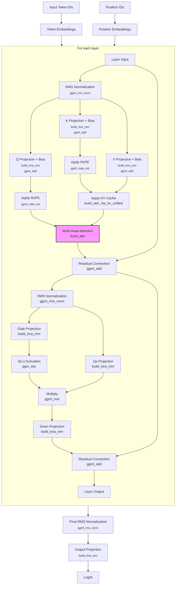
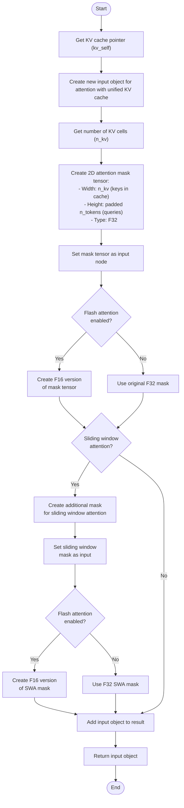
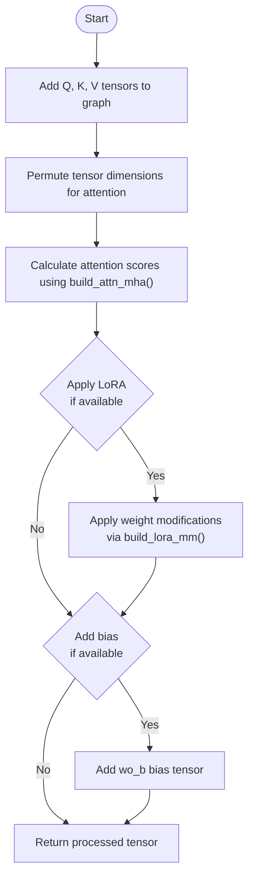
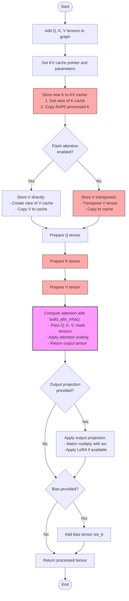
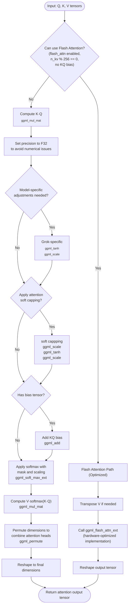
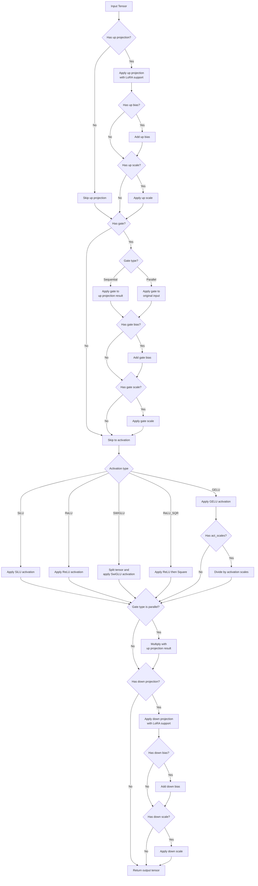

# llama.cpp Decode Graph Build Qwen

## Model Download
- [DeepSeek-R1-Distill-Qwen-14B](https://huggingface.co/bartowski/DeepSeek-R1-Distill-Qwen-14B-GGUF)
- [DeepSeek-R1-Distill-Qwen-7B](https://huggingface.co/unsloth/DeepSeek-R1-Distill-Qwen-7B-GGUF)
- [DeepSeek-R1-Distill-Qwen-1.5B](https://huggingface.co/unsloth/DeepSeek-R1-Distill-Qwen-1.5B-GGUF)
- [DeepSeek-R1-Distill-Qwen-1.5B f16 132](https://huggingface.co/bartowski/DeepSeek-R1-Distill-Qwen-1.5B-GGUF)

## llama.cpp build
```
cmake -B build -DCMAKE_BUILD_TYPE=Debug
cmake --build build
```

For realease version:
```
cmake -B build 
cmake --build build --config Release
```

## 14B model
### model check
```
./llama-cli -m ~/Projects/models/DeepSeek-R1-Distill-Qwen-14B-Q8_0.gguf --verbose
```

#### meta data
- 30 key-value pairs
```
llama_model_loader: - kv   0:                       general.architecture str              = qwen2
llama_model_loader: - kv   2:                               general.name str              = DeepSeek R1 Distill Qwen 14B
llama_model_loader: - kv   3:                           general.basename str              = DeepSeek-R1-Distill-Qwen
llama_model_loader: - kv   4:                         general.size_label str              = 14B
llama_model_loader: - kv   5:                          qwen2.block_count u32              = 48
llama_model_loader: - kv   6:                       qwen2.context_length u32              = 131072
llama_model_loader: - kv   7:                     qwen2.embedding_length u32              = 5120
llama_model_loader: - kv   8:                  qwen2.feed_forward_length u32              = 13824
llama_model_loader: - kv   9:                 qwen2.attention.head_count u32              = 40
llama_model_loader: - kv  10:              qwen2.attention.head_count_kv u32              = 8
llama_model_loader: - kv  13:                       tokenizer.ggml.model str              = gpt2
llama_model_loader: - kv  14:                         tokenizer.ggml.pre str              = deepseek-r1-qwen
llama_model_loader: - type  f32:  241 tensors
llama_model_loader: - type q8_0:  338 tensors
```

## 1.5B model
### model check
```
./llama-simple -m ~/Projects/models/DeepSeek-R1-Distill-Qwen-1.5B-Q8_0.gguf -n 64
```

```
llama_model_loader: loaded meta data with 27 key-value pairs and 339 tensors from /Users/hongbingli/Projects/models/DeepSeek-R1-Distill-Qwen-1.5B-Q8_0.gguf (version GGUF V3 (latest))

llama_model_loader: - kv   0:                       general.architecture str              = qwen2
llama_model_loader: - kv   1:                               general.type str              = model
llama_model_loader: - kv   2:                               general.name str              = DeepSeek R1 Distill Qwen 1.5B
llama_model_loader: - kv   3:                       general.organization str              = Deepseek Ai
llama_model_loader: - kv   4:                           general.basename str              = DeepSeek-R1-Distill-Qwen
llama_model_loader: - kv   5:                         general.size_label str              = 1.5B
llama_model_loader: - kv   6:                          qwen2.block_count u32              = 28
llama_model_loader: - kv   7:                       qwen2.context_length u32              = 131072
llama_model_loader: - kv   8:                     qwen2.embedding_length u32              = 1536
llama_model_loader: - kv   9:                  qwen2.feed_forward_length u32              = 8960
llama_model_loader: - kv  10:                 qwen2.attention.head_count u32              = 12
llama_model_loader: - kv  11:              qwen2.attention.head_count_kv u32              = 2
llama_model_loader: - kv  12:                       qwen2.rope.freq_base f32              = 10000.000000
llama_model_loader: - kv  13:     qwen2.attention.layer_norm_rms_epsilon f32              = 0.000001
llama_model_loader: - kv  14:                          general.file_type u32              = 7
llama_model_loader: - kv  15:                       tokenizer.ggml.model str              = gpt2
llama_model_loader: - kv  16:                         tokenizer.ggml.pre str              = deepseek-r1-qwen
llama_model_loader: - kv  17:                      tokenizer.ggml.tokens arr[str,151936]  = ["!", "\"", "#", "$", "%", "&", "'", ...
llama_model_loader: - kv  18:                  tokenizer.ggml.token_type arr[i32,151936]  = [1, 1, 1, 1, 1, 1, 1, 1, 1, 1, 1, 1, ...
llama_model_loader: - kv  19:                      tokenizer.ggml.merges arr[str,151387]  = ["Ġ Ġ", "ĠĠ ĠĠ", "i n", "Ġ t",...
llama_model_loader: - kv  20:                tokenizer.ggml.bos_token_id u32              = 151646
llama_model_loader: - kv  21:                tokenizer.ggml.eos_token_id u32              = 151643
llama_model_loader: - kv  22:            tokenizer.ggml.padding_token_id u32              = 151654
llama_model_loader: - kv  23:               tokenizer.ggml.add_bos_token bool             = true
llama_model_loader: - kv  24:               tokenizer.ggml.add_eos_token bool             = false
llama_model_loader: - kv  25:                    tokenizer.chat_template str              = {% if not add_generation_prompt is de...
llama_model_loader: - kv  26:               general.quantization_version u32              = 2
llama_model_loader: - type  f32:  141 tensors
llama_model_loader: - type q8_0:  198 tensors
```

## 7B model

### model check
```
./llama-cli -m ~/Projects/models/DeepSeek-R1-Distill-Qwen-7B-Q8_0.gguf --verbose
```

```
register_backend: registered backend Metal (1 devices)
register_device: registered device Metal (Apple M1 Pro)
register_backend: registered backend BLAS (1 devices)
register_device: registered device BLAS (Accelerate)
register_backend: registered backend CPU (1 devices)
register_device: registered device CPU (Apple M1 Pro)
llama_model_load_from_file_impl: using device Metal (Apple M1 Pro) - 10922 MiB free
```

```
llama_model_loader: tensor_name: token_embd.weight, n_elements: 544997376, n_bytes: 579059712.
llama_model_loader: tensor_name: blk.0.attn_norm.weight, n_elements: 545000960, n_bytes: 579074048.
llama_model_loader: tensor_name: blk.0.ffn_down.weight, n_elements: 612896256, n_bytes: 651212800.
llama_model_loader: tensor_name: blk.0.ffn_gate.weight, n_elements: 680791552, n_bytes: 723351552.
llama_model_loader: tensor_name: blk.0.ffn_up.weight, n_elements: 748686848, n_bytes: 795490304.
llama_model_loader: tensor_name: blk.0.ffn_norm.weight, n_elements: 748690432, n_bytes: 795504640.
llama_model_loader: tensor_name: blk.0.attn_k.bias, n_elements: 748690944, n_bytes: 795506688.
llama_model_loader: tensor_name: blk.0.attn_k.weight, n_elements: 750525952, n_bytes: 797456384.
llama_model_loader: tensor_name: blk.0.attn_output.weight, n_elements: 763371008, n_bytes: 811104256.
llama_model_loader: tensor_name: blk.0.attn_q.bias, n_elements: 763374592, n_bytes: 811118592.
llama_model_loader: tensor_name: blk.0.attn_q.weight, n_elements: 776219648, n_bytes: 824766464.
llama_model_loader: tensor_name: blk.0.attn_v.bias, n_elements: 776220160, n_bytes: 824768512.
llama_model_loader: tensor_name: blk.0.attn_v.weight, n_elements: 778055168, n_bytes: 826718208.
...
llama_model_loader: tensor_name: blk.27.attn_norm.weight, n_elements: 6837561344, n_bytes: 7265853440.
llama_model_loader: tensor_name: blk.27.ffn_down.weight, n_elements: 6905456640, n_bytes: 7337992192.
llama_model_loader: tensor_name: blk.27.ffn_gate.weight, n_elements: 6973351936, n_bytes: 7410130944.
llama_model_loader: tensor_name: blk.27.ffn_up.weight, n_elements: 7041247232, n_bytes: 7482269696.
llama_model_loader: tensor_name: blk.27.ffn_norm.weight, n_elements: 7041250816, n_bytes: 7482284032.
llama_model_loader: tensor_name: blk.27.attn_k.bias, n_elements: 7041251328, n_bytes: 7482286080.
llama_model_loader: tensor_name: blk.27.attn_k.weight, n_elements: 7043086336, n_bytes: 7484235776.
llama_model_loader: tensor_name: blk.27.attn_output.weight, n_elements: 7055931392, n_bytes: 7497883648.
llama_model_loader: tensor_name: blk.27.attn_q.bias, n_elements: 7055934976, n_bytes: 7497897984.
llama_model_loader: tensor_name: blk.27.attn_q.weight, n_elements: 7068780032, n_bytes: 7511545856.
llama_model_loader: tensor_name: blk.27.attn_v.bias, n_elements: 7068780544, n_bytes: 7511547904.
llama_model_loader: tensor_name: blk.27.attn_v.weight, n_elements: 7070615552, n_bytes: 7513497600.
llama_model_loader: tensor_name: output_norm.weight, n_elements: 7070619136, n_bytes: 7513511936.
llama_model_loader: tensor_name: output.weight, n_elements: 7615616512, n_bytes: 8092571648.
```

- For QWEN2, 1 embedding weight tensor, 1 output norm weight tensor, 1 output weight tensor. 12 weight and bias tensors for each layer, 28 layers.
So the total is 1 + 2 + 12 * 28 = 339 tensors.

```
            case LLM_ARCH_QWEN2:
            case LLM_ARCH_QWEN2VL:
                {
                    tok_embd = create_tensor(tn(LLM_TENSOR_TOKEN_EMBD, "weight"), {n_embd, n_vocab}, 0);

                    // output
                    output_norm = create_tensor(tn(LLM_TENSOR_OUTPUT_NORM, "weight"), {n_embd}, 0);
                    output      = create_tensor(tn(LLM_TENSOR_OUTPUT,      "weight"), {n_embd, n_vocab}, TENSOR_NOT_REQUIRED);
                    // if output is NULL, init from the input tok embed
                    if (output == NULL) {
                        output = create_tensor(tn(LLM_TENSOR_TOKEN_EMBD, "weight"), {n_embd, n_vocab}, TENSOR_DUPLICATED);
                    }

                    for (int i = 0; i < n_layer; ++i) {
                        auto & layer = layers[i];

                        layer.attn_norm = create_tensor(tn(LLM_TENSOR_ATTN_NORM, "weight", i), {n_embd}, 0);

                        layer.wq = create_tensor(tn(LLM_TENSOR_ATTN_Q,   "weight", i), {n_embd, n_embd}, 0);
                        layer.wk = create_tensor(tn(LLM_TENSOR_ATTN_K,   "weight", i), {n_embd, n_embd_gqa}, 0);
                        layer.wv = create_tensor(tn(LLM_TENSOR_ATTN_V,   "weight", i), {n_embd, n_embd_gqa}, 0);
                        layer.wo = create_tensor(tn(LLM_TENSOR_ATTN_OUT, "weight", i), {n_embd, n_embd}, 0);

                        // optional bias tensors
                        layer.bq = create_tensor(tn(LLM_TENSOR_ATTN_Q,   "bias", i), {n_embd}, 0);
                        layer.bk = create_tensor(tn(LLM_TENSOR_ATTN_K,   "bias", i), {n_embd_gqa}, 0);
                        layer.bv = create_tensor(tn(LLM_TENSOR_ATTN_V,   "bias", i), {n_embd_gqa}, 0);

                        layer.ffn_norm = create_tensor(tn(LLM_TENSOR_FFN_NORM, "weight", i), {n_embd}, 0);

                        layer.ffn_gate = create_tensor(tn(LLM_TENSOR_FFN_GATE, "weight", i), {n_embd,   n_ff}, 0);
                        layer.ffn_down = create_tensor(tn(LLM_TENSOR_FFN_DOWN, "weight", i), {  n_ff, n_embd}, 0);
                        layer.ffn_up   = create_tensor(tn(LLM_TENSOR_FFN_UP,   "weight", i), {n_embd,   n_ff}, 0);
                    }
                } break;
```               

- The weights and bias of all layers have the same shape and type
```
tok_emdb shape: [3584,152064,1,1], type: 8
output_norm shape: [3584,1,1,1], type: 0
output shape: [3584,152064,1,1], type: 8
layer 0
layer.attn_norm shape: [3584,1,1,1], type: 0
layer.wq shape: [3584,3584,1,1], type: 8
layer.wk shape: [3584,512,1,1], type: 8
layer.wv shape: [3584,512,1,1], type: 8
layer.wo shape: [3584,3584,1,1], type: 8
layer.bq shape: [3584,1,1,1], type: 0
layer.bk shape: [512,1,1,1], type: 0
layer.bv shape: [512,1,1,1], type: 0
layer.ffn_norm shape: [3584,1,1,1], type: 0
layer.ffn_gate shape: [3584,18944,1,1], type: 8
layer.ffn_down shape: [18944,3584,1,1], type: 8
layer.ffn_up shape: [3584,18944,1,1], type: 8
...
layer 27
layer.attn_norm shape: [3584,1,1,1], type: 0
layer.wq shape: [3584,3584,1,1], type: 8
layer.wk shape: [3584,512,1,1], type: 8
layer.wv shape: [3584,512,1,1], type: 8
layer.wo shape: [3584,3584,1,1], type: 8
layer.bq shape: [3584,1,1,1], type: 0
layer.bk shape: [512,1,1,1], type: 0
layer.bv shape: [512,1,1,1], type: 0
layer.ffn_norm shape: [3584,1,1,1], type: 0
layer.ffn_gate shape: [3584,18944,1,1], type: 8
layer.ffn_down shape: [18944,3584,1,1], type: 8
layer.ffn_up shape: [3584,18944,1,1], type: 8
```

```
llama_model_loader: loaded meta data with 27 key-value pairs and 339 tensors from /Users/hongbingli/Projects/models/DeepSeek-R1-Distill-Qwen-7B-Q8_0.gguf (version GGUF V3 (latest))
```

#### meta data
- 27 key-value pairs
```
llama_model_loader: - kv   0:                       general.architecture str              = qwen2
llama_model_loader: - kv   1:                               general.type str              = model
llama_model_loader: - kv   2:                               general.name str              = DeepSeek R1 Distill Qwen 7B
llama_model_loader: - kv   3:                       general.organization str              = Deepseek Ai
llama_model_loader: - kv   4:                           general.basename str              = DeepSeek-R1-Distill-Qwen
llama_model_loader: - kv   5:                         general.size_label str              = 7B
llama_model_loader: - kv   6:                          qwen2.block_count u32              = 28
llama_model_loader: - kv   7:                       qwen2.context_length u32              = 131072
llama_model_loader: - kv   8:                     qwen2.embedding_length u32              = 3584
llama_model_loader: - kv   9:                  qwen2.feed_forward_length u32              = 18944
llama_model_loader: - kv  10:                 qwen2.attention.head_count u32              = 28
llama_model_loader: - kv  11:              qwen2.attention.head_count_kv u32              = 4
llama_model_loader: - kv  12:                       qwen2.rope.freq_base f32              = 10000.000000
llama_model_loader: - kv  13:     qwen2.attention.layer_norm_rms_epsilon f32              = 0.000001
llama_model_loader: - kv  14:                          general.file_type u32              = 7
llama_model_loader: - kv  15:                       tokenizer.ggml.model str              = gpt2
llama_model_loader: - kv  16:                         tokenizer.ggml.pre str              = deepseek-r1-qwen
llama_model_loader: - kv  17:                      tokenizer.ggml.tokens arr[str,152064]  = ["!", "\"", "#", "$", "%", "&", "'", ...
llama_model_loader: - kv  18:                  tokenizer.ggml.token_type arr[i32,152064]  = [1, 1, 1, 1, 1, 1, 1, 1, 1, 1, 1, 1, ...
llama_model_loader: - kv  19:                      tokenizer.ggml.merges arr[str,151387]  = ["Ġ Ġ", "ĠĠ ĠĠ", "i n", "Ġ t",...
llama_model_loader: - kv  20:                tokenizer.ggml.bos_token_id u32              = 151646
llama_model_loader: - kv  21:                tokenizer.ggml.eos_token_id u32              = 151643
llama_model_loader: - kv  22:            tokenizer.ggml.padding_token_id u32              = 151654
llama_model_loader: - kv  23:               tokenizer.ggml.add_bos_token bool             = true
llama_model_loader: - kv  24:               tokenizer.ggml.add_eos_token bool             = false
llama_model_loader: - kv  25:                    tokenizer.chat_template str              = {% if not add_generation_prompt is de...
llama_model_loader: - kv  26:               general.quantization_version u32              = 2
llama_model_loader: - type  f32:  141 tensors
llama_model_loader: - type q8_0:  198 tensors
```

- Head count: 28
- Each head dimemsion: 3584 / 28 = 128
- GQA group number: 4
- Heads per group: 7 (4 * 7 = 28)
- All heads within the same group share the same K and V. 

#### How It Works Step-by-Step
1. Input Embedding: Start with an input embedding of size 3584.
2. Query Computation:
   - A weight matrix 𝑊𝑄 of shape [3584, 3584] (or split into 28 heads with [3584, 128] per head) transforms the input into 28 query vectors, each 128-dimensional.
   - Total query size: 28 × 128 = 3584.
3. Key/Value Computation:
   - A weight matrix 𝑊𝐾 of shape [3584, 512] transforms the input into key vectors. Since there are 4 groups, this produces 4 key vectors, each 128-dimensional (4 × 128 = 512).
   - Similarly, 𝑊𝑉 of shape [3584, 512] produces 4 value vectors, each 128-dimensional.
   - These 4 key and 4 value vectors correspond to the 4 groups.
4. Sharing in Groups:
   - Each of the 4 groups gets one 128-dimensional key vector and one 128-dimensional value vector.
   - Within each group, all 7 query heads (each with their own 128-dimensional query vector) use the same group-specific key and value vectors to compute attention.
5. Output: The outputs from all 28 heads are concatenated (28 × 128 = 3584) and typically passed through an output projection layer to produce the final result.

## Required OPs 
- RMS Normalization
- Add (Bias, Residual connection)
- RoPE (For Q, K)
- SiLU (FFN activation)
- Mul (LoRA and FFN)
- Lookup (get_rows, Token embedding)
- MatMul (LoRA, Token embedding)
- Scale (LoRA, Token embedding)
- Reshape (Attention)
- Tanh (Attention Soft capping)
- Softmax (Attention)
- Permute (Attention)

## Extract weights from GGUF

- Clone the llama.cpp repo and use its Python bindings:

```
cd /path/to/llama.cpp
pip install -e .  # Installs llama.cpp Python package locally
```

- This gives access to gguf utilities. Alternatively, install gguf standalone if available:
```
pip install gguf
```

- Run [GGUF_tensor_extract](./code/GGUF_tensor_extract.py) script
   - Show all avialable tensors
   ```
   python GGUF_tensor_extract.py -m ~/Projects/models/DeepSeek-R1-Distill-Qwen-1.5B-f16.gguf
   ```

   - Extract one specific tensor (blk.0.ffn_down.weight, index: 11)
   ```
   python GGUF_tensor_extract.py -m ~/Projects/models/DeepSeek-R1-Distill-Qwen-1.5B-f16.gguf --index 11 --output weights/blk.0.ffn_down.weight.npy
   ```

   - Extract all tensors
   ```
   python GGUF_tensor_extract.py --model ~/Projects/models/DeepSeek-R1-Distill-Qwen-1.5B-f16.gguf --extract-all --output-dir weights_1.5B_f16
   ```

## Create ONNX models
```
python ffn.py --embed_dim 1536 --hidden_dim 8960 --load_weights --down_proj_weights weights_1.5B_f16/blk.0.ffn_down.weight.npy --gate_proj_weights weights_1.5B_f16/blk.0.ffn_gate.weight.npy --up_proj_weights weights_1.5B_f16/blk.0.ffn_up.weight.npy --dtype float16 --save_path models_1.5B_f16/blk.0.ffn
```

### Automating FFN Model Extraction for All Blocks

1. Modify the bash script [extract_all_ffn_blocks.sh](./code/extract_all_ffn_blocks.sh) accordingly

2. Make the script executable:
   ```bash
   chmod +x extract_all_ffn_blocks.sh
   ```

3. Run the script:
   ```bash
   ./extract_all_ffn_blocks.sh
   ```

## llm_build_qwen2() in llama-model.cpp

Here's a Mermaid flow chart that visualizes the computational graph for the Qwen2 architecture as implemented in `llm_build_qwen2()`:
- No LORA



### Key Components

1. **Input Processing**
   - Convert token IDs to embeddings
   - Generate position embeddings

2. **Transformer Layers**
   - **Attention Block**
     - RMS normalization
     - Q, K, V projections with biases
     - Rotary position embeddings (RoPE)
     - Scaled dot-product attention
     - Output projection with bias
     - Residual connection

   - **Feed-Forward Network**
     - RMS normalization
     - Parallel gate and up projections
     - SiLU activation on gate path
     - Element-wise multiplication
     - Down projection
     - Residual connection

3. **Output Processing**
   - Final RMS normalization
   - Output projection to vocabulary size

This architecture follows the standard decoder-only transformer design with some Qwen2-specific features like RMS normalization and SiLU activations in a parallel feed-forward configuration.

### Qwen2 Architecture Specifics

The function implements Qwen2-specific features:
- RMS normalization (different from LayerNorm)
- Separate, explicit Q, K, V projection matrices (with biases)
- Rotary position embeddings without alibi
- SiLU (Swish) activations in feed-forward network
- Parallel feed-forward network structure

## `llm_graph_context::build_inp_embd()` in `llama-graph.cpp`

This function creates the initial embedding vectors for tokens, which is the first transformation in the language model's forward pass.

```mermaid
flowchart TD
    start([Start]) --> check_input{"Input type?"}
    
    check_input -->|Token IDs| create_tokens["Create tensor for token IDs
    ggml_new_tensor_1d()"]
    check_input -->|Embeddings| create_embd["Create tensor for embeddings
    ggml_new_tensor_2d()"]
    
    create_tokens --> lookup["Look up embeddings
    ggml_get_rows"]
    create_embd --> use_direct["Use embeddings directly"]
    
    lookup --> has_lora{"Any LoRA
    adapters?"}
    
    has_lora -->|Yes| lora_loop["For each applicable LoRA adapter"]
    has_lora -->|No| scale_check
    
    lora_loop --> get_weight["Get LoRA weights for embeddings"]
    get_weight --> apply_lora["Apply LoRA modification:
    ∆ = scale * B·(A·tokens)<br>ggml_get_rows<br>ggml_mul_mat<br>ggml_scale"]
    apply_lora --> add_delta["Add modification:
    cur = cur + ∆<br>ggml_add"]
    add_delta --> more_loras{"More adapters?"}
    
    more_loras -->|Yes| lora_loop
    more_loras -->|No| scale_check
    
    use_direct --> scale_check{"Needs embedding
    scaling?"}
    
    scale_check -->|Yes| apply_scale["Apply embedding scale<br>
    ggml_scale"]
    scale_check -->|No| callback
    
    apply_scale --> callback["Call callback function
    "]
    
    callback --> return["Return embedding tensor"]
  ```

### Key Operations

1. **Input Processing**:
   - Creates appropriate tensors based on input type (token IDs or direct embeddings)
   - Marks tensors for external input (to be filled later)

2. **Token to Embedding Conversion**:
   - For token IDs: Performs lookup in the embedding table using `ggml_get_rows`
   - For embeddings: Uses the provided embeddings directly 

3. **LoRA Adaptation** (if applicable):
   - Applies low-rank adaptation to embeddings
   - Enables fine-tuned behavior without modifying base embeddings
   - Computes `∆ = scale * B·(A·tokens)` for each adapter
   - Adds these modifications to base embeddings

4. **Architecture-Specific Processing**:
   - Applies embedding scale factor for certain architectures (e.g., Granite)

5. **Result Handling**:
   - Registers the input handler for later use
   - Returns the processed embeddings for use in subsequent layers

This is the first step in the model's computation path, converting discrete tokens into continuous vector representations.

## `llm_graph_context::build_inp_pos()` in `llama-graph.cpp`

This function creates a tensor for position information in the computation graph, which is crucial for position-aware operations in transformer models.

### Purpose

The position tensor is essential for transformers because:

1. **Sequence Order**: Transformer models need to understand token positions in sequences
2. **RoPE (Rotary Position Embeddings)**: Positions are used to calculate rotation angles
3. **Attention Calculations**: Positions determine which tokens can attend to each other

### Key Details

- Creates an INT32 tensor to hold position values
- Size depends on:
  - `n_tokens`: Number of tokens in the batch
  - `n_pos_per_token()`: Returns 4 for Qwen2VL models, 1 for all others
- Marks the tensor as an "input tensor" which will be filled later
- The actual position values are set by `set_input()` when the model runs

### Related Functions

The position information is later used by:
- RoPE calculations in attention mechanisms
- Relative position bias computations
- Attention masking to enforce causal attention

This function is critical for position-awareness in transformers, which would otherwise be permutation-invariant.

## `llm_graph_context::build_lora_mm()` in `llama-graph.cpp`

The `build_lora_mm()` function implements Low-Rank Adaptation (LoRA) in the llama.cpp inference process. LoRA is a parameter-efficient fine-tuning technique that allows adapting pre-trained models with minimal additional parameters.

```mermaid
flowchart TD
    start([Start]) --> standard_mm["Standard Matrix Multiplication:
    res = W·cur"<br> <sub>ggml_mul_mat</sub>]
    
    standard_mm --> has_loras{"Any LoRA
    adapters?"}
    
    has_loras -->|No| return_res["Return res"]
    
    has_loras -->|Yes| lora_loop["For each LoRA adapter"]
    
    lora_loop --> has_weights{"Adapter has
    weights for W?"}
    
    has_weights -->|No| next_lora["Next adapter"]
    next_lora --> lora_loop
    
    has_weights -->|Yes| compute_a["Compute A·cur<br> <sub>ggml_mul_mat</sub>"]
    compute_a --> compute_b["Compute B·(A·cur)<br> <sub>ggml_mul_mat</sub>"]
    compute_b --> scale["Scale result by adapter factor<br> <sub>ggml_scale</sub>"]
    scale --> add["Add to original: 
    res = res + scale·B·(A·cur)<br> <sub>ggml_add</sub>"]
    
    add --> more_adapters{"More adapters?"}
    more_adapters -->|Yes| next_lora
    more_adapters -->|No| return_res
    
    return_res --> finish([End])
    
    classDef process fill:#f9f,stroke:#333,stroke-width:1px;
    classDef decision fill:#bbf,stroke:#333,stroke-width:1px;
    
    class standard_mm,compute_a,compute_b,scale,add process;
    class has_loras,has_weights,more_adapters decision;
```

### How LoRA Works in This Function

1. **Base Computation**: First computes the standard matrix multiplication `W·x` between original weights and input

2. **For Each LoRA Adapter**:
   - Retrieves adapter-specific weights for the given tensor
   - Calculates the adaptation by computing `B·(A·x)` where A and B are low-rank matrices
   - Scales the result by the adapter's scaling factor
   - Adds this adaptation to the original result

3. **Mathematical Equivalent**: 
   - Original: `y = W·x`
   - With LoRA: `y = W·x + (BA)·x = W·x + B·(A·x)`

This function effectively implements the core LoRA equation: `W' = W + BA` where the adapted weight `W'` is used instead of the original weight `W`, but without explicitly materializing the full `W'` matrix - saving memory and computation.

The function handles multiple LoRA adapters simultaneously, allowing for composable adaptations of the base model.

## build_attn_inp_kv_unified 

- llama-graph.cpp

The `build_attn_inp_kv_unified()` function creates and initializes tensor structures needed for attention operations that work with the unified KV cache. It prepares attention masks that control which keys in the cache each query token can attend to.



### Key Points

1. **Purpose**: Creates attention mask tensors that control the visibility between query tokens and key-value pairs in the KV cache.

2. **Mask dimensions**: The mask is sized to fit all active keys in the cache (width) and all query tokens in the current batch (height).

3. **Format optimizations**: Creates half-precision (F16) versions of masks when using flash attention for better GPU performance.

4. **Special cases**: Creates additional masks for sliding window attention (SWA) when enabled, which limits each token's attention to a fixed context window.

The actual content of these masks will be populated later by the `set_input()` method based on sequence relationships, causal attention constraints, and position patterns.

## build_attn()

- llama-graph.cpp

The `build_attn()` function is one of the core computational components of llama.cpp, responsible for constructing the attention mechanism in the transformer architecture. It has three overloaded versions for different attention scenarios.



### Version Differences

1. **With No KV Cache** (`llm_graph_input_attn_no_cache`):
   - Directly computes attention between all queries and keys in the current batch
   - All computation happens for tokens in the current context only

2. **With Unified KV Cache** (`llm_graph_input_attn_kv_unified`):
   - Stores new K and V tensors in the KV cache
   - Retrieves previously computed K and V values from the cache
   - Enables efficient inference by avoiding redundant computations
   - Supports sliding window attention optimization

3. **Cross-Attention** (`llm_graph_input_attn_cross`):
   - Handles attention between different sequences (encoder-decoder models)
   - Manages cross-attention masks between sequences

Each version calls `build_attn_mha()` which computes the multi-head attention using either standard attention or Flash Attention when available, applying optimizations like softmax scaling and alibi position bias.

## build_attn() with Unified KV Cache Attention

- llama-graph.cpp



The flowchart shows how the function efficiently:
1. Stores new keys and values in the KV cache
2. Retrieves and formats all necessary keys and values from the cache
3. Correctly handles special cases like sliding window attention
4. Manages tensor transposition based on the attention implementation
5. Applies projections and biases to the attention output

This unified approach allows reusing previously computed key-value pairs, which is essential for efficient autoregressive inference.

## `llm_graph_context::build_attn_mha()` in `llama-graph.cpp`

The `build_attn_mha()` function implements the multi-head attention mechanism, which is the core component that allows transformer models to dynamically focus on different parts of the input.



### Key Steps in the Function

1. **Decision Point**: Choose between Flash Attention (optimized) or standard attention path
   
2. **Flash Attention Path**:
   - Transpose V tensor if needed
   - Use optimized `ggml_flash_attn_ext` operation
   - Set precision and reshape output

3. **Standard Attention Path**:
   - Compute query-key product (`K·Q`)
   - Apply model-specific adjustments (e.g., GROK scaling)
   - Handle attention logit soft capping if enabled
   - Add bias if provided
   - Apply softmax with mask to get attention weights
   - Calculate weighted values (`V·softmax(K·Q)`)
   - Reshape and permute dimensions for final output format

4. **Backend Selection**:
   - Optionally force CPU execution for this operation

This function is critical for model performance as attention operations are among the most computationally intensive parts of transformer inference.

## `llm_graph_context::build_ffn()` in `llma-graph.cpp`

The `build_ffn()` function constructs the feed-forward network (FFN) component of transformer models in llama.cpp's computational graph. This is a crucial part of each transformer layer that processes token representations after the attention mechanism.



### Key Components

1. **Up-Projection**
   - Expands the input's dimensionality
   - Applies LoRA fine-tuning if available
   - Optionally adds bias and scaling

2. **Gating Mechanisms**
   - **Sequential Gate**: Applied after up-projection
   - **Parallel Gate**: Applied to original input in parallel with up-projection
   - Both support bias and scaling

3. **Activation Functions**
   - **SiLU** (Sigmoid Linear Unit): `x * sigmoid(x)`
   - **GELU** (Gaussian Error Linear Unit): Smooth approximation of ReLU
   - **ReLU** (Rectified Linear Unit): `max(0, x)`
   - **ReLU-SQR**: Applies ReLU then squares the result
   - **SwiGLU**: Splits tensor and applies special activation

4. **Down-Projection**
   - Projects dimensions back to original size
   - Applies LoRA fine-tuning if available
   - Optionally adds bias and scaling

This highly flexible implementation can support various modern transformer architectures including LLaMA, Falcon, GPT-J, Qwen, and others with their specific variations.

## `llm_graph_context::build_cvec()` in `llama-graph.cpp`

The `build_cvec()` function applies conditioning vectors to the model's internal representations, which is a technique used for controlled generation or steering in language models.

### Purpose

This function is part of llama.cpp's conditioning system that allows you to manipulate the model's internal activations to guide or steer its output in specific directions.

### Key Functionality

The function acts as a thin wrapper around the `apply_to()` method of a conditioning vector object (`cvec`), which:

1. Receives the current tensor representation (`cur`) at a specific layer (`il`)
2. Uses the ggml context (`ctx0`) to create necessary computation nodes
3. Returns a modified tensor with the conditioning applied

### How It's Used

Conditioning vectors are applied at specific points in the model's forward pass, typically:

1. After self-attention layers
2. After feed-forward networks
3. At specific layers where intervention is desired

### Applications

In llama.cpp, this functionality enables:

- **Logit manipulation**: Steering text generation toward or away from certain topics
- **Classifier-free guidance**: Similar to techniques used in image diffusion models
- **Concept steering**: Amplifying or suppressing specific concepts in generated text
- **Style control**: Modifying the writing style or tone of generated text

This is part of llama.cpp's more advanced control features that allow fine-grained influence over model behavior without full fine-tuning.
