# LLM Concepts (Charts & Tables)

This note uses diagrams and tables to explain core LLM ideas: **tokens**, **context windows**, **RAG**, **agents**, **LLM wikis**, **agent frameworks**, **consumer chat apps** (ChatGPT, Claude, Gemini, Grok), and **coding-agent products** (Cursor, Claude Code, Codex, …).

---

## Cheat sheet — how the layers fit

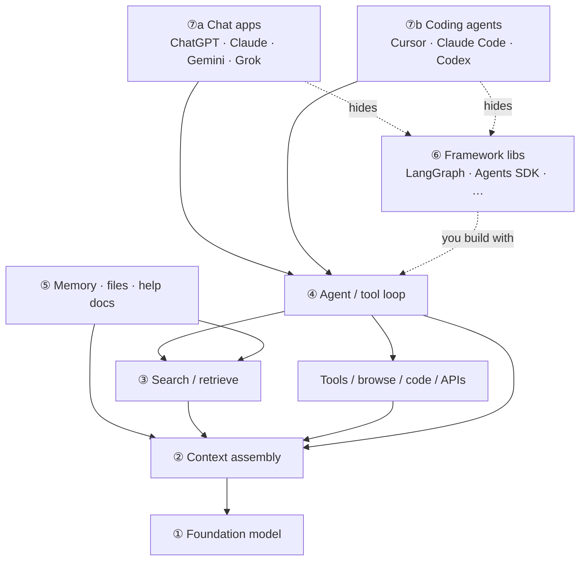

| Layer | One-liner | Jump |
|---|---|---|
| **① LLM** | Autoregressive next-token predictor (the *model*) | [§1](#1-what-an-llm-does-next-token-loop) |
| **② Tokens / context** | Everything must fit (and be paid for) in the window | [§2](#2-tokens--context-window-why-size-matters) |
| **③ RAG** | Fetch *relevant* chunks; large windows don’t replace indexes | [§3](#3-rag-vs-large-context--is-rag-still-necessary) |
| **④ Agent** | Loop that chooses tools/RAG until the goal is done | [§4](#4-agents--from-one-shot-to-a-control-loop) |
| **⑤ LLM wiki** | Curated, citable knowledge the retriever/agent reads | [§5](#5-llm-wiki--grounded-knowledge-for-orgs--agents) |
| **⑥ Framework** | Libraries *you* embed to wire the loop | [§6](#6-agent-frameworks--who-orchestrates-the-loop) |
| **⑦a Chat apps** | ChatGPT / Claude.ai / Gemini / Grok — *products*, not bare LLMs | [§7](#7-consumer-chat-apps--chatgpt-claude-gemini-grok) |
| **⑦b Coding agents** | Cursor / Claude Code / Codex — coding-agent products | [§8](#8-coding-agent-products--cursor-claude-code-codex-) |

| Don’t confuse… | With… |
|---|---|
| **ChatGPT / Claude.ai / Gemini / Grok** | The raw **LLM API** / model weights alone |
| **Bigger context** | A full company corpus (still need **RAG** / wiki) |
| **RAG** | An **agent** (RAG answers; agents also *do*) |
| **Wiki dump** | An **LLM wiki** (structure, metadata, ACLs, review) |
| **Framework (§6)** | **Product (§7/§8)** — libs you build with vs apps you use |

**Rules of thumb:** **model** = next-token engine · **chat app** = model + context manager + tools + UI · weights = what it *learned* · context = what it *sees now* · RAG/wiki = what it can *look up* · tools = what it can *do* · framework = *how* you code the loop · evals = whether it *works*.

---

## 1. What an LLM Does (Next-Token Loop)

At its core, an LLM is an **autoregressive next-token predictor**. It does not write sentences all at once; it estimates which token should come next, appends it, and repeats.

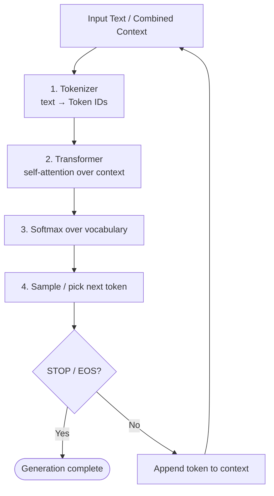

### Loop with example tokens

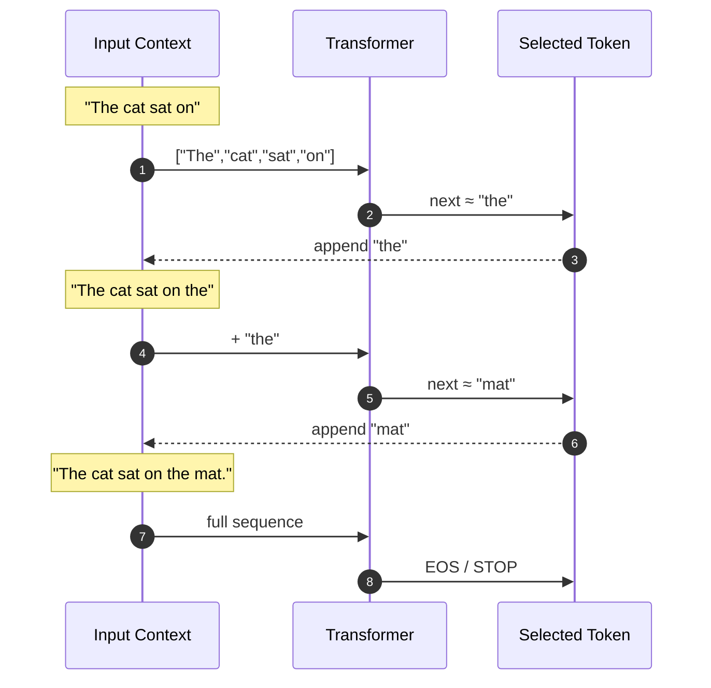

| Concept | Meaning |
|---|---|
| **Token** | Subword / word piece the model reads & writes (not always a full word) |
| **Context window** | Max tokens the model can attend to in one forward pass (prompt + generation so far) |
| **Params (weights)** | What the model *learned* at train time |
| **Context (prompt)** | What you *give* at inference time (docs, tools, chat history) |

---

## 2. Tokens & Context Window (Why Size Matters)

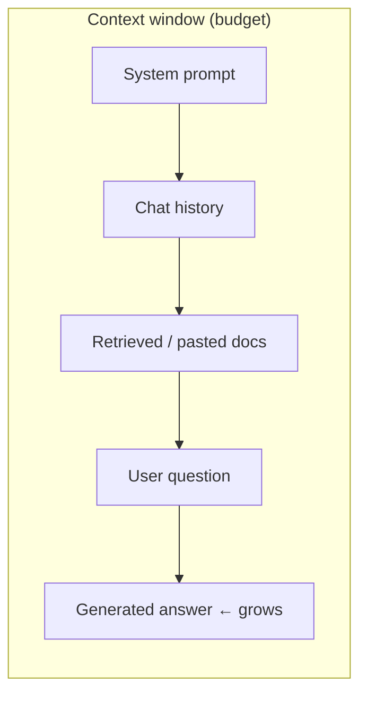

| Window size | Rough intuition | Typical use |
|---|---|---|
| 4k–8k | Short chat + small snippet | Simple Q&A |
| 32k–128k | Long thread or several PDFs | Many “just paste it” workflows |
| 200k–1M+ | Book-scale / large corpora *in theory* | Long-doc analysis, agent traces |

**Cost note:** Attention is roughly **O(n²)** in sequence length (or still expensive even with linear/sparse tricks). Bigger windows ≠ free.

---

## 3. RAG vs Large Context — Is RAG Still Necessary?

### Short answer

**Yes, RAG is still necessary for most production systems.**  
A large context window **reduces** how often you need retrieval for *medium* corpora, but it does **not** replace RAG when knowledge is large, changing, private, or must be cited selectively.

### Two ways to give the model external knowledge

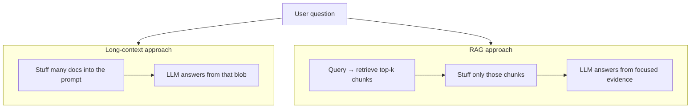

### Comparison table

| Dimension | Large context only (“stuff everything”) | RAG (retrieve, then generate) |
|---|---|---|
| **Corpus size** | Breaks when data ≫ window (or becomes huge prompts) | Scales to millions of chunks via an index |
| **Freshness** | Must re-paste / re-upload when docs change | Re-index or update vectors; prompt stays small |
| **Cost / latency** | Pay for *all* tokens every request | Pay for query + top-k chunks (+ embedding search) |
| **Signal quality** | “Lost in the middle”: important facts get diluted in long prompts | Top-k focuses attention on relevant passages |
| **Privacy / tenancy** | Entire corpus may enter the prompt vendor’s context | Can retrieve only per-user / per-tenant slices |
| **Citations** | Harder to know *which* page mattered | Natural: return retrieved chunk IDs / URLs |
| **When it wins** | Single book, one large PDF, short-lived session memory | Enterprise wiki, codebases, tickets, policies, product catalogs |

### Decision guide

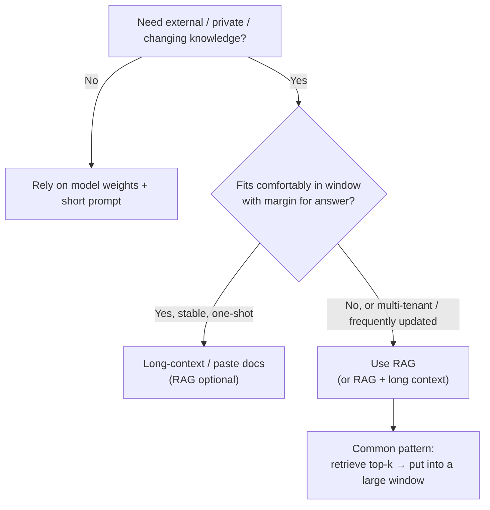

### Practical rule of thumb

| Situation | Prefer |
|---|---|
| One PDF / meeting transcript / ticket thread | Long context (maybe no RAG) |
| Company wiki, Confluence, Notion, drive with 10k+ pages | **RAG** |
| Codebase Q&A across many repos | **RAG** (+ optional repo map) |
| News / inventory / prices that change daily | **RAG** (or tools/APIs) |
| Agent with tools that *fetch* facts | Tools ≈ live RAG; still not “all in weights” |

**Bottom line:** Large windows make RAG **smarter and simpler** (retrieve fewer, larger chunks; keep more history), but they do **not** make “put the whole internet / whole company drive in the prompt” viable. RAG remains the default for **scalable, updatable, attributable** knowledge.

---

## 4. Agents — From One Shot to a Control Loop

A **chat completion** is one forward pass (plus token loop). An **agent** wraps the LLM in a **control loop** that can call **tools**, read **observations**, and decide whether to act again or stop.

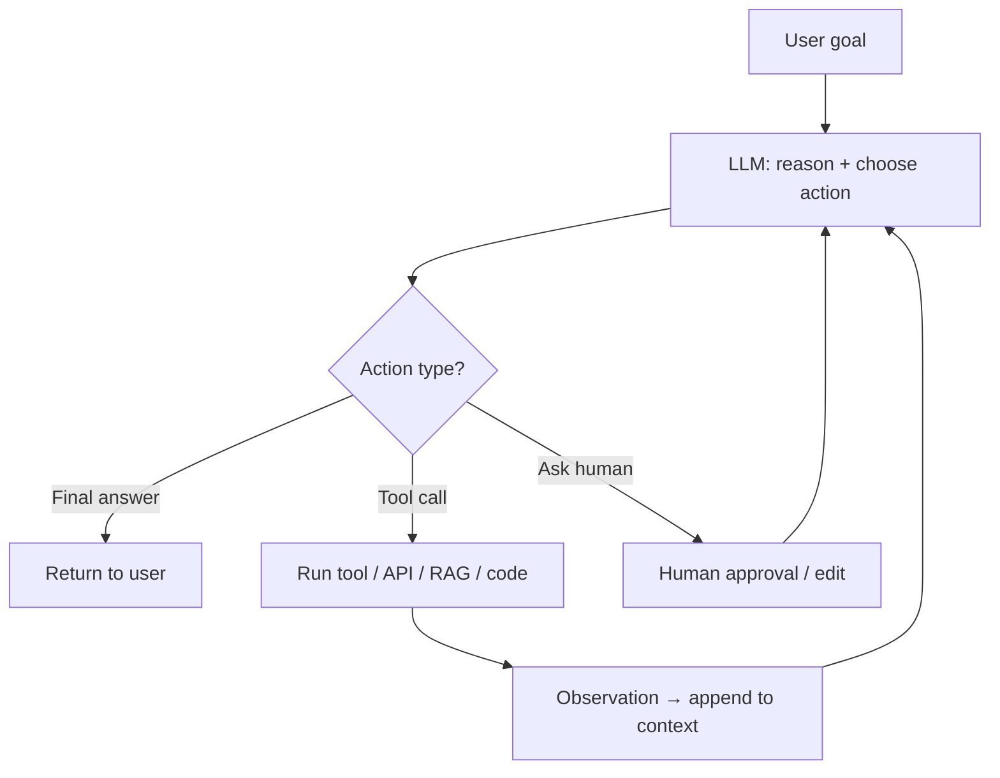

### Building blocks

| Piece | Role | Examples |
|---|---|---|
| **LLM** | Policy: what to do next (in language / structured JSON) | GPT, Claude, Llama, Qwen |
| **Tools** | Side effects & fresh facts | Search, SQL, calendar, code exec, browser |
| **Memory (short)** | Current scratchpad in the context window | Chat turns, tool results |
| **Memory (long)** | Durable store outside the window | Vector DB, wiki, SQL, files |
| **Orchestration** | Who runs when; stop conditions | ReAct loop, graph, multi-agent handoff |
| **Guardrails** | Safety / schema / budget | Max steps, allowlists, PII filters |

### Chatbot vs RAG vs Agent

| | Chatbot (no tools) | RAG app | Agent |
|---|---|---|---|
| **Knowledge** | Weights only | Weights + retrieved chunks | Weights + retrieve **and/or** tools |
| **Steps** | 1 generation | Retrieve → 1 generation | Many steps until done |
| **Side effects** | None | Usually none | Can write tickets, send mail, run code |
| **Failure mode** | Hallucination | Bad retrieval / wrong chunk | Loops, wrong tool, cost blow-ups |
| **Best for** | Writing, brainstorming | Q&A over docs | Workflows that need *doing*, not only *saying* |

### Common control patterns

**ReAct** (Reason + Act) — interleaved thought and tool use:

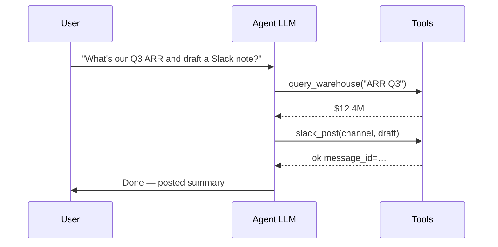

**Plan-then-execute** — plan once, then run steps (fewer open-ended loops):

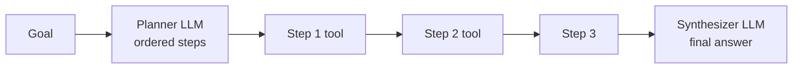

**Multi-agent** — specialized roles + handoffs (researcher / coder / reviewer):

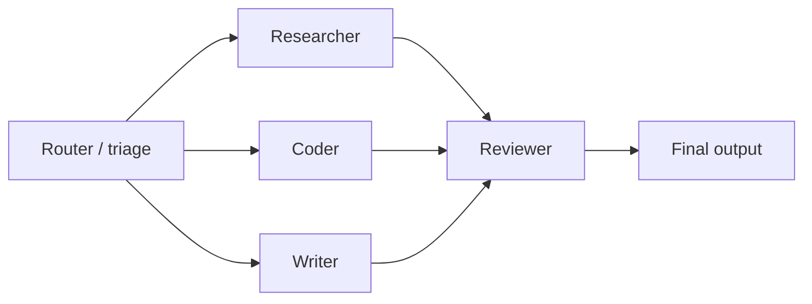

| Pattern | Strength | Weakness |
|---|---|---|
| **ReAct** | Flexible; good for unknown paths | Can wander; needs step/cost caps |
| **Plan-execute** | Predictable, easier to audit | Bad plans waste the whole run |
| **Multi-agent** | Division of labor, clearer prompts | Coordination overhead; harder to debug |
| **Human-in-the-loop** | Safe for irreversible actions | Latency; needs UX for approvals |

### Memory layers (agents still need RAG)

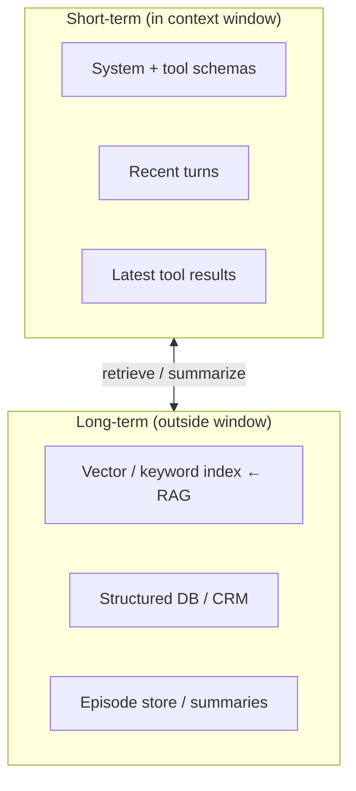

**Takeaway:** Agents **use** RAG and tools; they do not replace them. The agent decides *when* to retrieve or call an API; RAG/indexes decide *what* text comes back.

---

## 5. LLM Wiki — Grounded Knowledge for Orgs & Agents

An **LLM wiki** (sometimes “AI knowledge base” / “second brain”) is a **curated, chunked, attributable** corpus designed so models (and agents) can **retrieve and cite**—not a dump of raw Drive folders.

### Wiki vs plain RAG corpus vs long context

| | Shared drive / PDF dump | **LLM wiki** | Stuff into long context |
|---|---|---|---|
| **Structure** | Ad hoc folders | Pages, titles, owners, links, tags | One big blob per request |
| **Freshness** | Unclear | Explicit update / review process | Manual re-paste |
| **Retrieval** | Often noisy | Chunked + metadata filters | No retrieval (all or nothing) |
| **Citations** | Hard | Page URL / section anchors | Weak |
| **Multi-tenant** | Risky | Filter by space / ACL | Easy to leak |

### Typical wiki → RAG pipeline

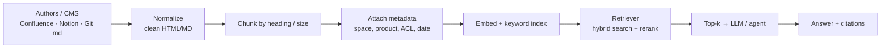

### What “good wiki pages” look like (for machines)

| Practice | Why it helps retrieval |
|---|---|
| One topic per page; clear **H1 / H2** | Clean chunk boundaries |
| **Canonical facts** in tables | Less paraphrase ambiguity |
| Stable **URLs / page IDs** | Citations & ACL |
| “Last reviewed” + owner | Trust / freshness filters |
| Avoid huge mega-pages | Better top-k precision |
| Separate **policy** vs **how-to** vs **changelog** | Metadata routing |

### How agents use a wiki

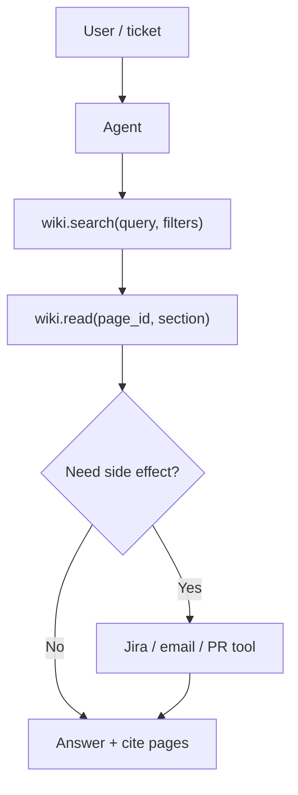

| Pattern | Description |
|---|---|
| **Ask the wiki** | Classic RAG over wiki index |
| **Browse then act** | Agent opens pages like a human, then uses tools |
| **Wiki as memory** | Agent *writes back* summaries / decisions (with review) |
| **Wiki + long context** | Retrieve 5–20 pages, then reason in a large window |

**Bottom line:** An LLM wiki is the **productized knowledge layer** (content + metadata + ACLs + review). RAG is the **query path**. Agents are the **workflow** that decides when to read the wiki vs call other tools.

---

## 6. Agent Frameworks — Who Orchestrates the Loop?

Frameworks differ mainly in **orchestration style**, not in the underlying LLM.

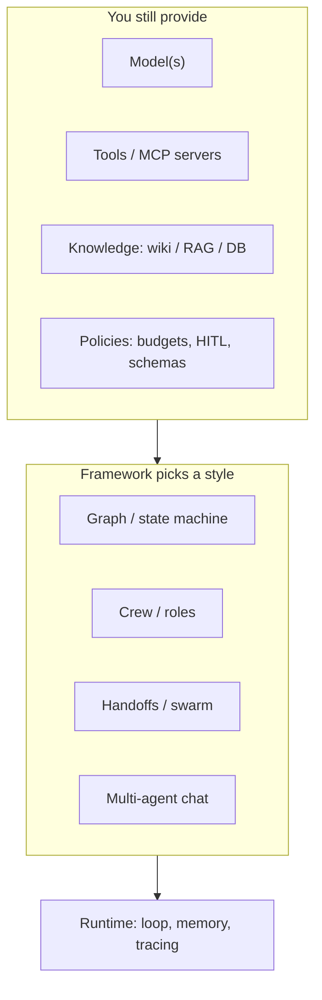

### Landscape (2025–2026 snapshot)

| Framework | Mental model | Best fit | Production notes |
|---|---|---|---|
| **LangGraph** | Typed **graph**: nodes + edges + shared state; checkpoints | Complex, long-running, auditable workflows | Strong persistence / HITL / LangSmith; steepest learning curve |
| **OpenAI Agents SDK** | Agent loop + **handoffs** + guardrails (+ MCP) | Fast path if you’re in the OpenAI ecosystem (also multi-model via adapters) | Simple API; less explicit state than graphs |
| **CrewAI** | **Crew** of role-playing agents + tasks | Prototyping, research→write pipelines, demos | Very fast to start; add your own hardening for strict SLAs |
| **AutoGen → AG2 / Microsoft Agent Framework** | Conversational multi-agent (history: AutoGen) | Research, experiments; MS stack evolving to Agent Framework | Check current MS guidance before greenfield |
| **LlamaIndex Workflows** | Event/step workflows + strong **data/RAG** roots | Doc-heavy agents, indexing-centric apps | Natural if already on LlamaIndex RAG |
| **Semantic Kernel** | Skills/plugins + planners (.NET/Python) | Enterprise Microsoft shops | Good plugin story; planner patterns vary by version |
| **Haystack / custom** | Pipelines or plain Python | Full control, minimal deps | You own retries, state, tracing |

### Side-by-side dimensions

| Dimension | LangGraph | OpenAI Agents SDK | CrewAI | LlamaIndex Workflows |
|---|---|---|---|---|
| **Control flow** | Explicit graph | Implicit loop + handoffs | Role/task crew | Event / step workflow |
| **State** | First-class shared state | Conversation + session | Crew/task context | Workflow state |
| **Multi-agent** | Yes (as subgraphs) | Yes (handoffs) | Yes (native metaphor) | Yes |
| **RAG affinity** | Via LangChain / custom | Via your tools | Via tools / integrations | **Native strength** |
| **HITL / resume** | Excellent (checkpoints) | Improving (sessions) | Extra work | Possible |
| **Observability** | LangSmith, etc. | OpenAI tracing | Growing / enterprise tier | Integrations vary |
| **Learning curve** | Higher | Lower | Lowest for crews | Medium |
| **Vendor lock-in** | Low (any model) | Low–medium (best on OpenAI) | Low (LiteLLM etc.) | Low |

### How to choose

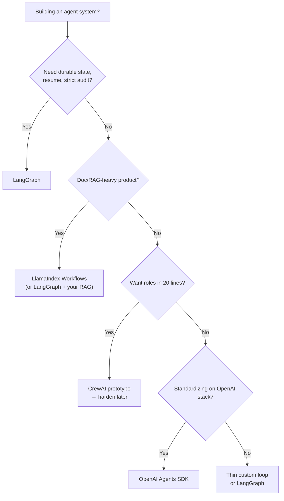

### What frameworks do *not* replace

| Still your job | Why |
|---|---|
| **Chunking / index quality** | Framework can’t fix a bad corpus |
| **Tool design** (clear schemas, idempotency) | Most failures are tool/UX bugs |
| **Eval & tracing** | Agents regress silently without tests |
| **Cost / step budgets** | Loops can spend unbounded tokens |
| **Security** (sandbox, allowlists, ACLs) | Agents amplify tool permissions |

### Minimal mental stack

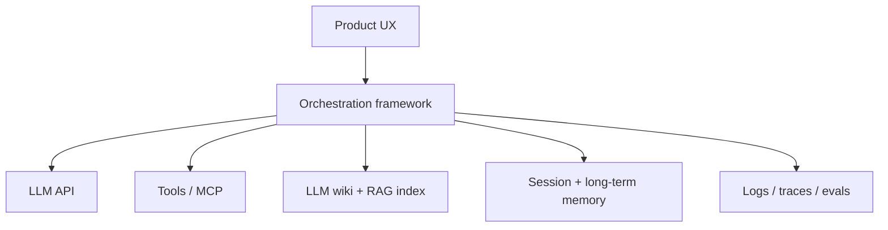

| Layer | Question it answers |
|---|---|
| LLM | “What token / tool call next?” |
| RAG / wiki | “What should it *know* right now?” |
| Tools | “What can it *do*?” |
| Framework | “How do steps, state, and agents connect?” |
| Evals | “Did the system actually get better?” |

---

## 7. Consumer Chat Apps — ChatGPT, Claude, Gemini, Grok

**Correct: they are not “just LLMs.”**  
The **LLM** is the foundation model (①). **ChatGPT**, **Claude.ai**, **Google Gemini** (app), and **xAI Grok** are **consumer products** that wrap a model with context management, tools, safety, memory, and a UI—the same stack as [§4](#4-agents--from-one-shot-to-a-control-loop)–[§6](#6-agent-frameworks--who-orchestrates-the-loop), mostly invisible to you.

| Name people say | Usually means | Bare model / API side |
|---|---|---|
| **ChatGPT** | OpenAI chat product | `gpt-*` via OpenAI API |
| **Claude** | Claude.ai product | Anthropic API (`claude-*`) |
| **Gemini** | Gemini app / Google AI | Gemini API / Vertex |
| **Grok** | xAI chat (e.g. on X) | xAI API |

### What happens on one user message

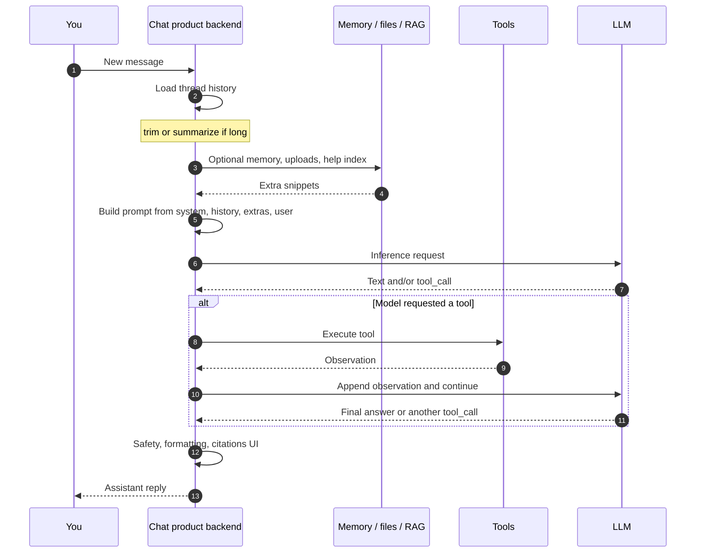

### How they manage **context**

| Mechanism | What it does |
|---|---|
| **Thread history** | Prior turns are re-sent (or summarized) each request—stateless LLM + stateful app |
| **Window limit** | Oldest turns **dropped** or **compressed** when near the max |
| **System / developer prompts** | Hidden instructions (tone, safety, tool schemas)—not shown as chat bubbles |
| **Uploads / “projects”** | Files chunked and retrieved (RAG) or partially stuffed into context |
| **Memory** (when enabled) | Long-term notes about you, injected selectively—not the whole chat forever |
| **Summarization** | Long threads → rolling summary + recent raw turns |

The model does **not** magically remember yesterday. The **product** re-feeds whatever it still keeps in the assembled context.

### How they **call tools / APIs**

| Step | Who |
|---|---|
| 1. Model emits a structured **tool call** (name + args) | LLM |
| 2. **Product backend** runs the tool (web search, code sandbox, image gen, connectors…) | Not the GPU weights |
| 3. Tool result is appended to the context | Product |
| 4. Model is called **again** to use that result | LLM |

So “Claude searched the web” ≈ **agent loop** (④): model proposes → product executes → model reads observation. Same pattern as [§4](#4-agents--from-one-shot-to-a-control-loop); the chat UI just hides the loop.

### Chat app vs raw LLM API

| | ChatGPT / Claude.ai / Gemini app / Grok | Raw LLM API |
|---|---|---|
| **You talk to** | Full product | One model endpoint |
| **History** | Managed for you | You send `messages[]` every time |
| **Tools** | Built-in (browse, code, …) | You define & execute tools |
| **Memory / files** | Product features | You build RAG/memory |
| **Safety / routing** | Often multi-model + filters | Your responsibility |
| **Best mental model** | Agent-ish assistant product | Primitive: next-token (+ optional tool JSON) |

### Same family as coding agents

| Product class | Examples | Default “corpus” |
|---|---|---|
| **⑦a General chat** | ChatGPT, Claude.ai, Gemini, Grok | Web (via tools), your uploads, chat memory |
| **⑦b Coding agents** | Cursor, Claude Code, Codex | **Your repository** + rules |

Both are **products on top of LLMs**, not alternate spellings of “the model.”

---

## 8. Coding-Agent Products — Cursor, Claude Code, Codex, …

**Where they fit:** [§6](#6-agent-frameworks--who-orchestrates-the-loop) frameworks are **libraries** you embed in *your* app. **Cursor**, **Claude Code**, **OpenAI Codex** (CLI/IDE agents), Copilot Chat/agent modes, Windsurf, etc. are **vertical products**: shipping coding agents with UX, tools, and retrieval over *your repo* already wired. Same idea as [§7](#7-consumer-chat-apps--chatgpt-claude-gemini-grok), specialized for software engineering.

They are not a new layer under the LLM — they are a **packaged stack** of layers ①–⑤ (and an internal ⑥ you don’t always see).

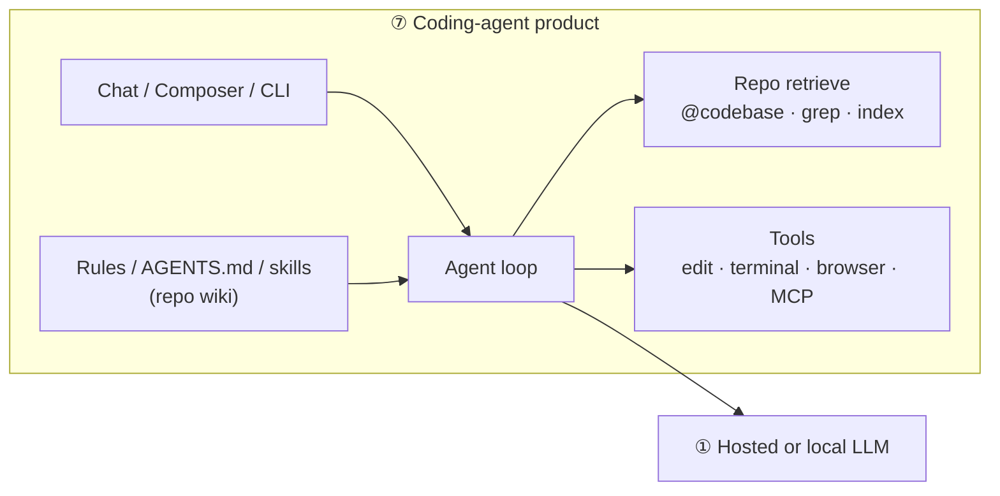

### Map product features → this doc’s layers

| Layer in this doc | What you see in Cursor / Claude Code / Codex |
|---|---|
| **① LLM** | Model picker (Claude, GPT, Gemini, …) |
| **② Context** | Open tabs, selection, @-mentions, chat history, max window |
| **③ RAG** | Codebase index, semantic search, `grep`/file search, “@codebase” |
| **④ Agent** | Multi-step: plan → edit files → run tests → fix |
| **⑤ LLM wiki** | `.cursor/rules`, `AGENTS.md`, skills, project docs the agent is told to follow |
| **⑥ Framework** | Mostly **hidden** proprietary orchestrator (not LangGraph in your repo) |
| **⑦ Product** | The IDE/CLI itself |

### Product snapshot (same category, different UX)

| Product | Shape | Typical strength |
|---|---|---|
| **Cursor** | AI-native IDE (VS Code fork) | Tight editor loop, rules, multi-file agent, MCP |
| **Claude Code** | CLI / terminal-first agent | Long-running repo tasks, tool use, project memory |
| **OpenAI Codex** | CLI / cloud coding agent | OpenAI-stack agents, repo tasks, sandboxed runs |
| **GitHub Copilot** | IDE extension + agent modes | PR/issue integration, familiar VS Code/JetBrains UX |
| **Others** | Windsurf, Devin, … | Same idea: agent + tools + codebase context |

Exact names/features change quickly; the **layer mapping** stays stable.

### Framework (§6) vs product (§8)

| | **Agent frameworks** (§6) | **Coding-agent products** (§8) |
|---|---|---|
| **You are…** | Building a product/backend | Using a coding assistant |
| **Orchestration** | You choose LangGraph / SDK / … | Vendor’s loop (opaque) |
| **Primary corpus** | Whatever you index (wiki, DB, …) | **Your git repo** (+ docs/rules) |
| **Tools** | You register APIs | Edit, terminal, git, browser, MCP |
| **When to use** | Ship agents to *end users* | Speed up *your* engineering |

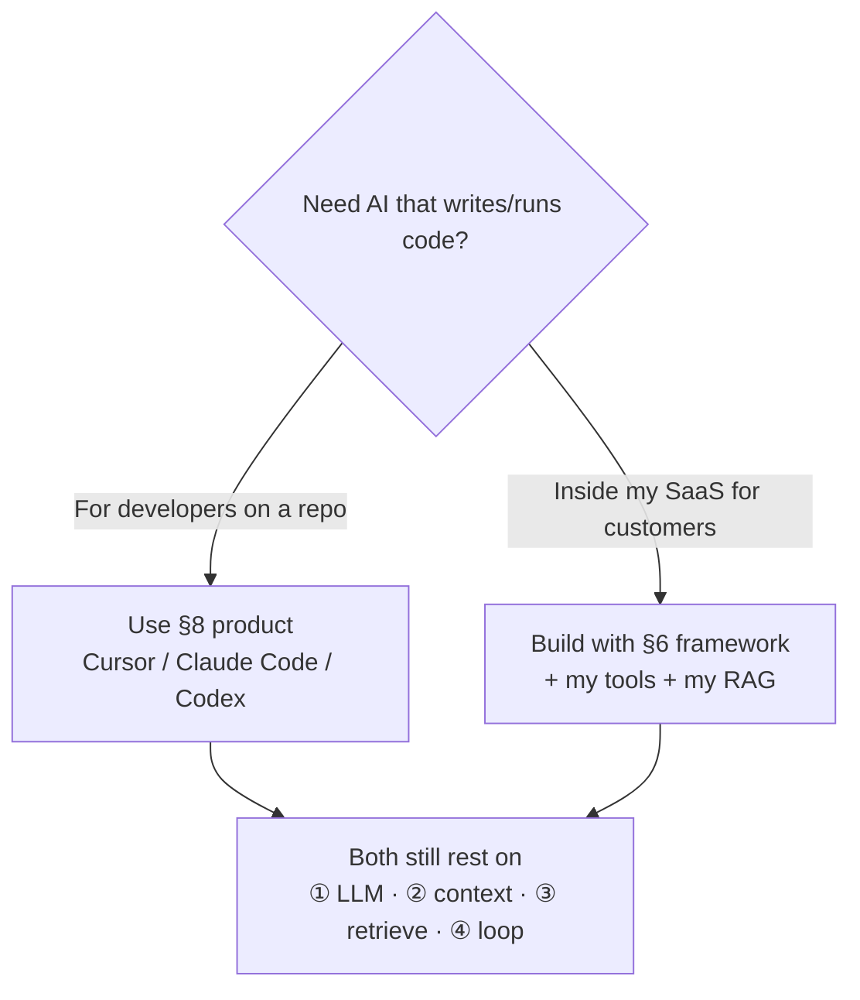

### Practical tips (same concepts, coding flavor)

| Tip | Layer |
|---|---|
| Keep rules/docs short and structured (`AGENTS.md`, cursor rules) | ⑤ wiki quality |
| Prefer search/`grep` over stuffing the whole monorepo | ③ RAG vs long context |
| Let the agent run tests; don’t only chat | ④ tools / observe |
| Cap runaway loops; review diffs before merge | Guardrails (agent ops) |

---

## 9. Doc Map

| Section | Status | Focus |
|---|---|---|
| Cheat sheet | Done | One-page layer map |
| 1. LLM next-token loop | Done | Autoregressive generation |
| 2. Tokens & context window | Done | Budget, cost |
| 3. RAG vs long context | Done | When RAG is still required |
| 4. Agents | Done | ReAct, plan-execute, multi-agent, memory |
| 5. LLM wiki | Done | Curated knowledge layer for RAG/agents |
| 6. Agent frameworks | Done | LangGraph, OpenAI SDK, CrewAI, LlamaIndex, … |
| 7. Consumer chat apps | Done | ChatGPT, Claude.ai, Gemini, Grok |
| 8. Coding-agent products | Done | Cursor, Claude Code, Codex, Copilot, … |

---

## References (optional reading)

- Lost-in-the-middle / long-context distraction (why stuffing ≠ understanding)
- RAG surveys: retrieve → augment prompt → generate
- ReAct (Yao et al.): reason + act interleaved tool use
- Vendor context limits (e.g. 128k–1M) vs enterprise corpus sizes (GB–TB)
- Framework docs: [LangGraph](https://langchain-ai.github.io/langgraph/), [OpenAI Agents SDK](https://openai.github.io/openai-agents-python/), [CrewAI](https://docs.crewai.com/), [LlamaIndex Workflows](https://docs.llamaindex.ai/), [AG2](https://docs.ag2.ai/) / Microsoft Agent Framework
- Coding agents: [Cursor](https://cursor.com/), [Claude Code](https://docs.anthropic.com/en/docs/claude-code), [OpenAI Codex](https://openai.com/codex/), [GitHub Copilot](https://github.com/features/copilot)
