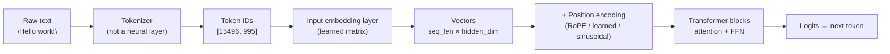
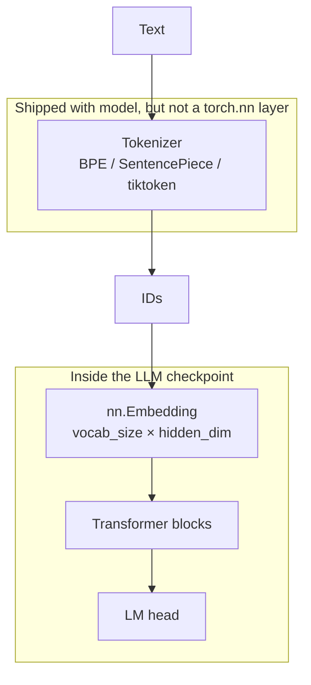
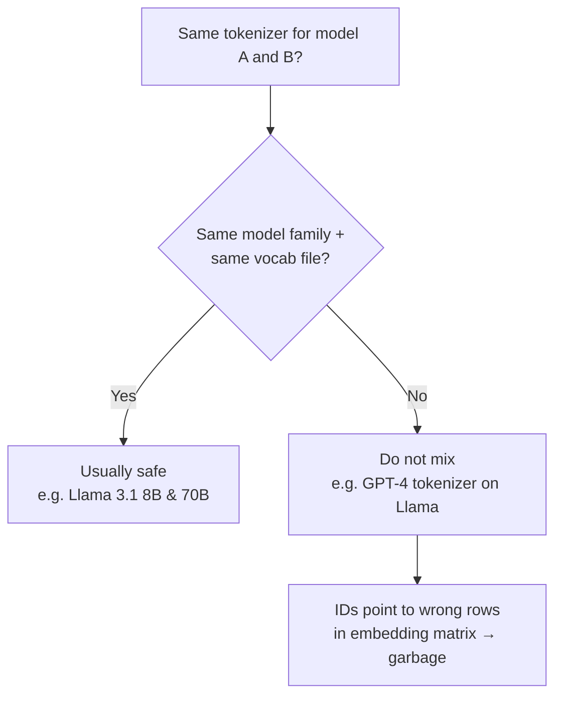
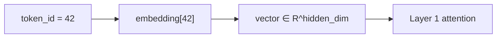
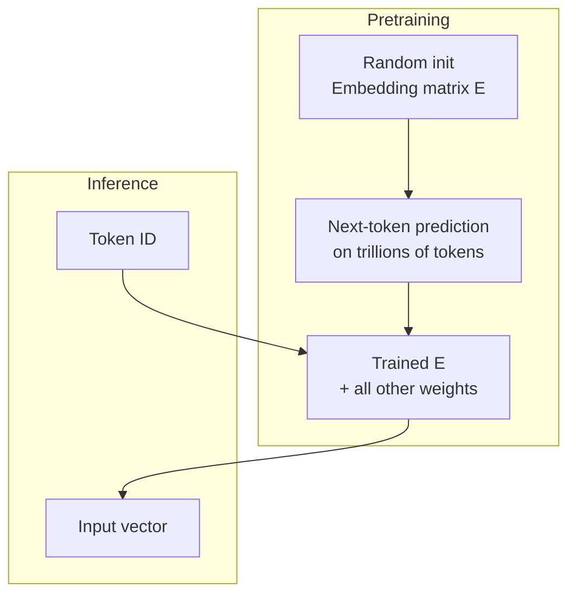
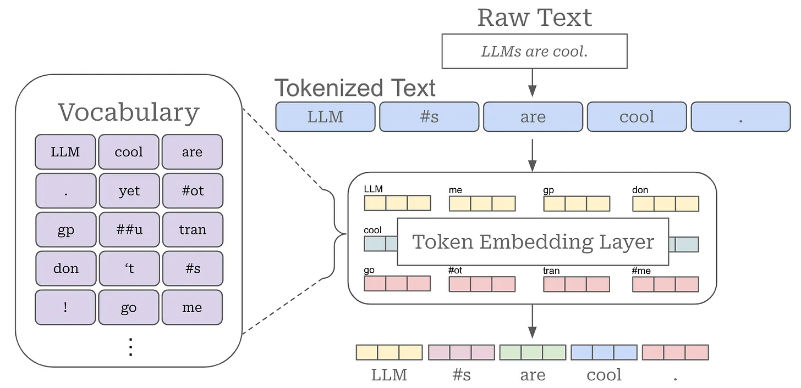
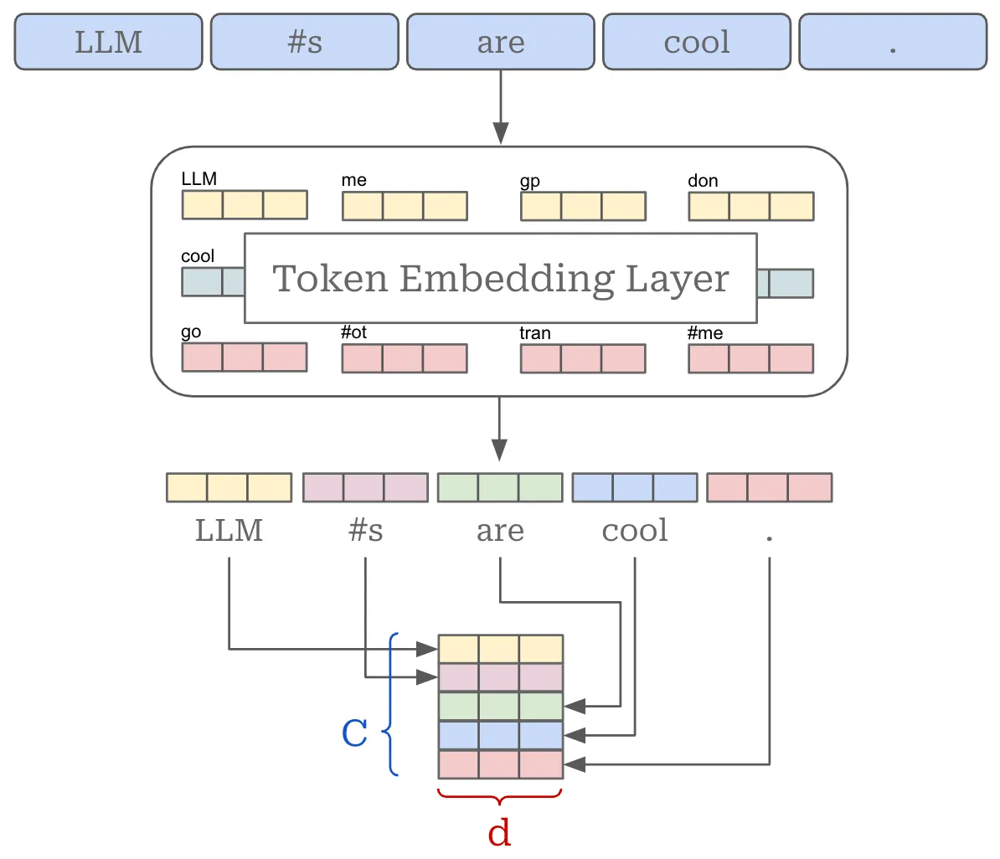

# Tokenizer, token IDs, and input embeddings

How text becomes numbers inside an LLM — and how that differs from **word embeddings** (Word2Vec/GloVe) and from **RAG retrieval embeddings**.

Parent overview: [LLM.md §2 Tokens & tokenizer](./LLM.md#2-tokens-tokenizer--context-window) · [RAG.md §5 Embeddings in RAG](./RAG.md#5-embeddings-in-rag) (different subsystem)

---

## Cheat sheet — five common questions

| # | Question | Short answer |
|---|---|---|
| **1** | Is the **tokenizer** part of the LLM? Same as **input embedding**? | **Related but not the same.** Tokenizer = text ↔ token **IDs** (deterministic, pre/post-processing). **Input embedding** = neural **lookup table** that maps each ID → vector. Both ship with a model release, but only the embedding layer is inside the network forward pass. |
| **2** | Can **different LLMs** use the **same tokenizer**? | **Sometimes, within a family** (e.g. many Llama checkpoints). **In general, no** — vocab and merge rules are tied to how the model was trained. Using the wrong tokenizer corrupts inputs. |
| **3** | Is **token embedding** part of the LLM? | **Yes** — the **input embedding matrix** (and usually **position encoding**) are the first learned layers of the transformer. |
| **4** | Most **popular tokenizers**? | **BPE**, **byte-level BPE**, **WordPiece**, **SentencePiece** (incl. **Unigram**). Implementations: **tiktoken**, **Hugging Face `tokenizers`**, **SentencePiece**. |
| **5** | **Input embeddings** — popular algorithms or **learned in training**? | **Learned end-to-end** during LLM pretraining (random init → gradient updates with the rest of the weights). Not a separate Word2Vec-style fit at inference. **RoPE** etc. add position; still part of the trained stack. |

---

## End-to-end pipeline (what happens to your prompt)



| Stage | Part of neural net? | Trained with LLM? | Output |
|---|---|---|---|
| **Tokenizer** | **No** | **No** (fit on corpus **before** or **during** vocab build; rules fixed at inference) | Integer token IDs |
| **Input embedding** | **Yes** | **Yes** | `hidden_dim`-dim vector per token |
| **Position encoding** | **Yes** (or fixed formula applied in net) | **Mostly yes** (RoPE is a formula; still tied to the checkpoint) | Same shape as token vectors |
| **Transformer layers** | **Yes** | **Yes** | Contextualized hidden states |

**Naming trap:** people say “token embedding” for two different things:

| Name people use | What it usually means |
|---|---|
| **Input / token embedding layer** | Row of the embedding matrix for token ID `k` — **same** vector for that ID regardless of sentence (until attention mixes context) |
| **Contextualized token embeddings** | Hidden states **after** transformer layers — **depend on full context** (BERT `last_hidden_state`, etc.) |

This doc uses **input embedding** for the lookup table and **contextualized hidden states** for post-transformer vectors.

---

## 1. Is the tokenizer part of the LLM? Is it the same as input embedding?

**No to both — they are adjacent steps, not the same thing.**



| | **Tokenizer** | **Input embedding layer** |
|---|---|---|
| **Job** | Split text → tokens → **integer IDs** | Map each ID → **dense vector** |
| **Type** | String algorithm + vocab/merge files | Learned weight matrix |
| **Deterministic?** | **Yes** (same text → same IDs) | **Yes** at lookup, then layers change meaning |
| **In `model.forward()`?** | **No** — runs in app/server **before** forward | **Yes** — first step of forward |
| **Same as the other?** | **No** | **No** |

**“Part of the LLM” in product terms:** Hugging Face `AutoTokenizer` + `AutoModel` are **paired artifacts** from one release. You always use **that** tokenizer with **that** checkpoint. In **architecture** terms, only the embedding matrix is inside the network.

```text
"ChatGPT"  →  tiktoken.encode(text)  →  [33706,  …]  →  GPU matmuls start here
```

See [LLM.md §2](./LLM.md#2-tokens-tokenizer--context-window) for token counting, special tokens, and decode.

---

## 2. Can different LLM models use the same tokenizer?

**Only when they were explicitly built to share the same vocabulary and merge rules.** Do not assume interchangeability across vendors or even across major versions.



| Situation | Share tokenizer? |
|---|---|
| **Same architecture, same vocab** (sizes of checkpoints in one family) | **Yes** — common |
| **Fine-tune / LoRA on base model** | **Yes** — keep base tokenizer |
| **Different parameter count, same gen** (8B vs 70B Llama 3) | **Usually yes** |
| **New major version** (Llama 2 → Llama 3, GPT-2 → GPT-4) | **No** — new vocab |
| **Different companies** (GPT vs Gemini vs Claude) | **No** |
| **Multilingual vs English-only variant** | **Often no** — vocab differs |

**Rule:** load tokenizer from the **same repo / checkpoint** as the weights (`AutoTokenizer.from_pretrained(same_id)`).

---

## 3. Is token embedding part of the LLM?

**Yes.** The **input embedding layer** is a core part of the model weights:

```text
embedding.weight.shape ≈ (vocab_size, hidden_dim)
```

Example: vocab 128256, hidden 4096 → ~500M parameters **only in the embedding table** on large models (often tied / shared with the output LM head to save params).



What is **not** the LLM’s token embedding:

| Subsystem | Part of LLM? |
|---|---|
| **Input embedding matrix** | **Yes** |
| **RAG bi-encoder** (chunk/query vectors for search) | **No** — separate model; see [RAG.md §5](./RAG.md#5-embeddings-in-rag) |
| **Word2Vec / GloVe files** | **No** — legacy static word vectors |

---

## 4. Most popular tokenizers

Tokenizers differ in **how** text is split; most modern LLMs use **subword** methods so rare words decompose into known pieces.

### Algorithm families

| Algorithm | Idea | Used by (examples) |
|---|---|---|
| **BPE** (Byte Pair Encoding) | Iteratively merge frequent byte/token pairs | GPT-2, RoBERTa, early open models |
| **Byte-level BPE** | BPE on bytes → robust Unicode | GPT-2, many GPT-style models |
| **WordPiece** | Greedy merge like BPE; different scoring | **BERT**, DistilBERT |
| **SentencePiece** | Language-agnostic; treats space as symbol; **BPE or Unigram** | **Llama**, **Gemma**, **T5**, **Mistral**, **Qwen** |
| **Unigram** (inside SentencePiece) | Starts large, prunes vocab | T5, some multilingual models |

### Common implementations (libraries)

| Library | Typical models |
|---|---|
| **[tiktoken](https://github.com/openai/tiktoken)** | OpenAI GPT-3.5/4 (`cl100k_base`, `o200k_base`, …) |
| **[Hugging Face `tokenizers`](https://github.com/huggingface/tokenizers)** | Most `transformers` checkpoints |
| **[SentencePiece](https://github.com/google/sentencepiece)** | Llama, Gemma, T5, many C++ inference stacks |

### Model → tokenizer cheat sheet

| Model line | Tokenizer style | Vocab size (typical) |
|---|---|---|
| **GPT-2 / early OpenAI** | Byte-level BPE | ~50k |
| **GPT-3.5 / GPT-4** | tiktoken BPE (`cl100k_base`, etc.) | ~100k |
| **BERT** | WordPiece | ~30k |
| **Llama 2 / 3** | SentencePiece (BPE) | ~128k |
| **Gemma, Mistral, Qwen** | SentencePiece / similar | ~128k–256k |
| **Claude** | Proprietary (public details limited) | — |

Vocab sizes **64k–256k** are common for recent LLMs ([LLM.md §2](./LLM.md#2-tokens-tokenizer--context-window)).

---

## 5. Input embeddings — algorithms or learned during training?

**Learned during LLM pretraining** together with attention, FFN, and (usually) the output head. There is no separate “embedding algorithm” run at inference.



| Approach | When | Relation to modern LLMs |
|---|---|---|
| **Learned input embedding** (lookup table) | **Default for GPT/BERT/Llama** | **This is what LLMs use** |
| **Word2Vec / GloVe / FastText** | Pre-transformer era; separate training | **Not** the LLM input layer; optional for other NLP pipelines |
| **Random init + train with LM loss** | LLM pretraining | **Standard** |
| **Weight tying** | Embedding ↔ LM head share weights | Saves params; same training loop |

**Position information** (not the same as token identity):

| Method | Learned? | Examples |
|---|---|---|
| **Sinusoidal** (fixed formula) | Fixed | Original Transformer |
| **Learned absolute positions** | **Yes** | BERT, GPT-2 |
| **RoPE** (rotary) | Formula applied to **trained** Q/K; no separate position table | Llama, Mistral, Qwen, many modern LLMs |

**Takeaway:** At inference you **look up** rows in a matrix that was **optimized for next-token prediction**, not computed by Word2Vec.

---

## 6. Token embedding vs word embedding (historical contrast)

There are differences between **token embeddings** (transformer era) and **word embeddings** (pre-transformer), though both map text units to vectors.

### Definitions

**Word embedding**

- One vector per **whole word** in a fixed vocabulary.
- **Static** — same vector regardless of context.
- Algorithms: **Word2Vec**, **GloVe**, **FastText**.

**Token embedding (transformer)**

- One vector per **subword token** ID at the **input layer**; after layers, **contextualized** hidden states per position.
- Used in **BERT**, **GPT**, **Llama**, and other transformers.

### Comparison

| Aspect | Word embedding | Token / transformer embedding |
|---|---|---|
| **Granularity** | Whole word | Subword token |
| **OOV handling** | Poor | Strong (pieces compose) |
| **Contextuality** | Static | Contextualized after attention |
| **How vectors are obtained** | Separate algorithm (Word2Vec, …) | **Learned** with LM / MLM objective |
| **Typical use today** | Legacy features, small models | **All major LLMs** |

### Contextuality (important correction)

The BERT snippet below returns **`last_hidden_state`** — those are **contextualized** outputs, not the raw input embedding row:

```python
from transformers import AutoTokenizer, AutoModel

tokenizer = AutoTokenizer.from_pretrained("bert-base-uncased")
model = AutoModel.from_pretrained("bert-base-uncased")

inputs = tokenizer("Hello world!", return_tensors="pt")
outputs = model(**inputs)

# Contextualized hidden states (after all layers):
contextualized = outputs.last_hidden_state

# Raw input embeddings (lookup only) — separate access:
input_embeds = model.embeddings.word_embeddings(inputs["input_ids"])
```

---

## 7. Examples

### Word embedding (Word2Vec) — static, not an LLM layer

```python
from gensim.models import Word2Vec

sentences = [["hello", "world"], ["goodbye", "world"]]
model = Word2Vec(sentences, vector_size=10, min_count=1)
embedding = model.wv["world"]  # fixed vector for "world"
```

### LLM path — tokenizer then input IDs (embedding happens inside `model`)

```python
from transformers import AutoTokenizer, AutoModelForCausalLM

name = "meta-llama/Llama-3.2-1B"  # example
tokenizer = AutoTokenizer.from_pretrained(name)
model = AutoModelForCausalLM.from_pretrained(name)

text = "Hello world"
ids = tokenizer.encode(text)          # tokenizer → IDs (outside forward)
# model(input_ids) internally: embed(ids) → transformer → logits
```

---

## 8. Visual walkthrough (images)

LLMs take text as input, but the text is processed **before** the neural forward pass. First, the **tokenizer** converts text into discrete tokens from the model vocabulary (often 64k–256k entries).



After token IDs are known, the **input embedding layer** looks up one vector per token. If the sequence has `C` tokens and each embedding is `d`-dimensional, the input tensor is **`C × d`**.



---

## 9. Related docs

| Doc | Topic |
|---|---|
| [LLM.md §2](./LLM.md#2-tokens-tokenizer--context-window) | Tokens, counting, context window |
| [RAG.md §5](./RAG.md#5-embeddings-in-rag) | RAG chunk/query vectors (**not** LLM input embeddings) |
| [transformer.md](./transformer.md) | Full transformer stack |
| [RoPE.md](./RoPE.md) | Rotary position encoding |
| [word_embedding.md](./text/word_embedding.md) | Word2Vec, GloVe deep dive |

---

## Summary table

| Concept | Part of LLM weights? | Trained with LM? | Same as tokenizer? |
|---|---|---|---|
| **Tokenizer** | No (paired artifact) | No (vocab built from corpus) | — |
| **Input embedding** | **Yes** | **Yes** | **No** |
| **Contextualized hidden state** | **Yes** (deeper layers) | **Yes** | **No** |
| **RAG embedding model** | **No** (separate model) | Separate training | **No** |
| **Word2Vec / GloVe** | **No** | Separate algorithm | **No** |
