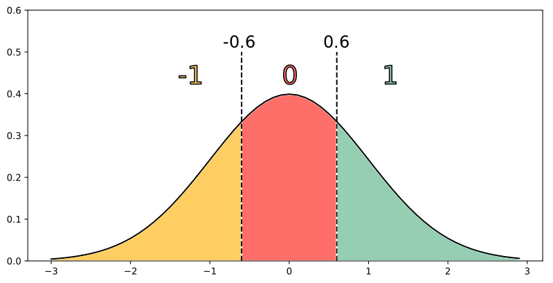

# Machine Learning, Computer Vision and Data Science Introductions 
* Classification
  * Images  
    * [MNIST classification with Tensorflow quickstart](./classification/MNIST_classification_with_tensorflow_quickstart.ipynb) (from [Tensorflow Tutorial](https://www.tensorflow.org/tutorials/quickstart/beginner) )
* Quantization
  * Quantization for deep learning is the process of approximating a neural network that uses floating-point numbers by a neural network of low bit width numbers.
  * Continuous-discrete learning
    * During training there are effectively two networks : float-precision and binary-precision. The binary-precision is updated in the forward pass using the float-precision, and the float-precision is updated in the backward pass using the binary-precision. In this sense, the training is a type of alternating optimization.
    

       
    

    * Ternary parameter networks are an alternative to binary parameters that allow for higher accuracy, at cost of larger model size.
    

       
    

 
## References

### Documentation

### Sites

### Conferences

### Online Courses
