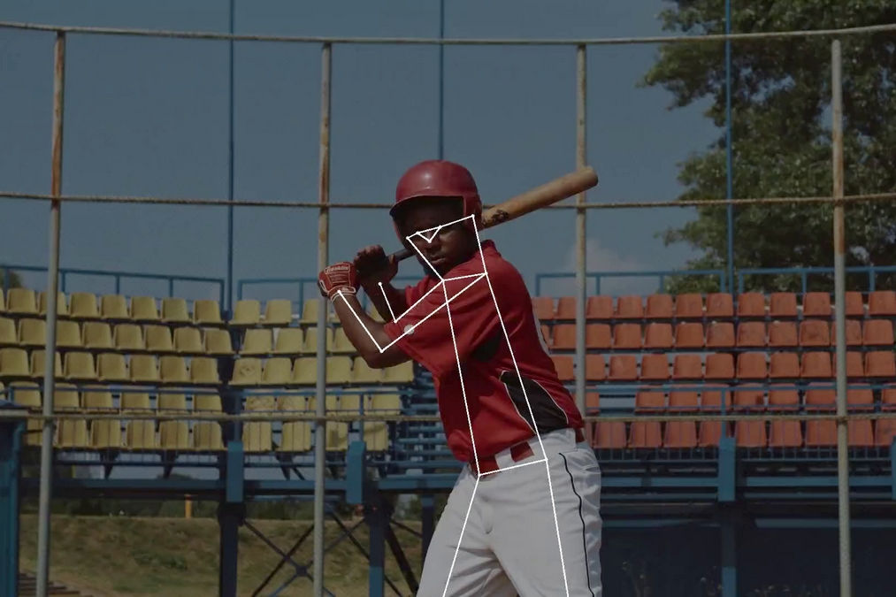

# Computer Vision

Computer vision enables computer systems to analyze digital images, videos, and other visual input with computational methods to derive information that can be used to take action or make decisions based on it.

Many high-performing methods in modern computer vision software are based on a convolutional neural network (CNN).

Computer vision involves some fundamental visual perception tasks:

- __Image classification__: 
- __Object detection__: Determine whether image data contains one or multiple specified or learned objects or object classes. 
  - __Face detection__: 
- __Object segmentation__: Object segmentation tries to find the exact boundary of the objects in the image.
  - __Semantic segmentation__: 
  - __Instance segmentation__: It returns a unique label to every instance of a particular object in the image.
- __Object tracking__: Detect an object in an image and then tracking the object through a series of frames.
- __Face recognition__: Recognize an individual instance of a human face by matching it with database entries. 
- __Pose estimation__: Estimate the orientation and position of a specific object relative to the camera.

- __Optical character recognition (OCR)__: Identify characters in images (numberplates, handwriting, etc.), usually combined with encoding the text in a useful format. 
- __Scene understanding__: Parse an image into meaningful segments for analysis. 
- __Motion analysis__: Tracking the movement of interest points (keypoints) or objects (vehicles, objects, humans, etc.) in an image sequence or video.  

## References

- [What is Computer Vision? The Complete Technology Guide for 2022](https://viso.ai/computer-vision/what-is-computer-vision/)