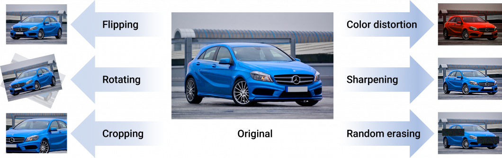

# Data Augmentation

The rise of computer vision is largely based on the success of deep learning methods that use Convolutional Neural Networks (CNN). However, these neural networks are heavily reliant on a lot of training data to avoid overfitting and poor model performance. Unfortunately, in many cases such as real-world applications, there is limited data available, and gathering enough training data is very challenging and expensive.

Data augmentation is a set of techniques that enhance the size and quality of machine learning training datasets so that better deep learning models can be trained with them.

## Popular Types and Methods of Data Augmentation 

Early experiments showing the effectiveness of data augmentations come from simple image transformations, for example, horizontal flipping, color space augmentations, and random cropping. Such transformations encode many of the invariances that present challenges to image recognition tasks.

There are different methods for image data augmentation: 

- __Geometric transformations__: Augmenting image data using flipping horizontally or vertically, random cropping, rotation augmentation, translation to shift images left/right/up/down, or noise injection. 
- __Color distortion__ contains changing brightness, hue, or saturation of images. Altering the color distribution or manipulating the RGB color channel histogram is used to increase model resistance to lighting biases. 
- __Kernel filters__ use image processing techniques to sharpen and blur images. Those methods aim to increase details about objects of interest or to improve motion blur resistance. 
- __Mixing images__ applies techniques to blend different images together by averaging their pixel values for each RGB channel, or with random image cropping and patching. While counterintuitive to humans, the method has shown to be effective in increasing model performance. 

- __Information deletion__ uses random erasing, cutout, and hide-and-seek methods to mask random image parts, optimally using patches filled with random pixel values. Deleting a level of information is used to increase occlusion resistance in image recognition, resulting in a notable increase in model robustness.

## References

- [Image Data Augmentation for Computer Vision in 2022 (Guide)](https://viso.ai/computer-vision/image-data-augmentation-for-computer-vision/)