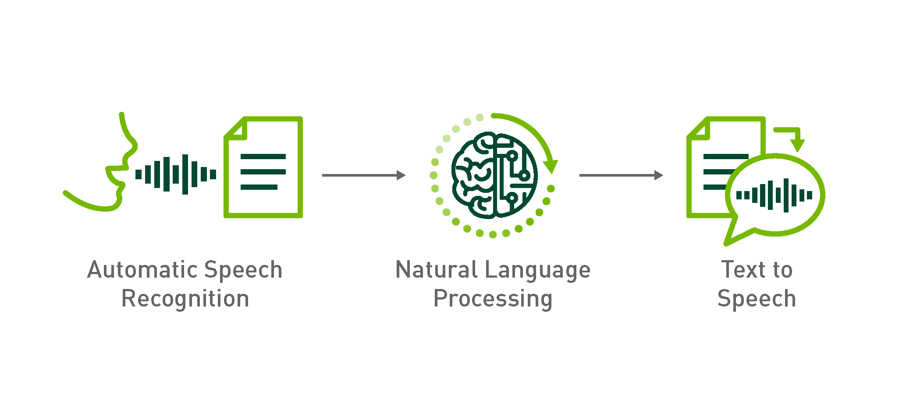
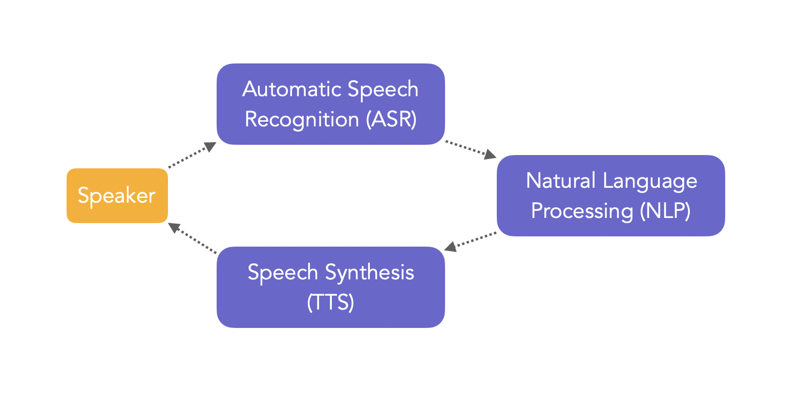
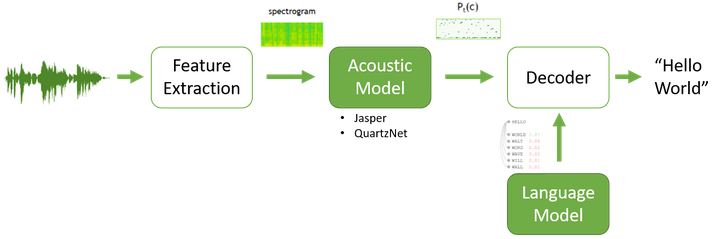
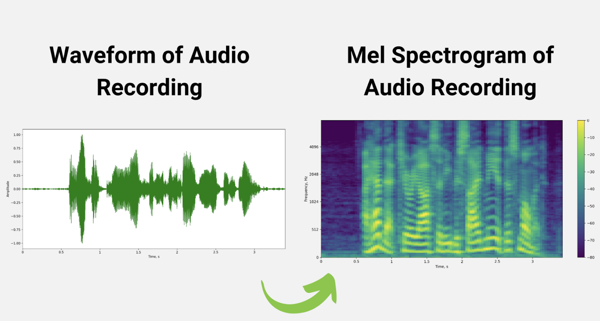
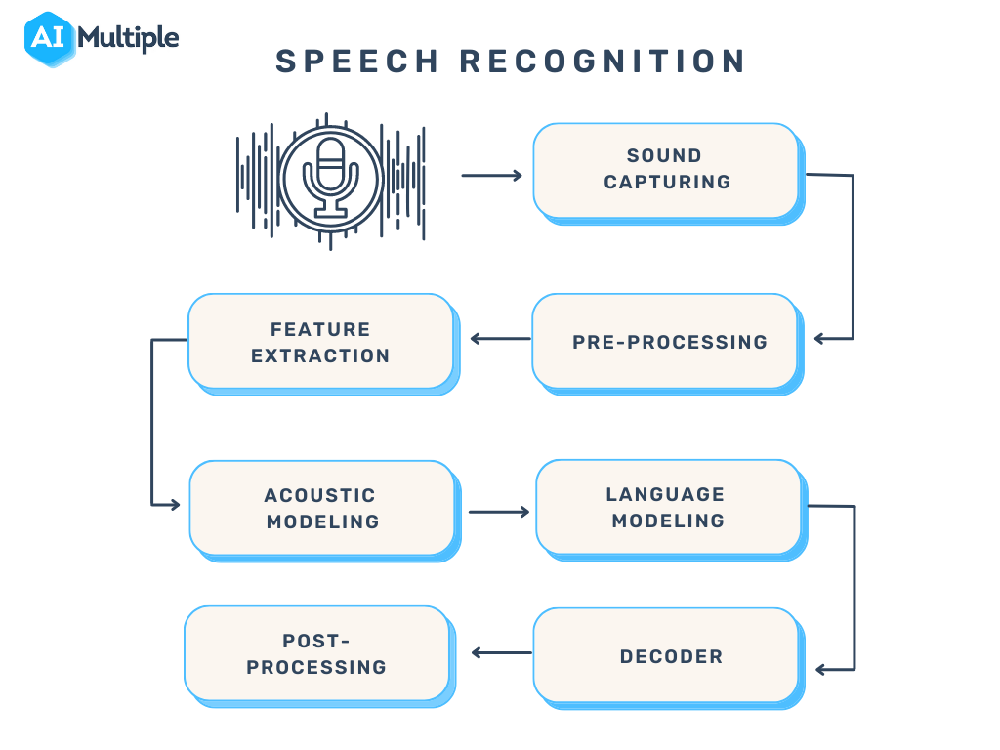
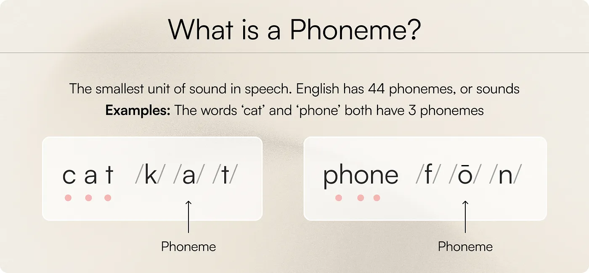
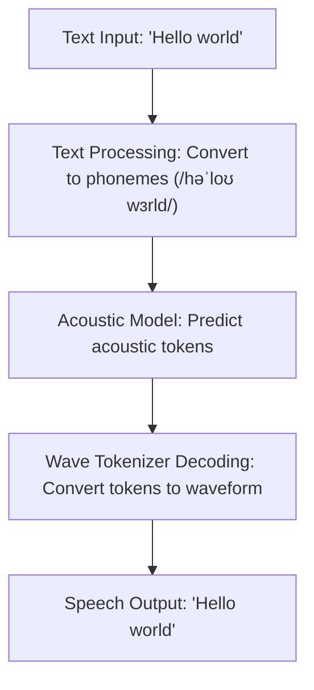
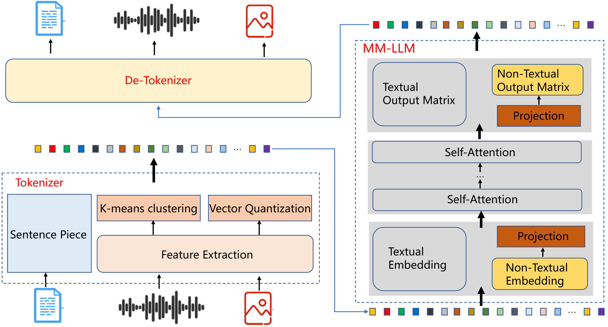

# Conversational AI

Conversational AI is the use of natural language to communicate with machines. A typical conversational AI application uses three subsystems to do the steps of processing and transcribing the audio, understanding (deriving meaning) of the question asked, generating the response (text) and speaking the response back to the human. These steps are achieved by multiple deep learning solutions working together. 
- First, <b>automatic speech recognition (ASR)</b> is used to process the raw audio signal and transcribing text from it. 
- Second, <b>natural language processing (NLP)</b> is used to derive meaning from the transcribed text (ASR output). 
- Last, <b>speech synthesis or text-to-speech (TTS)</b> is used for the artificial production of human speech from text. 

## ASR

The introduction of `Connectionist Temporal Classification (CTC)` removed the need for pre-segmented data and allowed the network to be trained end-to-end directly for sequence labelling tasks like ASR.  As a result, a CTC based ASR pipeline consists of the following blocks, shown below:

1. <b>Feature extraction:</b> Audio signal preprocessing using normalization, windowing, (log) spectrogram (or mel scale spectrogram, or MFCC).
2. <b>Acoustic Model:</b> A CTC-based network that predicts the probability distributions P_t(c) over vocabulary characters c per each time step t. 
3. <b>Decoding:</b>
    - <b>Greedy (argmax):</b> Is the simplest strategy for a decoder. The letter with the highest probability (temporal softmax output layer) is chosen at each time-step, without regard to any semantic understanding of what was being communicated. Then, the repeated characters are removed or collapsed, and blank tokens are discarded.
    - A <b>language model</b> can be used to add contex,t and therefore correct mistakes in the acoustic model.  A beam search decoder weights the relative probabilities the softmax output against the likelihood of certain words appearing in context and tries to determine what was spoken by combining both what the acoustic model thinks it heard with what is a likely next word.

### Acoustic Feature Extraction: Teaching Machines to "Hear"
The process begins by converting raw audio signals into numerical representations that machine learning models can interpret. Techniques like Mel-Frequency Cepstral Coefficients (MFCCs) and Mel Spectrograms analyze speech signals, focusing on frequencies most relevant to human hearing. These features act as a "fingerprint," capturing unique patterns that distinguish one sound from another.

Example: A raw audio waveform of someone saying, "Hello," is transformed into a spectrogram, highlighting its energy patterns and frequencies for further processing.

    

### Whisper Architecture

The Whisper architecture is a simple end-to-end approach, implemented as an encoder-decoder Transformer. Input audio is split into 30-second chunks, converted into a log-Mel spectrogram, and then passed into an encoder. A decoder is trained to predict the corresponding text caption, intermixed with special tokens that direct the single model to perform tasks such as language identification, phrase-level timestamps, multilingual speech transcription, and to-English speech translation.

## Phoneme

## G2P

In Text-to-Speech (TTS) systems, <b>G2P</b> stands for <b>Grapheme-to-Phoneme</b> conversion. It refers to the process of converting written text (graphemes, which are the smallest units of a writing system, like letters or characters) into phonemes, which are the smallest units of sound in a language. This is a critical step in TTS, as it determines how words are pronounced by mapping text to their corresponding phonetic representations.

For example:

- The word "cat" (graphemes: c-a-t) is converted to phonemes like /kæt/ in American English.
- G2P handles complexities like homographs (e.g., "read" can be /riːd/ or /rɛd/ depending on tense) or irregular pronunciations.

G2P systems often use dictionaries, rules, or machine learning models to ensure accurate pronunciation, especially for languages with inconsistent spelling-to-sound rules.

## TTS Architecture

## TEAL Architecture

## References

 - [TEAL: Tokenize and Embed ALl for multi-modal large language models](https://arxiv.org/html/2311.04589v3)
 - [How to Build Domain Specific Automatic Speech Recognition Models on GPUs](https://developer.nvidia.com/blog/how-to-build-domain-specific-automatic-speech-recognition-models-on-gpus/)