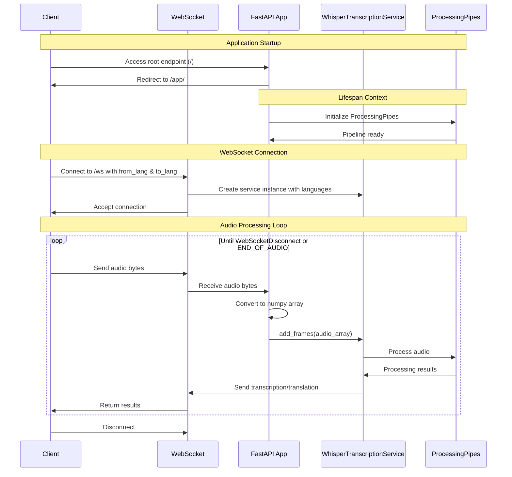
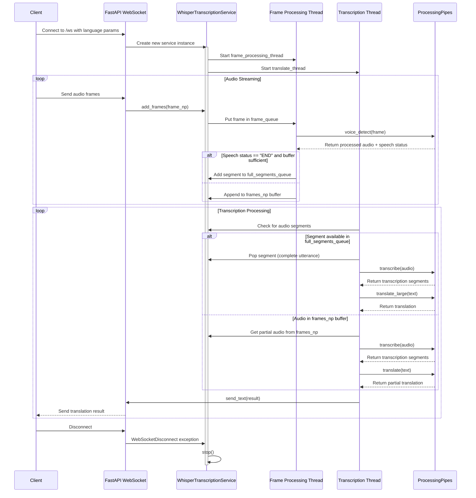
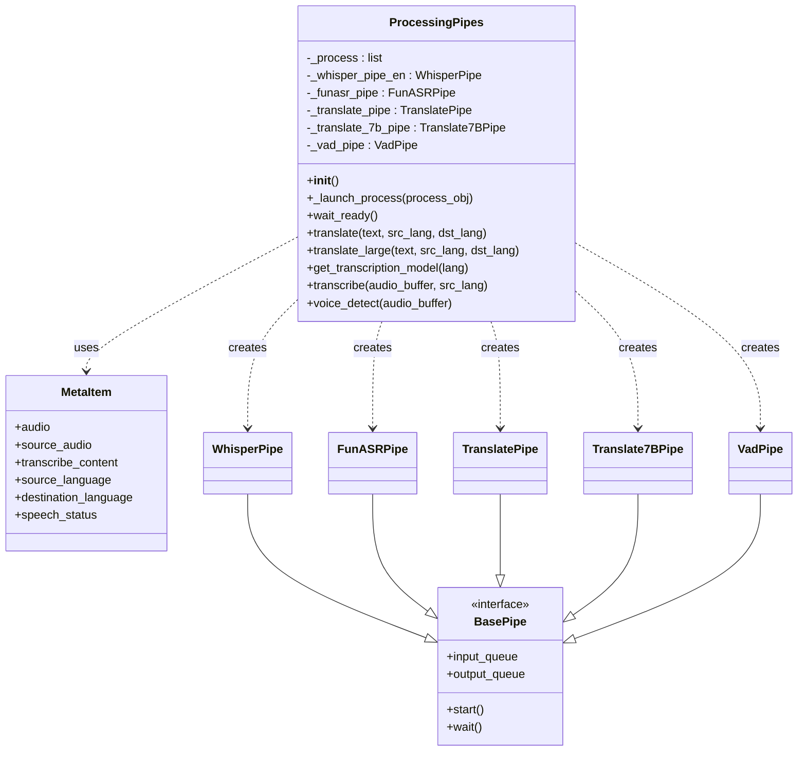
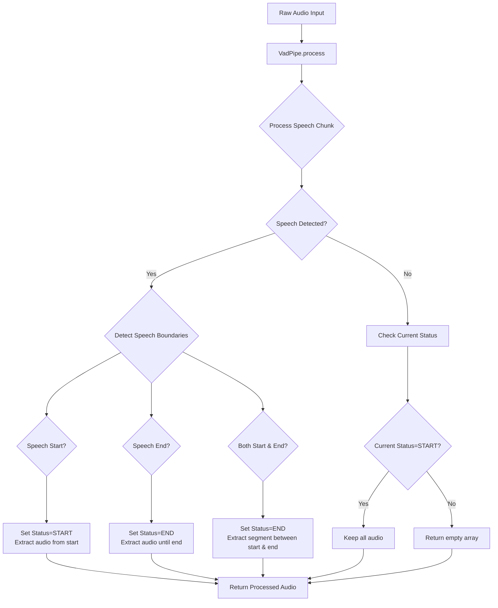

# Understanding the Translator Application

This code is the main entry point for a real-time audio translation service built with FastAPI. 

Here's a breakdown of its functionality:

## Core Components

1. **Web Server Setup**:
   - Uses FastAPI to create a web server with both HTTP endpoints and WebSocket support
   - Serves a frontend application from the "frontend" directory

2. **Audio Translation Pipeline**:
   - Receives audio through WebSockets
   - Transcribes speech using a Whisper model
   - Translates between languages specified as query parameters

## Key Functions and Classes

### Application Lifecycle
- `lifespan()`: An async context manager that initializes the processing pipeline when the application starts

### WebSocket Handling
- `get_audio_from_websocket()`: Receives audio data chunks through the WebSocket connection and converts them to NumPy arrays
- `translate()`: The main WebSocket endpoint that:
  - Accepts language parameters (`from_lang` and `to_lang`)
  - Creates a transcription service for the client
  - Continuously receives audio frames and adds them to the processing pipeline

### Endpoints
- `GET /`: Redirects to the frontend application
- `WebSocket /ws`: Handles real-time audio streaming and translation

## Execution Flow

1. When the application starts:
   - The processing pipeline is initialized
   - Static files are mounted for the frontend
   - WebSocket endpoint is configured

2. When a client connects:
   - The WebSocket connection is established with language parameters
   - A unique transcription service is created for the client
   - Audio frames are continuously received and processed

3. The pipeline likely:
   - Transcribes the audio in the source language
   - Translates the transcription to the target language
   - Sends results back to the client through the WebSocket

This architecture enables real-time speech-to-text and translation, making it suitable for applications like live interpretation or subtitling.

# WhisperTranscriptionService Analysis

`WhisperTranscriptionService` is a real-time speech-to-text and translation service that processes audio streams through WebSockets. It combines speech recognition (using Whisper) with translation to convert spoken language from a source language to a target language.

## Key Functionality

1. **Audio Processing**: 
   - Receives audio frames via WebSockets
   - Applies voice activity detection to identify speech segments
   - Manages audio buffers and segmentation

2. **Speech-to-Text**: 
   - Transcribes audio to text in the source language
   - Handles both partial (streaming) and complete transcriptions

3. **Translation**:
   - Translates transcribed text to the target language
   - Uses different translation strategies for partial vs complete segments

4. **WebSocket Communication**:
   - Sends transcription and translation results back to the client in real-time

## Sequence Diagram

## Process Flow Explained

1. **Initialization**:
   - When a client connects, a new `WhisperTranscriptionService` instance is created with source and target languages
   - Two threads are started: one for frame processing and one for transcription/translation

2. **Audio Frame Processing**:
   - Client sends audio frames which are added to a queue
   - The frame processing thread applies voice activity detection
   - Audio is accumulated in a buffer until speech ends or max duration is reached
   - Complete speech segments are moved to a dedicated queue

3. **Transcription and Translation**:
   - The transcription thread processes audio segments
   - Complete segments get full transcription and higher-quality translation
   - Partial segments get streamed transcription and faster translation
   - Results include both original text and translation

4. **Result Delivery**:
   - Results are formatted as JSON and sent back through the WebSocket
   - Each response indicates whether it's a partial or complete result

This system allows for real-time speech translation with minimal latency while maintaining quality through careful buffer management and speech detection.

# ProcessingPipes: A Parallel Processing Pipeline Manager

`ProcessingPipes` is a component that manages multiple specialized processing pipelines for speech-to-text transcription and translation. It acts as a central orchestrator that initializes, manages, and provides access to various AI model pipelines.

## Core Functionality

1. **Pipeline Management**: 
   - Initializes different AI pipelines as parallel processes
   - Manages communication with each pipeline through queues
   - Provides a unified interface to access different processing capabilities

2. **Available Pipelines**:
   - `WhisperPipe`: For English speech transcription (OpenAI's Whisper model)
   - `FunASRPipe`: For Chinese speech transcription
   - `TranslatePipe`: For standard text translation
   - `Translate7BPipe`: For higher-quality translation (likely a larger model)
   - `VadPipe`: Voice Activity Detection to identify speech segments

3. **Core Operations**:
   - `translate()`: Translates text using the standard translation model
   - `translate_large()`: Translates text using a larger, likely more accurate model
   - `transcribe()`: Transcribes audio using the appropriate model based on language
      - language is 'zh': FunASRPipe
      - language is 'en': WhisperPipe
   - `voice_detect()`: Detects voice activity in audio streams

## Technical Design

## How It Works

1. **Initialization**:
   - When `ProcessingPipes` is created, it initializes all pipeline processes
   - Each pipeline runs in a separate process for parallelism
   - `wait_ready()` ensures all pipelines are ready before use

2. **Data Flow**:
   - Input data is wrapped in a `MetaItem` object
   - The item is placed in the appropriate pipeline's input queue
   - The pipeline processes the data asynchronously
   - Results are retrieved from the pipeline's output queue

3. **Performance Optimization**:
   - The `@timer` decorator tracks processing times
   - Multiprocessing allows concurrent operation of different models
   - Different translation models for different quality/speed tradeoffs

This architecture allows the system to process audio and text efficiently by leveraging multiple AI models in parallel, essential for real-time speech translation applications.

# VadPipe: Voice Activity Detection Pipeline

`VadPipe` is a specialized pipeline component that performs Voice Activity Detection (VAD) on audio streams. It identifies when speech starts and ends in an audio signal, crucial for segmenting continuous audio into meaningful speech units.

## Model Path
 - silero-vad/silero_vad.onnx

## Core Functionality

1. **Speech Detection**: 
   - Analyzes audio frames to detect the presence of speech
   - Marks boundaries between speech and non-speech segments
   - Tracks speech "START" and "END" events across audio frames

2. **Audio Processing**:
   - Receives raw audio data as byte streams
   - Converts to numpy arrays for signal processing
   - Returns processed audio containing only the relevant speech segments

3. **State Management**:
   - Maintains internal state across multiple audio frames
   - Tracks processing offset to handle continuous audio streams
   - Monitors current speech status ("START" or "END")

## Technical Details

## How It Works

1. **Initialization**:
   - Creates a `FixedVADIterator` with specific thresholds for speech detection
   - Sets initial state (offset = 0, status = "END")

2. **Processing Flow**:
   - Receives audio frames through the input queue as `MetaItem` objects
   - Converts byte data to numpy arrays for processing
   - Uses the VAD algorithm to detect speech boundaries

3. **Speech Boundary Detection**:
   - Identifies start and end frames of speech relative to the current offset
   - Updates speech status based on detected boundaries
   - Handles different cases (speech start, speech end, or both)

4. **Audio Extraction**:
   - For speech start: Extracts audio from slightly before the start point
   - For speech end: Extracts audio up to the end point
   - For complete segments: Extracts the entire speech segment
   - During ongoing speech: Passes the entire audio frame

5. **Output**:
   - Returns processed audio with speech status information
   - Updates internal state for the next frame

This component is critical for the real-time translation system as it ensures that only relevant speech segments are processed by the more computationally expensive transcription and translation models, improving efficiency and reducing latency.

# FunASR: Speech Recognition System

`FunASR` is a speech recognition system that converts spoken language into text, with particular focus on Chinese language processing. Based on your code, here's what it does:

## Key Functionality

1. **Automatic Speech Recognition (ASR)**:
   - Converts audio input into text transcriptions
   - Uses the Paraformer large model specifically trained for Chinese (zh-cn)
      - speech_seaco_paraformer_large_asr_nat-zh-cn-16k-common-vocab8404-pytorch
   - Processes 16kHz audio input

2. **Voice Activity Detection (VAD)**:
   - Identifies speech segments within audio
   - Uses an FSMN (Feedforward Sequential Memory Networks) model
     - speech_fsmn_vad_zh-cn-16k-common-pytorch

3. **Punctuation Restoration**:
   - Adds appropriate punctuation to the transcribed text
   - Uses a CT-Transformer model with Chinese-English vocabulary
     - punc_ct-transformer_cn-en-common-vocab471067-large

## Implementation Details

- **Model Initialization**: 
  - Loads pre-trained models from specified directories
  - Supports optional warmup to avoid cold-start latency issues

- **Audio Processing**:
  - Takes audio input as bytes or numpy arrays
  - Supports direct file input or audio buffer processing
  - Handles 16kHz audio sampling rate

- **Additional Features**:
  - Hotword support to improve recognition of specific terms
  - Error handling for transcription failures
  - Logging control with configurable log levels

This component is part of your larger translation system, specifically handling the speech recognition part for Chinese language input. It works alongside other components like Whisper (likely for other languages) to provide comprehensive speech-to-text capabilities for your translation pipeline.

# FunASRPipe: Speech-to-Text Pipeline Component

`FunASRPipe` is a pipeline component that processes audio data through the FunASR speech recognition system and structures the transcription results. It acts as a bridge between raw audio input and structured text output in your translation system.

## Key Functionality

1. **Audio Transcription Processing**:
   - Takes audio data from a `MetaItem` object
   - Passes it to the FunASR transcription engine
   - Processes the results into a standardized format

2. **Result Formatting**:
   - Converts FunASR's output into structured `Segment` objects
   - Each segment contains:
     - Text transcription
     - Start time (`t0`)
     - End time (`t1`)
   - Combines segments into a complete transcription

3. **Text Cleaning**:
   - Filters non-printable characters from Chinese text
   - Removes control characters through Unicode category filtering
   - Ensures clean text output for downstream processing

## Implementation Details

- **Lazy Initialization**: 
  - Uses class-level `funasr` variable to ensure the model is loaded only once
  - Initializes the FunASR model on first use through the `init()` class method

- **Flexible Result Handling**:
   - Handles different output formats from FunASR:
     - Dictionary lists with text/timestamps
     - Plain string outputs
     - Objects with text attributes
   - Provides fallbacks for unexpected formats

- **Memory Optimization**:
   - Clears audio data from the `MetaItem` after processing (`in_data.audio = b""`)
   - Helps reduce memory usage in the pipeline

The class also has a specialized subclass `FunASRChinese` that initializes the FunASR engine specifically for Chinese language processing.

This component is part of your multiprocessing pipeline architecture, working alongside other pipeline components like `WhisperPipe` and `TranslatePipe` to form a complete speech translation system.
