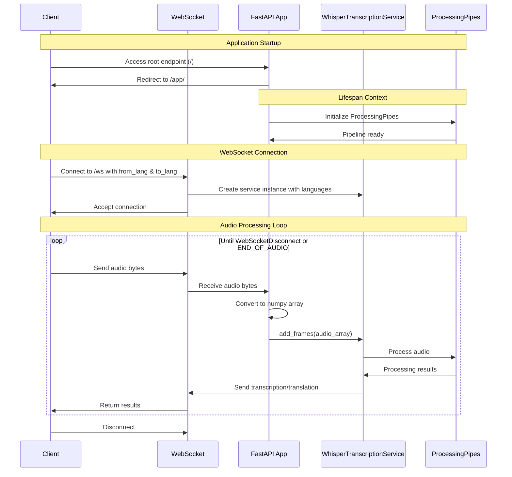

# Understanding the Translator Application

This code is the main entry point for a real-time audio translation service built with FastAPI. 

Here's a breakdown of its functionality:

## Core Components

1. **Web Server Setup**:
   - Uses FastAPI to create a web server with both HTTP endpoints and WebSocket support
   - Serves a frontend application from the "frontend" directory

2. **Audio Translation Pipeline**:
   - Receives audio through WebSockets
   - Transcribes speech using a Whisper model
   - Translates between languages specified as query parameters

## Key Functions and Classes

### Application Lifecycle
- `lifespan()`: An async context manager that initializes the processing pipeline when the application starts

### WebSocket Handling
- `get_audio_from_websocket()`: Receives audio data chunks through the WebSocket connection and converts them to NumPy arrays
- `translate()`: The main WebSocket endpoint that:
  - Accepts language parameters (`from_lang` and `to_lang`)
  - Creates a transcription service for the client
  - Continuously receives audio frames and adds them to the processing pipeline

### Endpoints
- `GET /`: Redirects to the frontend application
- `WebSocket /ws`: Handles real-time audio streaming and translation

## Execution Flow

1. When the application starts:
   - The processing pipeline is initialized
   - Static files are mounted for the frontend
   - WebSocket endpoint is configured

2. When a client connects:
   - The WebSocket connection is established with language parameters
   - A unique transcription service is created for the client
   - Audio frames are continuously received and processed

3. The pipeline likely:
   - Transcribes the audio in the source language
   - Translates the transcription to the target language
   - Sends results back to the client through the WebSocket

This architecture enables real-time speech-to-text and translation, making it suitable for applications like live interpretation or subtitling.