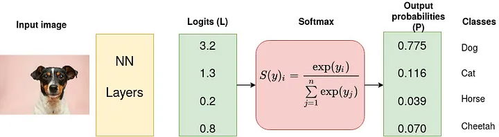

# Activation Functions
 
Activation function decides whether to activate a neuron or not by calculating weighted sum and further adding bias to it. Without it neural network is just a linear regression model in its sense and <b>activation function introduces non-linearity into the output</b>.

## Softmax

Softmax is an activation function that scales numbers/logits into probabilities. It is often used as the last activation function of a neural network to normalize the output of a network to a probability distribution over predicted output classes. 

It is used in tranformers. 

$$Softmax(y)_i = \dfrac{exp(y_i)}{\sum_{j=1}^nexp(y_j)} $$

### Softmax normalization and Standard normalization

softmax([2,4]) = [0.119, 0.881]

softmax([4,8]) = [0.018, 0.982]

std_norm([2,4]) = [0.333, 0.667]

std_norm([4,8]) = [0.333, 0.667]

## Sigmoid / logistic function

It can also be used in cases when you need your output to be in [0:1] range. The problem is that it saturates and kills gradient which makes learning slower.

$$\large f(x) = \dfrac{1}{1 + e^{-x}}$$

## Tanh

It is a shifted version of the sigmoid and also saturates the gradient, but its values lie in [-1:1] range. It is commonly used in hidden layers of a neural network as it helps to center the data and bring mean to 0, it makes learning easier for next layers.

$$\large f(x)=\dfrac{2}{1+ e^{-2x}}-1=2\times Sigmoid(2x) - 1$$

## Rectified linear unit (ReLU)

It is the __most widely used activation function__ as a model using it learns much faster than with the previous two. It is not as computationally expensive as the previous two and not sensitive to vanishing gradient. It returns 0 for all values less than 0 and a value for all which are more or equal to 0. I have also seen advice to use ReLU when you are not sure what to use.

Formula is f(x) = max(0,x)

$$f(x)=
\begin{cases}
x & \quad \text{when $x \geq 0$} \\
0 & \quad \text{otherwise}
\end{cases}$$

