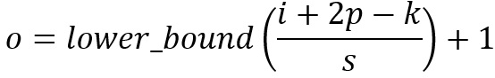
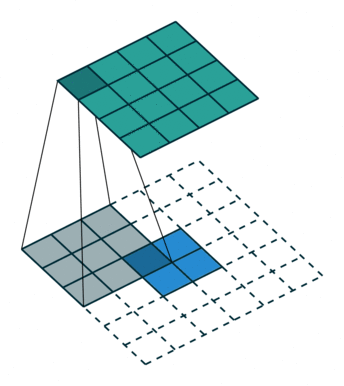
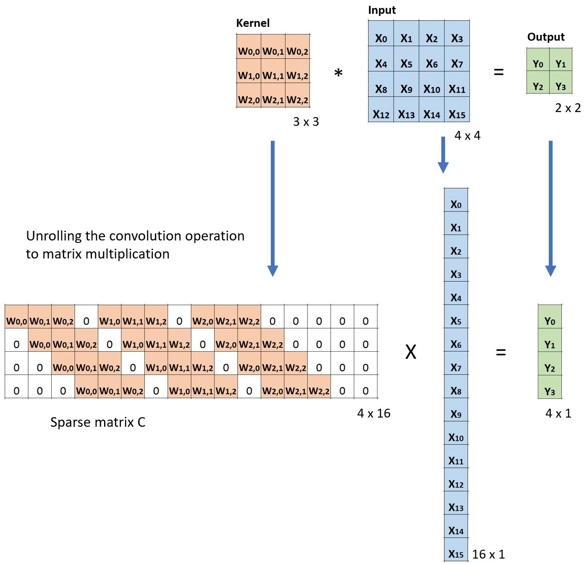

# Convolution
  * [1x1 Convolution](#1x1-convolution)
  * [Convolution Arithmetic](#convolution-arithmetic)
  * [Transposed Convolution (Deconvolution)](#transposed-convolution)
  * [Grouped Convolution](#grouped-convolution)

## Convolution


Output size:
```
n_new = (n_old - f + 1)x(n_old - f + 1) = (5 - 3 + 1)x(5 - 3 + 1) = 3x3
```
Here,

- n_new = size of the new output image

- n_old = size of the input image

- f = filter size

This formula is applicable when the stride is 1, and the padding is 0. So it means if stride jumps 1 pixel at a time towards the horizontal side and vertical side, then we will get the 3x3 output image.

### Convolution with Multiple Filters


Here we have 2 filters: Filter 1 and Filter 2.

Filter size is 3x3.

### Stride

- It is used to move the filter horizontally or vertically way operations after each pixel jump movement. The jumps and movement are decided by the value of the stride, as shown in the below image.


- When we use stride, the formula becomes

```
n_new = [(n_old + 2*p - f)/s + 1]*[(n_old + 2*p - f)/s + 1]
```

### Padding


- The padding is used to keep the boundary information to the next step. It is also used to keep the original input image size so that the information holds still to the other convolutional layers.

- We can do padding with zero value and also do reflective padding with the same value as in the boundary of the original image. The main advantage of using the reflective padding is to stop the discontinuation from the 0 paddings.

- When we use the padding, the formula becomes

```
n_new = (n_old - f + 2p + 1)x(n_old - f + 2p + 1) = (5 - 3 + 2*1 + 1)x(5 - 3 + 2*1 + 1) = 5x5
```

Here:

- n_new = size of the new output image

- n_old = size of the input image

- f = filter size

- p = number of padding

## 1x1 Convolution

The following picture illustrates how 1 x 1 convolution works for an input layer with dimension H x W x D. After 1 x 1 convolution with filter size 1 x 1 x D, the output channel is with dimension H x W x 1. If we apply N such 1 x 1 convolutions and then concatenate results together, we could have a output layer with dimension H x W x N.


*1x1 convolution, where the filter size is 1x1xD*

Initially, 1 x 1 convolutions were proposed in the Network-in-network paper. They were then highly used in the Google Inception paper. A few advantages of 1 x 1 convolutions are:
  * Dimensionality reduction for efficient computations
  
  * Efficient low dimensional embedding, or feature pooling
  
  * Applying nonlinearity again after convolution

The first two advantages can be observed in the image above. After 1 x 1 convolution, we significantly reduce the dimension depth-wise. Say if the original input has 200 channels, the 1 x 1 convolution will embed these channels (features) into a single channel. The third advantage comes in as after the 1 x 1 convolution, non-linear activation such as ReLU can be added. The non-linearity allows the network to learn more complex function.

## Convolution Arithmetic

Here are a few terminologies:

  * Kernel size: The kernel size defines the field of view of the convolution.
  
  * Stride: it defines the step size of the kernel when sliding through the image. Stride of 1 means that the kernel slides through the image pixel by pixel. Stride of 2 means that the kernel slides through image by moving 2 pixels per step (i.e., skipping 1 pixel). We can use stride (>= 2) for downsampling an image.
  
  * Padding: the padding defines how the border of an image is handled. A padded convolution will keep the spatial output dimensions equal to the input image, by padding 0 around the input boundaries if necessary. On the other hand, unpadded convolution only perform convolution on the pixels of the input image, without adding 0 around the input boundaries. The output size is smaller than the input size.
  
This following illustration describes a 2D convolution using a kernel size of 3, stride of 1 and padding of 1.


For an input image with size of i, kernel size of k, padding of p, and stride of s, the output image from convolution has size o:



## Transposed Convolution

For many applications and in many network architectures, we often want to do transformations going in the opposite direction of a normal convolution, i.e. we’d like to perform up-sampling. A few examples include generating high-resolution images and mapping low dimensional feature map to high dimensional space such as in auto-encoder or semantic segmentation. (In the later example, semantic segmentation first extracts feature maps in the encoder and then restores the original image size in the decoder so that it can classify every pixel in the original image.)

Traditionally, one could achieve up-sampling by applying interpolation schemes or manually creating rules. Modern architectures such as neural networks, on the other hand, tend to let the network itself learn the proper transformation automatically, without human intervention. To achieve that, we can use the transposed convolution.

The transposed convolution is also known as deconvolution, or fractionally strided convolution in the literature. However, it’s worth noting that the name “deconvolution” is less appropriate, since transposed convolution is not the real deconvolution as defined in signal / image processing. Technically speaking, deconvolution in signal processing reverses the convolution operation. That is not the case here. Because of that, some authors are strongly against calling transposed convolution as deconvolution. People call it deconvolution mainly because of simplicity.

It is always possible to implement a transposed convolution with a direct convolution. For an example in the image below, we apply transposed convolution with a 3 x 3 kernel over a 2 x 2 input padded with a 2 x 2 border of zeros using unit strides. The up-sampled output is with size 4 x 4.


*Up-sampling a 2x2 input to 4x4 output*/

Interestingly enough, one can map the same 2 x 2 input image to a different image size, by applying fancy padding & stride. Below, transposed convolution is applied over the same 2 x 2 input (with 1 zero inserted between inputs) padded with a 2 x 2 border of zeros using unit strides. Now the output is with size 5 x 5.


*Up-sampling 2x2 input to a 5x5 output*/

The following example shows how such operation works. It flattens the input to a 16 x 1 matrix, and transforms the kernel into a sparse matrix (4 x 16). The matrix multiplication is then applied between sparse matrix and the flattened input. After that, the resulting matrix (4 x 1) is then transformed back to a 2 x 2 output.


*Matrix multiplication for convolution: from a large input image (4x4) to a Small output image (2x2)*

Now, if we multiple the transpose of matrix CT on both sides of the equation, and use the property that multiplication of a matrix with its transposed matrix gives an Unit matrix, then we have the following formula CT x Small = Large, as demonstrated in the figure below.


*Matrix multiplication for convolution: from a Small input image (2x2) to a Large output image (4x4)*

As you can see here, we perform up-sampling from a small image to a large image. That is what we want to achieve. And now, you can also see where the name “transposed convolution” comes from.

## Grouped Convolution

Grouped convolution was introduced in the AlexNet paper in 2012. The main reason of implementing it was to allow the network training over two GPUs with limited memory (1.5 GB memory per GPU). The AlexNet below shows two separate convolution paths at most of the layers. It’s doing model-parallelization across two GPUs (of course one can do multi-GPUs parallelization if more GPUs are available).


Here we describe how the grouped convolutions work. First of all, conventional 2D convolutions follow the steps showing below. In this example, the input layer of size (7 x 7 x 3) is transformed into the output layer of size (5 x 5 x 128) by applying 128 filters (each filter is of size 3 x 3 x 3). Or in general case, the input layer of size (Hin x Win x Din) is transformed into the output layer of size (Hout x Wout x Dout) by applying Dout kernels (each is of size h x w x Din).


*Standard 2D convolution*

In grouped convolution, the filters are separated into different groups. Each group is responsible for a conventional 2D convolutions with certain depth. The following examples can make this clearer.


*Grouped convolution with 2 filter groups*

Above is the illustration of grouped convolution with 2 filter groups. In each filter group, the depth of each filter is only half of the that in the nominal 2D convolutions. They are of depth Din / 2. Each filter group contains Dout /2 filters. The first filter group convolves with the first half of the input layer ([:, :, 0:Din/2]), while the second filter group convolves with the second half of the input layer ([:, :, Din/2:Din]). As a result, each filter group creates Dout/2 channels. Overall, two groups create 2 x Dout/2 = Dout channels. We then stack these channels in the output layer with Dout channels.

## References
* [ImageNet Classification with Deep Convolutional Neural Networks](https://papers.nips.cc/paper/4824-imagenet-classification-with-deep-convolutional-neural-networks.pdf) by Alex Krizhevsky, Ilya Sutskever and Geoffrey E. Hinton.
