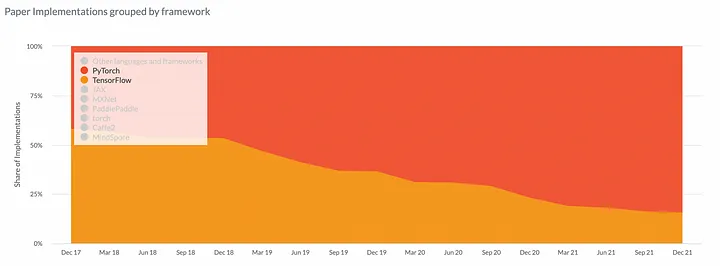
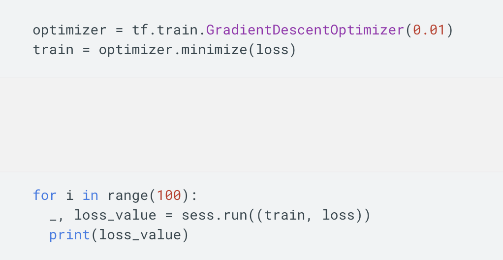
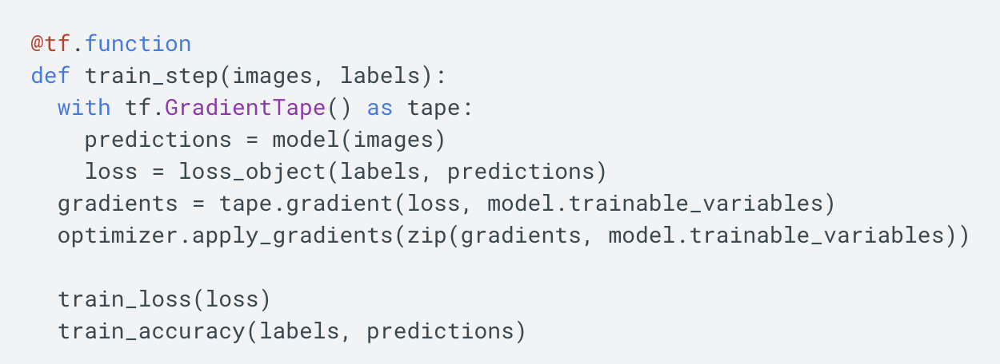
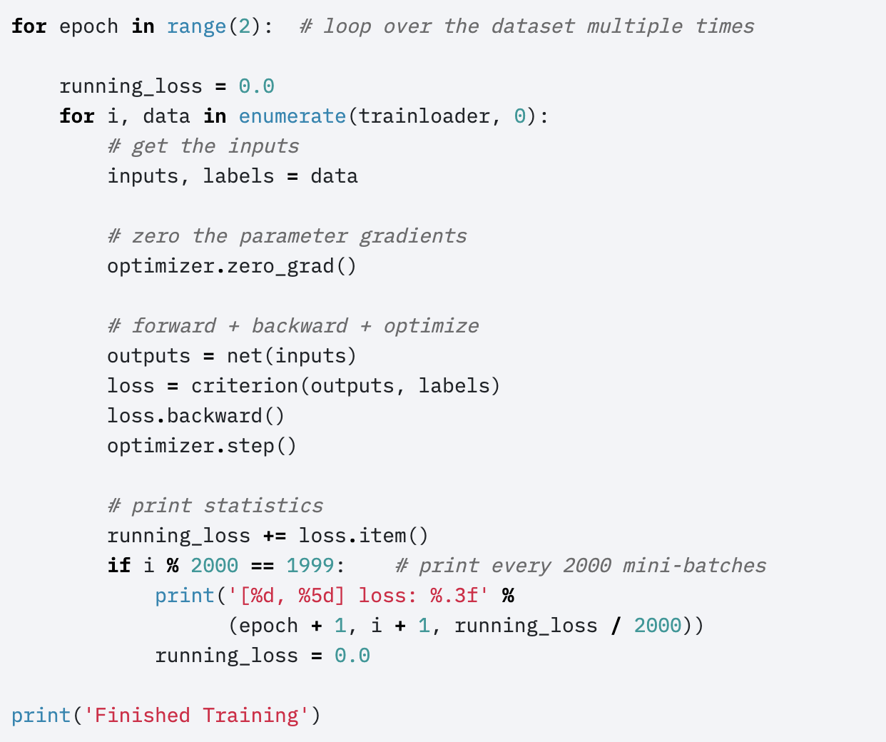

# PyTorch vs Tensorflow

## PapersWithCode Paper Implementations PyTorch vs TensorFlow



## What speaks for PyTorch

- PyTorch is easier to learn and work with
- It is better for some projects, especially for NLP and building rapid prototypes
- New resources come in at a rapid pace, offering PyTorch to be suited well for production environments
- Most research is done in PyTorch

## What speaks for TensorFlow

- TF’s documentation is on point and TF offers large community support
- TF is currently better for production models and scalability because it was built to be production ready
- With TF 2.x it basically got most of the Features PyTorch has
- tf.keras offers a high-level API for fast model

## Comparing TensorFlow 1.x, PyTorch, and TensorFlow 2.x

The main differences between these frameworks are in the way in which variables are assigned and the computational graph is run. TensorFlow 2.0 works similarly to PyTorch.

```
# Tensorflow 1.x
outputs = session.run(f(placeholder), feed_dict={placeholder: input})

# Tensorflow 2.x
outputs = f(input)
```

With TensorFlow 2.0, we don’t initialize and run a session with placeholders. Instead, the computational graph is built up dynamically as we declare variables, and calling a function with an input runs the graph and provides the output, like a standard Python function.

- Tensorflow 1.x


- Tensorflow 2.x


- PyTorch
