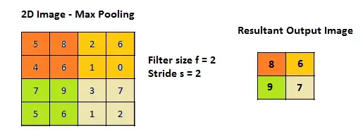

# Pooling

## Max Pooling

In this type of pooling, the filter roll over the input image and take the maximum value from the mask area, then does the addition to mapping it into the output image with stride movement. The below image will show the working idea of max pooling.

## Average Pooling 

In this type of pooling, the rollover of the input image takes the average of the values from the mask area and then does the addition to mapping it into the output image with stride movement. The below image will show the working idea of average pooling.

