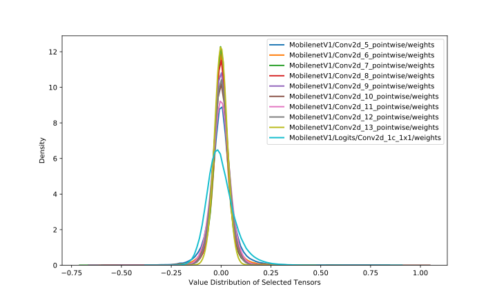
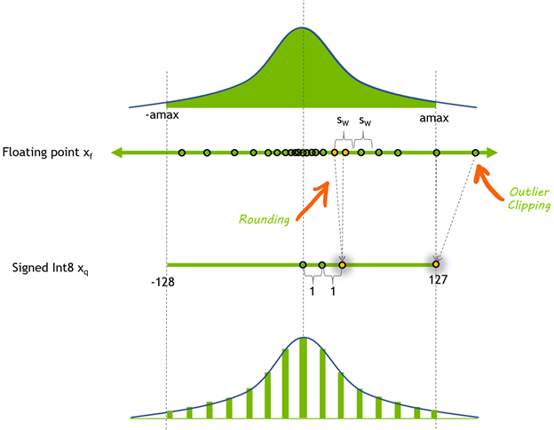
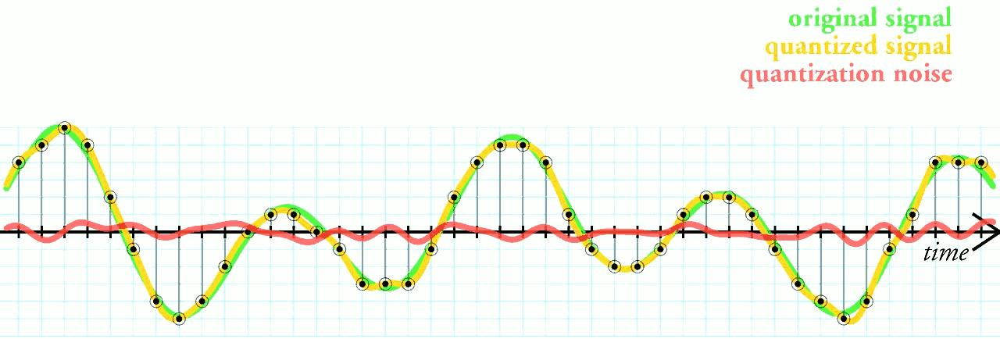

# Quantization Arithmetic  
   * [Fixed-point and floating-point](#fixed-point-and-floating-point)
   * [Quantizing floating-point](#quantizing-floating-point)
   * [Quantized arithmetic](#quantized-arithmetic)
   * [Inferencing with INT8](#inferencing-with-int8)
  
Quantization for deep learning is the process of approximating a neural network that uses floating-point numbers, which by default are 32-bit, by a neural network of low bit width numbers. This results in a smaller model size and faster computation.

* Benefits:
  * Reduced bandwidth
  * Reduced footprint
  * Higher compute throughput
  * Lower power consumption

* Challenge:
  * Maintaing accuracy

Quantization process can be divided into two parts: converting model from FP32 to INT8, and inferencing with INT8.

## Fixed-point and Floating-point

Fixed point and floating point are both representation of numbers. The difference is where the point, which divides the integer part and fractional part of a number, is placed. Fixed point reserves specific number of digits for both parts, while floating point reserves specific number of digits for significand and exponent respectively.

*Figure: Formatand example of fixed-point and floating-point*

For fixed-point, I denotes integer and F denotes fraction in IIIII.FFFFF. For floating-point, the base is 2,10 and 16 for binary, decimal and hex format respectively. The digit examples of fixed-point and floating-point are the one-to-one same in the above Figure.

In the context of premitive data type of ISA (Instruction Set Architecture), fixed point is integer which doesn’t reserve fractional part, floating-point is in binary format. Generally speaking, fixed point is continuous since it is integer and the gap of two nearest representable numbers is 1. Floating point, on the other hand, the representation gap is determined by exponent. Thus, floating point has very wide value range (for 32 bits, max integer is 231−1 and max float is (2−2−23)×2127), and the closer the value is to 0, more accurate it can represent a real number. One observation is that, floating point has same number of values in different range determined by exponent as Figure 6. For exmple, the number of floating point values in [1,2) is same as [0.5,1), [2,4), [4,8) and so on.

*Figure: Real numbers and floating point numbers*

Floating point operation can be composed by integer operations. In the early days, it is software which emulates floating-point arithmetic on fixed-point only hardware. Equations below show how floating-point multiplication is resolved into multiplication and addition of integer - the significand and exponent.

*Equation: Floating-point multiply*

In practice, after the integer multiplication of significand above, a rescaling operation is usually needed when the multiplication results in a number is too large for the representation. Rescaling moves part of the significand result to exponent, and round the remained significand in a nearest rounding approach. Because some digits are abandoned, floating-point multiplication loses some information.

*Figure: Significant part of floating-point multiplication*

## Quantizing Floating-point

Neural networks are built of floating point arithmetic. As stated in Fixed-point and Floating-point, value ranges of FP32 and INT8 are [(2−2−23)×2127,(223−2)×2127] and [−128,127], while the value count approximate 232 and 28 respectively. Therefore, converting networks from FP32 to INT8 is not a trivial work like truncated casting of data types.

Fortunately, the value distribution of neural network weight is of small range, which is very close to 0. Figure below shows weight distribution of 10 layers (layers that have most value points) of MobileNetV1.

*Figure: Weight distribution of 10 layers of MobileNetV1*
  
Quantizing float value is as Equations below, and can be summarized in two steps:

  * Determining xscale and xzero_point by finding min and max value in weight tensor.
  * Converting weight tensor from FP32 to INT8 per value.

Note that, rounding is needed in these steps when the floating-point operation result doesn’t equal to an integer. Considering mapping [−1,1] FP32 range to INT8 range [0,255]. We have xscale=2/255, and xzero_point=255−255/2≈127.

*Figure: 8-bit signed integer quantization of a floating-point tensor*

### Quantization Range

Quantization is a balance between quantization error and clipping error.

* Full-range:
  * Good representation of outlier (large values)
  * Low resolution at distribution mass
* Reduced-range:
  * Outlier are clipped
  * Higher resolution for small values

  

### Quantization Granularity

* Scale per-tensor (Weights/Activations)
  * Single scale for the entire tensor.
  * Fast and simple
  * Coarse: higher error

* Scale per-channel (Weights)
  * Vector of scale elements:
  * Higher compute storage overheads
  * Fine: lower error

It’s obverious that there is error in quantization process. The error is inevitable just like the quantization in digital signal processing, where the quantization terminology comes from. Figure below shows the quantization and the error of digital signal processing.

*Figure: Quantization and the error of digital signal processing*

## Quantized Arithmetic

Equation 10-16 below is the detail behind quantized multiplication xfloat⋅yfloat. 

*Equation: Quantized multiplication arithmetic*

Since the scale factors of input x, weight y and output z are all known for a given neural network, thus Multiplierx,y,z can be pre-computed before network forwarding. Therefore operations in Equation 16 are in integer except the multiplication between Multiplierx,y,z and (xquantized−xzero_point)⋅(yquantized−yzero_point).

Equation 17-26 are the quantized addition arithmetic.

*Equation: Quantized addition arithmetic*

Besides multiplication and addition, there are many other arithemtic operations such as division, subtraction, exponentation and so on. There are particular methods, which can be decomposed into multiplication and addition, to represent these operations in quanzation regardless of whether it is complex or not. With theses methods the quantized neural network forwards and generates valid result just like the network it quantizes from.

## Inferencing with INT8

* Some frameworks simply introduce Quantize and Dequantize layer which converts FP32 to INT8 and the reverse.

 * Some other frameworks convert the network into INT8 format as a whole, online or offline. 

*Figure: Mixed FP32/INT8 and Pure INT8 Inference. Red color is FP32, green color is INT8 or quantization*
   
## References
* [Quantizing deep convolutional networks for efficient inference: A white paper](https://arxiv.org/pdf/1806.08342.pdf) by Google.
* [Quantization and Training of Neural Networks for Efficient Integer-Arithmetic-Only Inference](https://arxiv.org/pdf/1712.05877.pdf) by Benoit Jacob, Skirmantas Kligys, Bo Chen, Menglong Zhu, Matthew Tang, Andrew Howard, Hartwig Adam, and Dmitry Kalenichenko from Google.
* [Quantization Algorithms](https://nervanasystems.github.io/distiller/algo_quantization.html) Neural Network Distiller
* [Mixed-Precision Training of Deep Neural Networks](https://devblogs.nvidia.com/mixed-precision-training-deep-neural-networks/) by Nvidia
* [8-bit Inference with TensorRT](http://on-demand.gputechconf.com/gtc/2017/presentation/s7310-8-bit-inference-with-tensorrt.pdf) by Szymon Migacz from Nvidia
* [Fast INT8 Inference for Autonomous Vehicles with TensorRT 3](https://devblogs.nvidia.com/int8-inference-autonomous-vehicles-tensorrt/) by Joohoon Lee from Nvidia
* [Making Neural Nets Work with Low Precision](https://sahnimanas.github.io/post/quantization-in-tflite/) 
* [What I've learned about neural network quantization](https://petewarden.com/2017/06/22/what-ive-learned-about-neural-network-quantization/) by Pete Warden.
