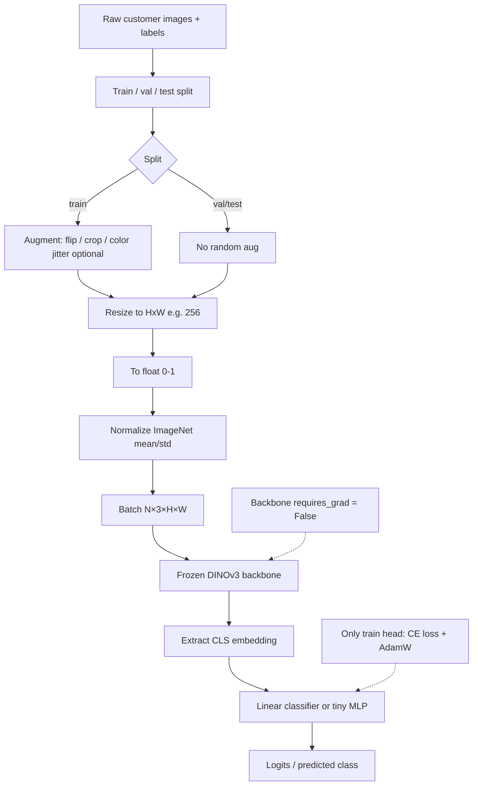

# DINO, DINOv2, and DINOv3

The **DINO** family (Meta FAIR) is a line of **self-supervised vision backbones**. They learn **general visual features** from images **without labels** (no class tags, no captions). They are **feature extractors / foundation encoders**, not detectors or segmenters by themselves.

**Name:** DINO = **Di**stillation with **no** labels (self-distillation).  
Do not confuse with **Grounding DINO** (open-vocabulary **detector**) — different model; see [open-vocabulary detection](../../computer_vision/object_detection/open_vocabulary_detection.md).

See also: [Vision Transformer](vision_transformer.md) · [CNN vs ViT](../../classification/cnn_vs_vit.md) · [Segment Anything](../../computer_vision/Segmentation/segment_anything.md)

## What DINO-style models output

* A global **CLS** embedding (whole image) — classification, retrieval, k-NN
* **Patch** embeddings (dense / local features) — segmentation cues, depth, matching, detection heads

Typical use today: **freeze the backbone** → linear probe or small head, or light fine-tune.

---

## DINO (2021) — the original method

**Paper:** *Emerging Properties in Self-Supervised Vision Transformers* (Caron et al., ICCV 2021).

DINO showed that **self-supervised ViTs** learn qualitatively different features than supervised ViTs or many convnets — especially **semantic layout / object boundaries** visible in attention maps, and strong **k-NN** classification from frozen features.

### Core idea (self-distillation, no labels)

```text
same image → different crops / augmentations
                    │
        ┌───────────┴───────────┐
        ▼                       ▼
   Student network         Teacher network
   (trained by CE)         (EMA of student)
        │                       │
        └──────── match ────────┘
         student predicts teacher
```

* **Student** and **teacher** share the same architecture (often a ViT).
* Teacher weights are an **EMA (momentum)** copy of the student — not trained by backprop.
* **Multi-crop:** teacher sees **global** crops; student also sees **local** crops → learn local-to-global consistency.
* Loss is basically **cross-entropy**: student matches the teacher’s softmax output.
* **Centering + sharpening** of the teacher distribution avoids **collapse** (everything mapping to one trivial feature), without needing a heavy contrastive negative bank.

So DINO is “knowledge distillation” where the teacher is built from the student itself — **no human labels**.

### Why it mattered

* Simple SSL recipe that works especially well with **ViTs**
* Emergent **semantic segmentation-like** structure in features / attention
* Strong frozen features for **k-NN** and linear eval on ImageNet
* Foundation for later **DINOv2** / **DINOv3** scaling

Repo: [facebookresearch/dino](https://github.com/facebookresearch/dino) · Paper: [arXiv:2104.14294](https://arxiv.org/abs/2104.14294)

---

## DINOv2 (2023)

**DINOv2** scales and hardens the DINO idea into a **production-style foundation model**: trained on a large curated set (~142M images). Features are strong **out of the box** for many tasks with little or no fine-tuning of the backbone.

**What DINOv2 can do well**

* **Image classification** / fine-grained recognition (linear head or light fine-tune) — especially useful on **small custom datasets**
* **Semantic segmentation** / object-part understanding (dense patch features)
* **Monocular depth** (surprisingly strong with a simple head)
* **Image / instance retrieval** (similarity search)
* **Feature matching** across images
* Transfer features for video understanding

**What it is not**

* Not [SAM](../../computer_vision/Segmentation/segment_anything.md) — no promptable masks out of the box
* Not YOLO / [Grounding DINO](../../computer_vision/object_detection/open_vocabulary_detection.md) — no boxes from a forward pass alone
* Not CLIP by design — **vision-only** SSL (no native text tower)

Repo: [facebookresearch/dinov2](https://github.com/facebookresearch/dinov2)

---

## DINOv3 (2025)

**DINOv3** (Meta, Aug 2025) is the scaled successor: same role (universal SSL vision features), trained much larger.

Reported highlights vs DINOv2:

* Much larger scale (on the order of **~1.7B images**, models up to **~7B** parameters)
* **Gram anchoring** to keep **dense** feature maps sharp during long training (dense quality used to degrade when scaling)
* Strong results with a **frozen** backbone on many **dense** tasks (segmentation, detection heads, etc.), including broader domains (e.g. satellite variants)
* A **family** of distilled smaller **ViT** and **ConvNeXt** models for deployment; optional post-hoc flexibility (resolution, text alignment)

**What DINOv3 can do** — same jobs as v2, generally stronger dense features and more size options. Prefer DINOv3 when you want the latest backbone; keep DINOv2 if your stack already depends on it and is good enough.

Repo / paper: [facebookresearch/dinov3](https://github.com/facebookresearch/dinov3) · [Meta DINOv3 blog](https://ai.meta.com/blog/dinov3-self-supervised-vision-model/)

---

## Family comparison

| | **DINO (2021)** | **DINOv2 (2023)** | **DINOv3 (2025)** |
|--|-----------------|-------------------|-------------------|
| Role | SSL method + early ViT features | Scaled foundation backbone | Further scaled foundation family |
| Focus | Self-distillation recipe; emergent properties | Curated data + robust universal features | Scale + dense-feature quality (Gram anchoring) |
| What you use today | Historical / research baseline | Still excellent default SSL backbone | Latest / strongest dense features |
| vs YOLO / SAM | Feature encoder only | Same | Same |

## DINO vs ResNet as a feature extractor

**Yes — DINOv2 / DINOv3 are excellent for image feature extraction.** On a **small custom dataset**, a frozen DINO backbone is often a **better starting point than fine-tuning ResNet**.

| | **DINOv2 / v3** | **ResNet50 (fine-tune)** |
|--|-----------------|--------------------------|
| Pretraining | Self-supervised, strong general features | Supervised ImageNet |
| Small data | Often wins with **frozen + linear head** | Works, but easier to overfit if you unfreeze a lot |
| Feature quality | Strong global + dense semantics | Strong, more “ImageNet-shaped” |
| Training cost | Cheap if frozen | Medium |
| When ResNet wins | — | Domain very close to ImageNet and you tune carefully |

### Small custom dataset → one classifier

**Recommended default**

1. **DINOv2 or DINOv3 backbone, frozen**
2. Train only a **linear classifier** (or a tiny MLP) on CLS features
3. Strong but simple augmentation; careful train/val split

That usually beats “fine-tune all of ResNet50” when labels are few, because you keep a strong representation instead of overfitting the backbone.

**Strong alternative:** fine-tune **ResNet50** with a small LR on the backbone and a larger LR on the head (optionally freeze early epochs). Still a solid workflow; a **clean frozen DINO linear probe** is often stronger on small data.

**If you have a bit more data**, try both and pick by validation:

1. Frozen DINO + linear head  
2. Light DINO fine-tune (unfreeze last blocks, tiny LR)  
3. Fine-tune ResNet50  

**Practical tip:** start with **DINOv2-B** or a distilled **DINOv3** small/base if VRAM matters; keep preprocessing consistent with the checkpoint. For fine-grained or domain-shifted images (industrial, medical, products), DINO’s SSL features often transfer better than ImageNet-supervised ResNet.

**Bottom line:** For a small custom classifier, prefer **DINO as a frozen feature extractor + linear head** first; use fine-tuned ResNet as a baseline comparison, not the only plan. See also [CNN vs ViT](../../classification/cnn_vs_vit.md) and [Fine-tuning ViT](vision_transformer.md#fine-tuning-vit-on-custom-data).

### Frozen DINOv3 + linear / MLP head — preprocessing and pipeline

Preprocessing is mostly **match the DINOv3 checkpoint**; the backbone stays frozen and labels never update DINO weights.

**Required (web / LVD weights)** — official-style transform from [dinov3](https://github.com/facebookresearch/dinov3):

1. **RGB** image  
2. **Resize** to the size the checkpoint expects (commonly **256×256**; Hugging Face processors often default to **224** — follow that checkpoint)  
3. Convert to **float in [0, 1]**  
4. **Normalize** with ImageNet stats: mean `(0.485, 0.456, 0.406)`, std `(0.229, 0.224, 0.225)`  
5. Batch as `N×3×H×W`

Satellite (**SAT**) weights use **different** mean/std — do not mix them with web weights.

**Train aug (optional, helpful on small data):** light RandomResizedCrop / flip / color jitter *before* normalize. Keep **val/test deterministic** (fixed resize + normalize only).

**Not required** for a frozen CLS probe: ImageNet labels, boxes, masks, or unfreezing DINO.

After preprocess:

```text
image → transform → frozen DINOv3 → CLS vector → Linear / tiny MLP → class logits
```

Only the Linear/MLP is trained (e.g. cross-entropy). Same resize + mean/std at train and inference; you can cache CLS features once for faster head sweeps.



## Practical takeaway

* Need a **pretrained visual encoder** for your dataset (classify, retrieve, feed a det/seg/depth head) → **DINOv2 or DINOv3** (often frozen + linear head on small data).
* Small custom classifier: prefer **frozen DINO + linear** over jumping straight to full ResNet fine-tune — see [above](#dino-vs-resnet-as-a-feature-extractor).
* Need **boxes or masks as the product** → [YOLO](../../computer_vision/object_detection/yolo_is_sota.md) / [open-vocab detection](../../computer_vision/object_detection/open_vocabulary_detection.md) / [SAM](../../computer_vision/Segmentation/segment_anything.md); DINO can still be the backbone behind a head.
* Fine-tuning tips for ViT-style models: [Fine-tuning ViT on custom data](vision_transformer.md#fine-tuning-vit-on-custom-data).

## References

* M. Caron et al., [Emerging Properties in Self-Supervised Vision Transformers](https://arxiv.org/abs/2104.14294) (DINO, ICCV 2021).
* M. Oquab et al., [DINOv2: Learning Robust Visual Features without Supervision](https://arxiv.org/abs/2304.07193) (2023).
* [DINOv3 technical report](https://ai.meta.com/research/publications/dinov3/) (2025).
* [dino](https://github.com/facebookresearch/dino) · [dinov2](https://github.com/facebookresearch/dinov2) · [dinov3](https://github.com/facebookresearch/dinov3)
