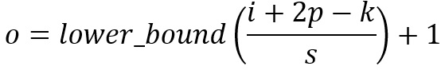
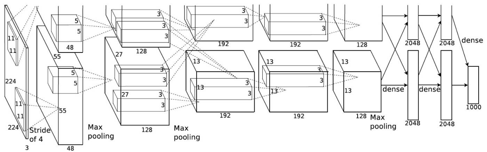
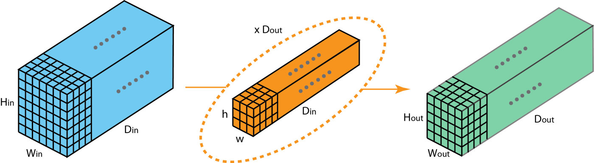
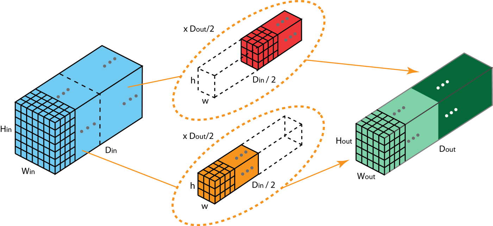

# Convolution
  * [1x1 Convolution](#1x1-convolution)
  * [Convolution Arithmetic](#convolution-arithmetic)
  * [Grouped Convolution](#grouped-convolution)
  
## 1x1 Convolution

The following picture illustrates how 1 x 1 convolution works for an input layer with dimension H x W x D. After 1 x 1 convolution with filter size 1 x 1 x D, the output channel is with dimension H x W x 1. If we apply N such 1 x 1 convolutions and then concatenate results together, we could have a output layer with dimension H x W x N.

*1x1 convolution, where the filter size is 1x1xD*

Initially, 1 x 1 convolutions were proposed in the Network-in-network paper. They were then highly used in the Google Inception paper. A few advantages of 1 x 1 convolutions are:
  * Dimensionality reduction for efficient computations
  
  * Efficient low dimensional embedding, or feature pooling
  
  * Applying nonlinearity again after convolution

The first two advantages can be observed in the image above. After 1 x 1 convolution, we significantly reduce the dimension depth-wise. Say if the original input has 200 channels, the 1 x 1 convolution will embed these channels (features) into a single channel. The third advantage comes in as after the 1 x 1 convolution, non-linear activation such as ReLU can be added. The non-linearity allows the network to learn more complex function.

## Convolution Arithmetic

Here are a few terminologies:

  * Kernel size: The kernel size defines the field of view of the convolution.
  
  * Stride: it defines the step size of the kernel when sliding through the image. Stride of 1 means that the kernel slides through the image pixel by pixel. Stride of 2 means that the kernel slides through image by moving 2 pixels per step (i.e., skipping 1 pixel). We can use stride (>= 2) for downsampling an image.
  
  * Padding: the padding defines how the border of an image is handled. A padded convolution will keep the spatial output dimensions equal to the input image, by padding 0 around the input boundaries if necessary. On the other hand, unpadded convolution only perform convolution on the pixels of the input image, without adding 0 around the input boundaries. The output size is smaller than the input size.
  
This following illustration describes a 2D convolution using a kernel size of 3, stride of 1 and padding of 1.

For an input image with size of i, kernel size of k, padding of p, and stride of s, the output image from convolution has size o:

## Grouped Convolution

Grouped convolution was introduced in the AlexNet paper in 2012. The main reason of implementing it was to allow the network training over two GPUs with limited memory (1.5 GB memory per GPU). The AlexNet below shows two separate convolution paths at most of the layers. It’s doing model-parallelization across two GPUs (of course one can do multi-GPUs parallelization if more GPUs are available).

Here we describe how the grouped convolutions work. First of all, conventional 2D convolutions follow the steps showing below. In this example, the input layer of size (7 x 7 x 3) is transformed into the output layer of size (5 x 5 x 128) by applying 128 filters (each filter is of size 3 x 3 x 3). Or in general case, the input layer of size (Hin x Win x Din) is transformed into the output layer of size (Hout x Wout x Dout) by applying Dout kernels (each is of size h x w x Din).

*Standard 2D convolution*

In grouped convolution, the filters are separated into different groups. Each group is responsible for a conventional 2D convolutions with certain depth. The following examples can make this clearer.

*Grouped convolution with 2 filter groups*

Above is the illustration of grouped convolution with 2 filter groups. In each filter group, the depth of each filter is only half of the that in the nominal 2D convolutions. They are of depth Din / 2. Each filter group contains Dout /2 filters. The first filter group convolves with the first half of the input layer ([:, :, 0:Din/2]), while the second filter group convolves with the second half of the input layer ([:, :, Din/2:Din]). As a result, each filter group creates Dout/2 channels. Overall, two groups create 2 x Dout/2 = Dout channels. We then stack these channels in the output layer with Dout channels.

## References
* [ImageNet Classification with Deep Convolutional Neural Networks](https://papers.nips.cc/paper/4824-imagenet-classification-with-deep-convolutional-neural-networks.pdf) by Alex Krizhevsky, Ilya Sutskever and Geoffrey E. Hinton.
