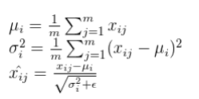

# Normalization 
 

   
 

## Benefits of using normalization
* It makes the Optimization faster because normalization doesn’t allow weights to explode all over the place and restricts them to a certain range.
 

  
 

* It normalizes each feature so that they maintains the contribution of every feature, as some feature has higher numerical value than others. This way our network can be unbiased(to higher value features).

* It reduces Internal Covariate Shift. It is the change in the distribution of network activations due to the change in network parameters during training. To improve the training, we seek to reduce the internal covariate shift.

* Batch Norm makes loss surface smoother(i.e. it bounds the magnitude of the gradients much more tightly).

* An unintended benefit of Normalization is that it helps network in Regularization(only slightly, not significantly).

 From above, we can conclude that getting Normalization right can be a crucial factor in getting your model to train effectively, but this isn’t as easy as it sounds. Let me support this by certain questions.
 
* How Normalization layers behave in Distributed training ?

* Which Normalization technique should you use for your task like CNN, RNN, style transfer etc ?

* What happens when you change the batch size of dataset in your training ?

* Which norm technique would be the best trade-off for computation and accuracy for your network ?

## Batch Normalization

  The mainstream normalization technique for almost all convolutional neural networks today is <b>Batch Normalization (BN)</b>, which has been widely adopted in the development of deep learning. Proposed by Google in 2015, BN can not only accelerate a model’s converging speed, but also alleviate problems such as Gradient Dispersion in the deep neural network, making it easier to train models.
 
  Batch normalization is a method that <b>normalizes activations</b> in a network across the mini-batch of definite size. For each feature, batch normalization computes the mean and variance of that feature in the mini-batch. It then subtracts the mean and divides the feature by its mini-batch standard deviation.
 

   
 

  But wait, what if increasing the magnitude of the weights made the network perform better?
  
  To solve this issue, we can add γ and β as scale and shift learn-able parameters respectively. This all can be summarized as:
  

   
  

  
### Problems associated with Batch Normalization
* Variable Batch Size → If batch size is of 1, then variance would be 0 which doesn’t allow batch norm to work. Furthermore, if we have small mini-batch size then it becomes too noisy and training might affect. 

* BN cannot ensure the model accuracy rate when the batch size becomes smaller. As a result, researchers today are normalizing with large batches, which is very memory intensive.

* There would also be a problem in distributed training. As, if you are computing in different machines then you have to take same batch size because otherwise γ and β will be different for different systems.

* Recurrent Neural Network → In an RNN, the recurrent activations of each time-step will have a different story to tell(i.e. statistics). This means that we have to fit a separate batch norm layer for each time-step. This makes the model more complicated and space consuming because it forces us to store the statistics for each time-step during training.

## Layer Normalization

 Layer normalization normalizes input across the features instead of normalizing input features across the batch dimension in batch normalization.
 
 A mini-batch consists of multiple examples with the same number of features. Mini-batches are matrices(or tensors) where one axis corresponds to the batch and the other axis(or axes) correspond to the feature dimensions.
 

  
 

     
 Layer normalization performs better than batch norm in case of <b>RNNs</b>.
 
## Instance Normalization

 Layer normalization and instance normalization is very similar to each other but the difference between them is that instance normalization normalizes across each channel in each training example instead of normalizing across input features in an training example. Unlike batch normalization, the instance normalization layer is applied at test time as well(due to non-dependency of mini-batch).
 

  
 

 
  Here, x∈ ℝ T ×C×W×H be an input tensor containing a batch of T images. Let xₜᵢⱼₖ denote its tijk-th element, where k and j span spatial dimensions(Height and Width of the image), i is the feature channel (color channel if the input is an RGB image), and t is the index of the image in the batch.
  
 This technique is originally devised for <b>style transfer</b>, the problem instance normalization tries to address is that the network should be agnostic to the contrast of the original image.
 
## Group Normalization
 Group Normalization normalizes over group of channels for each training examples. We can say that, Group Norm is in between Instance Norm and Layer Norm.
 
 When we put all the channels into a single group, group normalization becomes Layer normalization. And, when we put each channel into different groups it becomes Instance normalization.
 
 GN divides channels — also referred to as feature maps that look like 3D chunks of data — into groups and normalizes the features within each group. GN only exploits the layer dimensions, and its computation is independent of batch sizes.     
 

  
  
  
  
 

  Here, x is the feature computed by a layer, and i is an index. In the case of 2D images, i = (iN , iC , iH, iW ) is a 4D vector indexing the features in (N, C, H, W) order, where N is the batch axis, C is the channel axis, and H and W are the spatial height and width axes. G is the number of groups, which is a pre-defined hyper-parameter. C/G is the number of channels per group. ⌊.⌋ is the floor operation, and “⌊kC/(C/G)⌋= ⌊iC/(C/G)⌋” means that the indexes i and k are in the same group of channels, assuming each group of channels are stored in a sequential order along the C axis. GN computes µ and σ along the (H, W) axes and along a group of C/G channels.

## Batch-Instance Normalization
 Batch-Instance Normalization is just an interpolation between batch norm and instance norm.
 

  
 
 The interesting aspect of batch-instance normalization is that the balancing parameter ρ is learned through gradient descent.
 
 <b>From batch-instance normalization, we can conclude that models could learn to adaptively use different normalization methods using gradient descent.</b>
 
## Switchable Normalization
 Switchable normalization uses a weighted average of different mean and variance statistics from batch normalization, instance normalization, and layer normalization.
 
 switch normalization could potentially outperform batch normalization on tasks such as image classification and object detection.
 
 The instance normalization were used more often in earlier layers, batch normalization was preferred in the middle and layer normalization being used in the last more often. Smaller batch sizes lead to a preference towards layer normalization and instance normalization.
