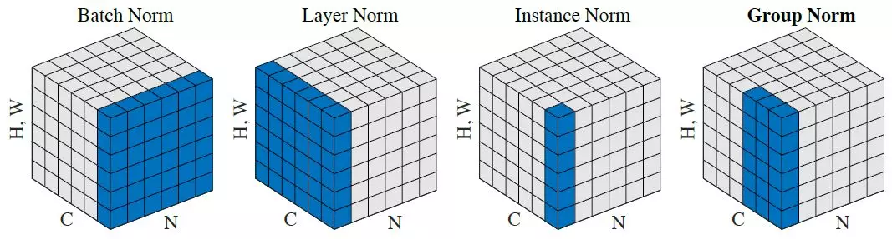

# Normalization 
 

   
 

## Benefits of using normalization
* It makes the Optimization faster because normalization doesn’t allow weights to explode all over the place and restricts them to a certain range.

* It normalizes each feature so that they maintains the contribution of every feature, as some feature has higher numerical value than others. This way our network can be unbiased(to higher value features).

* It reduces Internal Covariate Shift. It is the change in the distribution of network activations due to the change in network parameters during training. To improve the training, we seek to reduce the internal covariate shift.

* Batch Norm makes loss surface smoother(i.e. it bounds the magnitude of the gradients much more tightly).

* An unintended benefit of Normalization is that it helps network in Regularization(only slightly, not significantly).

 From above, we can conclude that getting Normalization right can be a crucial factor in getting your model to train effectively, but this isn’t as easy as it sounds. Let me support this by certain questions.
 
* How Normalization layers behave in Distributed training ?

* Which Normalization technique should you use for your task like CNN, RNN, style transfer etc ?

* What happens when you change the batch size of dataset in your training ?

* Which norm technique would be the best trade-off for computation and accuracy for your network ?

 The mainstream normalization technique for almost all convolutional neural networks today is <b>Batch Normalization (BN)</b>, which has been widely adopted in the development of deep learning. Proposed by Google in 2015, BN can not only accelerate a model’s converging speed, but also alleviate problems such as Gradient Dispersion in the deep neural network, making it easier to train models.

 <b>BN cannot ensure the model accuracy rate when the batch size becomes smaller. As a result, researchers today are normalizing with large batches, which is very memory intensive.</b>
     
 GN divides channels — also referred to as feature maps that look like 3D chunks of data — into groups and normalizes the features within each group. GN only exploits the layer dimensions, and its computation is independent of batch sizes.     

 Layer Normalization (LN), proposed in 2016 by a University of Toronto team led by Dr. Geoffrey Hinton; and Instance Normalization (IN), proposed by Russian and UK researchers, are also alternatives for normalizing batch dimensions. While LN and IN are effective for training sequential models such as RNN/LSTM or generative models such as GANs, GN appears to present a better result in visual recognition.
