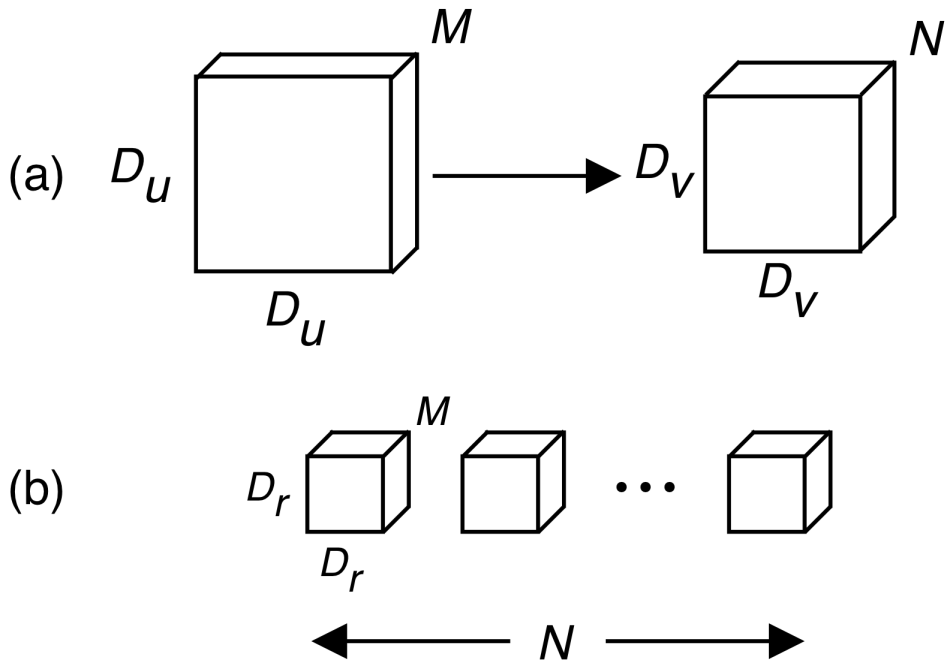
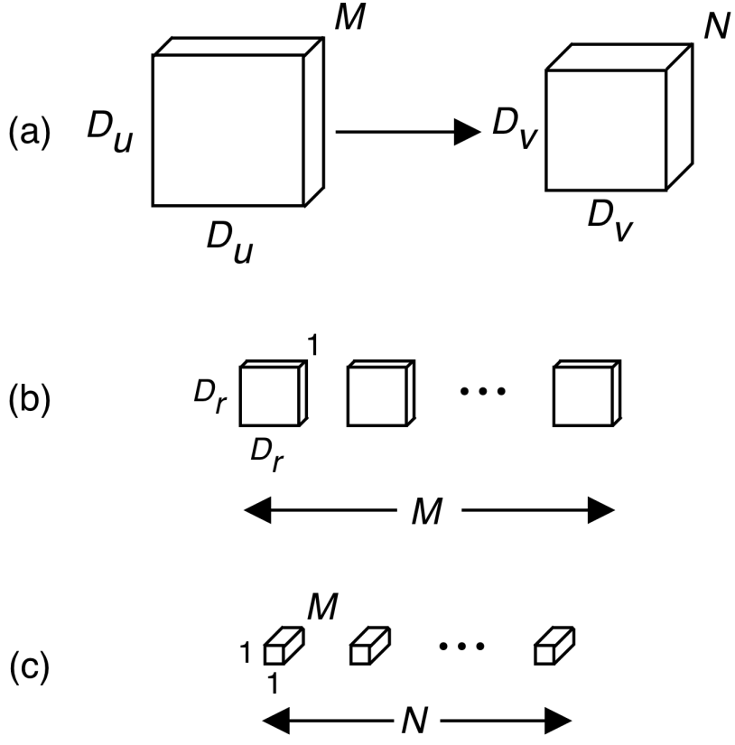
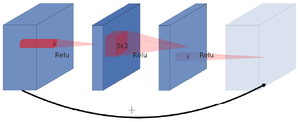

# Residual Block and Inverted Residual Block

## Standard Convolution

Suppose a convolution operation transforms an input volume of dimensions Dᵤ x Dᵤ x M to an output volume of dimensions Dᵥ x Dᵥ x N, as shown in Fig. 1(a). Specifically, we require N filters, each of dimension Dᵣ x Dᵣ x M, as shown in Fig. 1(b).



## Depth-wise Separable Convolutions

As before, suppose an input volume of Dᵤ x Dᵤ x M is transformed to an output volume of Dᵥ x Dᵥ x N, as shown in Fig. 4(a). The first set of filters, shown in Fig. 4(b), are comprised of M single-channel filters, mapping the input volume to Dᵥ x Dᵥ x M on a per-channel basis. This stage, known as depth-wise convolutions, rchieves the spatial filtering component. In order to construct new features from those already captured by the input volume, we require a linear combination. To do so, 1x1 kernels are used along the depth of the intermediate tensor; this step is referred to as point-wise convolution. N such 1x1 filters are used, resulting in the desired output volume of Dᵥ x Dᵥ x N.



The lowered computational cost of depth-wise separable convolutions comes predominantly from limiting the spatial filtering from M*N times in standard convolutions to M times. 

Taking the ratio between the cost of depth-wise separable and standard convolution gives 1/N + 1/Dᵣ². N will often be greater than Dᵣ² in practical applications, particularly as one goes deeper into a network, so the ratio can be approximated by 1/Dᵣ². For reference, if one uses 3x3 kernels, depth-wise separable convolutions enjoy nearly an order of magnitude fewer computations than standard convolutions.

## Residual Block

Residual blocks connect the beginning and end of a convolutional block with a skip connection. By adding these two states the network has the opportunity of accessing earlier activations that weren’t modified in the convolutional block. This approach turned out to be essential in order to build networks of great depth.



Residual block follows a wide->narrow->wide approach concerning the number of channels. The input has a high number of channels, which are compressed with an inexpensive 1x1 convolution. That way the following 3x3 convolution has far fewer parameters. In order to add input and output in the end the number of channels is increased again using another 1x1 convolution. In Keras it would look like this:

    ```
    def residual_block(x, squeeze=16, expand=64):
      m = Conv2D(squeeze, (1,1), activation='relu')(x)
      m = Conv2D(squeeze, (3,3), activation='relu')(m)
      m = Conv2D(expand, (1,1), activation='relu')(m)
      return Add()([m, x])
    ```
    
## Inverted Residual Block

MobileNetV2 follows a narrow->wide->narrow approach. The first step widens the network using a 1x1 convolution because the following 3x3 depthwise convolution already greatly reduces the number of parameters. Afterwards another 1x1 convolution squeezes the network in order to match the initial number of channels.


In Keras it would look like this:

    ```
    def inverted_residual_block(x, expand=64, squeeze=16):
      m = Conv2D(expand, (1,1), activation='relu')(x)
      m = DepthwiseConv2D((3,3), activation='relu')(m)
      m = Conv2D(squeeze, (1,1), activation='relu')(m)
      return Add()([m, x])
    ```
    
### Linear Bottleneck

The last convolution of a residual block has a linear output before it’s added to the initial activations. Putting this into code is super simple as we simply discard the last activation function of the convolutional block:

    ```
    def inverted_linear_residual_block(x, expand=64, squeeze=16):
      m = Conv2D(expand, (1,1), activation='relu')(x)
      m = DepthwiseConv2D((3,3),  activation='relu')(m)
      m = Conv2D(squeeze, (1,1))(m)
      return Add()([m, x])
    ```
    
### ReLU6

    ```
    def relu(x):
      return max(0, x)
    def relu6(x):
      return min(max(0, x), 6)
    ```
    
The final building block looks like this:

    ```
    def bottleneck_block(x, expand=64, squeeze=16):
      m = Conv2D(expand, (1,1))(x)
      m = BatchNormalization()(m)
      m = Activation('relu6')(m)
      m = DepthwiseConv2D((3,3))(m)
      m = BatchNormalization()(m)
      m = Activation('relu6')(m)
      m = Conv2D(squeeze, (1,1))(m)
      m = BatchNormalization()(m)
      return Add()([m, x])    
    ```
