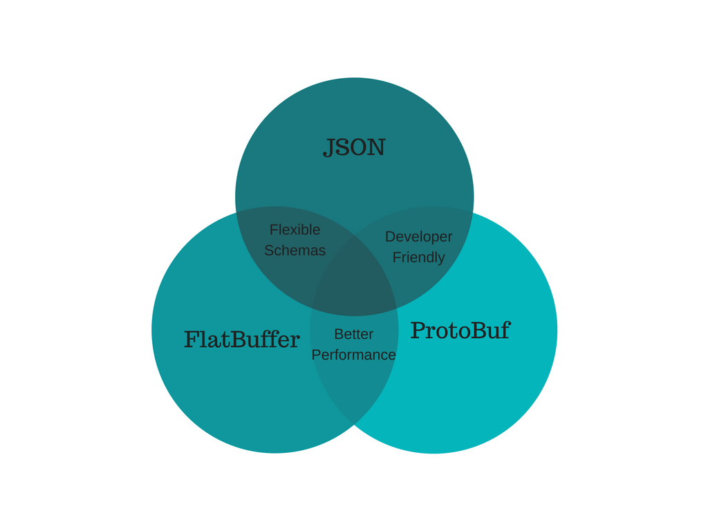

# Protobuf and Flat Buffers

## What's protocol buffers?

Protobuf is a data serializing protocol like a JSON or XML. But unlike them, the protobuf is not for humans, serialized data is compiled bytes and hard for the human reading.

It's description from Google official page:

<i>Protocol buffers are Google's language-neutral, platform-neutral, extensible mechanism for serializing structured data – think XML, but smaller, faster, and simpler. You define how you want your data to be structured once, then you can use special generated source code to easily write and read your structured data to and from a variety of data streams and using a variety of languages.</i>

In layman terms, you define a schema (in a .proto file) and then protocol buffers generates the code for you in any of the supported languages (which covers almost all of the mainstream languages).

The advantage of using protocol buffers is that it

* Gurantees type-safety

* Prevents schema-violations

* Gives you simple accessors

* Fast serialization/deserialization

* Backward compatibility

Protocol Buffers are good for communicating between two systems (e.g. microservices). Google’s GRPC is doing exactly this for developing a high performance RPC framework.

<b>But Protobufs (short for protocol buffers) are not good for the purposes of storing something e.g. a text document, or a database dump.</b>

This is because in the native format protocol buffers are not human-readable and human-editable. Without an accompanying schema, you can’t make sense of a protocol buffer.

## What are Flat Buffers?

In concept, Flat Buffers are similar to Protocol Buffers. It’s also a google project aimed at making language neutral serialization mechanism which is fast.

The primary difference between protobufs and flat buffers is that you don’t need to deserialize the whole data in the latter before accessing an object. This makes flat buffers responsible for use cases where you have a lot of data and you are concerned with a snippet of it. It also consumes much less memory than protobuf.

The code is also an order of magnitude smaller and supports more schema features (e.g. unions of types in XML)

Flatbuffers also suffer from the same drawback as protobuf due to lack of human-readable representation.

## Why do we need another format for data serialization?

Modern server architectures is built on the constant communication of services. It can be REST API, GraphQl, RPC, Queues, etc. Services generate thousands of messages to each other, load the network and require a lot of resources. We need a fast way to serialize for transferring compact data between services.

A buffer can save us money and resources in the clouds like aws or gcloud.

Protobuf encoding is faster than json stream 2.3 times and json 2.7 times.

Protobuf decoding is faster than json stream 5.4 times and json 4.7 times.

## Which one to use?

For storing data in DB or in filesystems such as S3, JSON should be the obvious choice. This is because it allows you to query these systems without writing additional code using already available tools. For squeezing more data, you can always use GZIP or LZ4 compression which is supported out of the box in most of the systems these days.

However for inter-communications between various REST services or streaming systems, you should prefer protocol buffers or flat buffers. This is because of the significant difference between the serialization/deserialization performance of these two vs JSON. Also, the memory footprint is much smaller in flatbuffers.

Flatbuffers should only be used for cases where the object is large and you normally need to extract only one or two entities out of it. This is because the code for making a flatbuffer object is much more than that needed for protobuf and JSON. Even converting from/to JSON is not supported in flatbuffers which is essential for logging in many cases.

## The problem

Why is it not so popular yet? Because protobuf is not so as simple as google says. Protobuf must preprocess from proto files to the sources of you programming language. Unfortunately, for some platforms, the protoc generator produces a very impractical code and it’s too hard to debug it. It’s not a human reading standard.