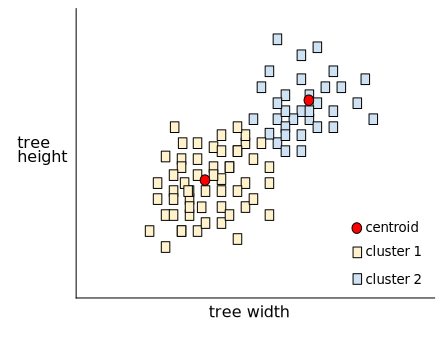
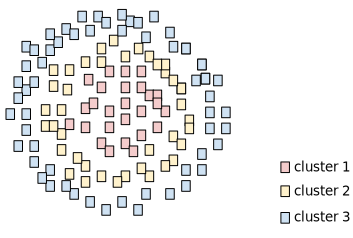
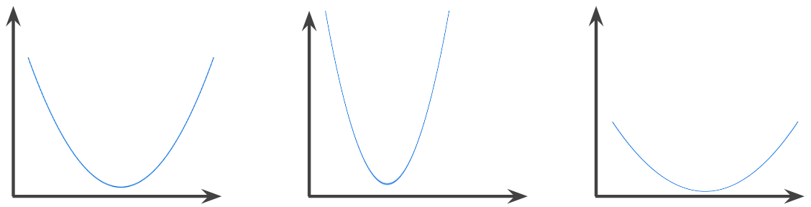

# Machine Learning Glossary
 * [bag of words](./README.md#bag-of-words)
 * [clustering]((./README.md#clustering)
 * [convex function](./README.md#convex-function)
 
## bag of words
A representation of the words in a phrase or passage, irrespective of order. For example, bag of words represents the following three phrases identically:

  * the dog jumps
  * jumps the dog
  * dog jumps the
  
Each word is mapped to an index in a sparse vector, where the vector has an index for every word in the vocabulary. For example, the phrase the dog jumps is mapped into a feature vector with non-zero values at the three indices corresponding to the words the, dog, and jumps. The non-zero value can be any of the following:

  * A 1 to indicate the presence of a word.
  * A count of the number of times a word appears in the bag. For example, if the phrase were <i>the maroon dog is a dog with maroon fur</i>, then both maroon and dog would be represented as 2, while the other words would be represented as 1.
  * Some other value, such as the logarithm of the count of the number of times a word appears in the bag. 
 
## clustering
Grouping related examples, particularly during unsupervised learning. Once all the examples are grouped, a human can optionally supply meaning to each cluster.

Many clustering algorithms exist. For example, the k-means algorithm clusters examples based on their proximity to a centroid, as in the following diagram:

A human researcher could then review the clusters and, for example, label cluster 1 as "dwarf trees" and cluster 2 as "full-size trees."

As another example, consider a clustering algorithm based on an example's distance from a center point, illustrated as follows:

## confusion matrix
An NxN table that summarizes how successful a classification model's predictions were; that is, the correlation between the label and the model's classification. One axis of a confusion matrix is the label that the model predicted, and the other axis is the actual label. N represents the number of classes. In a binary classification problem, N=2. For example, here is a sample confusion matrix for a binary classification problem:

|  | Tumor(predicted) | Non-Tumor(predicted|
| --- | ---| --- | 
| Tumor (actual) |	18 |	1 |
|Non-Tumor (actual)	| 6	| 452 |

The preceding confusion matrix shows that of the 19 samples that actually had tumors, the model correctly classified 18 as having tumors (18 <b>true positives</b>), and incorrectly classified 1 as not having a tumor (1 <b>false negative</b>). Similarly, of 458 samples that actually did not have tumors, 452 were correctly classified (452 <b>true negatives</b>) and 6 were incorrectly classified (6 <b>false positives</b>).

The confusion matrix for a multi-class classification problem can help you determine mistake patterns. For example, a confusion matrix could reveal that a model trained to recognize handwritten digits tends to mistakenly predict 9 instead of 4, or 1 instead of 7.

Confusion matrices contain sufficient information to calculate a variety of performance metrics, including <b>precision</b> and <b>recall</b>.

## convex function
A function in which the region above the graph of the function is a convex set. The prototypical convex function is shaped something like the letter U. For example, the following are all convex functions:

A typical convex function is shaped like the letter 'U'.

By contrast, the following function is not convex. Notice how the region above the graph is not a convex set:

A strictly convex function has exactly one local minimum point, which is also the global minimum point. The classic U-shaped functions are strictly convex functions. However, some convex functions (for example, straight lines) are not U-shaped.

A lot of the common loss functions, including the following, are convex functions:

 * L2 loss
 * Log Loss
 * L1 regularization
 * L2 regularization

Many variations of gradient descent are guaranteed to find a point close to the minimum of a strictly convex function. Similarly, many variations of stochastic gradient descent have a high probability (though, not a guarantee) of finding a point close to the minimum of a strictly convex function.

The sum of two convex functions (for example, L2 loss + L1 regularization) is a convex function.

Deep models are never convex functions. Remarkably, algorithms designed for convex optimization tend to find reasonably good solutions on deep networks anyway, even though those solutions are not guaranteed to be a global minimum.
