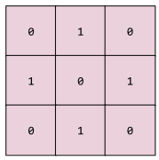

# Concept
 * Machine Learning
   * [bag of words](./README.md#bag-of-words)
   * [clustering](./README.md#clustering)   
   * [Decision Tree](./README.md#decision-tree)
   * [Hashing](./README.md#hashing)   
 * Deep Learning
   * [convolutional layer](./README.md#convolutional-layer)
   * [convolutional operation](./README.md#convolutional-operation)

## bag of words
A representation of the words in a phrase or passage, irrespective of order. For example, bag of words represents the following three phrases identically:

  * the dog jumps
  * jumps the dog
  * dog jumps the
  
Each word is mapped to an index in a sparse vector, where the vector has an index for every word in the vocabulary. For example, the phrase the dog jumps is mapped into a feature vector with non-zero values at the three indices corresponding to the words the, dog, and jumps. The non-zero value can be any of the following:

  * A 1 to indicate the presence of a word.
  * A count of the number of times a word appears in the bag. For example, if the phrase were <i>the maroon dog is a dog with maroon fur</i>, then both maroon and dog would be represented as 2, while the other words would be represented as 1.
  * Some other value, such as the logarithm of the count of the number of times a word appears in the bag. 
 
## clustering
Grouping related examples, particularly during unsupervised learning. Once all the examples are grouped, a human can optionally supply meaning to each cluster.

Many clustering algorithms exist. For example, the k-means algorithm clusters examples based on their proximity to a centroid, as in the following diagram:

A human researcher could then review the clusters and, for example, label cluster 1 as "dwarf trees" and cluster 2 as "full-size trees."

As another example, consider a clustering algorithm based on an example's distance from a center point, illustrated as follows:

## convolutional layer
A layer of a deep neural network in which a convolutional filter passes along an input matrix. For example, consider the following 3x3 convolutional filter:

The following animation shows a convolutional layer consisting of 9 convolutional operations involving the 5x5 input matrix. Notice that each convolutional operation works on a different 3x3 slice of the input matrix. The resulting 3x3 matrix (on the right) consists of the results of the 9 convolutional operations:

## convolutional operation
The following two-step mathematical operation:

  * Element-wise multiplication of the convolutional filter and a slice of an input matrix. (The slice of the input matrix has the same rank and size as the convolutional filter.)
  * Summation of all the values in the resulting product matrix.
  
For example, consider the following 5x5 input matrix:

Now imagine the following 2x2 convolutional filter:

Each convolutional operation involves a single 2x2 slice of the input matrix. For instance, suppose we use the 2x2 slice at the top-left of the input matrix. So, the convolution operation on this slice looks as follows:

A convolutional layer consists of a series of convolutional operations, each acting on a different slice of the input matrix.

## decision tree
A model represented as a sequence of branching statements. For example, the following over-simplified decision tree branches a few times to predict the price of a house (in thousands of USD). According to this decision tree, a house larger than 160 square meters, having more than three bedrooms, and built less than 10 years ago would have a predicted price of 510 thousand USD.

Machine learning can generate deep decision trees.

## hashing
In machine learning, a mechanism for bucketing categorical data, particularly when the number of categories is large, but the number of categories actually appearing in the dataset is comparatively small.

For example, Earth is home to about 60,000 tree species. You could represent each of the 60,000 tree species in 60,000 separate categorical buckets. Alternatively, if only 200 of those tree species actually appear in a dataset, you could use hashing to divide tree species into perhaps 500 buckets.

A single bucket could contain multiple tree species. For example, hashing could place baobab and red maple—two genetically dissimilar species—into the same bucket. Regardless, hashing is still a good way to map large categorical sets into the desired number of buckets. Hashing turns a categorical feature having a large number of possible values into a much smaller number of values by grouping values in a deterministic way.

