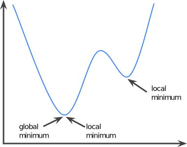
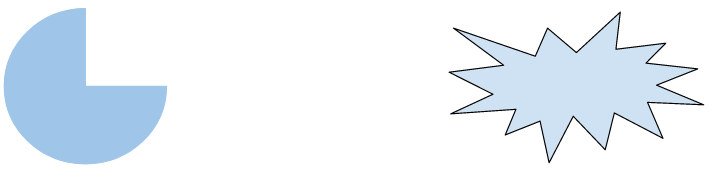
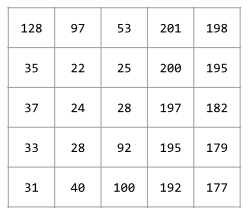
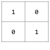
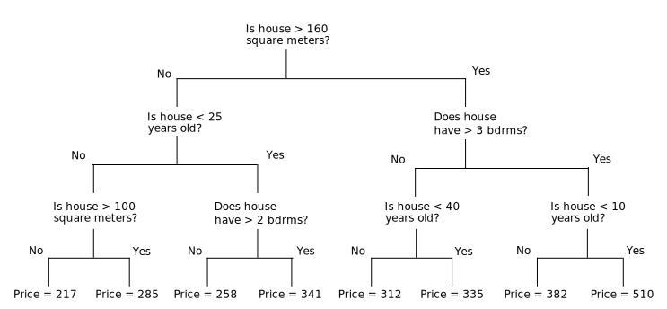

# Glossary
 * Machine Learning
   * [bag of words](./README.md#bag-of-words)
   * [clustering](./README.md#clustering)
   * [Confusion Matrix](./README.md#confusion-matrix)
   * [convex function](./README.md#convex-function)
   * [convex set](./README.md#convex-set)   
   * [decision tree](./README.md#decision-tree)
   * [hashing](./README.md#hashing)
 * Deep Learning
   * [convolutional layer](./README.md#convolutional-layer)
   * [convolutional operation](./README.md#convolutional-operation)
 * Computer Vision
   * [Intersection over Union (IoU)](./README.md#intersection-over-union-iou)
     * [IoU sample notebook](./IoU.ipynb)
 
## bag of words
A representation of the words in a phrase or passage, irrespective of order. For example, bag of words represents the following three phrases identically:

  * the dog jumps
  * jumps the dog
  * dog jumps the
  
Each word is mapped to an index in a sparse vector, where the vector has an index for every word in the vocabulary. For example, the phrase the dog jumps is mapped into a feature vector with non-zero values at the three indices corresponding to the words the, dog, and jumps. The non-zero value can be any of the following:

  * A 1 to indicate the presence of a word.
  * A count of the number of times a word appears in the bag. For example, if the phrase were <i>the maroon dog is a dog with maroon fur</i>, then both maroon and dog would be represented as 2, while the other words would be represented as 1.
  * Some other value, such as the logarithm of the count of the number of times a word appears in the bag. 
 
## clustering
Grouping related examples, particularly during unsupervised learning. Once all the examples are grouped, a human can optionally supply meaning to each cluster.

Many clustering algorithms exist. For example, the k-means algorithm clusters examples based on their proximity to a centroid, as in the following diagram:

A human researcher could then review the clusters and, for example, label cluster 1 as "dwarf trees" and cluster 2 as "full-size trees."

As another example, consider a clustering algorithm based on an example's distance from a center point, illustrated as follows:

## Confusion Matrix
An NxN table that summarizes how successful a classification model's predictions were; that is, the correlation between the label and the model's classification. One axis of a confusion matrix is the label that the model predicted, and the other axis is the actual label. N represents the number of classes. In a binary classification problem, N=2. For example, here is a sample confusion matrix for a binary classification problem:

|  | Tumor(predicted) | Non-Tumor(predicted|
| --- | ---| --- | 
| Tumor (actual) |	18 |	1 |
|Non-Tumor (actual)	| 6	| 452 |

The preceding confusion matrix shows that of the 19 samples that actually had tumors, the model correctly classified 18 as having tumors (18 <b>true positives</b>), and incorrectly classified 1 as not having a tumor (1 <b>false negative</b>). Similarly, of 458 samples that actually did not have tumors, 452 were correctly classified (452 <b>true negatives</b>) and 6 were incorrectly classified (6 <b>false positives</b>).

The confusion matrix for a multi-class classification problem can help you determine mistake patterns. For example, a confusion matrix could reveal that a model trained to recognize handwritten digits tends to mistakenly predict 9 instead of 4, or 1 instead of 7.

Confusion matrices contain sufficient information to calculate a variety of performance metrics, including <b>precision</b> and <b>recall</b>.

## convex function
A function in which the region above the graph of the function is a convex set. The prototypical convex function is shaped something like the letter U. For example, the following are all convex functions:

A typical convex function is shaped like the letter 'U'.

By contrast, the following function is not convex. Notice how the region above the graph is not a convex set:

A strictly convex function has exactly one local minimum point, which is also the global minimum point. The classic U-shaped functions are strictly convex functions. However, some convex functions (for example, straight lines) are not U-shaped.

A lot of the common loss functions, including the following, are convex functions:

 * L2 loss
 * Log Loss
 * L1 regularization
 * L2 regularization

Many variations of gradient descent are guaranteed to find a point close to the minimum of a strictly convex function. Similarly, many variations of stochastic gradient descent have a high probability (though, not a guarantee) of finding a point close to the minimum of a strictly convex function.

The sum of two convex functions (for example, L2 loss + L1 regularization) is a convex function.

Deep models are never convex functions. Remarkably, algorithms designed for convex optimization tend to find reasonably good solutions on deep networks anyway, even though those solutions are not guaranteed to be a global minimum.

## convex set
A subset of Euclidean space such that a line drawn between any two points in the subset remains completely within the subset. For instance, the following two shapes are convex sets:

By contrast, the following two shapes are not convex sets:

## convolutional layer
A layer of a deep neural network in which a convolutional filter passes along an input matrix. For example, consider the following 3x3 convolutional filter:

The following animation shows a convolutional layer consisting of 9 convolutional operations involving the 5x5 input matrix. Notice that each convolutional operation works on a different 3x3 slice of the input matrix. The resulting 3x3 matrix (on the right) consists of the results of the 9 convolutional operations:

## convolutional operation
The following two-step mathematical operation:

  * Element-wise multiplication of the convolutional filter and a slice of an input matrix. (The slice of the input matrix has the same rank and size as the convolutional filter.)
  * Summation of all the values in the resulting product matrix.
  
For example, consider the following 5x5 input matrix:

Now imagine the following 2x2 convolutional filter:

Each convolutional operation involves a single 2x2 slice of the input matrix. For instance, suppose we use the 2x2 slice at the top-left of the input matrix. So, the convolution operation on this slice looks as follows:

A convolutional layer consists of a series of convolutional operations, each acting on a different slice of the input matrix.

## decision tree
A model represented as a sequence of branching statements. For example, the following over-simplified decision tree branches a few times to predict the price of a house (in thousands of USD). According to this decision tree, a house larger than 160 square meters, having more than three bedrooms, and built less than 10 years ago would have a predicted price of 510 thousand USD.

Machine learning can generate deep decision trees.

## hashing
In machine learning, a mechanism for bucketing categorical data, particularly when the number of categories is large, but the number of categories actually appearing in the dataset is comparatively small.

For example, Earth is home to about 60,000 tree species. You could represent each of the 60,000 tree species in 60,000 separate categorical buckets. Alternatively, if only 200 of those tree species actually appear in a dataset, you could use hashing to divide tree species into perhaps 500 buckets.

A single bucket could contain multiple tree species. For example, hashing could place baobab and red maple—two genetically dissimilar species—into the same bucket. Regardless, hashing is still a good way to map large categorical sets into the desired number of buckets. Hashing turns a categorical feature having a large number of possible values into a much smaller number of values by grouping values in a deterministic way.

## Intersection over Union (IoU)

__Intersection Over Union (IoU)__ is a number that quantifies the degree of overlap between two boxes. In the case of object detection and segmentation, __IoU__ evaluates the overlap of the __Ground Truth__ and __Prediction__ region.

For example, in the image below:

  * The predicted bounding box (the coordinates delimiting where the model predicts the night table in the painting is located) is outlined in purple.
  
  * The ground-truth bounding box (the coordinates delimiting where the night table in the painting is actually located) is outlined in green.

Here, the intersection of the bounding boxes for prediction and ground truth (below left) is 1, and the union of the bounding boxes for prediction and ground truth (below right) is 7, so the IoU is 1/7.

Let’s go through the following example to understand how IoU is calculated. Let there be three models- A, B, and C, trained to predict birds. We pass an image through the models where we already know the __Ground Truth (marked in red)__. The image below shows __predictions__ of the models __(marked in cyan)__.

IoU is the ratio of the __overlap area__ to the __combined area of prediction__ and __ground truth__.

IoU values range from 0 to 1. Where 0 means no overlap and 1 means perfect overlap.

Looking closely, we are adding the area of the intersection __twice__ in the denominator. So actually we calculate IoU as shown in the illustration below.

### Qualitative Analysis of Predictions

With the help of the IoU threshold, we can decide whether the prediction is __True Positive(TP)__, __False Positive(FP)__, or __False Negative(FN)__. The example below shows predictions with the IoU threshold __ɑ__ set at __0.5__.

The decision of making a detection as __True Positive__ or __False Positive__, completely depends on the requirement.

- The first prediction is __True Positive__ as the IoU threshold is 0.5.
- If we set the threshold at 0.97, then it becomes a __False Positive__.
- Similarly, the second prediction shown above is __False Positive__ due to the threshold but can be __True Positive__ if we set the threshold at 0.20.
- Theoretically, the third prediction can also be __True Positive__, given that we lower the threshold all the way to 0.

### Intersection over Union in Image Segmentation

__IoU in object detection is a helper metric__. However, in image segmentation; IoU is the primary metric to evaluate model accuracy.

In the case of Image Segmentation, the area is not necessarily rectangular. It can have any regular or irregular shape. That means the predictions are segmentation masks and not bounding boxes. Therefore, pixel-by-pixel analysis is done here. Moreover, the definition of TP, FP, and FN is slightly different as it is not based on a predefined threshold.

(a) __True Positive__: The area of intersection between Ground Truth(__GT__) and segmentation mask(__S__). Mathematically, this is __logical AND__ operation of GT and S i.e., 

$$TP = GT.S$$

(b) __False Positive__: The predicted area outside the Ground Truth. This is the __logical OR__ of GT and segmentation minus GT. 

$$FP = (GT + S) - GT$$

(c) __False Negative__: Number of pixels in the Ground Truth area that the model failed to predict. This is the __logical OR__ of GT and segmentation minus S.

$$FN = (GT + S) - S$$

We know from Object Detection that IoU is the ratio of the __intersected area__ to the __combined area__ of __prediction__ and __ground truth__. Since the values of TP, FP, and FN are nothing but areas or number of pixels; we can write IoU as follows.

$$IoU = \dfrac{TP} {TP + FP + FN} $$

