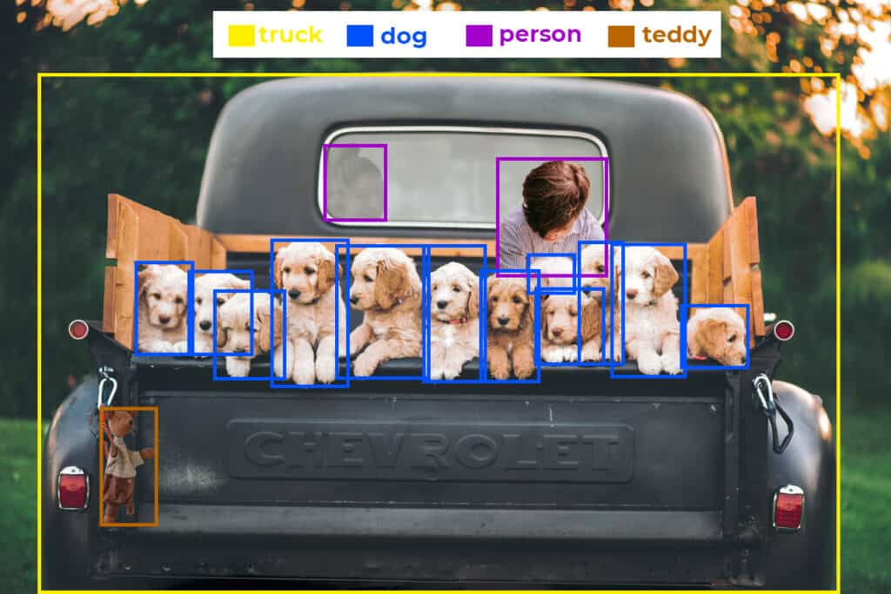
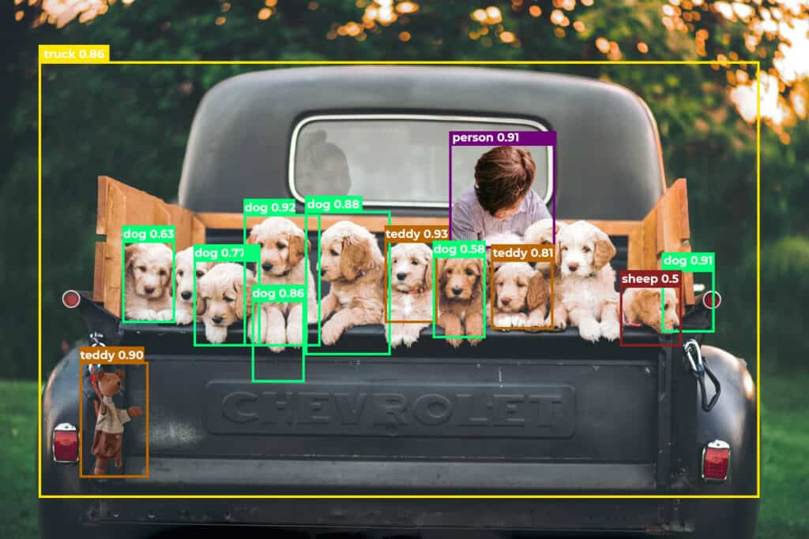
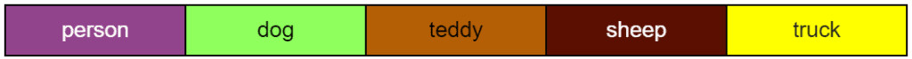
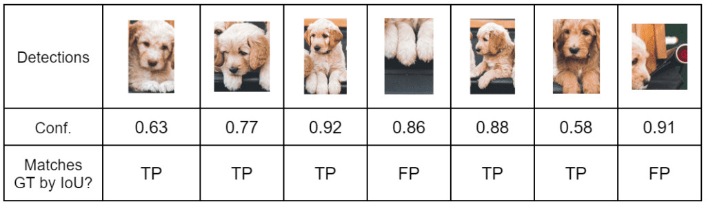
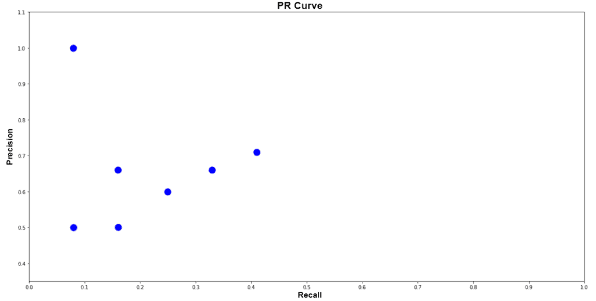
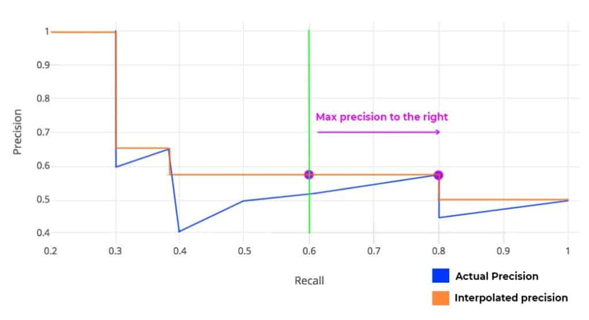
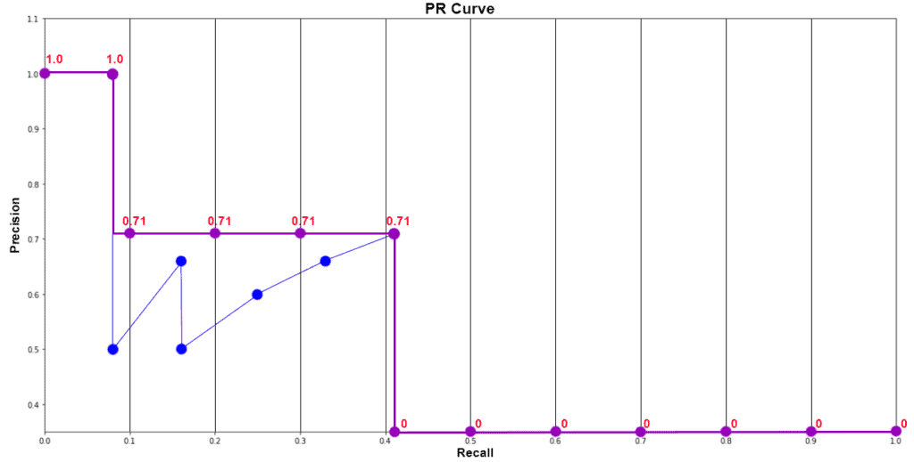
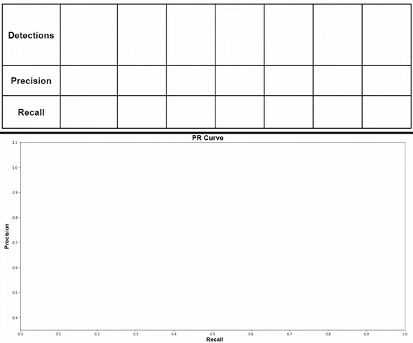
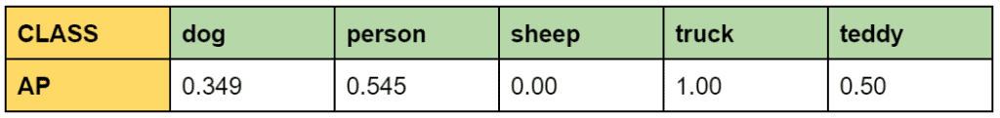
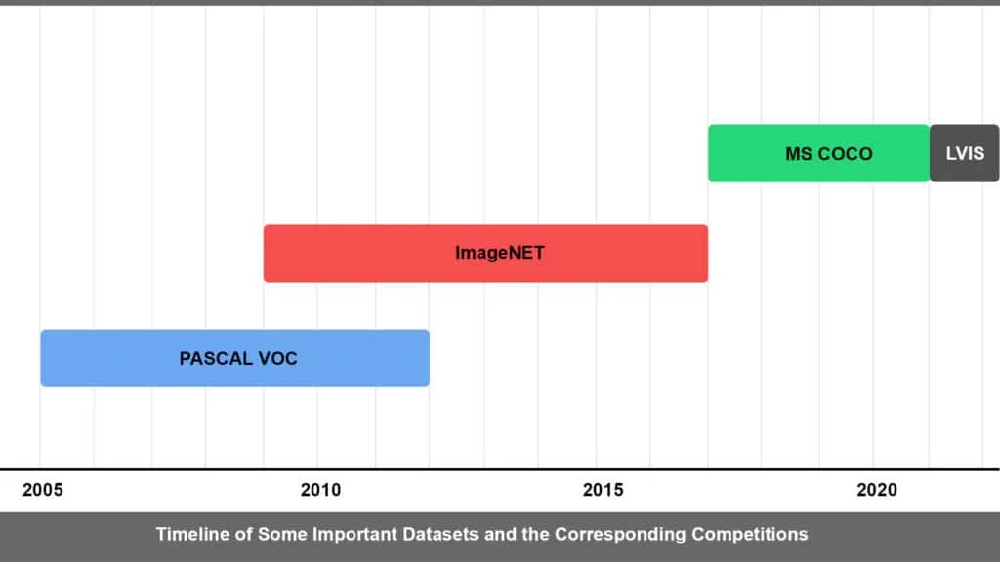

# Mean Average Precision (mAP)

__Mean Average Precision (mAP) is a performance metric used for evaluating machine learning models__. It is the most popular metric that is used by benchmark challenges such as __PASCAL VOC__, __COCO__, __ImageNET__ challenge, __Google Open Image__ Challenge, etc. Mean Average Precision has different meanings on various platforms. Hence, oftentimes it can be confusing.

In object detection, the correctness of the prediction (TP, FP, or FN) is decided with the help of the IoU threshold. Whereas in image segmentation, it is decided by referencing the __Ground Truth__ pixels. Ground truth means known objects.

Note that __True Negative__ is not applicable to object detection and segmentation. __It is correctly detecting the background of an object as background__. Which is equivalent to not detecting anything.

Interestingly, Average Precision (AP) is not the average of Precision (P). The term AP has evolved with time. For simplicity, we can say that it is the area under the precision-recall curve.

## How to calculate Average Precision (AP) manually?
Let us consider the following image that has various classes. The IoU threshold is set at 0.5. The ground truths are already known.

We can see that the images have the following objects (Ground Truths).

- 2 person
- 12 dog
- 1 teddy
- 1 truck

The YOLOv5 nano model has predicted the following objects.

__Average Precision (AP) is calculated class-wise__. We will discuss the reason a bit later. Now, let’s get started with calculating the AP of dog class. The steps to be followed are as follows.

### Record every Dog detection along with the Confidence score

### Calculate Precision and Recall

Here, we calculate detection-wise Precision and Recall values. Follow the steps below to tabulate the data.

1. Sort the table in descending order of confidence.
2. Tabulate cumulative TP and FP (Keep on adding the current value with the previous row).
3. Calculate row-wise Precision and Recall.

Where,

P = Cumulative TP / ( Cumulative TP + Cumulative FP )

R = Cumulative TP / Total Ground Truths

### Plot Precision-Recall graph

Note: If the table contains multiple precision values for the same recall values, you can consider the highest value and discard the rest. Not doing so will NOT affect the final result. This is for simplifying the plot. In our case, we are plotting everything.

### Calculate Average Precision (AP) using PASCAL VOC 11 Point Interpolation Method

The 11 point interpolation method was introduced in the 2007 PASCAL VOC challenge. Where Precision values are recorded across 11 equally spaced Recall values. Average Precision is defined as follows.

AP = 1/11 * Sum(11 point interpolated precision)

Precision values are interpolated across 11 Recall values, i.e., 0, 0.1, 0.2, 0.3,…,1.0. The interpolated Precision is the maximum Precision corresponding to the Recall value greater than the current Recall value. In simple terms, it is the maximum precision value to the right.

#### Why Precision is interpolated only for 11 Recall points?

Quoting from the paper, The intention in interpolating the precision/recall curve in this way is to reduce the impact of the “wiggles” in the precision/recall curve, caused by small variations in the ranking of examples.

In reality, the evaluation dataset is huge. When we plot the graph for all predictions, the difference between adjacent points will be very very less. Hence, 11 point interpolation is sufficient to compare two models.

#### Is Average Precision (AP) calculated for all points as well?

Yes, it is calculated for all points. In fact, that is another evaluation metric adopted by VOC in 2010. We will discuss it in a bit. For now, let’s continue with the 11 point interpolation method and plot the graph.

### Plot Final Interpolated graph and calculate Average Precision for Dog Class

APdog = 1/11 * ( Sum of 11 interpolated Precision values )

             =  1/11 * (1 + 4*0.71 + 6*0)

             =  0.349

             = 34.9%

Similarly, we calculate Average Precision(AP) for person, teddy, sheep, and truck. Make sure to calculate AP for at least two classes below for clear understanding. Once done, we will proceed with calculating Mean Average Precision (mAP).

## What is Mean Average Precision (mAP)?

As the name suggests, Mean Average Precision or mAP is the average of AP over all detected classes.

__mAP = 1/n * sum(AP)__, where n is the number of classes.

In the example above, we have 5 classes. Therefore, the calculated mAP is;

mAP = 1/5 * (0.349 + 0.545 + 0 + 1 + 0.5)

         = 0.4788

         = 47.88 %

__To arrive at the mAP, while evaluating a model; Average Precision (AP) is calculated for each class separately.__

Now let’s go back to the question that we skipped a while ago. Why Average Precision (AP) is it not calculated for all the classes at once?

Let’s think about what happens if we do. You can go back to the detection chart and calculate the AP by combining all classes. However, this time we would not be able to observe the class-wise performance. Consider a dataset having 3 classes, apple, bird, and butterfly. Let the number of training images be 1000. 20, and 1000. respectively. The model is bound to perform poorly in recognizing birds. This can be identified only when per class AP is calculated.

## Evolution of Evaluation Metrics Over Time

This section is not necessarily specific to object detection. We will take a look at how evaluation metrics changed over time and the reasons behind it.

### ROC-AUC Metric, PASCAL VOC 2005

The metric was used to evaluate classification models. ROC (Receiver Operating Characteristic)-AUC (Area Under the Curve) metric was introduced in PASCAL VOC 2005. True Positive Rate (TPR) values are plotted corresponding to False Positive Rate (FPR) values.

Where,

TPR = TP / (TP + FN)

FPR = FP/(FP+FN)

### 11 Point Interpolation AP, PASCAL VOC 2007

We have already discussed the 11 Point Interpolation Method. It was introduced in the 2007 PASCAL VOC challenge. __It is calculated at IoU threshold 0.5__. This metric is more sensitive compared to ROC-AUC. The metric has the following advantages.

- Improve interpretability.
- Increased visibility to performance at low recall.

### PR-AUC, PASCAL VOC 2010

PR-AUC is the exact area under the Precision-Recall curve. Unlike the 11 Point Method, we don’t have to interpolate Precision values. And the final value is not divided by 11. __This is also calculated at IoU threshold 0.5__.

### 101 Point Interpolation AP, MS COCO 2014 | COCO mAP

Until now the metrics introduced by PASCAL VOC were the standard benchmarking system. However, with time models started saturating. It was observed that even models with equivalent scores were not performing equally. MS COCO introduced 101 Point Interpolation AP in 2014. It is a better approximation of AUC under the P-R curve.

Moreover, COCO made the challenge tougher by redefining the __mAP@0.5__ to __mAP@[0.5:0.05:0.95]__. Earlier, mAP was evaluated at IoU threshold 0.5. COCO mAP is calculated for a set of 10 different IoU thresholds and then averaged. It ranges from 0.5 to 0.95 at a step frequency of 0.05.

Note that MS COCO defines Average Precision (AP) as __mAP@[0.5:.05:.95]__. Here, the terms AP and mAP are used interchangeably. As of today, COCO mAP is the most popular metric for evaluating object detection models.

## Datasets and Model Evaluation Competitions

The AI boom that the world is experiencing today is possible not only because of the __algorithms__ but also because of the __datasets__. At present, there are lots of datasets being used for a variety of tasks. We will discuss a few of them here.

### PASCAL VOC (Visual Object Classes)

It was introduced first in the year 2005 with only 4 classes. Initially, it was used for classification and object detection. In 2007, segmentation tester was introduced and the number of classes increased to 20. With successive years further developments were incorporated and the dataset grew larger. As per the last update in 2012, PASCAL VOC has 11,530 images that have 20 classes, 27,450 ROI annotated objects and 6,929 segmentations.

Compared to other datasets, the PASCAL VOC dataset may be smaller but still is a good dataset to start with. Although the VOC challenge ended in 2012, the server still accepts submissions.

### ImageNET

A revolutionary dataset, introduced in 2009. __Many believe that it is the reason for the AI boom that we see today__. When researchers were scrimmaging to develop better algorithms, ImageNET focused on the idea of a better dataset. It was found that even existing algorithms were performing better when trained on the ImageNET dataset. As of today, ImageNET has over 15 million images containing more than 20,000 categories.

In 2010 PASCAL VOC collaborated and co-branded their competition with ImageNet. ILSVRC (ImageNET Large Scale Visual Recognition Challenge) the annual contest organized by ImageNET continued till 2017. Through the contest, groundbreaking benchmarks were set up. The competition uses a trimmed set containing 150k images with 1000 categories. In 2017, the competition was passed onto Kaggle for hosting.

### MS COCO (Microsoft Common Objects in Context)

Initially released in the year 2014, the MS COCO dataset was updated last in 2017. At present, It is the most commonly used dataset. COCO contains 328k images that have 80 classes and 1.5 million object instances. MS COCO competition and its rules are the current standards. However, the COCO server is no longer accepting submissions from 2021.

### LVIS (Large Vocabulary Instance Segmentation)
LVIS (Large Vocabulary Instance Segmentation)
LVIS is a dataset for long tail instance segmentation. It has 164k images that consist of annotations in over 1000 categories. It has a long tail of categories with few training samples. This means the dataset is imbalanced, making it even more challenging.

## References
- [Mean Average Precision (mAP) in Object Detection](https://learnopencv.com/mean-average-precision-map-object-detection-model-evaluation-metric/)
