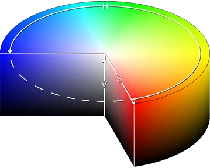

# HSV (Hue, Saturation, Value)

## HUE

Hue is the color portion of the model, expressed as a number from 0 to 360 degrees:

- Red falls between 0 and 60 degrees.
- Yellow falls between 61 and 120 degrees.
- Green falls between 121 and 180 degrees.
- Cyan falls between 181 and 240 degrees.
- Blue falls between 241 and 300 degrees.
- Magenta falls between 301 and 360 degrees.

## SATURATION

Saturation describes the amount of gray in a particular color, from 0 to 100 percent. Reducing this component toward zero introduces more gray and produces a faded effect. Sometimes, saturation appears as a range from 0 to 1, where 0 is gray, and 1 is a primary color.

## VALUE (OR BRIGHTNESS)

Value works in conjunction with saturation and describes the brightness or intensity of the color, from 0 to 100 percent, where 0 is completely black, and 100 is the brightest and reveals the most color.

## Uses of HSV

Designers use the HSV color model when selecting colors for paint or ink because HSV better represents how people relate to colors than the RGB color model does.

Selecting an HSV color begins with picking one of the available hues and then adjusting the shade and brightness values.