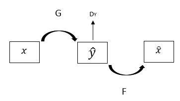
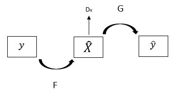
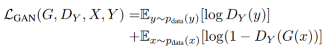
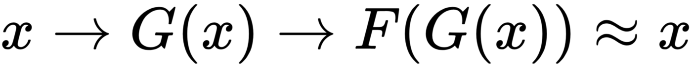
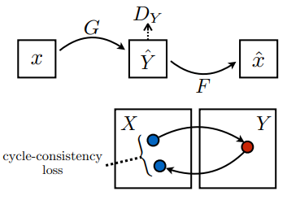
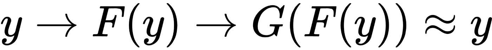
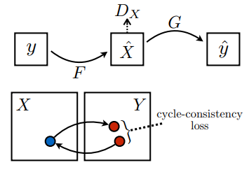

# CycleGAN: Unpaired Image-to-Image Translation using Cycle-Consistent Adversarial Netwoks

[CycleGANs](https://arxiv.org/pdf/1703.10593.pdf) were proposed by Jun-Yan Zhu, Taesung Park, Phillip Isola, and Alexei A. CycleGANs are a novel approach for translating an image from a source domain A to a target domain B. One of the cool feature of CycleGANs is that it doesn’t require paired training data to produce stunning style transfer results. 

In many style transfer applications, paired data is a required for the training.

  

CycleGAN doesn’t require paired data input to train a models.

  

A CycleGAN tries to learn a Generator network, which, learns two mappings. CycleGANs train two Generators and two Discriminators networks, which differs from most of the GANs with a single Generator and Discriminator network.

* CycleGAN has two Generator networks

  * <b>Generator A</b>: Learns a mapping G:X ->Y, where X is an image from the source <b>domain A</b> and Y is an image from the target <b>domain B</b>. It takes an image from the source domain A, and converts it into an image that is similar to an image from the target domain B. Basically, the aim of the network is to learn a mapping so that G(X) is similar to Y.
  
  * <b>Generator B</b>: Learns a mapping F:Y->X, and then takes an image Y from the target <b>domain B</b>, and converts it into an image X that is similar to an image from the source <b>domain A</b>. Similarly, the aim of the network is to learn another mapping, so that F(G(X) is similar to X.

* CycleGAN has two Discriminator networks

  * <b>Discriminator A</b>: The Discriminator A is to Discriminate between the images generated by the Generator network A, which are represented as G(X), and the real images from the source domain A, which are represented as X.
  
  * <b>Discriminator B</b>: The Discriminator B is to Discriminate between the images generated by the Generator network B, which are represented as F(Y), and the real images from the source domain B, which are represented as Y.
  
* CycleGAN Architecture Diagram
  

    
  

  
  The goal of CycleGANs is to learn how to map images from one domain A to another domain B. CycleGAN’s architecture diagram shows the use of two mapping functions G and F, and two Discriminators DX and DY.
  
  * The discriminator DX is used to verify the images from domain A and the translated images F(y).
  
  * The discriminator DY is used to verify the images from domain B and the translated images G(x).
  
  * The CycleGANs use a cycle consistency loss for image translation. The cycle consistency loss is used to determine whether an image X from domain A can be recovered from the translated image.
  
* X to Y then reconstructed X CyleGAN Architecture
  

    
  

* Y to X then reconstructed Y CyleGAN Architecture
  

    
  

* Loss Functions

  Like other GAN, CycleGANs also have a training objective function, which needs to minimize in training process. The loss function is a weighted sum of the following losses.
  
  * Adversarial loss.
  
  * Cycle consistency loss.
  
* Adversarial loss

  It is a loss between the image from the real distribution domain A or domain B, and the images generated by the Generator networks. We have two mapping functions and we will be applying the adversarial loss to both of the mappings.

  The adversarial loss for the mapping is
  

    
  

  
  * Where, X is an image from the distribution of domain A, and Y is an image from the distribution of domain B.
  
  * The Discriminator D(Y) try to find the difference between the generated image by the G mapping G(X), and the real image Y from a different distribution of domain B.
  
  * The Discriminator D(X) try to find the difference between the generated image by the F mapping F(Y) and the real image X from the distribution of domain A.
  
  * The objective of G is to minimize the adversarial loss function against a Discriminator D, which constantly tries to maximize it.  
  
* Cycle consistency loss

  A cycle consistent mapping function is a function that can translate an image x from domain A to another image y in domain B, and generate back the original image.

  * A forward cycle consistent mapping function appears as follows
  

    
  

  

    
  

  
  * A backward cycle consistent mapping function appears as follows
  

    
  

  

    
  

