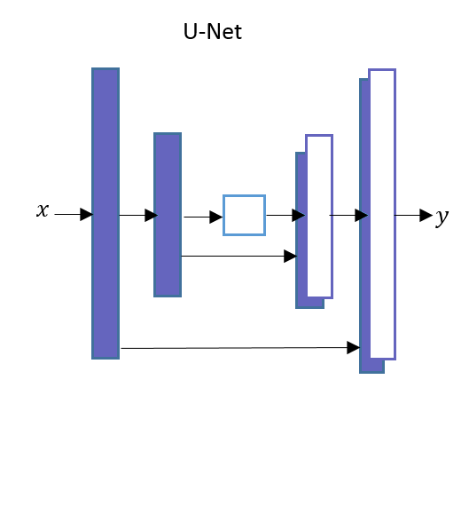
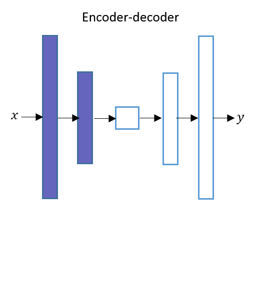
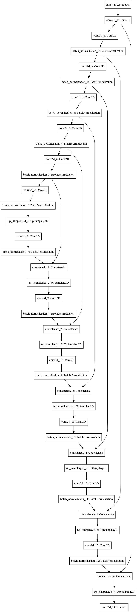
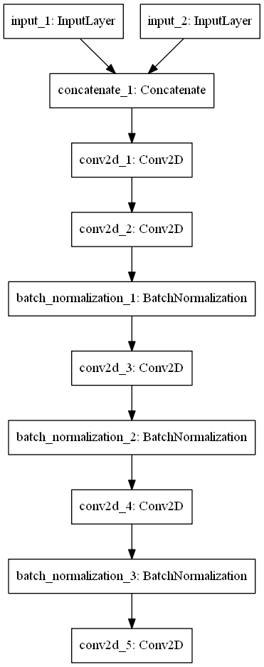
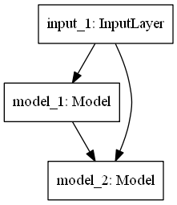
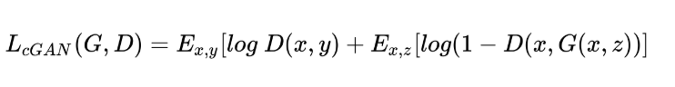
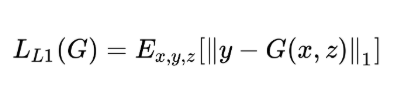
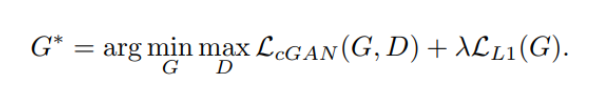

# Pix2Pix: Image-to-Image Translation with Conditional Adversarial Netwoks

[Pix2Pix](https://arxiv.org/pdf/1611.07004.pdf) network is basically a Conditional GANs (cGAN) that learn the mapping from an input image to output an image. 

Image-To-Image Translation is a process for translating one representation of an image into another representation.

* The Generator Network

  Generator network uses a <b>U-Net</b>-based architecture. U-Net’s architecture is similar to an <b>Auto-Encoder</b> network except for one difference. Both U-Net and Auto-Encoder network has two networks The <b>Encoder</b> and the <b>Decoder</b>.
  
  * U-Net Architecture Diagram
    

      
    

    
    * U-Net’s network has skip connections between Encoder layers and Decoder layers.
    
    * As shown in the picture the output of the first layer of Encoder is directly passed to the last layer of the Decoder and output of the second layer of Encoder is pass to the second last layer of the Decoder and so on.
    
    * Let’s consider if there are total N layers in U-Net’s(including middle layer), Then there will be a skip connection from the kth layer in the Encoder network to the (N-k+1)th layer in the Decoder network. where 1 ≤ k ≤ N/2.
   
   * Auto-Encoder Architecture Diagram
      

        
      

  
     * As shown in the picture Auto-Encoder doesn’t have skip connections between Encoder layers and Decoder layers.
     
   * The Generator Architecture
   
      The Generator network is made up of these two networks.
      
        * The Encoder network is a downsampler.
           * The Encoder network of the Generator network has seven convolutional blocks.
           * Each convolutional block has a convolutional layer, followed a LeakyRelu activation function.
           * Each convolutional block also has a batch normalization layer except the first convolutional layer.
           
        * The Decoder network is an upsampler.
          * The Decoder network of the Generator network has seven upsampling convolutional blocks.
          * Each upsampling convolutional block has an upsampling layer, followed by a convolutional layer, a batch normalization layer and a ReLU activation function.
        

          
        
      
        
* Discriminator Architecture

  Discriminator network uses of PatchGAN architecture. The PatchGAN network contains five convolutional blocks.
  

    
  

      
* Pix2Pix GAN Architecture
  

    
  

  
* Pix2Pix Network Training

  Pix2Pix is a conditional GANs. The loss function for the conditional GANs can be written as below.
  

    
  

  
   We have to minimize the loss between the reconstructed image and the original image. To make the images less blurry we can either use L1 or L2 regularization.
     * L1 regularization is the sum of the absolute error for each data point.
     * L2 regularization is the sum of the squared loss for each data point.
     * The L1 regularization loss function can be shown for a single image as bellow.     
    

      
    

   Where y is the original image and G(x, z) is the image generated by the Generator network. The L1 loss is calculated by the sum of all the absolute differences between all pixel values of the original image and all pixel values of the generated image.
   
   The final loss function for Pix2Pix is as given below.
   

      
   

