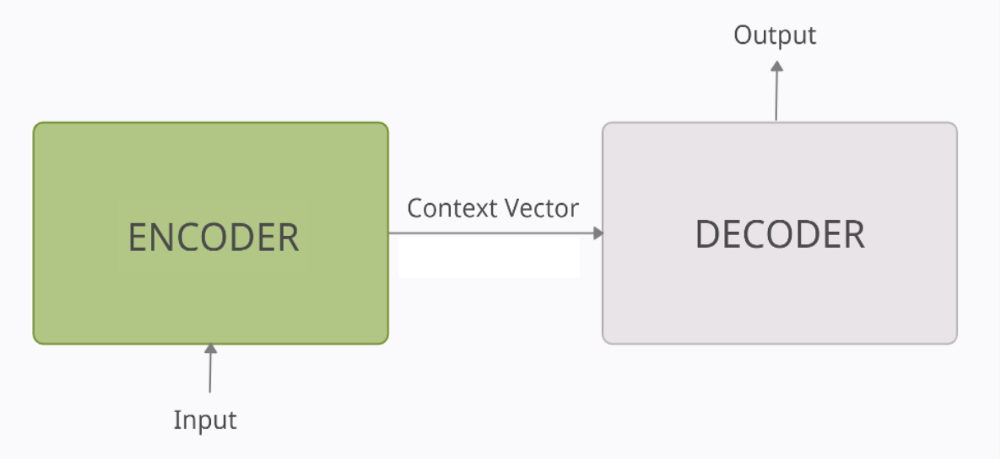
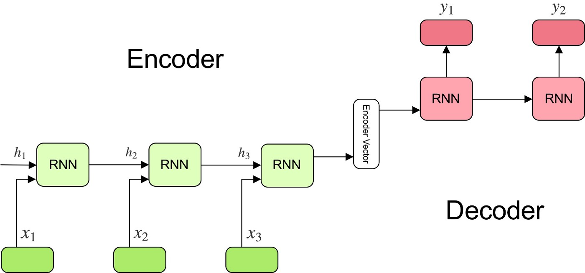
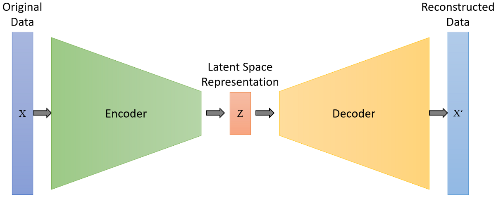

# Encoder-Decoder, Autoencoder and U-Net

## Encoder-Decoder Architecture

### RNN/LSTM based seq2seq model

## Autoencoder

Auto Encoders are a special case of encoder-decoder models. In the case of auto encoders, the input and the output domains are the same.

It consists of two networks:

* <b>Encoder network</b>: It translates the original high-dimension input into the latent low-dimensional code. The input size is larger than the output size.

* <b>Decoder network</b>: The decoder network recovers the data from the code, likely with larger and larger output layers.

The encoder network essentially accomplishes the dimensionality reduction, just like how we would use Principal Component Analysis (PCA) or Matrix Factorization (MF) for. In addition, the autoencoder is explicitly optimized for the data reconstruction from the code. A good intermediate representation not only can capture latent variables, but also benefits a full decompression process.

## U-Net Architecture

In encoder-decoder nets there is exactly one latent space (L) with a nonlinear mapping from the input (X) to that space (E: X->L), and a corresponding mapping from that latent space to the output space (D: L->Y). There's a clear distinction between the encoder and decoder: the encoder changes representation of each sample into some "code" in the latent space, and the decoder is able to construct outputs given only such codes. This means you can take such a network apart and use the encoder and decoder separately.

In U-Nets however this is not the case. There, the output mapping also depends directly on the input space - instead of L->Y, there is [X+L]->Y (a "skip" connection). This means there are no real "encoder" and "decoder" parts, in the sense of mapping the sample onto some well-defined latent space and then computing the output from it. You cannot split a U-Net into parts and use them separately, as in order to compute the output, the input is needed as well.

## Denoising Autoencoder

Since the autoencoder learns the identity function, we are facing the risk of “overfitting” when there are more network parameters than the number of data points.

To avoid overfitting and improve the robustness, Denoising Autoencoder (Vincent et al. 2008) proposed a modification to the basic autoencoder. The input is partially corrupted by adding noises to or masking some values of the input vector in a stochastic manner, then the model is trained to recover the original input (note: not the corrupt one).

## Variational Autoencoder (VAE)

## References

* [From Autoencoder to Beta-VAE](https://lilianweng.github.io/posts/2018-08-12-vae/)